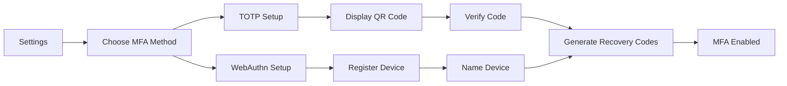
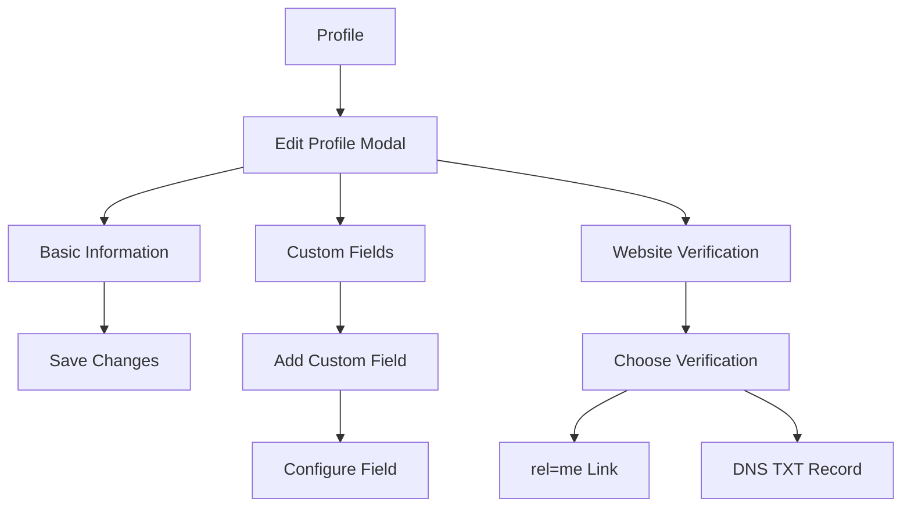
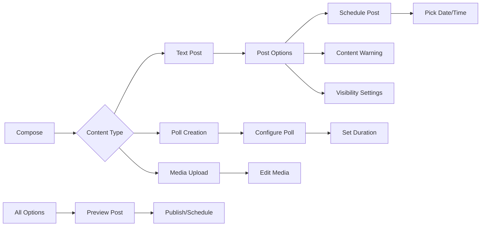
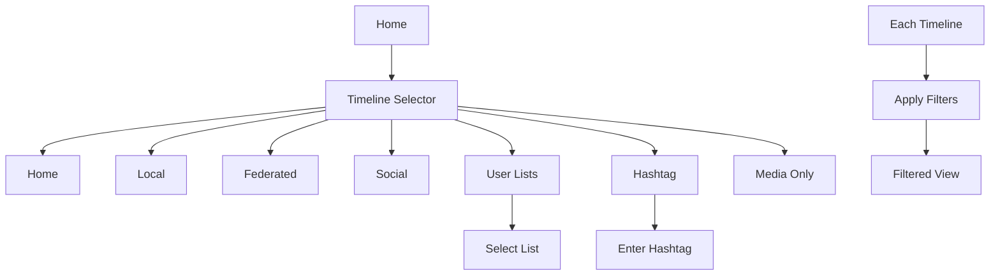
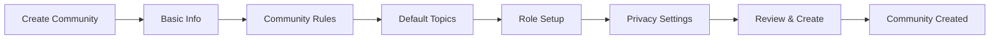
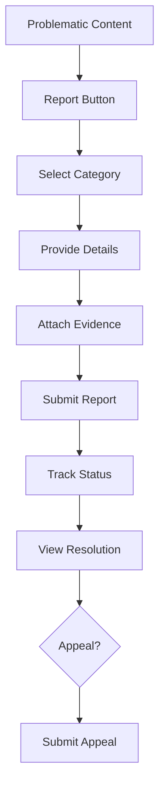
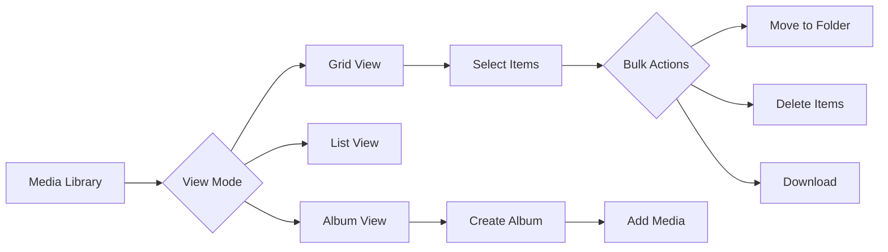
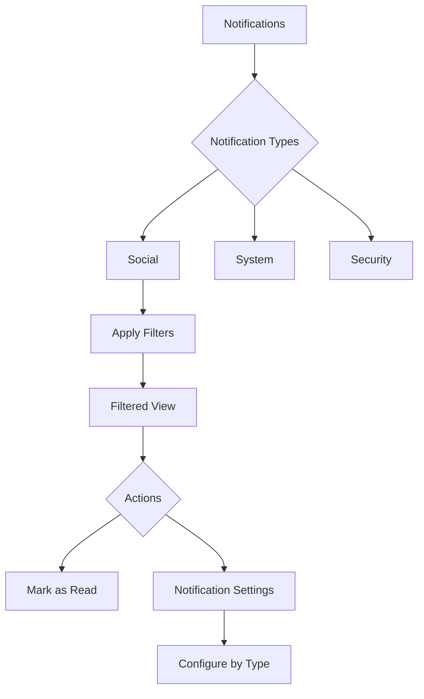
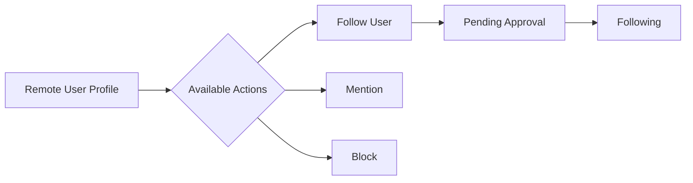
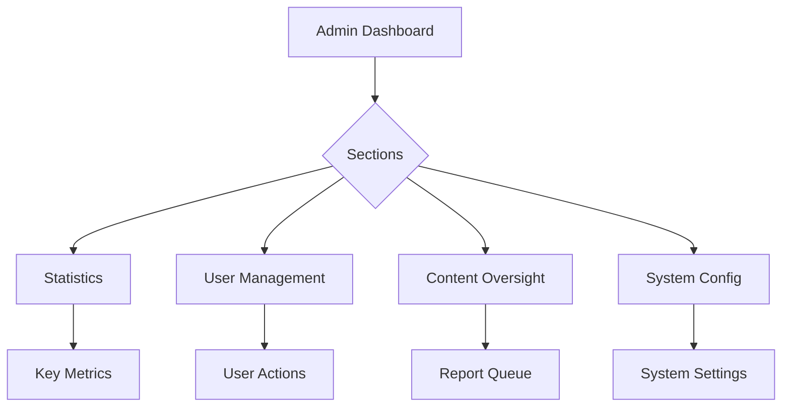

# Avion Web - Comprehensive Screen Transitions Documentation

This document provides a complete overview of all screen transitions and user flows for the Avion web application, consolidating all use cases identified from backend services and implementing the Container-Presentation pattern with DDD principles.

## Table of Contents

1. [Missing Use Cases Summary](#missing-use-cases-summary)
2. [Screen Categories](#screen-categories)
3. [Authentication & Security Flows](#authentication--security-flows)
4. [User Profile & Social Features](#user-profile--social-features)
5. [Content Creation & Management](#content-creation--management)
6. [Timeline & Discovery](#timeline--discovery)
7. [Community Management](#community-management)
8. [Moderation & Safety](#moderation--safety)
9. [Media Management](#media-management)
10. [Notification System](#notification-system)
11. [Federation & ActivityPub](#federation--activitypub)
12. [System Administration](#system-administration)
13. [Navigation Architecture](#navigation-architecture)
14. [Implementation Roadmap](#implementation-roadmap)

## Missing Use Cases Summary

Based on comprehensive analysis of all backend services, the following use cases were identified as missing from the current avion-web documentation:

### High Priority Missing Features
1. **Multi-Factor Authentication (MFA)** - Complete setup and management flows
2. **User Lists Management** - Creation and organization of user lists
3. **Poll Creation & Voting** - Interactive content features
4. **Scheduled Posts** - Content scheduling system
5. **Draft Management** - Auto-save and organization
6. **Community Features** - Full community creation and management
7. **Moderation Dashboard** - Report management and safety tools
8. **Media Library** - Comprehensive media organization
9. **Advanced Search** - Filters, history, and saved searches
10. **Federation Management** - Remote user and instance handling

### Medium Priority Missing Features
- Recovery codes management
- Session management across devices
- Bot/API client management
- Custom profile fields
- Website verification
- Follow request management
- Block/mute management with cascading
- Keyword muting with regex
- Data export/import
- Account deactivation/deletion flows
- Edit history viewing
- Content warnings (CW)
- Quote posts
- Bookmark organization
- List/hashtag/media timelines
- Trending discovery
- User recommendations
- Appeal system
- Instance blocking
- Admin dashboard

## Screen Categories

### Core Navigation Structure
```
Root
├── Public (Unauthenticated)
│   ├── Landing
│   ├── Login
│   ├── Register
│   ├── Password Reset
│   └── OAuth Consent
├── Authenticated
│   ├── Main App
│   │   ├── Home (Timeline)
│   │   ├── Explore (Discovery)
│   │   ├── Notifications
│   │   ├── Messages (Future)
│   │   ├── Communities
│   │   ├── Media Library
│   │   └── Profile
│   ├── Settings
│   │   ├── Account
│   │   ├── Security
│   │   ├── Privacy
│   │   ├── Notifications
│   │   ├── Display
│   │   └── Data Management
│   └── Modals (Overlay)
│       ├── Compose
│       ├── Edit Profile
│       ├── Media Upload
│       └── Quick Actions
└── Admin (Role-based)
    ├── Dashboard
    ├── Users
    ├── Reports
    ├── System
    └── Federation
```

## Authentication & Security Flows

### MFA Setup Flow


**Container Components:**
- `MFASetupContainer`: Manages MFA configuration state
- `SessionManagementContainer`: Handles active sessions
- `BotManagementContainer`: Controls API clients

**Presentation Components:**
- `MFAMethodSelector`: UI for choosing authentication method
- `TOTPSetupDisplay`: QR code and verification interface
- `WebAuthnRegistration`: Device registration UI
- `RecoveryCodesDisplay`: Secure display of backup codes
- `SessionList`: Active sessions with device info
- `BotCreationWizard`: Multi-step bot setup

### Session Management Screen
- **Entry:** Settings → Security → Sessions
- **Features:**
  - List of active sessions with device/browser info
  - IP address and location display
  - Last activity timestamps
  - Individual session termination
  - "Logout all other sessions" action
- **Exit:** Return to Security settings or Main app

## User Profile & Social Features

### Profile Customization Flow


**Container Components:**
- `ProfileEditContainer`: Profile update management
- `FollowSystemContainer`: Follow/unfollow operations
- `UserListContainer`: List CRUD operations
- `BlockMuteContainer`: Block/mute management

**Presentation Components:**
- `ProfileEditor`: Form for profile editing
- `CustomFieldManager`: Add/edit custom fields (max 4)
- `WebsiteVerifier`: Verification process UI
- `FollowRequestList`: Pending follow requests
- `UserListCreator`: List creation wizard
- `BlockMuteSettings`: Block/mute configuration

### User Lists Management
- **Entry:** Profile → Lists or Sidebar → Lists
- **Features:**
  - Create new list (max 50 lists)
  - Add/remove members (max 5000 per list)
  - Public/private visibility toggle
  - List timeline viewing
  - List sharing capabilities
- **Navigation:**
  - Lists → List Details → Member Management
  - Lists → List Timeline
  - Lists → List Settings

## Content Creation & Management

### Advanced Posting Features


**Container Components:**
- `ComposerContainer`: Main posting logic
- `PollCreatorContainer`: Poll configuration
- `SchedulerContainer`: Post scheduling
- `DraftManagerContainer`: Draft operations
- `BookmarkContainer`: Bookmark management

**Presentation Components:**
- `RichTextComposer`: Main text editor
- `PollBuilder`: Poll option creator (2-4 options)
- `ScheduleCalendar`: Date/time picker
- `DraftList`: Saved drafts display
- `EditHistoryViewer`: Version comparison
- `ContentWarningSelector`: CW configuration
- `BookmarkOrganizer`: Folder-based bookmarks

### Draft Management Screen
- **Entry:** Compose → Drafts or Profile → Drafts
- **Features:**
  - Auto-save every 30 seconds
  - Manual save option
  - Draft search and filtering
  - Bulk operations (delete, publish)
  - Draft folders/categories
  - Resume editing from any device
- **Exit:** Publish draft or return to Compose/Profile

## Timeline & Discovery

### Timeline Types & Navigation


**Container Components:**
- `TimelineContainer`: Timeline data management
- `DiscoveryContainer`: Trending/recommendations
- `SearchContainer`: Search operations

**Presentation Components:**
- `TimelineViewer`: Main timeline display
- `TimelineSelector`: Timeline type switcher
- `FilterPanel`: Timeline filter options
- `TrendingHashtags`: Trending topics display
- `UserRecommendations`: Suggested follows
- `SearchInterface`: Advanced search UI

### Discovery Features
- **Trending Hashtags:**
  - 24-hour and 7-day trending
  - Usage graphs
  - Follow hashtag option
- **User Recommendations:**
  - Based on follows and interactions
  - Quick follow/dismiss actions
  - Reason for recommendation
- **Popular Posts:**
  - Viral content discovery
  - Engagement metrics display

## Community Management

### Community Creation Wizard


**Container Components:**
- `CommunityContainer`: Community operations
- `TopicContainer`: Topic/channel management
- `EventContainer`: Event organization

**Presentation Components:**
- `CommunityWizard`: Creation flow UI
- `CommunityBrowser`: Discovery interface
- `MemberDirectory`: Member list with roles
- `RoleManager`: Permission editor
- `TopicOrganizer`: Channel structure
- `EventCalendar`: Event scheduling

### Community Features
- **Management Dashboard:**
  - Member statistics
  - Content moderation queue
  - Role assignments
  - Community settings
- **Member Features:**
  - Join/leave communities
  - Post to community
  - Participate in events
  - View community timeline

## Moderation & Safety

### Report Flow


**Container Components:**
- `ReportContainer`: Report submission/tracking
- `ModerationContainer`: Moderation actions
- `FilterContainer`: Content filter management

**Presentation Components:**
- `ReportForm`: Report submission UI
- `ReportTracker`: Status monitoring
- `AppealForm`: Appeal submission
- `ModeratorDashboard`: Mod tools interface
- `FilterConfiguration`: Content filter setup
- `QuickActions`: Contextual mod actions

### Moderation Dashboard (For Moderators)
- **Queue Management:**
  - Priority-based report queue
  - Batch processing capabilities
  - Quick action buttons
- **Investigation Tools:**
  - User history viewer
  - Content analysis
  - Pattern detection
- **Actions Available:**
  - Warn, suspend, ban users
  - Remove content
  - Apply labels/warnings

## Media Management

### Media Library


**Container Components:**
- `MediaLibraryContainer`: Media operations
- `AlbumContainer`: Album management
- `UploadContainer`: Upload handling

**Presentation Components:**
- `MediaBrowser`: Library interface
- `FolderTree`: Folder navigation
- `AlbumCreator`: Album creation UI
- `BatchOperations`: Bulk action interface
- `UsageTracker`: Media usage display
- `StorageIndicator`: Quota visualization

## Notification System

### Notification Management


**Container Components:**
- `NotificationContainer`: Notification management
- `PushContainer`: Push notification handling

**Presentation Components:**
- `NotificationFeed`: Real-time feed
- `NotificationBell`: Icon with counter
- `NotificationSettings`: Preference configuration
- `NotificationGroups`: Grouped display

## Federation & ActivityPub

### Remote User Interaction


**Container Components:**
- `FederationContainer`: Federation operations
- `RemoteUserContainer`: Remote user handling

**Presentation Components:**
- `RemoteProfileView`: Remote user display
- `FederationStatus`: Connection indicators
- `InstanceManager`: Instance blocking UI
- `MigrationWizard`: Account migration tool

## System Administration

### Admin Dashboard Structure


**Container Components:**
- `AdminContainer`: Admin operations
- `StatsContainer`: Statistics aggregation
- `AnnouncementContainer`: Announcement management

**Presentation Components:**
- `AdminDashboard`: Main admin interface
- `StatisticsViewer`: Metrics display
- `UserManager`: User administration
- `AnnouncementComposer`: Announcement creator
- `SystemMonitor`: Health monitoring

## Navigation Architecture

### Deep Linking Support
```
/                           → Home Timeline
/explore                    → Discovery
/notifications              → Notifications
/communities                → Communities
/communities/:id            → Community Detail
/u/:username                → User Profile
/u/:username/lists          → User's Lists
/u/:username/media          → User's Media
/drops/:id                  → Drop Detail
/tags/:hashtag              → Hashtag Timeline
/settings                   → Settings Root
/settings/security          → Security Settings
/settings/privacy           → Privacy Settings
/admin                      → Admin Dashboard
/search?q=:query            → Search Results
```

### Modal System
- **Compose Modal:** Overlay for creating content
- **Media Viewer:** Full-screen media display
- **Profile Edit:** Quick profile editing
- **Quick Actions:** Context menus
- **Confirmation Dialogs:** Destructive actions

## Implementation Roadmap

### Phase 1: Core Features (Weeks 1-4)
1. MFA setup and session management
2. User lists and follow request management
3. Poll creation and voting
4. Draft management with auto-save

### Phase 2: Content Features (Weeks 5-8)
1. Scheduled posts and calendar view
2. Edit history and content warnings
3. Quote posts and bookmarks
4. Advanced timeline features

### Phase 3: Social Features (Weeks 9-12)
1. Community creation and management
2. User recommendations and discovery
3. Media library and albums
4. Advanced search with filters

### Phase 4: Moderation & Admin (Weeks 13-16)
1. Report submission and tracking
2. Moderation dashboard
3. Admin tools and statistics
4. Federation management

### Phase 5: Polish & Optimization (Weeks 17-20)
1. Performance optimization
2. Accessibility improvements
3. PWA enhancements
4. Cross-browser testing

## Technical Implementation Notes

### State Management Architecture
```typescript
// Domain Aggregates
interface ScreenTransitionAggregate {
  currentScreen: ScreenState;
  navigationStack: ScreenState[];
  modalStack: ModalState[];
  breadcrumbs: BreadcrumbItem[];
}

// Use Cases (CQRS)
class NavigateToScreenCommand implements Command {
  constructor(
    public readonly targetScreen: ScreenIdentifier,
    public readonly params?: NavigationParams
  ) {}
}

class GetNavigationStateQuery implements Query {
  constructor(
    public readonly includeHistory: boolean = false
  ) {}
}
```

### Container-Presentation Pattern
```typescript
// Container Component
const ScreenContainer: React.FC = () => {
  const { data, loading, error } = useScreenData();
  const navigation = useNavigation();
  
  return (
    <ScreenPresentation
      data={data}
      loading={loading}
      error={error}
      onNavigate={navigation.navigate}
    />
  );
};

// Presentation Component
const ScreenPresentation: React.FC<ScreenProps> = ({
  data,
  loading,
  error,
  onNavigate
}) => {
  // Pure presentation logic only
  return <div>{/* UI elements */}</div>;
};
```

### Performance Considerations
- **Code Splitting:** Lazy load feature modules
- **Virtual Scrolling:** For large lists and timelines
- **Optimistic Updates:** Immediate UI feedback
- **Cache Strategy:** Apollo Client normalized cache
- **Bundle Size:** Target < 200KB initial bundle

### Accessibility Requirements
- **WCAG 2.1 AA Compliance**
- **Keyboard Navigation:** Full keyboard support
- **Screen Readers:** ARIA labels and roles
- **Focus Management:** Proper focus handling
- **Color Contrast:** 4.5:1 minimum ratio

### Testing Strategy
```typescript
// Domain Tests
describe('NavigationAggregate', () => {
  it('should maintain navigation history', () => {
    // Test navigation stack management
  });
});

// Use Case Tests
describe('NavigateToScreenCommand', () => {
  it('should navigate with proper validation', () => {
    // Test navigation command execution
  });
});

// Component Tests
describe('ScreenContainer', () => {
  it('should handle data fetching and navigation', () => {
    // Test container logic
  });
});
```

## Related Documentation

- [User Profile & Social Screen Transitions](./user-profile-social-screen-transitions.md)
- [Screen Transitions Design](./screen-transitions-design.md)
- [Frontend Guidelines](./frontend-guidelines.md)
- [Design Document](./designdoc.md)
- [Product Requirements Document](./prd.md)

## Conclusion

This comprehensive documentation provides a complete blueprint for implementing all identified missing use cases in the avion-web frontend. Each screen transition has been designed following the Container-Presentation pattern, DDD principles, and CQRS architecture as required by the project's `.cursor/rules` specifications.

The implementation should proceed in phases, with continuous testing and validation against the architectural requirements. All features must maintain consistency with the existing design system while providing an intuitive and accessible user experience across all device types.