# Screen Transitions Design: Content Creation & Management Features

**Author:** Claude Code  
**Created:** 2025-08-18  
**Last Updated:** 2025-08-18  

## Overview

This document outlines comprehensive screen transition designs for advanced content creation and management features in Avion Web. The design follows the established Container-Presentation pattern, DDD principles, and CQRS architecture outlined in the main [avion-web design document](./designdoc.md).

## Architecture Context

### Design Principles
- **Container-Presentation Pattern**: All screens follow the established pattern with Container components handling business logic and Presentation components managing UI
- **CQRS Integration**: Commands for write operations, Queries for read operations
- **Domain-Driven Design**: Screen flows align with domain boundaries and aggregates
- **Optimistic Updates**: Immediate UI feedback with rollback capabilities
- **SSE Integration**: Real-time updates for collaborative features

### State Management Structure
```typescript
// Core state aggregates for content management
interface ContentCreationState {
  drafts: DraftAggregate[];
  scheduledPosts: ScheduledPostAggregate[];
  mediaLibrary: MediaLibraryAggregate;
  bookmarks: BookmarkAggregate;
  timelineFilters: TimelineFilterAggregate;
}
```

## 1. Advanced Posting Features

### 1.1. Poll Creation Interface

#### Screen Flow Architecture
```
MainComposer → PollComposerModal → PollPreview → PublishConfirmation
     ↓              ↓                    ↓              ↓
Container Layer: PollComposerContainer → PollPreviewContainer → PublishContainer
Presentation Layer: PollComposerUI → PollPreviewUI → PublishConfirmationUI
```

#### Navigation Paths
```typescript
// Route definitions
{
  path: '/compose',
  component: MainComposerContainer,
  children: [
    {
      path: 'poll',
      component: PollComposerContainer,
      modal: true
    }
  ]
}
```

#### Container Components
```typescript
// PollComposerContainer.tsx
export const PollComposerContainer: React.FC = () => {
  const [createPoll, { isPending }] = useCommand(CreatePollCommand);
  const [saveDraft] = useCommand(SaveDraftCommand);
  
  const [pollState, setPollState] = useState<PollCreationState>({
    question: '',
    options: ['', ''],
    duration: 24, // hours
    multipleChoice: false,
    resultsVisibility: 'afterVote'
  });

  const handleAddOption = useCallback(() => {
    if (pollState.options.length < 4) {
      setPollState(prev => ({
        ...prev,
        options: [...prev.options, '']
      }));
    }
  }, [pollState.options.length]);

  const handleRemoveOption = useCallback((index: number) => {
    if (pollState.options.length > 2) {
      setPollState(prev => ({
        ...prev,
        options: prev.options.filter((_, i) => i !== index)
      }));
    }
  }, [pollState.options.length]);

  const handlePublish = useCallback(async () => {
    try {
      await createPoll({
        question: pollState.question,
        options: pollState.options.filter(opt => opt.trim()),
        durationHours: pollState.duration,
        multipleChoice: pollState.multipleChoice,
        resultsVisibility: pollState.resultsVisibility
      });
      // Navigate to timeline or close modal
    } catch (error) {
      // Handle error
    }
  }, [createPoll, pollState]);

  return (
    <PollComposerUI
      pollState={pollState}
      onStateChange={setPollState}
      onAddOption={handleAddOption}
      onRemoveOption={handleRemoveOption}
      onSaveDraft={() => saveDraft({ type: 'poll', data: pollState })}
      onPublish={handlePublish}
      isPublishing={isPending}
    />
  );
};
```

#### Presentation Component
```typescript
// PollComposerUI.tsx
interface PollComposerUIProps {
  pollState: PollCreationState;
  onStateChange: (state: PollCreationState) => void;
  onAddOption: () => void;
  onRemoveOption: (index: number) => void;
  onSaveDraft: () => void;
  onPublish: () => void;
  isPublishing: boolean;
}

export const PollComposerUI: React.FC<PollComposerUIProps> = ({
  pollState,
  onStateChange,
  onAddOption,
  onRemoveOption,
  onSaveDraft,
  onPublish,
  isPublishing
}) => {
  const isValidPoll = pollState.question.trim() && 
                     pollState.options.filter(opt => opt.trim()).length >= 2;

  return (
    <Modal
      title="Create Poll"
      size="lg"
      onClose={() => router.back()}
    >
      <div className="poll-composer">
        <div className="poll-question">
          <TextArea
            placeholder="Ask a question..."
            value={pollState.question}
            onChange={(value) => onStateChange({ ...pollState, question: value })}
            maxLength={280}
            rows={2}
          />
          <CharacterCounter current={pollState.question.length} max={280} />
        </div>

        <div className="poll-options">
          {pollState.options.map((option, index) => (
            <div key={index} className="poll-option">
              <Input
                placeholder={`Option ${index + 1}`}
                value={option}
                onChange={(value) => {
                  const newOptions = [...pollState.options];
                  newOptions[index] = value;
                  onStateChange({ ...pollState, options: newOptions });
                }}
                maxLength={100}
              />
              {pollState.options.length > 2 && (
                <IconButton
                  icon="trash"
                  onClick={() => onRemoveOption(index)}
                  variant="ghost"
                  size="sm"
                />
              )}
            </div>
          ))}
          
          {pollState.options.length < 4 && (
            <Button
              variant="ghost"
              onClick={onAddOption}
              icon="plus"
            >
              Add Option
            </Button>
          )}
        </div>

        <div className="poll-settings">
          <Select
            label="Poll Duration"
            value={pollState.duration}
            onChange={(duration) => onStateChange({ ...pollState, duration })}
            options={[
              { value: 1, label: '1 hour' },
              { value: 24, label: '1 day' },
              { value: 168, label: '1 week' },
              { value: 720, label: '30 days' }
            ]}
          />
          
          <Checkbox
            label="Allow multiple choices"
            checked={pollState.multipleChoice}
            onChange={(multipleChoice) => onStateChange({ ...pollState, multipleChoice })}
          />
          
          <RadioGroup
            label="Results Visibility"
            value={pollState.resultsVisibility}
            onChange={(resultsVisibility) => onStateChange({ ...pollState, resultsVisibility })}
            options={[
              { value: 'afterVote', label: 'After voting' },
              { value: 'afterClose', label: 'After poll closes' },
              { value: 'always', label: 'Always visible' }
            ]}
          />
        </div>

        <div className="poll-actions">
          <Button
            variant="ghost"
            onClick={onSaveDraft}
          >
            Save Draft
          </Button>
          <Button
            variant="primary"
            onClick={onPublish}
            disabled={!isValidPoll}
            loading={isPublishing}
          >
            Publish Poll
          </Button>
        </div>
      </div>
    </Modal>
  );
};
```

### 1.2. Scheduled Post Calendar View

#### Screen Flow Architecture
```
MainComposer → SchedulerModal → CalendarView → TimeSlotSelector → ConfirmSchedule
     ↓              ↓              ↓              ↓                  ↓
SchedulerContainer → CalendarContainer → TimeSlotContainer → ConfirmContainer
SchedulerUI → CalendarUI → TimeSlotUI → ConfirmScheduleUI
```

#### Container Components
```typescript
// ScheduledPostCalendarContainer.tsx
export const ScheduledPostCalendarContainer: React.FC = () => {
  const { data: scheduledPosts } = useQuery(GetScheduledPostsQuery, {});
  const [schedulePost] = useCommand(SchedulePostCommand);
  const [updateScheduledPost] = useCommand(UpdateScheduledPostCommand);
  const [cancelScheduledPost] = useCommand(CancelScheduledPostCommand);
  
  const [selectedDate, setSelectedDate] = useState<Date>(new Date());
  const [selectedPost, setSelectedPost] = useState<ScheduledPost | null>(null);
  const [viewMode, setViewMode] = useState<'month' | 'week' | 'day'>('month');
  
  const handleSchedulePost = useCallback(async (
    content: string, 
    scheduledAt: Date,
    mediaIds?: string[]
  ) => {
    try {
      await schedulePost({
        content,
        scheduledAt,
        mediaIds,
        visibility: 'public'
      });
      // Refresh scheduled posts list
    } catch (error) {
      // Handle error
    }
  }, [schedulePost]);

  const handleReschedule = useCallback(async (
    postId: string,
    newScheduledAt: Date
  ) => {
    try {
      await updateScheduledPost({
        id: postId,
        scheduledAt: newScheduledAt
      });
    } catch (error) {
      // Handle error
    }
  }, [updateScheduledPost]);

  const getPostsForDate = useCallback((date: Date) => {
    if (!scheduledPosts) return [];
    return scheduledPosts.filter(post => 
      isSameDay(new Date(post.scheduledAt), date)
    );
  }, [scheduledPosts]);

  return (
    <ScheduledPostCalendarUI
      scheduledPosts={scheduledPosts || []}
      selectedDate={selectedDate}
      onDateSelect={setSelectedDate}
      selectedPost={selectedPost}
      onPostSelect={setSelectedPost}
      viewMode={viewMode}
      onViewModeChange={setViewMode}
      onSchedulePost={handleSchedulePost}
      onReschedule={handleReschedule}
      onCancelPost={cancelScheduledPost}
      getPostsForDate={getPostsForDate}
    />
  );
};
```

## 2. Bookmark System

### 2.1. Bookmark Organization Screen

#### Screen Flow Architecture
```
BookmarksList → BookmarkFolders → FolderContents → BookmarkDetails
     ↓              ↓               ↓                ↓
BookmarksContainer → FoldersContainer → ContentsContainer → DetailsContainer
BookmarksListUI → BookmarkFoldersUI → FolderContentsUI → BookmarkDetailsUI
```

#### Navigation Paths
```typescript
// Route definitions for bookmarks
{
  path: '/bookmarks',
  component: BookmarksContainer,
  children: [
    {
      path: '',
      component: BookmarksListContainer
    },
    {
      path: 'folders',
      component: BookmarkFoldersContainer
    },
    {
      path: 'folder/:folderId',
      component: FolderContentsContainer
    },
    {
      path: 'search',
      component: BookmarkSearchContainer
    }
  ]
}
```

#### Container Components
```typescript
// BookmarksContainer.tsx
export const BookmarksContainer: React.FC = () => {
  const { data: bookmarks, refetch } = useQuery(GetBookmarksQuery, {});
  const { data: folders } = useQuery(GetBookmarkFoldersQuery, {});
  const [createBookmark] = useCommand(CreateBookmarkCommand);
  const [removeBookmark] = useCommand(RemoveBookmarkCommand);
  const [moveBookmark] = useCommand(MoveBookmarkCommand);
  
  const [selectedBookmarks, setSelectedBookmarks] = useState<string[]>([]);
  const [viewMode, setViewMode] = useState<'list' | 'grid' | 'compact'>('list');
  const [sortBy, setSortBy] = useState<'createdAt' | 'title' | 'url'>('createdAt');
  const [filterBy, setFilterBy] = useState<'all' | 'unread' | 'recent'>('all');

  const filteredBookmarks = useMemo(() => {
    if (!bookmarks) return [];
    
    return bookmarks
      .filter(bookmark => {
        switch (filterBy) {
          case 'unread':
            return !bookmark.isRead;
          case 'recent':
            return isAfter(new Date(bookmark.createdAt), subDays(new Date(), 7));
          default:
            return true;
        }
      })
      .sort((a, b) => {
        switch (sortBy) {
          case 'title':
            return a.title.localeCompare(b.title);
          case 'url':
            return a.url.localeCompare(b.url);
          case 'createdAt':
          default:
            return new Date(b.createdAt).getTime() - new Date(a.createdAt).getTime();
        }
      });
  }, [bookmarks, filterBy, sortBy]);

  const handleBulkAction = useCallback(async (
    action: 'move' | 'delete' | 'markRead',
    targetFolderId?: string
  ) => {
    try {
      switch (action) {
        case 'move':
          if (targetFolderId) {
            await Promise.all(
              selectedBookmarks.map(id => moveBookmark({ bookmarkId: id, folderId: targetFolderId }))
            );
          }
          break;
        case 'delete':
          await Promise.all(
            selectedBookmarks.map(id => removeBookmark({ bookmarkId: id }))
          );
          break;
        case 'markRead':
          // Implement mark as read functionality
          break;
      }
      
      setSelectedBookmarks([]);
      refetch();
    } catch (error) {
      // Handle error
    }
  }, [selectedBookmarks, moveBookmark, removeBookmark, refetch]);

  return (
    <BookmarksUI
      bookmarks={filteredBookmarks}
      folders={folders || []}
      selectedBookmarks={selectedBookmarks}
      onBookmarkSelect={setSelectedBookmarks}
      viewMode={viewMode}
      onViewModeChange={setViewMode}
      sortBy={sortBy}
      onSortChange={setSortBy}
      filterBy={filterBy}
      onFilterChange={setFilterBy}
      onBulkAction={handleBulkAction}
    />
  );
};
```

## 3. Media Management

### 3.1. Media Library Browser

#### Screen Flow Architecture
```
MediaLibrary → MediaUploader → MediaEditor → MediaAlbums
     ↓              ↓              ↓             ↓
LibraryContainer → UploaderContainer → EditorContainer → AlbumsContainer
LibraryUI → MediaUploaderUI → MediaEditorUI → MediaAlbumsUI
```

#### Container Components
```typescript
// MediaLibraryContainer.tsx
export const MediaLibraryContainer: React.FC = () => {
  const { data: mediaFiles, refetch } = useQuery(GetMediaFilesQuery, {});
  const { data: albums } = useQuery(GetMediaAlbumsQuery, {});
  const [uploadMedia] = useCommand(UploadMediaCommand);
  const [deleteMedia] = useCommand(DeleteMediaCommand);
  const [organizeMedia] = useCommand(OrganizeMediaCommand);
  
  const [selectedFiles, setSelectedFiles] = useState<string[]>([]);
  const [viewMode, setViewMode] = useState<'grid' | 'list'>('grid');
  const [filterBy, setFilterBy] = useState<'all' | 'images' | 'videos' | 'audio'>('all');
  const [sortBy, setSortBy] = useState<'createdAt' | 'name' | 'size'>('createdAt');

  const filteredMedia = useMemo(() => {
    if (!mediaFiles) return [];
    
    return mediaFiles
      .filter(file => {
        if (filterBy === 'all') return true;
        return file.type.startsWith(filterBy.slice(0, -1)); // 'images' -> 'image'
      })
      .sort((a, b) => {
        switch (sortBy) {
          case 'name':
            return a.name.localeCompare(b.name);
          case 'size':
            return b.size - a.size;
          case 'createdAt':
          default:
            return new Date(b.createdAt).getTime() - new Date(a.createdAt).getTime();
        }
      });
  }, [mediaFiles, filterBy, sortBy]);

  const handleBulkDelete = useCallback(async () => {
    try {
      await Promise.all(
        selectedFiles.map(id => deleteMedia({ mediaId: id }))
      );
      setSelectedFiles([]);
      refetch();
    } catch (error) {
      // Handle error
    }
  }, [selectedFiles, deleteMedia, refetch]);

  const handleCreateAlbum = useCallback(async (
    albumName: string,
    mediaIds: string[]
  ) => {
    try {
      await organizeMedia({
        action: 'createAlbum',
        albumName,
        mediaIds
      });
      refetch();
    } catch (error) {
      // Handle error
    }
  }, [organizeMedia, refetch]);

  return (
    <MediaLibraryUI
      mediaFiles={filteredMedia}
      albums={albums || []}
      selectedFiles={selectedFiles}
      onFileSelect={setSelectedFiles}
      viewMode={viewMode}
      onViewModeChange={setViewMode}
      filterBy={filterBy}
      onFilterChange={setFilterBy}
      sortBy={sortBy}
      onSortChange={setSortBy}
      onBulkDelete={handleBulkDelete}
      onCreateAlbum={handleCreateAlbum}
      onUpload={uploadMedia}
    />
  );
};
```

## 4. Timeline Features

### 4.1. List Timeline Selector

#### Screen Flow Architecture
```
MainTimeline → TimelineSelector → ListTimeline → ListManagement
     ↓              ↓                 ↓             ↓
TimelineContainer → SelectorContainer → ListContainer → ManagementContainer
TimelineUI → TimelineSelectorUI → ListTimelineUI → ListManagementUI
```

#### Container Components
```typescript
// TimelineSelectorContainer.tsx
export const TimelineSelectorContainer: React.FC = () => {
  const { data: userLists } = useQuery(GetUserListsQuery, {});
  const { data: availableTimelines } = useQuery(GetAvailableTimelinesQuery, {});
  const [currentTimeline, setCurrentTimeline] = useState<TimelineType>('home');
  
  const timelineOptions = useMemo(() => {
    const defaultOptions = [
      { id: 'home', name: 'Home', icon: 'home' },
      { id: 'global', name: 'Global', icon: 'globe' },
      { id: 'local', name: 'Local', icon: 'users' }
    ];
    
    const listOptions = (userLists || []).map(list => ({
      id: `list:${list.id}`,
      name: list.name,
      icon: 'list',
      memberCount: list.memberCount
    }));
    
    return [...defaultOptions, ...listOptions];
  }, [userLists]);

  const handleTimelineChange = useCallback((timelineId: string) => {
    setCurrentTimeline(timelineId as TimelineType);
    
    // Update URL and timeline state
    if (timelineId.startsWith('list:')) {
      const listId = timelineId.replace('list:', '');
      router.push(`/timeline/list/${listId}`);
    } else {
      router.push(`/timeline/${timelineId}`);
    }
  }, []);

  return (
    <TimelineSelectorUI
      currentTimeline={currentTimeline}
      timelineOptions={timelineOptions}
      onTimelineChange={handleTimelineChange}
      onCreateList={() => router.push('/lists/create')}
      onManageLists={() => router.push('/lists/manage')}
    />
  );
};
```

### 4.2. Hashtag Timeline Viewer

#### Screen Flow Architecture
```
HashtagDiscovery → HashtagTimeline → HashtagAnalytics → RelatedHashtags
       ↓              ↓                    ↓                ↓
DiscoveryContainer → TimelineContainer → AnalyticsContainer → RelatedContainer
DiscoveryUI → HashtagTimelineUI → HashtagAnalyticsUI → RelatedHashtagsUI
```

#### Container Components
```typescript
// HashtagTimelineContainer.tsx
export const HashtagTimelineContainer: React.FC<{ hashtag: string }> = ({ hashtag }) => {
  const { data: timelineData, fetchMore } = useQuery(GetHashtagTimelineQuery, {
    variables: { hashtag, first: 20 }
  });
  const { data: hashtagStats } = useQuery(GetHashtagStatsQuery, {
    variables: { hashtag }
  });
  const [followHashtag] = useCommand(FollowHashtagCommand);
  const [unfollowHashtag] = useCommand(UnfollowHashtagCommand);
  
  const [isFollowing, setIsFollowing] = useState(false);
  const [filterBy, setFilterBy] = useState<'recent' | 'top' | 'people'>('recent');

  const handleFollow = useCallback(async () => {
    try {
      if (isFollowing) {
        await unfollowHashtag({ hashtag });
        setIsFollowing(false);
      } else {
        await followHashtag({ hashtag });
        setIsFollowing(true);
      }
    } catch (error) {
      // Handle error
    }
  }, [hashtag, isFollowing, followHashtag, unfollowHashtag]);

  const handleLoadMore = useCallback(() => {
    if (timelineData?.hashtagTimeline.pageInfo.hasNextPage) {
      fetchMore({
        variables: {
          after: timelineData.hashtagTimeline.pageInfo.endCursor
        }
      });
    }
  }, [timelineData, fetchMore]);

  return (
    <HashtagTimelineUI
      hashtag={hashtag}
      timelineData={timelineData}
      hashtagStats={hashtagStats}
      isFollowing={isFollowing}
      filterBy={filterBy}
      onFilterChange={setFilterBy}
      onFollow={handleFollow}
      onLoadMore={handleLoadMore}
    />
  );
};
```

### 4.3. Timeline Filter Configuration

#### Screen Flow Architecture
```
TimelineSettings → FilterConfiguration → KeywordFilters → ContentFilters
       ↓                  ↓                   ↓               ↓
SettingsContainer → ConfigContainer → KeywordContainer → ContentContainer
SettingsUI → FilterConfigUI → KeywordFiltersUI → ContentFiltersUI
```

#### Container Components
```typescript
// TimelineFilterConfigContainer.tsx
export const TimelineFilterConfigContainer: React.FC = () => {
  const { data: currentFilters } = useQuery(GetTimelineFiltersQuery, {});
  const [updateFilters] = useCommand(UpdateTimelineFiltersCommand);
  const [resetFilters] = useCommand(ResetTimelineFiltersCommand);
  
  const [filterConfig, setFilterConfig] = useState<TimelineFilterConfig>({
    keywords: { blocked: [], muted: [] },
    users: { blocked: [], muted: [] },
    content: {
      showRedrops: true,
      showReplies: true,
      showMediaOnly: false,
      showPolls: true
    },
    temporal: {
      hideOlderThan: null,
      showOnlyRecent: false
    }
  });

  useEffect(() => {
    if (currentFilters) {
      setFilterConfig(currentFilters);
    }
  }, [currentFilters]);

  const handleSaveFilters = useCallback(async () => {
    try {
      await updateFilters({ config: filterConfig });
      // Show success message
    } catch (error) {
      // Handle error
    }
  }, [updateFilters, filterConfig]);

  const handleResetFilters = useCallback(async () => {
    try {
      await resetFilters();
      // Reset local state
      setFilterConfig({
        keywords: { blocked: [], muted: [] },
        users: { blocked: [], muted: [] },
        content: {
          showRedrops: true,
          showReplies: true,
          showMediaOnly: false,
          showPolls: true
        },
        temporal: {
          hideOlderThan: null,
          showOnlyRecent: false
        }
      });
    } catch (error) {
      // Handle error
    }
  }, [resetFilters]);

  const handleAddKeywordFilter = useCallback((keyword: string, type: 'blocked' | 'muted') => {
    setFilterConfig(prev => ({
      ...prev,
      keywords: {
        ...prev.keywords,
        [type]: [...prev.keywords[type], keyword]
      }
    }));
  }, []);

  const handleRemoveKeywordFilter = useCallback((keyword: string, type: 'blocked' | 'muted') => {
    setFilterConfig(prev => ({
      ...prev,
      keywords: {
        ...prev.keywords,
        [type]: prev.keywords[type].filter(k => k !== keyword)
      }
    }));
  }, []);

  return (
    <TimelineFilterConfigUI
      filterConfig={filterConfig}
      onConfigChange={setFilterConfig}
      onSaveFilters={handleSaveFilters}
      onResetFilters={handleResetFilters}
      onAddKeywordFilter={handleAddKeywordFilter}
      onRemoveKeywordFilter={handleRemoveKeywordFilter}
    />
  );
};
```

## 5. Command and Query Definitions

### Commands (Write Operations)

```typescript
// Poll creation
export class CreatePollCommand implements GraphQLCommand<CreatePollInput, Poll> {
  async execute(input: CreatePollInput): Promise<Poll> {
    const mutation = gql`
      mutation CreatePoll($input: CreatePollInput!) {
        createPoll(input: $input) {
          id
          question
          options {
            id
            text
            votesCount
          }
          expiresAt
          multipleChoice
          totalVotes
        }
      }
    `;
    
    const optimisticPoll = this.createOptimisticPoll(input);
    this.optimisticService.addOptimisticUpdate(optimisticPoll);
    
    try {
      const result = await this.apolloClient.mutate({ mutation, variables: { input } });
      this.optimisticService.confirmOptimisticUpdate(optimisticPoll.id, result.data.createPoll);
      return result.data.createPoll;
    } catch (error) {
      this.optimisticService.rollbackOptimisticUpdate(optimisticPoll.id);
      throw error;
    }
  }

  private createOptimisticPoll(input: CreatePollInput): Poll {
    return {
      id: `temp-${Date.now()}`,
      question: input.question,
      options: input.options.map((text, index) => ({
        id: `temp-option-${index}`,
        text,
        votesCount: 0
      })),
      expiresAt: new Date(Date.now() + input.durationHours * 60 * 60 * 1000).toISOString(),
      multipleChoice: input.multipleChoice,
      totalVotes: 0,
      isOptimistic: true
    };
  }
}

// Bookmark management commands
export class CreateBookmarkCommand implements GraphQLCommand<CreateBookmarkInput, Bookmark> {
  async execute(input: CreateBookmarkInput): Promise<Bookmark> {
    const mutation = gql`
      mutation CreateBookmark($input: CreateBookmarkInput!) {
        createBookmark(input: $input) {
          id
          title
          url
          description
          folder {
            id
            name
          }
          createdAt
        }
      }
    `;
    
    const result = await this.apolloClient.mutate({ mutation, variables: { input } });
    
    // Update bookmarks cache
    this.apolloClient.cache.modify({
      fields: {
        bookmarks(existing = []) {
          const newBookmarkRef = this.apolloClient.cache.writeFragment({
            data: result.data.createBookmark,
            fragment: gql`
              fragment BookmarkFragment on Bookmark {
                id
                title
                url
                description
                folder {
                  id
                  name
                }
                createdAt
              }
            `
          });
          return [newBookmarkRef, ...existing];
        }
      }
    });
    
    return result.data.createBookmark;
  }
}

// Media management commands
export class UploadMediaCommand implements GraphQLCommand<UploadMediaInput, MediaFile> {
  async execute(input: UploadMediaInput): Promise<MediaFile> {
    const mutation = gql`
      mutation UploadMedia($input: UploadMediaInput!) {
        uploadMedia(input: $input) {
          id
          name
          url
          type
          size
          createdAt
        }
      }
    `;
    
    const result = await this.apolloClient.mutate({ 
      mutation, 
      variables: { input },
      context: {
        hasUpload: true
      }
    });
    
    // Update media library cache
    this.cacheInvalidationService.invalidateMediaLibrary();
    
    return result.data.uploadMedia;
  }
}
```

### Queries (Read Operations)

```typescript
// Get scheduled posts
export class GetScheduledPostsQuery implements GraphQLQuery<{}, ScheduledPost[]> {
  async execute(): Promise<ScheduledPost[]> {
    const query = gql`
      query GetScheduledPosts {
        scheduledPosts {
          id
          content
          scheduledAt
          status
          mediaIds
          visibility
          createdAt
        }
      }
    `;
    
    const result = await this.apolloClient.query({ 
      query,
      fetchPolicy: this.cacheStrategy.getFetchPolicy('scheduledPosts')
    });
    
    return result.data.scheduledPosts;
  }
  
  getCacheKey(): string {
    return 'scheduledPosts';
  }
}

// Get bookmarks query
export class GetBookmarksQuery implements GraphQLQuery<BookmarkFilters, Bookmark[]> {
  async execute(input: BookmarkFilters = {}): Promise<Bookmark[]> {
    const query = gql`
      query GetBookmarks($filters: BookmarkFilters) {
        bookmarks(filters: $filters) {
          id
          title
          url
          description
          content
          folder {
            id
            name
            color
          }
          isRead
          createdAt
          updatedAt
        }
      }
    `;
    
    const result = await this.apolloClient.query({ 
      query,
      variables: { filters: input },
      fetchPolicy: this.cacheStrategy.getFetchPolicy('bookmarks')
    });
    
    return result.data.bookmarks;
  }
  
  getCacheKey(input: BookmarkFilters = {}): string {
    return `bookmarks:${JSON.stringify(input)}`;
  }
}

// Get media files query
export class GetMediaFilesQuery implements GraphQLQuery<MediaFilters, MediaFile[]> {
  async execute(input: MediaFilters = {}): Promise<MediaFile[]> {
    const query = gql`
      query GetMediaFiles($filters: MediaFilters) {
        mediaFiles(filters: $filters) {
          id
          name
          url
          thumbnailUrl
          type
          size
          dimensions {
            width
            height
          }
          album {
            id
            name
          }
          createdAt
        }
      }
    `;
    
    const result = await this.apolloClient.query({ 
      query,
      variables: { filters: input },
      fetchPolicy: this.cacheStrategy.getFetchPolicy('mediaFiles')
    });
    
    return result.data.mediaFiles;
  }
  
  getCacheKey(input: MediaFilters = {}): string {
    return `mediaFiles:${JSON.stringify(input)}`;
  }
}

// Get hashtag timeline query
export class GetHashtagTimelineQuery implements GraphQLQuery<HashtagTimelineInput, TimelineConnection> {
  async execute(input: HashtagTimelineInput): Promise<TimelineConnection> {
    const query = gql`
      query GetHashtagTimeline($hashtag: String!, $first: Int!, $after: String) {
        hashtagTimeline(hashtag: $hashtag, first: $first, after: $after) {
          edges {
            node {
              id
              content
              author {
                id
                username
                displayName
                avatarUrl
              }
              createdAt
              reactionsCount
              redropsCount
              repliesCount
            }
            cursor
          }
          pageInfo {
            hasNextPage
            hasPreviousPage
            startCursor
            endCursor
          }
        }
      }
    `;
    
    const result = await this.apolloClient.query({ 
      query,
      variables: input,
      fetchPolicy: this.cacheStrategy.getFetchPolicy('hashtagTimeline')
    });
    
    return result.data.hashtagTimeline;
  }
  
  getCacheKey(input: HashtagTimelineInput): string {
    return `hashtagTimeline:${input.hashtag}:${input.first}:${input.after || 'null'}`;
  }
}
```

## 6. Navigation Flow Diagrams

### Advanced Posting Flow

```mermaid
graph TD
    A[Main Composer] --> B{Content Type}
    B -->|Text| C[Text Composer]
    B -->|Poll| D[Poll Composer Modal]
    B -->|Media| E[Media Uploader]
    B -->|Schedule| F[Schedule Modal]
    
    D --> G[Poll Preview]
    G --> H[Publish Confirmation]
    H --> I[Timeline/Close]
    
    F --> J[Calendar View]
    J --> K[Time Slot Selector]
    K --> L[Confirm Schedule]
    L --> M[Scheduled Posts List]
    
    C --> N[Draft Auto-save]
    N --> O{Action}
    O -->|Publish| P[Timeline]
    O -->|Save Draft| Q[Drafts List]
    O -->|Schedule| F
```


### Bookmark Management Flow


### Media Management Flow


### Timeline Features Flow


## 7. State Management Architecture

### Domain Aggregates
```typescript
// Content Creation Aggregate
interface ContentCreationAggregate {
  id: ContentCreationId;
  drafts: Map<DraftId, Draft>;
  scheduledPosts: Map<ScheduledPostId, ScheduledPost>;
  activeComposer: ComposerState | null;
  
  // Commands
  createDraft(content: string): Draft;
  scheduleDraft(draftId: DraftId, scheduledAt: Date): ScheduledPost;
  publishDraft(draftId: DraftId): void;
  deleteDraft(draftId: DraftId): void;
}

// Bookmark Aggregate
interface BookmarkAggregate {
  id: BookmarkId;
  folders: Map<FolderId, BookmarkFolder>;
  bookmarks: Map<BookmarkId, Bookmark>;
  searchHistory: SearchQuery[];
  
  // Commands
  createBookmark(url: string, folderId?: FolderId): Bookmark;
  moveBookmark(bookmarkId: BookmarkId, folderId: FolderId): void;
  deleteBookmark(bookmarkId: BookmarkId): void;
  searchBookmarksInternal(query: string): BookmarkSearchResult[];
}

// Media Library Aggregate
interface MediaLibraryAggregate {
  id: MediaLibraryId;
  files: Map<MediaFileId, MediaFile>;
  albums: Map<AlbumId, MediaAlbum>;
  uploadQueue: UploadTask[];
  
  // Commands
  uploadFile(file: File, albumId?: AlbumId): UploadTask;
  createAlbum(name: string, fileIds: MediaFileId[]): MediaAlbum;
  deleteFiles(fileIds: MediaFileId[]): void;
  organizeFiles(fileIds: MediaFileId[], albumId: AlbumId): void;
}

// Timeline Filter Aggregate
interface TimelineFilterAggregate {
  id: TimelineFilterId;
  keywordFilters: KeywordFilter[];
  userFilters: UserFilter[];
  contentFilters: ContentFilter;
  temporalFilters: TemporalFilter;
  
  // Commands
  addKeywordFilter(keyword: string, type: 'block' | 'mute'): void;
  removeKeywordFilter(filterId: FilterId): void;
  updateContentFilters(filters: ContentFilter): void;
  resetAllFilters(): void;
}
```

### Cache Strategy
```typescript
interface CacheStrategy {
  // Content creation caching
  drafts: {
    ttl: 'session', // Cache until session ends
    invalidateOn: ['draft.created', 'draft.updated', 'draft.deleted']
  };
  
  scheduledPosts: {
    ttl: 300, // 5 minutes
    invalidateOn: ['post.scheduled', 'post.published', 'post.cancelled']
  };
  
  // Bookmark caching
  bookmarks: {
    ttl: 600, // 10 minutes
    invalidateOn: ['bookmark.created', 'bookmark.moved', 'bookmark.deleted']
  };
  
  bookmarkFolders: {
    ttl: 1800, // 30 minutes
    invalidateOn: ['folder.created', 'folder.updated', 'folder.deleted', 'folder.reordered']
  };
  
  // Media caching
  mediaFiles: {
    ttl: 900, // 15 minutes
    invalidateOn: ['media.uploaded', 'media.deleted', 'media.organized']
  };
  
  mediaAlbums: {
    ttl: 1800, // 30 minutes
    invalidateOn: ['album.created', 'album.updated', 'album.deleted']
  };
  
  // Timeline caching
  timelineFilters: {
    ttl: 'session', // Cache until session ends
    invalidateOn: ['filter.updated', 'filter.reset']
  };
  
  hashtagTimeline: {
    ttl: 60, // 1 minute for real-time content
    invalidateOn: ['post.created', 'post.deleted']
  };
}
```

---

## 8. Implementation Roadmap

### Phase 1: Advanced Posting (Weeks 1-4)
1. Poll Creation Interface
2. Scheduled Post Calendar View
3. Draft Management Screen
4. Edit History Viewer

### Phase 2: Content Management (Weeks 5-8)
1. Content Warning Configuration
2. Quote Post Composer
3. Auto-save Draft System
4. Post Template System

### Phase 3: Bookmark System (Weeks 9-12)
1. Bookmark Organization Screen
2. Bookmark Folders/Categories
3. Search Within Bookmarks
4. Bookmark Import/Export

### Phase 4: Media Management (Weeks 13-16)
1. Media Library Browser
2. Folder Organization Interface
3. Batch Operations Screen
4. Album/Collection Creator
5. Usage Tracking Dashboard

### Phase 5: Timeline Features (Weeks 17-20)
1. List Timeline Selector
2. Hashtag Timeline Viewer
3. Media-only Timeline Toggle
4. Timeline Filter Configuration
5. Position Memory Indicator

---

## 9. Testing Strategy

### Component Testing
- **Unit Tests**: Each container and presentation component
- **Integration Tests**: GraphQL integration, optimistic updates
- **E2E Tests**: Complete user workflows per feature

### Performance Testing
- **Load Testing**: Large media libraries, extensive bookmark collections
- **Memory Testing**: Component cleanup, subscription management
- **Bundle Analysis**: Code splitting effectiveness

### Accessibility Testing
- **Screen Reader**: Full keyboard navigation support
- **WCAG Compliance**: AA level accessibility standards
- **Color Contrast**: High contrast mode support

---

This comprehensive design provides a complete blueprint for implementing advanced content creation and management features while maintaining consistency with Avion's DDD architecture and ensuring optimal user experience across all screen transitions.