# Avion アーキテクチャ概要

Avionはマイクロサービスアーキテクチャを採用し、Kubernetes上での運用を前提としています。各サービスはDDD（ドメイン駆動設計）に基づくレイヤードアーキテクチャを採用し、CQRSパターンを実装しています。主要なコンポーネント間の関係を以下に示します。

```mermaid
graph TD
    %% User Interaction
    subgraph "User Interaction"
        User["End User"]
        Bot["Bot/External App"]
        RemoteAP["Remote ActivityPub Server"]
    end

    %% Frontend
    subgraph "Frontend"
        WebApp["avion-web<br/>React SPA<br/>(Pure Client-side App)"]
    end

    %% Edge & Gateway
    subgraph "Edge & Gateway"
        CDN["CDN (Cloudflare/CloudFrontなど)"]
        Gateway["avion-gateway<br/>API Gateway<br/>(Auth/Routing)"]
    end

    %% Backend Services (Kubernetes上のステートレスPod群)
    subgraph "Backend Services (Kubernetes上のステートレスPod群)"
        AuthService["avion-auth<br/>Authentication & Authorization<br/>(Auth/JWT/Policy)"]
        UserService["avion-user<br/>User & Social Management<br/>(Profile/Follow/Settings)"]
        SystemAdminService["avion-system-admin<br/>System Administration<br/>(Config/Audit/Stats)"]
        ModerationService["avion-moderation<br/>Content Moderation<br/>(Reports/Filter/Actions)"]
        CommunityService["avion-community<br/>Community Management<br/>(Groups/Events/Channels)"]
        DropService["avion-drop<br/>Drop & Reaction Service<br/>(Drop/Reaction管理)"]
        TimelineService["avion-timeline<br/>Timeline Service<br/>(ハイブリッドFan-out)"]
        ActivityPubService["avion-activitypub<br/>ActivityPub Service<br/>(Federation)"]
        NotificationService["avion-notification<br/>Notification Service<br/>(Push/SSE)"]
        MediaService["avion-media<br/>Media Service<br/>(Upload/Serving)"]
        SearchService["avion-search<br/>Search Service<br/>(MeiliSearch/PostgreSQL FTS)"]
    end

    %% Data Stores & External Systems
    subgraph "Data Stores & External Systems"
        Postgres[("PostgreSQL DB")]
        Redis[("Redis Cache/Queue")]
        S3[("S3互換 Object Storage")]
        MeiliSearch[("MeiliSearch")]
        RemoteServers["他のActivityPubサーバー"]
    end

    %% Observability (Optional but Recommended)
    subgraph "Observability (Optional but Recommended)"
        Tracing["Trace Collector (Jaeger/Tempo)"]
        Metrics["Metrics Collector (Prometheus)"]
        Logging["Log Aggregator (Loki/EFK)"]
    end

    %% Connections - User Flow
    User -- "Static Assets" --> CDN
    CDN -- "HTML/JS/CSS" --> WebApp
    WebApp -- "GraphQL/SSE" --> Gateway
    Bot -- "REST" --> Gateway
    RemoteAP -- "HTTP (ActivityPub)" --> Gateway

    %% Gateway to Services
    Gateway -- "gRPC" --> AuthService
    Gateway -- "gRPC" --> UserService
    Gateway -- "gRPC" --> SystemAdminService
    Gateway -- "gRPC" --> ModerationService
    Gateway -- "gRPC" --> CommunityService
    Gateway -- "gRPC" --> DropService
    Gateway -- "gRPC" --> TimelineService
    Gateway -- "gRPC" --> NotificationService
    Gateway -- "gRPC" --> MediaService
    Gateway -- "gRPC" --> SearchService
    Gateway -- "HTTP" --> ActivityPubService
    Gateway -- "Redis Pub/Sub" --> Redis

    %% Service Dependencies
    AuthService -- "Auth/JWT/Policy" --> Postgres
    AuthService -- "JWT Cache/Session" --> Redis
    AuthService -- "Publishes Events" --> Redis
    
    UserService -- "Users/Follow/Settings" --> Postgres
    UserService -- "Profile Cache" --> Redis
    UserService -- "Publishes Events" --> Redis
    
    SystemAdminService -- "System Config/Audit" --> Postgres
    SystemAdminService -- "Config Cache" --> Redis
    SystemAdminService -- "Publishes Events" --> Redis
    
    ModerationService -- "Reports/Actions" --> Postgres
    ModerationService -- "Filter Cache" --> Redis
    ModerationService -- "Publishes Events" --> Redis
    
    CommunityService -- "Communities/Events" --> Postgres
    CommunityService -- "Community Cache" --> Redis
    CommunityService -- "Publishes Events" --> Redis

    DropService -- "Drops/Reactions" --> Postgres
    DropService -- "Reaction Cache" --> Redis
    DropService -- "Publishes Events" --> Redis
    DropService -- "Media Attachment" --> MediaService

    TimelineService -- "Timeline Cache" --> Redis
    TimelineService -- "Listen Events" --> Redis
    TimelineService -- "gRPC" --> UserService
    TimelineService -- "gRPC" --> DropService
    TimelineService -- "Events via Redis" --> Gateway

    ActivityPubService -- "Remote Actors/Objects" --> Postgres
    ActivityPubService -- "Delivery Queue" --> Redis
    ActivityPubService -- "HTTP" --> RemoteServers
    ActivityPubService -- "gRPC" --> UserService
    ActivityPubService -- "gRPC" --> DropService
    ActivityPubService -- "Media Proxy" --> MediaService

    NotificationService -- "Notifications/WebPush" --> Postgres
    NotificationService -- "Listen Events" --> Redis
    NotificationService -- "gRPC" --> UserService
    NotificationService -- "Web Push" --> User
    NotificationService -- "Events via Redis" --> Gateway

    MediaService -- "Media Metadata" --> Postgres
    MediaService -- "Upload/Serve" --> S3
    MediaService -- "Processing Queue" --> Redis
    MediaService -- "Serve via CDN" --> CDN

    SearchService -- "Listen Events" --> Redis
    SearchService -- "Index/Search" --> MeiliSearch
    SearchService -- "Fallback Search" --> Postgres
    SearchService -- "gRPC" --> DropService
    SearchService -- "gRPC" --> UserService

    %% Observability Connections (簡略化)
    Gateway --> Tracing
    Gateway --> Metrics
    Gateway --> Logging
    
    %% WebApp is client-side only, no server-side observability

    AuthService --> Tracing
    AuthService --> Metrics
    AuthService --> Logging

    DropService --> Tracing
    DropService --> Metrics
    DropService --> Logging

    TimelineService --> Tracing
    TimelineService --> Metrics
    TimelineService --> Logging

    ActivityPubService --> Tracing
    ActivityPubService --> Metrics
    ActivityPubService --> Logging
```

## サービス概要

### avion-gateway
- **役割**: APIゲートウェイ
- **機能**: 認証・認可、レート制限、ルーティング
- **技術**: Go、GraphQL、DataLoader、Redisキャッシュ、サーキットブレーカー

### avion-auth
- **役割**: 認証・認可管理
- **機能**: パスワード認証、Passkey、TOTP、JWT発行、認可ポリシー
- **技術**: Go、PostgreSQL、Redis

### avion-user
- **役割**: ユーザー管理とソーシャル機能
- **機能**: プロフィール管理、フォロー関係、ブロック・ミュート、ユーザー設定
- **技術**: Go、PostgreSQL、Redis

### avion-system-admin
- **役割**: システム管理者向け運用管理
- **機能**: システム設定、監査ログ、統計管理、アナウンス配信
- **技術**: Go、PostgreSQL、Redis

### avion-moderation
- **役割**: コンテンツモデレーション
- **機能**: 通報処理、コンテンツフィルタリング、モデレーションアクション
- **技術**: Go、PostgreSQL、Redis

### avion-community
- **役割**: コミュニティ管理
- **機能**: グループ管理、イベント管理、チャンネル機能
- **技術**: Go、PostgreSQL、Redis

### avion-drop
- **役割**: 投稿（Drop）とリアクション管理
- **機能**: Drop CRUD、リアクション追加・削除、リアクション集計
- **技術**: Go、PostgreSQL、Redisキャッシュ

### avion-timeline
- **役割**: タイムライン生成・配信
- **機能**: ハイブリッドFan-out戦略、タイムライン生成、SSEイベント配信
- **技術**: Go、Redisキャッシュ、イベント駆動

### avion-activitypub
- **役割**: ActivityPubプロトコル実装
- **機能**: フェデレーション、Activity送受信、リモートアクター管理
- **技術**: Go、PostgreSQL、HTTP Signatures

### avion-notification
- **役割**: 通知管理・配信
- **機能**: 通知生成、Web Push配信、SSE配信
- **技術**: Go、PostgreSQL、Web Push API

### avion-media
- **役割**: メディアアップロード・配信
- **機能**: 画像・動画アップロード、リサイズ、CDN配信
- **技術**: Go、S3互換Object Storage、ImageMagick

### avion-search
- **役割**: 検索機能
- **機能**: Drop検索、ユーザー検索、インデックス管理
- **技術**: Go、MeiliSearch、PostgreSQL FTS

### avion-web
- **役割**: 純粋なWebフロントエンドSPA
- **機能**: React SPA、GraphQLクライアント、SSEクライアント、PWA
- **技術**: React、TypeScript、Apollo Client、Vite、Service Worker

## データフロー

### 投稿作成フロー
1. ユーザーがavion-web (SPA)からDrop作成リクエスト
2. avion-gatewayが認証・レート制限を実施
3. avion-gatewayがGraphQL Mutationを処理
4. avion-dropがDropを保存し、イベント発行
5. avion-timelineがイベントを受信し、タイムライン更新
6. avion-searchがイベントを受信し、インデックス更新
7. avion-notificationがイベントを受信し、通知生成
8. avion-gatewayがSSE経由でリアルタイム更新を配信

### タイムライン取得フロー
1. ユーザーがavion-web (SPA)からホームタイムラインをリクエスト
2. avion-gatewayが認証・レート制限を実施
3. avion-gatewayがGraphQL Queryを処理
4. avion-timelineからタイムラインデータを取得
5. DataLoaderでavion-drop、avion-userから関連データをバッチ取得
6. GraphQLレスポンスとして返却

## 技術スタック

- **言語**: Go (バックエンド), TypeScript/React (フロントエンド)
- **プロトコル**: gRPC (サービス間), GraphQL/REST (API), SSE (リアルタイム)
- **データストア**: PostgreSQL, Redis, S3互換, MeiliSearch
- **インフラ**: Kubernetes, Docker
- **監視**: OpenTelemetry, Prometheus, Jaeger/Tempo, Loki