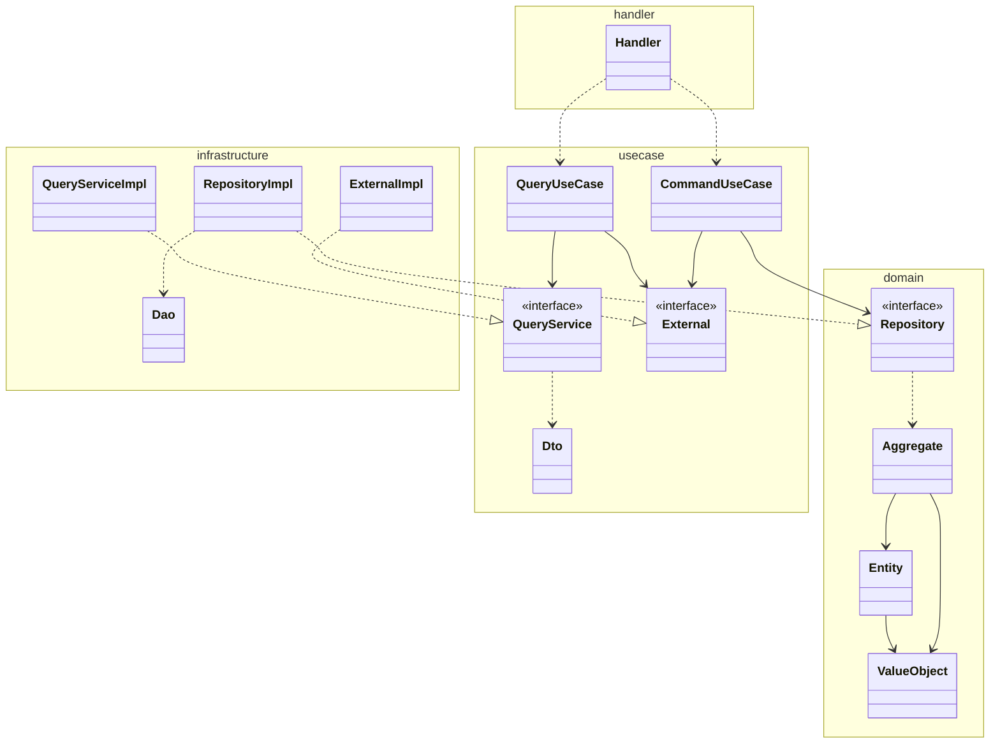

# Avion 共通開発ガイドライン

**Last Updated:** 2025/08/13  
**Compliance:** `.cursor/rules`準拠

## 概要

Avionのすべてのマイクロサービスで統一的に適用する開発ガイドラインです。
このドキュメントは、`.cursor/rules`に定義された開発規約に完全準拠し、TDD（テスト駆動開発）、DDD（ドメイン駆動設計）、環境変数管理、モック生成戦略、テスト戦略を含む包括的なガイドラインを提供します。

> **重要**: 本ガイドラインは`.cursor/rules/guidelines.mdc`および`.cursor/rules/ddd/architecture/architecture.md`に定義された規約の上位制約として機能します。すべての開発者はこれらの規約を厳守する必要があります。

## 目次

1. [テスト駆動開発（TDD）](#1-テスト駆動開発tdd)
2. [ドメイン駆動設計（DDD）](#2-ドメイン駆動設計ddd)
3. [モック生成戦略](#3-モック生成戦略)
4. [Git運用規約](#4-git運用規約)
5. [環境変数管理](#5-環境変数管理)
6. [テスト戦略](#6-テスト戦略)
7. [構造化ログ戦略](#7-構造化ログ戦略)
8. [エラーハンドリング戦略](#8-エラーハンドリング戦略)
9. [ID生成戦略](#9-id生成戦略)

---

## 1. テスト駆動開発（TDD）

[共通テスト戦略](../testing-strategy.md)に定義された詳細なTDD実践方法に従います。

### 開発ワークフロー

`.cursor/rules/guidelines.mdc`に従い、厳格なテスト駆動開発を実践します。以下の手順を**ファイル単位**で、この順番通りに実行してください（MUST）。

#### Step 1: インターフェース定義
実装すべき機能のインターフェースを最初に定義します。

#### Step 2: テスト実装
定義したインターフェースに対するテストコードを記述します。この時点では、プロダクトコードが存在しないためテストは失敗します。

詳細な実装方法、テーブル駆動テストのパターン、カバレッジ目標については[共通テスト戦略](../testing-strategy.md)を参照してください。

#### Step 3: プロダクトコード実装
Step 2で記述したすべてのテストが成功するように、プロダクトコードを実装します。

#### Step 4: 検証と反復
現在のファイルに関連するすべてのテストがパスすることを確認したら、次のファイルの実装に進みます。

### テスト要件

- **カバレッジ**: 90%以上のコードカバレッジを維持
- **テーブル駆動テスト**: Goの場合、すべてのテストはテーブル駆動形式で記述
- **契約による設計**: 事前条件、事後条件、不変条件を検証するテストコード
- **エラーケース**: 正常系だけでなく、異常系のテストも網羅的に実装

---

## 2. ドメイン駆動設計（DDD）

### レイヤードアーキテクチャ

`.cursor/rules/ddd/architecture/architecture.md`に準拠した4層アーキテクチャを厳守します。



### 各層の責務

#### Handler層
- HTTPリクエスト/レスポンスの処理
- gRPCエンドポイントの実装
- WebSocketハンドラー
- バッチジョブのエントリーポイント

#### UseCase層
- ビジネスロジックの調整
- トランザクション境界の管理
- Command/Queryの分離（CQRS）
- 外部サービスとの連携

#### Domain層
- ビジネスルールの実装
- 集約（Aggregate）による整合性保証
- エンティティと値オブジェクト
- ドメインサービス

#### Infrastructure層
- データベースアクセス
- 外部APIクライアント
- キャッシュ管理
- イベント発行

---

## 3. モック生成戦略

### 基本ルール

`.cursor/rules/guidelines.mdc`に従い、以下のルールでモックを生成します：

1. **使用ツール**: `go.uber.org/mock/gomock`を使用
2. **ディレクトリ構造**: プロジェクトルートの`tests`ディレクトリ内に、元のパッケージ構造をミラーリング
3. **生成ディレクティブ**: インターフェース定義に`//go:generate`を追加
4. **パッケージ名**: `-package`オプションには実装と同じパッケージ名を指定（MUST）

### モック生成例

#### Domain層のRepository
```go
//go:generate mockgen -source=$GOFILE -destination=../../tests/domain/repository/mock_user_repository.go -package=repository
package repository

type UserRepository interface {
    Create(ctx context.Context, user *User) error
    FindByID(ctx context.Context, id UserID) (*User, error)
    Update(ctx context.Context, user *User) error
    Delete(ctx context.Context, id UserID) error
}
```

#### UseCase層のExternal Service
```go
//go:generate mockgen -source=$GOFILE -destination=../../../tests/usecase/external/mock_notification_service.go -package=external
package external

type NotificationService interface {
    Send(ctx context.Context, notification *Notification) error
}
```

### 実行方法

```bash
# モック生成
go generate ./...

# テスト実行
go test ./...

# カバレッジ確認
go test -v -coverprofile=coverage.out ./...
go tool cover -html=coverage.out -o coverage.html
```

---

## 4. Git運用規約

### コミットメッセージ規約

すべてのコミットメッセージは[Conventional Commits](https://www.conventionalcommits.org/)仕様に準拠しなければなりません（MUST）。

#### フォーマット
```
<type>(<scope>): <subject>

[optional body]

[optional footer]
```

- **type**: `feat`, `fix`, `docs`, `style`, `refactor`, `perf`, `test`, `chore`のいずれか
- **scope**: 変更が影響するコンポーネント名をカンマ区切りで記載（必須）
- **subject**: 変更内容の簡潔な要約。50文字以内。動詞の原形で記述
- **body**: （任意）変更の動機や詳細な説明。1行あたり72文字以内
- **footer**: （任意）関連するIssue番号などを記載。例: `Fixes: #123`, `Refs: #456`

#### 例
```
feat(avion-auth,avion-gateway): ユーザー認証機能の実装

JWT認証を使用したユーザー認証機能を実装。
avion-authで認証処理を行い、avion-gatewayでトークン検証を実施。

Fixes: #123
```

### ブランチ戦略

#### 命名規則
```
[コンポーネント名]/[タスク番号]/[短いタスク内容]
```

例:
- `avion-auth/T-123/add-jwt-auth`
- `avion-gateway/T-456/fix-cors-issue`

### プルリクエスト

- **タイトル**: 対応するタスクチケットのタイトルと完全に一致させる
- **テスト結果**: 実行コマンド付きでテスト結果を添付（MUST）
- **Linter結果**: `golangci-lint run`の結果を添付

---

## 5. 環境変数管理

### 設計原則

1. **早期失敗（Fail Fast）**: 必須環境変数が不足している場合、起動時に即座に失敗
2. **明確なエラーメッセージ**: どの環境変数が不足しているかを明確に報告
3. **型安全性**: 環境変数を適切な型に変換し、Value Objectとして扱う
4. **テスト容易性**: 環境変数の読み込みをインターフェース化し、モック可能に
5. **DDD準拠**: Infrastructure層のConfigパッケージとして実装

### パッケージ構造

```
avion-[service-name]/
└── internal/
    └── infrastructure/
        └── config/
            ├── config.go          # Config構造体とロード関数
            ├── config_test.go     # テスト
            ├── validator.go       # 検証ロジック
            └── errors.go          # エラー定義
```

### Config構造体の定義

```go
// internal/infrastructure/config/config.go
package config

import (
    "fmt"
    "os"
    "strconv"
    "time"
)

// Config はサービスの設定を保持する構造体
type Config struct {
    // サーバー設定
    Server ServerConfig
    
    // データベース設定
    Database DatabaseConfig
    
    // Redis設定
    Redis RedisConfig
    
    // 認証設定
    Auth AuthConfig
    
    // 外部サービス設定
    Services ServicesConfig
    
    // 監視設定
    Observability ObservabilityConfig
}

// ServerConfig サーバー関連の設定
type ServerConfig struct {
    Port        int           `env:"PORT" required:"true" default:"8080"`
    GRPCPort    int           `env:"GRPC_PORT" required:"true" default:"9090"`
    Environment string        `env:"ENVIRONMENT" required:"true" default:"development"`
    LogLevel    string        `env:"LOG_LEVEL" required:"false" default:"info"`
    Timeout     time.Duration `env:"SERVER_TIMEOUT" required:"false" default:"30s"`
}

// DatabaseConfig データベース関連の設定
type DatabaseConfig struct {
    Host     string `env:"DB_HOST" required:"true"`
    Port     int    `env:"DB_PORT" required:"true" default:"5432"`
    Name     string `env:"DB_NAME" required:"true"`
    User     string `env:"DB_USER" required:"true"`
    Password string `env:"DB_PASSWORD" required:"true" secret:"true"`
    SSLMode  string `env:"DB_SSL_MODE" required:"false" default:"require"`
}

// RedisConfig Redis関連の設定
type RedisConfig struct {
    Host     string `env:"REDIS_HOST" required:"true"`
    Port     int    `env:"REDIS_PORT" required:"true" default:"6379"`
    Password string `env:"REDIS_PASSWORD" required:"false" secret:"true"`
    DB       int    `env:"REDIS_DB" required:"false" default:"0"`
}
```

### 環境変数ローダーの実装

```go
// internal/infrastructure/config/config.go (続き)

// EnvironmentLoader は環境変数を読み込むインターフェース
//go:generate mockgen -source=$GOFILE -destination=../../../tests/mocks/infrastructure/config/mock_environment_loader.go -package=config
type EnvironmentLoader interface {
    Get(key string) string
    Lookup(key string) (string, bool)
}

// OSEnvironmentLoader はOSの環境変数を読み込む実装
type OSEnvironmentLoader struct{}

func (l *OSEnvironmentLoader) Get(key string) string {
    return os.Getenv(key)
}

func (l *OSEnvironmentLoader) Lookup(key string) (string, bool) {
    return os.LookupEnv(key)
}

// Load は環境変数から設定を読み込む
func Load(loader EnvironmentLoader) (*Config, error) {
    validator := NewValidator(loader)
    
    cfg := &Config{}
    
    // 各設定セクションの読み込みと検証
    if err := validator.ValidateAndLoad(&cfg.Server); err != nil {
        return nil, fmt.Errorf("server config: %w", err)
    }
    
    if err := validator.ValidateAndLoad(&cfg.Database); err != nil {
        return nil, fmt.Errorf("database config: %w", err)
    }
    
    if err := validator.ValidateAndLoad(&cfg.Redis); err != nil {
        return nil, fmt.Errorf("redis config: %w", err)
    }
    
    // ... 他の設定セクション
    
    return cfg, nil
}

// MustLoad は環境変数から設定を読み込み、エラーの場合はパニックする
func MustLoad() *Config {
    cfg, err := Load(&OSEnvironmentLoader{})
    if err != nil {
        panic(fmt.Sprintf("failed to load config: %v", err))
    }
    return cfg
}
```

### main.goでの使用例

```go
// cmd/server/main.go
package main

import (
    "log"
    "os"
    "os/signal"
    "syscall"
    
    "github.com/avion/avion-[service-name]/internal/infrastructure/config"
    // ... 他のインポート
)

func main() {
    // 環境変数の読み込み（必須環境変数が不足していればここで失敗）
    cfg := config.MustLoad()
    
    // ロガーの初期化
    logger := initLogger(cfg.Server.LogLevel)
    
    logger.Info("Starting avion-[service-name] server",
        "environment", cfg.Server.Environment,
        "port", cfg.Server.Port,
        "grpc_port", cfg.Server.GRPCPort,
    )
    
    // 依存関係の初期化
    db := initDatabase(cfg.Database)
    redis := initRedis(cfg.Redis)
    
    // サーバーの起動
    // ...
}
```

---

## 6. テスト戦略

詳細なテスト戦略、TDD実践方法、テーブル駆動テストのパターン、カバレッジ目標については[共通テスト戦略](../testing-strategy.md)を参照してください。

### 設計原則

1. **インターフェースファーストの開発**: インターフェースを最初に定義
2. **自動生成**: `//go:generate` ディレクティブによる自動化
3. **統一的な配置**: `tests/mocks/` ディレクトリに元のパッケージ構造をミラーリング
4. **型安全性**: gomockによる型安全なモック生成

### モック生成ルール

`.cursor/rules/guidelines.mdc` に従い、以下のルールを適用：

- モック生成ツール: `go.uber.org/mock/gomock`
- 生成先: `tests/` ディレクトリ配下（元のパッケージ構造をミラーリング）
- ファイル名: `mock_[インターフェースファイル名].go`

### プロジェクト構造

```
avion-[service-name]/
├── internal/
│   ├── domain/
│   │   └── repository/       # Repository インターフェース定義
│   ├── usecase/
│   │   ├── query/           # Query Service インターフェース定義
│   │   └── external/        # External Service インターフェース定義
│   └── infrastructure/
│       └── config/          # Config インターフェース定義
└── tests/
    └── mocks/               # モックファイル配置先
        ├── domain/
        │   └── repository/  # Repository モック
        ├── usecase/
        │   ├── query/       # Query Service モック
        │   └── external/    # External Service モック
        └── infrastructure/
            └── config/      # Config モック
```

### Makefile による自動化

全てのサービスで統一的に以下のMakefileタスクを実装：

```makefile
# Makefile
.PHONY: generate generate-mocks test

# モック生成
generate:
	@echo "Generating mocks..."
	go generate ./...
	@echo "Mocks generated successfully"

# 別名タスク（互換性のため）
generate-mocks: generate

# テスト実行（モック生成を含む）
test: generate
	go test -race -short ./internal/...
```

### 生成対象インターフェース

#### Domain Layer
- Repository Interfaces
- Domain Service Interfaces

#### Use Case Layer
- Query Service Interfaces
- External Service Interfaces

#### Infrastructure Layer
- External API Client Interfaces
- Cache Interfaces

### 統一実装手順

#### Step 1: ディレクトリ構造の作成

```bash
# プロジェクトルートで実行
mkdir -p tests/mocks/domain/repository
mkdir -p tests/mocks/usecase/query
mkdir -p tests/mocks/usecase/external
mkdir -p tests/mocks/infrastructure/config
```

#### Step 2: go.mod への依存追加

```bash
go get go.uber.org/mock/gomock
go get go.uber.org/mock/mockgen
```

#### Step 3: インターフェース定義とモック生成の例

##### Domain Layer - Repository Interface

```go
// internal/domain/repository/user_repository.go
package repository

import (
    "context"
    "github.com/avion/avion-auth/internal/domain/aggregate"
)

//go:generate mockgen -source=$GOFILE -destination=../../../tests/mocks/domain/repository/mock_user_repository.go -package=repository
type UserRepository interface {
    Save(ctx context.Context, user *aggregate.User) error
    FindByID(ctx context.Context, id UserID) (*aggregate.User, error)
    FindByUsername(ctx context.Context, username Username) (*aggregate.User, error)
    Delete(ctx context.Context, id UserID) error
}
```

#### Use Case Layer - Query Service Interface

```go
// internal/usecase/query/user_query_service.go
package query

import (
    "context"
    "github.com/avion/avion-auth/internal/usecase/dto"
)

//go:generate mockgen -source=$GOFILE -destination=../../../tests/mocks/usecase/query/mock_user_query_service.go -package=query
type UserQueryService interface {
    GetUser(ctx context.Context, userID string) (*dto.UserOutput, error)
    GetUsersByIDs(ctx context.Context, userIDs []string) ([]*dto.UserOutput, error)
    SearchUsers(ctx context.Context, criteria dto.SearchCriteria) ([]*dto.UserOutput, error)
}
```

#### Use Case Layer - External Service Interface

```go
// internal/usecase/external/notification_service.go
package external

import (
    "context"
)

//go:generate mockgen -source=$GOFILE -destination=../../../tests/mocks/usecase/external/mock_notification_service.go -package=external
type NotificationServiceClient interface {
    SendEmail(ctx context.Context, to string, subject string, body string) error
    SendPushNotification(ctx context.Context, userID string, title string, message string) error
}
```

### Step 4: モック生成の実行

各サービスで以下のコマンドを実行してモックを生成：

```bash
# プロジェクトルートで実行
make generate

# または直接実行
go generate ./...

# 生成されたモックの確認
ls -la tests/mocks/
```

### Step 5: CI/CDへの統合

```yaml
# .github/workflows/test.yml
name: Test

on:
  push:
    branches: [ main ]
  pull_request:
    branches: [ main ]

jobs:
  test:
    runs-on: ubuntu-latest
    steps:
    - uses: actions/checkout@v3
    
    - name: Set up Go
      uses: actions/setup-go@v4
      with:
        go-version: '1.21'
    
    - name: Install dependencies
      run: |
        go mod download
        go install go.uber.org/mock/mockgen@latest
    
    - name: Generate mocks
      run: make generate
    
    - name: Run tests
      run: make test
```

### テストでのモック使用例

```go
// internal/usecase/command/register_user_use_case_test.go
package command_test

import (
    "context"
    "testing"
    
    "github.com/golang/mock/gomock"
    "github.com/stretchr/testify/assert"
    
    "github.com/avion/avion-auth/internal/usecase/command"
    mock_repo "github.com/avion/avion-auth/tests/mocks/domain/repository"
    mock_external "github.com/avion/avion-auth/tests/mocks/usecase/external"
)

func TestRegisterUserUseCase_Execute(t *testing.T) {
    ctrl := gomock.NewController(t)
    defer ctrl.Finish()
    
    // モックの作成
    mockUserRepo := mock_repo.NewMockUserRepository(ctrl)
    mockNotificationService := mock_external.NewMockNotificationServiceClient(ctrl)
    
    // テストケース
    t.Run("正常系：ユーザー登録成功", func(t *testing.T) {
        // モックの期待値設定
        mockUserRepo.EXPECT().
            FindByUsername(gomock.Any(), "testuser").
            Return(nil, repository.ErrUserNotFound)
        
        mockUserRepo.EXPECT().
            Save(gomock.Any(), gomock.Any()).
            Return(nil)
        
        mockNotificationService.EXPECT().
            SendEmail(gomock.Any(), "test@example.com", gomock.Any(), gomock.Any()).
            Return(nil)
        
        // ユースケースの実行
        useCase := command.NewRegisterUserUseCase(mockUserRepo, mockNotificationService)
        
        input := command.RegisterUserInput{
            Username: "testuser",
            Email:    "test@example.com",
            Password: "securepassword123",
        }
        
        output, err := useCase.Execute(context.Background(), input)
        
        // アサーション
        assert.NoError(t, err)
        assert.NotNil(t, output)
        assert.Equal(t, "testuser", output.Username)
    })
}
```

---

## 7. 構造化ログ戦略

### TDD (Test-Driven Development) ワークフロー

`.cursor/rules/guidelines.mdc` に従い、厳格なTDDワークフローを適用：

1. **インターフェース定義を最初に作成**
2. **テストを先に記述**
3. **テストが通るように実装**
4. **すべてのテストが通ることを確認してから次のファイルへ**

### テストの種類と配置

#### 単体テスト (Unit Tests)

各層のコンポーネントごとに単体テストを作成：

```
internal/
├── domain/
│   ├── aggregate/
│   │   ├── user.go
│   │   └── user_test.go
│   ├── entity/
│   │   ├── follow.go
│   │   └── follow_test.go
│   └── value/
│       ├── user_id.go
│       └── user_id_test.go
├── usecase/
│   ├── command/
│   │   ├── register_user_use_case.go
│   │   └── register_user_use_case_test.go
│   └── query/
│       ├── get_user_use_case.go
│       └── get_user_use_case_test.go
└── infrastructure/
    ├── repository/
    │   ├── postgres_user_repository.go
    │   └── postgres_user_repository_test.go
    └── external/
        ├── grpc_notification_client.go
        └── grpc_notification_client_test.go
```

#### 統合テスト (Integration Tests)

```
tests/
├── integration/
│   ├── api/
│   │   ├── user_api_test.go
│   │   └── auth_api_test.go
│   ├── repository/
│   │   └── user_repository_integration_test.go
│   └── testdata/
│       └── fixtures.sql
└── e2e/
    ├── user_registration_test.go
    └── authentication_flow_test.go
```

### テーブル駆動テスト

Go言語のベストプラクティスに従い、テーブル駆動テストを使用：

```go
func TestUserID_Validate(t *testing.T) {
    tests := []struct {
        name    string
        input   string
        wantErr bool
        errMsg  string
    }{
        {
            name:    "正常系：有効なUserID",
            input:   "user_123456",
            wantErr: false,
        },
        {
            name:    "異常系：空文字列",
            input:   "",
            wantErr: true,
            errMsg:  "user ID cannot be empty",
        },
        {
            name:    "異常系：無効な形式",
            input:   "invalid-format",
            wantErr: true,
            errMsg:  "invalid user ID format",
        },
        {
            name:    "異常系：長すぎるID",
            input:   strings.Repeat("a", 256),
            wantErr: true,
            errMsg:  "user ID too long",
        },
    }
    
    for _, tt := range tests {
        t.Run(tt.name, func(t *testing.T) {
            userID, err := value.NewUserID(tt.input)
            
            if tt.wantErr {
                assert.Error(t, err)
                assert.Contains(t, err.Error(), tt.errMsg)
                assert.Equal(t, value.UserID{}, userID)
            } else {
                assert.NoError(t, err)
                assert.Equal(t, tt.input, userID.String())
            }
        })
    }
}
```

### カバレッジ目標

- 単体テスト: 90%以上
- 統合テスト: 主要なユースケースを網羅
- E2Eテスト: クリティカルパスを網羅

### テスト実行コマンド

```bash
# 単体テストの実行
go test ./internal/...

# カバレッジ付きテスト実行
go test -cover ./internal/...

# カバレッジレポートの生成
go test -coverprofile=coverage.out ./internal/...
go tool cover -html=coverage.out -o coverage.html

# 統合テストの実行
go test -tags=integration ./tests/integration/...

# E2Eテストの実行
go test -tags=e2e ./tests/e2e/...

# 全テストの実行
make test-all
```

### Makefile

```makefile
.PHONY: test test-unit test-integration test-e2e test-all coverage lint generate

# モック生成
generate:
	go generate ./...

# 単体テスト
test-unit:
	go test -race -short ./internal/...

# 統合テスト
test-integration:
	go test -race -tags=integration ./tests/integration/...

# E2Eテスト
test-e2e:
	go test -race -tags=e2e ./tests/e2e/...

# 全テスト実行
test-all: generate lint test-unit test-integration test-e2e

# カバレッジ
coverage:
	go test -race -coverprofile=coverage.out ./internal/...
	go tool cover -html=coverage.out -o coverage.html
	open coverage.html

# リント
lint:
	golangci-lint run

# テスト＋リント（CI用）
test: generate lint test-unit
```

### テストデータベース

統合テストでは専用のテストデータベースを使用：

```go
// tests/testutil/database.go
package testutil

import (
    "database/sql"
    "fmt"
    "testing"
    
    "github.com/golang-migrate/migrate/v4"
    "github.com/golang-migrate/migrate/v4/database/postgres"
    _ "github.com/golang-migrate/migrate/v4/source/file"
)

func SetupTestDB(t *testing.T) (*sql.DB, func()) {
    // テスト用DBの接続
    db, err := sql.Open("postgres", getTestDBURL())
    if err != nil {
        t.Fatalf("failed to connect to test database: %v", err)
    }
    
    // マイグレーション実行
    driver, err := postgres.WithInstance(db, &postgres.Config{})
    if err != nil {
        t.Fatalf("failed to create migration driver: %v", err)
    }
    
    m, err := migrate.NewWithDatabaseInstance(
        "file://./migrations",
        "postgres", driver)
    if err != nil {
        t.Fatalf("failed to create migration instance: %v", err)
    }
    
    if err := m.Up(); err != nil && err != migrate.ErrNoChange {
        t.Fatalf("failed to run migrations: %v", err)
    }
    
    // クリーンアップ関数
    cleanup := func() {
        m.Down()
        db.Close()
    }
    
    return db, cleanup
}

func getTestDBURL() string {
    return fmt.Sprintf(
        "postgres://%s:%s@%s:%s/%s?sslmode=disable",
        os.Getenv("TEST_DB_USER"),
        os.Getenv("TEST_DB_PASSWORD"),
        os.Getenv("TEST_DB_HOST"),
        os.Getenv("TEST_DB_PORT"),
        os.Getenv("TEST_DB_NAME"),
    )
}
```

### 時刻に関するテスト

`github.com/newmo-oss/ctxtime` を使用した時刻のモック：

```go
// internal/domain/service/token_service_test.go
package service_test

import (
    "context"
    "testing"
    "time"
    
    "github.com/newmo-oss/ctxtime"
    "github.com/stretchr/testify/assert"
    
    "github.com/avion/avion-auth/internal/domain/service"
)

func TestTokenService_GenerateToken(t *testing.T) {
    // 固定時刻を設定
    fixedTime := time.Date(2024, 1, 1, 0, 0, 0, 0, time.UTC)
    ctx := ctxtime.WithTime(context.Background(), fixedTime)
    
    service := service.NewTokenService()
    
    token, err := service.GenerateToken(ctx, "user123")
    
    assert.NoError(t, err)
    assert.NotEmpty(t, token)
    
    // トークンの有効期限を検証
    claims, err := service.ValidateToken(ctx, token)
    assert.NoError(t, err)
    assert.Equal(t, fixedTime.Add(15*time.Minute), claims.ExpiresAt)
}
```

---

## 8. エラーハンドリング戦略

### ログフレームワーク

- **使用ライブラリ**: `slog` (Go標準ライブラリ) または `zap`
- **出力形式**: JSON形式
- **ログレベル**: Debug, Info, Warn, Error, CRITICAL
- **CRITICALレベル**: panicにして処理を停止させないといけないレベル

### ログ構造の標準フィールド

```go
type LogContext struct {
    // 必須フィールド
    Timestamp   time.Time `json:"timestamp"`
    Level       string    `json:"level"`
    Service     string    `json:"service"`
    Version     string    `json:"version"`
    TraceID     string    `json:"trace_id"`
    SpanID      string    `json:"span_id"`
    
    // コンテキストフィールド
    UserID      string    `json:"user_id,omitempty"`
    RequestID   string    `json:"request_id,omitempty"`
    Method      string    `json:"method,omitempty"`
    Path        string    `json:"path,omitempty"`
    Layer       string    `json:"layer,omitempty"`
    
    // エラー情報
    Error       string    `json:"error,omitempty"`
    ErrorCode   string    `json:"error_code,omitempty"`
    StackTrace  string    `json:"stack_trace,omitempty"`
    
    // パフォーマンス
    Duration    int64     `json:"duration_ms,omitempty"`
    
    // カスタムフィールド
    Extra       map[string]interface{} `json:"extra,omitempty"`
}
```

### 各層でのログ出力例

#### Handler層

```go
logger.Info("gRPC request received",
    slog.String("method", "RegisterUser"),
    slog.String("trace_id", traceID),
    slog.String("layer", "handler"),
)

logger.Error("gRPC request failed",
    slog.String("method", "RegisterUser"),
    slog.String("error", err.Error()),
    slog.String("error_code", "VALIDATION_ERROR"),
    slog.String("layer", "handler"),
)
```

#### Use Case層

```go
logger.Info("use case execution started",
    slog.String("use_case", "RegisterUserUseCase"),
    slog.String("user_id", userID),
    slog.String("layer", "usecase"),
)

logger.Warn("duplicate user registration attempt",
    slog.String("username", username),
    slog.String("email", email),
    slog.String("layer", "usecase"),
)
```

#### Infrastructure層

```go
logger.Debug("database query executed",
    slog.String("operation", "insert"),
    slog.String("table", "users"),
    slog.Int64("duration_ms", queryDuration),
    slog.String("layer", "infra"),
)

logger.Error("database connection failed",
    slog.String("host", dbHost),
    slog.String("error", err.Error()),
    slog.String("error_code", "DB_CONNECTION_ERROR"),
    slog.String("layer", "infra"),
)
```

### CRITICALレベルログの例

```go
// データ整合性の致命的破壊
logger.With(slog.String("level", "CRITICAL")).Error("data corruption detected",
    slog.String("table", "users"),
    slog.String("corruption_type", "primary_key_conflict"),
    slog.Int("affected_rows", affectedRows),
    slog.String("action", "immediate_intervention_required"),
)

// システムリソースの枯渇
logger.With(slog.String("level", "CRITICAL")).Error("resource exhaustion",
    slog.String("resource", "database_connections"),
    slog.Int("current_connections", currentConnections),
    slog.Int("max_connections", maxConnections),
    slog.String("action", "service_degradation_imminent"),
)
```

### セキュリティ考慮事項

- パスワードやトークンは絶対にログに含めない
- 個人情報（メールアドレス等）は必要に応じてハッシュ化
- 機密データを含む可能性のあるフィールドは `secret:"true"` タグを付与

---


### ドメインエラーの定義

各層で適切なエラーを定義し、エラーの伝播を明確化：

#### Domain層

```go
// internal/domain/error/errors.go
package error

import "errors"

// 認証関連エラー
var (
    ErrUserNotFound         = errors.New("user not found")
    ErrInvalidCredentials   = errors.New("invalid credentials")
    ErrUserAlreadyExists    = errors.New("user already exists")
    ErrInvalidPassword      = errors.New("invalid password")
    ErrWeakPassword         = errors.New("password does not meet strength requirements")
)

// バリデーションエラー
var (
    ErrInvalidUserID        = errors.New("invalid user ID")
    ErrInvalidUsername      = errors.New("invalid username")
    ErrInvalidEmail         = errors.New("invalid email format")
    ErrEmptyField           = errors.New("required field is empty")
)

// カスタムエラー型
type ValidationError struct {
    Field   string
    Message string
}

func (e ValidationError) Error() string {
    return fmt.Sprintf("validation error on field '%s': %s", e.Field, e.Message)
}
```

#### Use Case層

```go
// internal/usecase/error/errors.go
package error

import (
    "fmt"
    domain_error "github.com/avion/avion-auth/internal/domain/error"
)

// ユースケース固有のエラー
type UseCaseError struct {
    Type    string
    Message string
    Cause   error
}

func (e UseCaseError) Error() string {
    if e.Cause != nil {
        return fmt.Sprintf("%s: %s (caused by: %v)", e.Type, e.Message, e.Cause)
    }
    return fmt.Sprintf("%s: %s", e.Type, e.Message)
}

func (e UseCaseError) Unwrap() error {
    return e.Cause
}

// エラー変換関数
func ConvertDomainError(err error) error {
    switch {
    case errors.Is(err, domain_error.ErrUserNotFound):
        return UseCaseError{
            Type:    "NOT_FOUND",
            Message: "The requested user does not exist",
            Cause:   err,
        }
    case errors.Is(err, domain_error.ErrUserAlreadyExists):
        return UseCaseError{
            Type:    "CONFLICT",
            Message: "A user with this username or email already exists",
            Cause:   err,
        }
    default:
        return UseCaseError{
            Type:    "INTERNAL_ERROR",
            Message: "An unexpected error occurred",
            Cause:   err,
        }
    }
}
```

#### Handler層

```go
// internal/handler/grpc/error_mapper.go
package grpc

import (
    "errors"
    "google.golang.org/grpc/codes"
    "google.golang.org/grpc/status"
    
    usecase_error "github.com/avion/avion-auth/internal/usecase/error"
)

// MapToGRPCError はユースケースエラーをgRPCエラーに変換する
func MapToGRPCError(err error) error {
    var ucErr usecase_error.UseCaseError
    if errors.As(err, &ucErr) {
        switch ucErr.Type {
        case "NOT_FOUND":
            return status.Error(codes.NotFound, ucErr.Message)
        case "CONFLICT":
            return status.Error(codes.AlreadyExists, ucErr.Message)
        case "VALIDATION_ERROR":
            return status.Error(codes.InvalidArgument, ucErr.Message)
        case "UNAUTHORIZED":
            return status.Error(codes.Unauthenticated, ucErr.Message)
        case "FORBIDDEN":
            return status.Error(codes.PermissionDenied, ucErr.Message)
        default:
            return status.Error(codes.Internal, "Internal server error")
        }
    }
    
    // デフォルトエラー
    return status.Error(codes.Unknown, "Unknown error occurred")
}
```

### エラーハンドリングのベストプラクティス

1. **エラーのラップ**: `fmt.Errorf` や `errors.Join` を使用してコンテキストを追加
2. **エラーの比較**: `errors.Is` や `errors.As` を使用
3. **早期リターン**: エラーが発生したら即座にリターン
4. **ログとエラー**: エラーはログに記録し、上位層に伝播
5. **ユーザー向けメッセージ**: 技術的詳細を隠蔽し、分かりやすいメッセージを提供

```go
// 良い例
func (uc *RegisterUserUseCase) Execute(ctx context.Context, input RegisterUserInput) (*RegisterUserOutput, error) {
    // バリデーション
    if err := uc.validateInput(input); err != nil {
        uc.logger.Warn("invalid input", slog.String("error", err.Error()))
        return nil, fmt.Errorf("validation failed: %w", err)
    }
    
    // ユーザーの存在確認
    existingUser, err := uc.userRepo.FindByUsername(ctx, input.Username)
    if err != nil && !errors.Is(err, repository.ErrNotFound) {
        uc.logger.Error("failed to check existing user", slog.String("error", err.Error()))
        return nil, fmt.Errorf("user lookup failed: %w", err)
    }
    
    if existingUser != nil {
        uc.logger.Warn("user already exists", slog.String("username", input.Username))
        return nil, ErrUserAlreadyExists
    }
    
    // ... 続きの処理
}
```

---

## 9. ID生成戦略

### Backend採番の原則

Avionプラットフォームでは、すべてのIDをBackendで採番します。データベースの自動採番機能（AUTO_INCREMENT等）は使用しません。

詳細な実装ガイドラインについては[ID生成ガイドライン](../id-generation-guideline.md)を参照してください。

### 推奨ID形式

1. **ULID**: 時系列データ（Drop、Timeline）で推奨
2. **UUID v7**: 標準準拠が必要な場合
3. **Snowflake ID**: 高頻度生成が必要な場合
4. **UUID v4**: 順序が不要な場合

### 実装例

```go
// IDジェネレーターインターフェース
type IDGenerator interface {
    Generate(ctx context.Context) (value.ID, error)
    GenerateBatch(ctx context.Context, count int) ([]value.ID, error)
}

// ユースケースでの使用
func (uc *CreateUserUseCase) Execute(ctx context.Context, input CreateUserInput) (*CreateUserOutput, error) {
    // Backend採番でIDを生成
    userID, err := uc.idGenerator.Generate(ctx)
    if err != nil {
        return nil, fmt.Errorf("ID generation failed: %w", err)
    }
    
    // 生成されたIDを使用してエンティティを作成
    user, err := aggregate.NewUser(userID, input.Username, input.Email)
    // ...
}
```

---

## まとめ

このガイドラインに従うことで、Avionのすべてのマイクロサービスにおいて：

1. **統一的な開発体験**: 同じパターンとプラクティスの適用
2. **高い保守性**: 明確な構造と充実したテスト
3. **優れた運用性**: 構造化ログとエラーハンドリング
4. **型安全性**: インターフェースとモックによる型安全な開発
5. **早期エラー検出**: 環境変数の起動時検証とTDD
6. **ID生成の一貫性**: Backend採番による統一的なID管理

各サービス開発時は、このガイドラインを参照し、一貫性のある高品質なコードを実装してください。