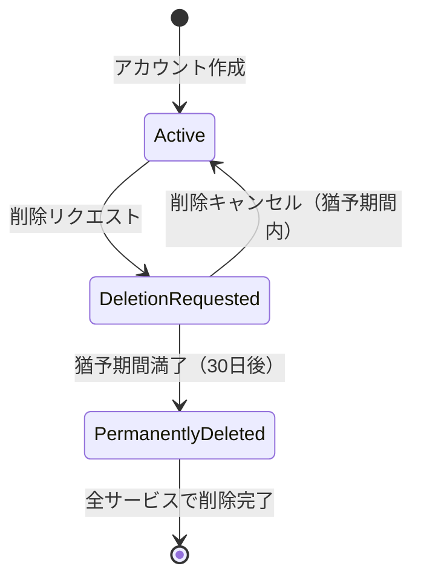
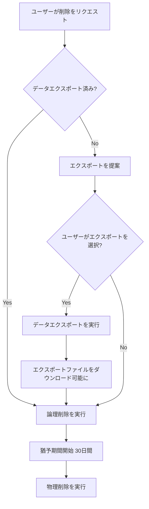
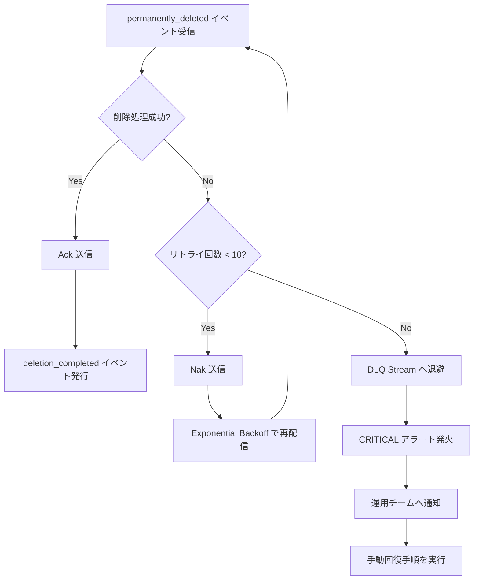
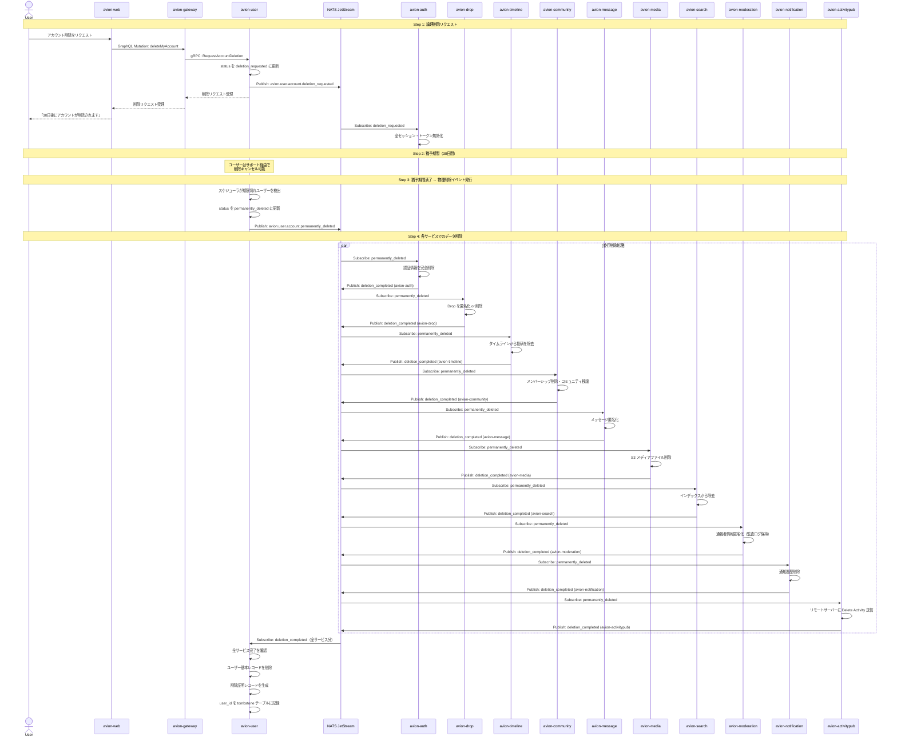
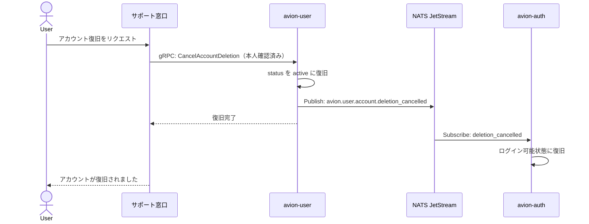

# ユーザー削除カスケード設計

**Last Updated:** 2026/03/14
**Author:** Claude Code
**Status:** 採用済み
**Compliance:** Draft

## 概要

Avion プラットフォームはマイクロサービスアーキテクチャを採用しており、ユーザーに関するデータは複数のサービスに分散して保持されています。ユーザーアカウントの削除は、単一データベースのカスケード削除では完結せず、すべての関連サービスが協調してデータを削除・匿名化する必要があります。

本ドキュメントでは、Saga パターンに基づくユーザー削除のカスケードフローを定義し、GDPR をはじめとするプライバシー規制への準拠を保証する設計を記述します。

### 解決すべき課題

| 課題 | 説明 |
|:--|:--|
| **データ散在** | ユーザーデータがプロフィール、投稿、メディア、通知、検索インデックス等に分散しており、削除漏れのリスクがある |
| **整合性保証** | 一部サービスで削除が失敗した場合、データの不整合が発生する |
| **法的義務** | GDPR の「忘れられる権利」により、合理的な期間内にすべての個人データを削除する義務がある |
| **誤操作保護** | ユーザーの誤操作によるアカウント削除を防止するため、猶予期間が必要 |
| **監査要件** | モデレーション関連の記録は法的要件により一定期間保持する必要がある |

## 目次

1. [削除フロー](#1-削除フロー)
2. [各サービスの削除責務](#2-各サービスの削除責務)
3. [NATS イベント設計](#3-nats-イベント設計)
4. [GDPR 対応](#4-gdpr-対応)
5. [失敗時のリカバリ](#5-失敗時のリカバリ)
6. [シーケンス図](#6-シーケンス図)
7. [運用ガイドライン](#7-運用ガイドライン)

---

## 1. 削除フロー

ユーザー削除は Saga パターンを採用し、以下の 4 ステップで段階的に実行します。即座に物理削除を行わず、猶予期間を設けることで誤操作からの復旧を可能にします。

### 1.1 フロー概要



### 1.2 Step 1: 論理削除リクエスト

ユーザーが avion-web からアカウント削除をリクエストすると、avion-user が論理削除を実行します。

1. avion-gateway が認証を確認し、avion-user に削除リクエストを転送
2. avion-user がユーザーレコードの `status` を `deletion_requested` に更新
3. avion-user が `deletion_requested_at` タイムスタンプを記録
4. avion-user が `avion.user.account.deletion_requested` イベントを NATS に発行
5. avion-auth が即座にすべてのアクティブセッションとリフレッシュトークンを無効化

**この時点でユーザーはログイン不可となるが、データは保持されます。**

### 1.3 Step 2: 猶予期間（30日間）

論理削除から物理削除までの間に 30 日間の猶予期間を設けます。

- ユーザーはサポート経由で削除をキャンセルし、アカウントを復旧可能
- 復旧時は `avion.user.account.deletion_cancelled` イベントを発行し、セッション無効化を解除
- 猶予期間中、ユーザーのデータは検索結果やタイムラインから非表示となる
- 猶予期間中のデータ変更は行わない（読み取り専用状態）

### 1.4 Step 3: 物理削除イベント発行

猶予期間満了後、バッチジョブが物理削除プロセスを開始します。

1. avion-user のスケジューラが `deletion_requested_at` から 30 日経過したユーザーを検出
2. avion-user がユーザーレコードの `status` を `permanently_deleted` に更新
3. avion-user が `avion.user.account.permanently_deleted` イベントを NATS に発行
4. 各サービスがイベントを受信し、自身が管理するデータの削除・匿名化を実行

### 1.5 Step 4: 各サービスでのデータ削除

各サービスは `avion.user.account.permanently_deleted` イベントを受信後、自身の責務範囲のデータを削除・匿名化します。各サービスの削除が完了したら、`avion.user.account.deletion_completed` イベントを発行してステータスを報告します。

avion-user は全サービスからの完了報告を集約し、すべての削除が完了したことを確認した上で最終的にユーザーの基本レコードを削除します。

---

## 2. 各サービスの削除責務

### 2.1 責務一覧

| サービス | 削除対象 | 処理方式 | 優先度 | 想定所要時間 |
|:--|:--|:--|:--|:--|
| avion-auth | 認証情報、セッション、トークン | 物理削除 | 最高 | < 1秒 |
| avion-user | プロフィール、フォロー関係、設定 | 物理削除 | 最高 | < 5秒 |
| avion-drop | 投稿（Drop）、リアクション | 匿名化 or 物理削除 | 高 | < 30秒 |
| avion-timeline | タイムライン上の投稿参照 | 物理削除 | 高 | < 10秒 |
| avion-community | メンバーシップ、所有コミュニティ | 移譲 + 物理削除 | 高 | < 10秒 |
| avion-message | DM メッセージ | 匿名化 | 高 | < 30秒 |
| avion-media | メディアファイル | S3 物理削除 | 中 | < 60秒 |
| avion-search | 検索インデックス | インデックス除去 | 中 | < 10秒 |
| avion-moderation | 通報者情報 | 匿名化（監査ログは保持） | 中 | < 5秒 |
| avion-notification | 通知履歴 | 物理削除 | 低 | < 5秒 |
| avion-activitypub | リモートサーバー通知 | Delete Activity 送信 | 低 | < 30秒 |

### 2.2 各サービスの詳細

#### avion-auth

```
削除対象:
  - パスワードハッシュ
  - Passkey 登録情報（公開鍵クレデンシャル）
  - TOTP シークレット
  - すべてのアクティブセッション
  - リフレッシュトークン
  - 認可ポリシーのユーザー固有エントリ

処理方式: 物理削除
備考: Step 1（論理削除時点）でセッション・トークンは即座に無効化済み。
      Step 4 では残存する認証情報の完全削除を実行する。
```

#### avion-user

```
削除対象:
  - プロフィール情報（表示名、自己紹介、アバター URL）
  - フォロー・フォロワー関係
  - ブロック・ミュート設定
  - ユーザー設定（通知設定、プライバシー設定等）
  - Redis 上のプロフィールキャッシュ

処理方式: 物理削除
備考: 全サービスからの削除完了報告を受けた後、最後にユーザー基本レコードを削除する。
      ユーザー ID は tombstone テーブルに記録し、同一 ID の再利用を防止する。
```

#### avion-drop

```
削除対象:
  - ユーザーが作成した Drop（投稿）
  - ユーザーが追加したリアクション
  - Redis 上のリアクションキャッシュ

処理方式: ユーザー設定による選択制
  - "匿名化モード": Drop の author_id を匿名ユーザー ID に置換し、コンテンツは残存
  - "完全削除モード": Drop とリアクションを物理削除

備考: 他ユーザーのリアクション（削除対象ユーザーの Drop に付けられたもの）は、
      Drop が完全削除される場合にのみカスケード削除される。
```

#### avion-timeline

```
削除対象:
  - 削除対象ユーザーの Drop へのタイムライン参照
  - Redis 上のタイムラインキャッシュ内の該当エントリ

処理方式: 物理削除
備考: 全フォロワーのタイムラインキャッシュから該当ユーザーの投稿を除去する。
      タイムラインの再構築はバックグラウンドで段階的に実行する。
```

#### avion-community

```
削除対象:
  - コミュニティメンバーシップ
  - チャンネル参加情報

移譲対象:
  - ユーザーが Owner のコミュニティ → 次の Admin に自動移譲
  - Admin が存在しない場合 → コミュニティをアーカイブ状態に遷移

処理方式: 移譲 + 物理削除
備考: コミュニティ移譲の結果は管理者に通知される。
```

#### avion-message

```
削除対象:
  - DM の送信者情報

処理方式: 匿名化（条件付き）
  - 平文メッセージ: sender_id を匿名ユーザー ID に置換
  - E2E 暗号化メッセージ: メッセージ本文はそのまま残存（復号不可能なため）
    - sender_id のみ匿名化
    - 削除ユーザーの暗号鍵は破棄されるため、以降の復号は不可能

備考: 相手ユーザーの会話履歴は保持される（送信者名が「削除済みユーザー」に置換）。
```

#### avion-media

```
削除対象:
  - ユーザーがアップロードした全メディアファイル（S3 上のオリジナル + 変換済みファイル）
  - PostgreSQL 上のメディアメタデータ
  - CDN キャッシュの無効化リクエスト

処理方式: S3 物理削除
備考: S3 削除はバッチ処理で実行し、CDN キャッシュの TTL 経過を待つ。
      削除確認は S3 のバージョニング機能で追跡可能。
```

#### avion-search

```
削除対象:
  - MeiliSearch 内のユーザープロフィールインデックス
  - MeiliSearch 内の該当ユーザーの Drop インデックス
  - PostgreSQL FTS のフォールバックインデックス

処理方式: インデックス除去
備考: MeiliSearch のドキュメント削除 API を使用。
      Drop が匿名化モードの場合、インデックスの author 情報のみ更新する。
```

#### avion-moderation

```
削除対象:
  - ユーザーが通報者として記録されている通報の個人情報

保持対象（法的要件）:
  - モデレーションアクションの監査ログ（7年間保持）
  - 通報内容（匿名化した上で保持）

処理方式: 匿名化
備考: 監査ログ内のユーザー ID は匿名化されたハッシュ値に置換される。
      監査ログの保持期間（7年）は法的要件に基づく。
      保持期間経過後に自動削除するバッチジョブを別途実装する。
```

#### avion-notification

```
削除対象:
  - ユーザー宛の通知履歴
  - ユーザーが発生源の通知（「Xさんがいいねしました」等）
  - Web Push サブスクリプション

処理方式: 物理削除
備考: ユーザーが発生源の通知は、受信者側の通知一覧からも除去される。
```

#### avion-activitypub

```
削除対象:
  - ローカル Actor レコード
  - フェデレーション先のリモートサーバーへの通知

処理方式: Delete Activity 送信
備考: ActivityPub 仕様に基づき、既知のすべてのリモートサーバーに
      Delete Activity を送信する。
      リモートサーバーでの削除はベストエフォートであり、保証されない。
      HTTP Signature の鍵は Delete Activity 送信完了後に破棄する。
```

---

## 3. NATS イベント設計

### 3.1 Subject 一覧

ユーザー削除カスケードに関連する NATS Subject を以下に定義します。命名規則は `docs/common/infrastructure/nats-jetstream-design.md` に準拠します。

| Subject | 発行元 | 説明 |
|:--|:--|:--|
| `avion.user.account.deletion_requested` | avion-user | 論理削除リクエスト（猶予期間開始） |
| `avion.user.account.deletion_cancelled` | avion-user | 削除キャンセル（猶予期間内の復旧） |
| `avion.user.account.permanently_deleted` | avion-user | 物理削除イベント（猶予期間満了） |
| `avion.user.account.deletion_completed` | 各サービス | 個別サービスの削除完了報告 |

### 3.2 イベントペイロード定義

#### `avion.user.account.deletion_requested`

```json
{
  "id": "evt_01JXXXXXXXXXXXXXXXXXXXXXX",
  "type": "user.account.deletion_requested",
  "source": "avion-user",
  "timestamp": "2026-03-14T10:00:00Z",
  "data": {
    "user_id": "usr_01JXXXXXXXXXXXXXXXXXXXXXX",
    "requested_at": "2026-03-14T10:00:00Z",
    "scheduled_permanent_deletion_at": "2026-04-13T10:00:00Z",
    "reason": "user_requested"
  }
}
```

#### `avion.user.account.deletion_cancelled`

```json
{
  "id": "evt_01JXXXXXXXXXXXXXXXXXXXXXX",
  "type": "user.account.deletion_cancelled",
  "source": "avion-user",
  "timestamp": "2026-03-20T15:30:00Z",
  "data": {
    "user_id": "usr_01JXXXXXXXXXXXXXXXXXXXXXX",
    "cancelled_at": "2026-03-20T15:30:00Z",
    "cancelled_by": "support_agent"
  }
}
```

#### `avion.user.account.permanently_deleted`

```json
{
  "id": "evt_01JXXXXXXXXXXXXXXXXXXXXXX",
  "type": "user.account.permanently_deleted",
  "source": "avion-user",
  "timestamp": "2026-04-13T10:00:00Z",
  "data": {
    "user_id": "usr_01JXXXXXXXXXXXXXXXXXXXXXX",
    "deletion_requested_at": "2026-03-14T10:00:00Z",
    "drop_handling_mode": "anonymize",
    "services_to_notify": [
      "avion-auth",
      "avion-drop",
      "avion-timeline",
      "avion-community",
      "avion-message",
      "avion-media",
      "avion-search",
      "avion-moderation",
      "avion-notification",
      "avion-activitypub"
    ]
  }
}
```

#### `avion.user.account.deletion_completed`

```json
{
  "id": "evt_01JXXXXXXXXXXXXXXXXXXXXXX",
  "type": "user.account.deletion_completed",
  "source": "avion-drop",
  "timestamp": "2026-04-13T10:00:25Z",
  "data": {
    "user_id": "usr_01JXXXXXXXXXXXXXXXXXXXXXX",
    "service": "avion-drop",
    "status": "completed",
    "records_deleted": 1523,
    "records_anonymized": 0,
    "errors": [],
    "duration_ms": 24500
  }
}
```

### 3.3 Consumer 設計

| Consumer 名 | 購読対象 Stream | Subject フィルタ | 配信ポリシー |
|:--|:--|:--|:--|
| `auth-user-deletion-consumer` | USER | `avion.user.account.permanently_deleted` | DeliverAll |
| `drop-user-deletion-consumer` | USER | `avion.user.account.permanently_deleted` | DeliverAll |
| `timeline-user-deletion-consumer` | USER | `avion.user.account.permanently_deleted` | DeliverAll |
| `community-user-deletion-consumer` | USER | `avion.user.account.permanently_deleted` | DeliverAll |
| `message-user-deletion-consumer` | USER | `avion.user.account.permanently_deleted` | DeliverAll |
| `media-user-deletion-consumer` | USER | `avion.user.account.permanently_deleted` | DeliverAll |
| `search-user-deletion-consumer` | USER | `avion.user.account.permanently_deleted` | DeliverAll |
| `moderation-user-deletion-consumer` | USER | `avion.user.account.permanently_deleted` | DeliverAll |
| `notification-user-deletion-consumer` | USER | `avion.user.account.permanently_deleted` | DeliverAll |
| `activitypub-user-deletion-consumer` | USER | `avion.user.account.permanently_deleted` | DeliverAll |
| `user-deletion-tracker-consumer` | USER | `avion.user.account.deletion_completed` | DeliverAll |

すべての Consumer は Explicit Ack ポリシーを使用し、MaxDeliver は 10（通常の 5 より高い値を設定。削除処理の確実な完了を優先するため）とします。

---

## 4. GDPR 対応

### 4.1 忘れられる権利（Right to Erasure）

GDPR 第17条に基づき、ユーザーは自身の個人データの削除を請求する権利を有します。Avion では以下の方針で対応します。

| 要件 | 対応方針 |
|:--|:--|
| 削除リクエストの受付 | avion-web のアカウント設定画面から自己申告。サポート窓口からも受付可能 |
| 削除完了期限 | リクエストから 30 日以内（猶予期間満了後、速やかに物理削除を実行） |
| 削除範囲 | 全サービスに分散するすべての個人データ（セクション 2 に準拠） |
| 削除の例外 | 法的義務に基づく監査ログ（匿名化の上で保持） |
| 削除証明 | 全サービスの削除完了報告を集約し、削除証明レコードを生成 |

### 4.2 データポータビリティ（Right to Data Portability）

GDPR 第20条に基づき、ユーザーは自身のデータをエクスポートする権利を有します。削除フローにはデータエクスポートのステップを組み込みます。

#### エクスポート → 削除のフロー



#### エクスポート対象データ

| カテゴリ | 内容 | 形式 |
|:--|:--|:--|
| プロフィール | 表示名、自己紹介、アバター画像 | JSON + 画像ファイル |
| 投稿 | すべての Drop（テキスト + 添付メディア） | JSON + メディアファイル |
| ソーシャル | フォロー・フォロワーリスト | JSON |
| メッセージ | DM 履歴（平文メッセージのみ） | JSON |
| 設定 | 通知設定、プライバシー設定 | JSON |
| アクティビティ | ログイン履歴、リアクション履歴 | JSON |

エクスポートファイルは ZIP 形式で生成し、avion-media 経由で一時的な署名付き URL を発行してダウンロード可能にします。ダウンロード期限は 7 日間とし、期限経過後に自動削除されます。

### 4.3 削除証明

全サービスの削除完了後、以下の情報を含む削除証明レコードを生成します。このレコードは個人を特定できない形式で保持します。

```json
{
  "deletion_id": "del_01JXXXXXXXXXXXXXXXXXXXXXX",
  "user_id_hash": "sha256:xxxxxxxxxxxxxxxxxxxxxxxxxxxxxxxx",
  "requested_at": "2026-03-14T10:00:00Z",
  "completed_at": "2026-04-13T10:02:30Z",
  "services_completed": [
    {"service": "avion-auth", "completed_at": "2026-04-13T10:00:01Z"},
    {"service": "avion-drop", "completed_at": "2026-04-13T10:00:25Z"},
    {"service": "avion-timeline", "completed_at": "2026-04-13T10:00:08Z"},
    {"service": "avion-community", "completed_at": "2026-04-13T10:00:05Z"},
    {"service": "avion-message", "completed_at": "2026-04-13T10:00:20Z"},
    {"service": "avion-media", "completed_at": "2026-04-13T10:01:30Z"},
    {"service": "avion-search", "completed_at": "2026-04-13T10:00:06Z"},
    {"service": "avion-moderation", "completed_at": "2026-04-13T10:00:03Z"},
    {"service": "avion-notification", "completed_at": "2026-04-13T10:00:02Z"},
    {"service": "avion-activitypub", "completed_at": "2026-04-13T10:02:30Z"}
  ],
  "data_export_downloaded": true
}
```

---

## 5. 失敗時のリカバリ

### 5.1 リトライ戦略

ユーザー削除はデータの完全性に直結するため、通常のイベント処理よりも厳格なリトライ戦略を適用します。

| パラメータ | 値 | 理由 |
|:--|:--|:--|
| MaxDeliver | 10 | 削除処理の確実な完了を優先 |
| AckWait | 120秒 | メディア削除等の長時間処理に対応 |
| リトライ間隔 | Exponential Backoff（初回 5秒、最大 5分） | サービス復旧を待機 |
| DLQ 移行条件 | MaxDeliver 超過 | 10回失敗後に DLQ へ退避 |

### 5.2 Dead Letter Queue（DLQ）

MaxDeliver を超過したメッセージは DLQ に退避し、アラートを発火します。



DLQ に退避されたメッセージは `USER_DLQ` Stream に保持されます。

```
Stream: USER_DLQ
Subject: avion.user.dlq.>
保持ポリシー: Limits（90日間）
```

### 5.3 削除ステータス追跡

avion-user は各サービスからの `deletion_completed` イベントを追跡し、削除の進捗を管理します。

```sql
-- user_deletion_tracking テーブル
CREATE TABLE user_deletion_tracking (
    id          TEXT PRIMARY KEY,
    user_id     TEXT NOT NULL,
    service     TEXT NOT NULL,
    status      TEXT NOT NULL DEFAULT 'pending',  -- pending, completed, failed
    completed_at TIMESTAMPTZ,
    error_detail TEXT,
    retry_count  INTEGER NOT NULL DEFAULT 0,
    created_at   TIMESTAMPTZ NOT NULL DEFAULT NOW(),
    updated_at   TIMESTAMPTZ NOT NULL DEFAULT NOW(),

    UNIQUE (user_id, service)
);
```

### 5.4 手動回復手順

DLQ に退避されたメッセージに対する手動回復手順は以下の通りです。

1. **DLQ メッセージの確認**: `USER_DLQ` Stream から該当メッセージを取得し、失敗原因を調査
2. **根本原因の解決**: 対象サービスの障害、データ不整合等の根本原因を解消
3. **手動再実行**: 以下のいずれかの方法で削除を再実行
   - 対象サービスの管理 API を直接呼び出し
   - DLQ メッセージを元の Subject に再 Publish
4. **ステータス更新**: `user_deletion_tracking` テーブルのステータスを手動更新
5. **完了確認**: すべてのサービスの削除が完了していることを確認し、削除証明を生成

```bash
# DLQ メッセージの確認（NATS CLI）
nats stream view USER_DLQ --subject "avion.user.dlq.account.permanently_deleted"

# 手動再 Publish
nats pub avion.user.account.permanently_deleted --header "Nats-Msg-Id:evt_retry_xxxx" < payload.json
```

### 5.5 タイムアウト監視

猶予期間満了後、一定時間内にすべてのサービスからの削除完了が確認できない場合、アラートを発火します。

| 条件 | アラートレベル | 対応 |
|:--|:--|:--|
| 1時間以内に完了しないサービスがある | WARNING | 運用チームへ通知 |
| 24時間以内に完了しないサービスがある | CRITICAL | 即座に手動調査 |
| 72時間以内に完了しないサービスがある | CRITICAL | GDPR 期限超過リスク。法務チームへエスカレーション |

---

## 6. シーケンス図

### 6.1 削除フロー全体



### 6.2 削除キャンセルフロー



---

## 7. 運用ガイドライン

### 7.1 定期的な確認事項

| 項目 | 頻度 | 担当 |
|:--|:--|:--|
| DLQ メッセージの確認 | 日次 | 運用チーム |
| 未完了の削除処理の確認 | 日次 | 運用チーム |
| 削除証明レコードの監査 | 月次 | コンプライアンスチーム |
| 監査ログ保持期間の確認 | 四半期 | 法務チーム |

### 7.2 Prometheus アラートルール

```yaml
# k8s/monitoring/user-deletion-alerts.yaml
apiVersion: monitoring.coreos.com/v1
kind: PrometheusRule
metadata:
  name: user-deletion-alerts
  namespace: avion-monitoring
spec:
  groups:
  - name: user-deletion
    interval: 60s
    rules:
    # 削除処理の長期未完了
    - alert: UserDeletionStalled
      expr: |
        (time() - avion_user_deletion_requested_timestamp) > 86400
        and avion_user_deletion_status != "completed"
      for: 1h
      labels:
        severity: critical
        team: platform
      annotations:
        summary: "User deletion has been stalled for over 24 hours"
        description: "User {{ $labels.user_id_hash }} deletion is incomplete after 24h"

    # DLQ メッセージ蓄積
    - alert: UserDeletionDLQNotEmpty
      expr: |
        nats_jetstream_stream_total_messages{stream="USER_DLQ"} > 0
      for: 5m
      labels:
        severity: critical
        team: platform
      annotations:
        summary: "User deletion DLQ has unprocessed messages"
        description: "{{ $value }} messages in USER_DLQ require manual intervention"
```

### 7.3 Grafana ダッシュボードパネル

| パネル | メトリクス | 説明 |
|:--|:--|:--|
| 削除リクエスト数 | `rate(avion_user_deletion_requests_total[1d])` | 日次の削除リクエスト数推移 |
| 猶予期間中のユーザー数 | `avion_user_deletion_pending_count` | 現在猶予期間中のユーザー数 |
| 削除完了率 | `avion_user_deletion_completed_total / avion_user_deletion_initiated_total` | 物理削除の完了率 |
| サービス別削除所要時間 | `avion_user_deletion_duration_seconds` | 各サービスの削除処理時間 |
| DLQ メッセージ数 | `nats_jetstream_stream_total_messages{stream="USER_DLQ"}` | 未処理の DLQ メッセージ数 |
| 削除キャンセル率 | `avion_user_deletion_cancelled_total / avion_user_deletion_requests_total` | 猶予期間中のキャンセル率 |

---

## まとめ

ユーザー削除カスケード設計により、以下を実現します。

1. **段階的削除**: 30 日間の猶予期間により、ユーザーの誤操作からの復旧を保証
2. **データ完全性**: Saga パターンと削除ステータス追跡により、すべてのサービスでの削除完了を保証
3. **GDPR 準拠**: 忘れられる権利とデータポータビリティの両方に対応し、削除証明を生成
4. **監査対応**: モデレーション関連の監査ログは法的要件に基づき匿名化の上で保持
5. **障害耐性**: DLQ、Exponential Backoff、手動回復手順により、障害時でも確実に削除を完了
6. **運用可視化**: Prometheus メトリクスと Grafana ダッシュボードにより、削除プロセスの全体像を把握
7. **フェデレーション対応**: ActivityPub の Delete Activity により、リモートサーバーへの削除通知をベストエフォートで実行
