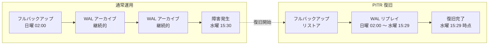
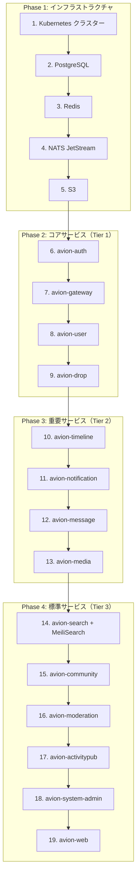
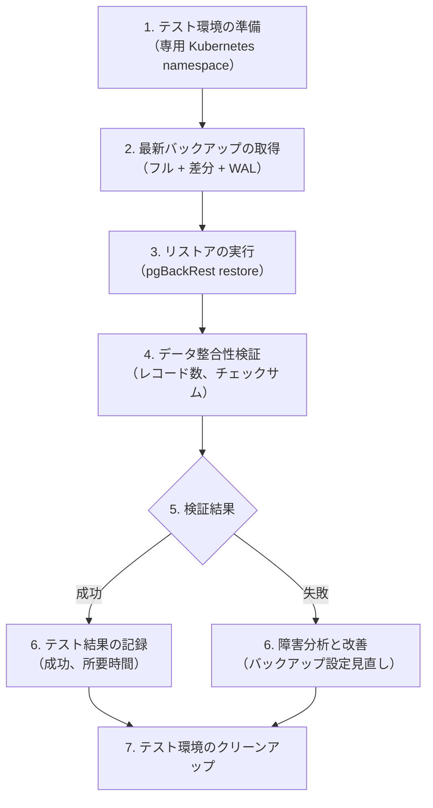
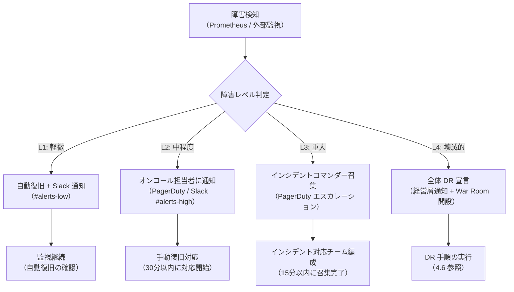

# 障害復旧（DR）計画

**Last Updated:** 2026/03/15
**Author:** Claude Code
**Status:** 採用済み
**Compliance:** Production Ready

## 概要

本ドキュメントは、Avion プラットフォーム全体の障害復旧（Disaster Recovery: DR）計画を定義します。マイクロサービスアーキテクチャにおけるデータストア（PostgreSQL、Redis、S3、NATS JetStream、MeiliSearch）の障害シナリオを網羅し、サービスティア別の RTO/RPO 目標、バックアップ戦略、復旧手順、および定期テスト計画を策定します。

### DR 計画の目的

| 目的 | 説明 |
|:--|:--|
| **サービス継続性の確保** | 障害発生時にもプラットフォームの中核機能を可能な限り維持する |
| **データ損失の最小化** | RPO 目標に基づき、許容可能なデータ損失範囲を明確にする |
| **復旧時間の最小化** | RTO 目標に基づき、サービス復旧までの時間を最短化する |
| **復旧手順の標準化** | 障害シナリオ別の復旧手順を事前に定義し、属人化を排除する |
| **定期的な検証** | DR テストを通じて計画の有効性を継続的に検証・改善する |

### スコープ

本計画は以下のコンポーネントを対象とします。

| カテゴリ | 対象コンポーネント |
|:--|:--|
| **データストア** | PostgreSQL 17、Redis 8+、S3 互換オブジェクトストレージ |
| **メッセージング** | NATS JetStream |
| **検索エンジン** | MeiliSearch 1.9+ |
| **アプリケーション** | 全 14 マイクロサービス（Kubernetes 上のステートレス Pod 群） |
| **インフラストラクチャ** | Kubernetes クラスター、CDN、DNS |

## 目次

1. [RTO/RPO 目標](#1-rtorpo-目標)
2. [バックアップ戦略](#2-バックアップ戦略)
3. [障害シナリオ](#3-障害シナリオ)
4. [復旧手順](#4-復旧手順)
5. [定期テスト](#5-定期テスト)
6. [エスカレーション](#6-エスカレーション)

---

## 1. RTO/RPO 目標

### 1.1 サービスティア定義

Avion プラットフォームのサービスをビジネスインパクトに基づき 3 段階のティアに分類し、各ティアに RTO/RPO 目標を設定します。

| ティア | RTO 目標 | RPO 目標 | 説明 |
|:--|:--|:--|:--|
| **Tier 1（クリティカル）** | 15 分以内 | 1 分以内 | サービス停止がユーザー体験に直接的かつ重大な影響を及ぼす |
| **Tier 2（重要）** | 1 時間以内 | 15 分以内 | サービス停止がユーザー体験の一部に影響を及ぼすが、中核機能は維持可能 |
| **Tier 3（標準）** | 4 時間以内 | 1 時間以内 | サービス停止の影響が限定的で、段階的な復旧が許容される |

### 1.2 サービスティア分類

| サービス | ティア | 根拠 |
|:--|:--|:--|
| **avion-auth** | Tier 1 | 認証停止は全サービスへのアクセスを遮断する |
| **avion-gateway** | Tier 1 | API ゲートウェイ停止は全 API リクエストを遮断する |
| **avion-drop** | Tier 1 | 投稿機能は SNS のコア体験であり、停止はユーザー離脱に直結する |
| **avion-user** | Tier 1 | ユーザープロフィール・ソーシャルグラフは大半の機能の前提条件 |
| **avion-timeline** | Tier 2 | タイムライン表示不可は体験劣化だが、個別投稿閲覧は可能 |
| **avion-notification** | Tier 2 | 通知遅延は体験劣化だが、サービス利用自体は可能 |
| **avion-message** | Tier 2 | DM 停止はコミュニケーション阻害だが、公開投稿は利用可能 |
| **avion-media** | Tier 2 | メディアアップロード停止はあるが、テキスト投稿は可能 |
| **avion-search** | Tier 3 | 検索停止は不便だが、直接アクセスやフォロー経由で代替可能 |
| **avion-activitypub** | Tier 3 | フェデレーション停止はローカルユーザーに影響しない |
| **avion-community** | Tier 3 | コミュニティ機能停止は限定的な影響 |
| **avion-moderation** | Tier 3 | モデレーション遅延は短期的に許容可能（キューに蓄積） |
| **avion-system-admin** | Tier 3 | 管理機能停止はエンドユーザーに直接影響しない |
| **avion-web** | Tier 3 | CDN キャッシュにより部分的に継続可能、バックエンドサービス復旧後に対応 |

### 1.3 データストアティア分類

| データストア | ティア | RPO 目標 | 根拠 |
|:--|:--|:--|:--|
| **PostgreSQL** | Tier 1 | 1 分以内 | プライマリデータストアであり、全サービスのデータ永続化を担う |
| **Redis** | Tier 2 | データ損失許容 | キャッシュ専用のため、データ損失は再構築で対応可能（[Redis キャッシュ戦略](./redis-cache-strategy.md) 参照） |
| **S3** | Tier 1 | データ損失不可 | メディアファイルは再作成不可能なユーザー資産 |
| **NATS JetStream** | Tier 2 | 15 分以内 | イベントバスのメッセージは Stream に永続化されるが、一時的な消失は Consumer の再処理で対応可能（[NATS JetStream 設計](./nats-jetstream-design.md) 参照） |
| **MeiliSearch** | Tier 3 | 再構築で対応 | 検索インデックスは PostgreSQL のデータから再構築可能 |

---

## 2. バックアップ戦略

### 2.1 バックアップ方針（3-2-1 ルール）

avion-system-admin PRD で定義された 3-2-1 ルールに準拠し、すべてのバックアップに以下を適用します。

| ルール | 内容 | Avion での実装 |
|:--|:--|:--|
| **3 コピー** | データのコピーを 3 つ保持 | プライマリ + レプリカ + オフサイトバックアップ |
| **2 メディア** | 2 種類以上の異なるストレージメディアに保存 | ブロックストレージ（PV） + オブジェクトストレージ（S3） |
| **1 オフサイト** | 1 つは地理的に離れた場所に保存 | 別リージョンの S3 バケットにクロスリージョン複製 |

### 2.2 PostgreSQL バックアップ

PostgreSQL はプラットフォーム全体のプライマリデータストアであり、最も厳密なバックアップ戦略を適用します。

#### バックアップ種別

| 種別 | 頻度 | 保持期間 | 方式 | 用途 |
|:--|:--|:--|:--|:--|
| **WAL アーカイブ** | 継続的（リアルタイム） | 14 日間 | WAL ファイルの S3 への連続アーカイブ | Point-in-Time Recovery（PITR） |
| **フルバックアップ** | 週次（日曜 02:00 JST） | 30 日間 | `pg_basebackup` による物理バックアップ | ベースラインリストア |
| **差分バックアップ** | 日次（02:00 JST） | 14 日間 | 前回フルバックアップからの差分 | 日次リストア |
| **論理バックアップ** | 週次（日曜 04:00 JST） | 90 日間 | `pg_dump` によるスキーマ + データ | 個別テーブルの選択復旧、スキーマ移行 |

#### WAL アーカイブ設定

```ini
# postgresql.conf
wal_level = replica
archive_mode = on
archive_command = 'pgbackrest --stanza=avion archive-push %p'
archive_timeout = 60
max_wal_senders = 10
wal_keep_size = 1GB
```

#### Point-in-Time Recovery（PITR）

WAL アーカイブにより、任意の時点（秒単位）へのデータ復旧が可能です。



#### バックアップ暗号化

avion-system-admin PRD の要件に準拠し、すべてのバックアップファイルを暗号化します。

| 項目 | 設定値 |
|:--|:--|
| **暗号化アルゴリズム** | AES-256-GCM |
| **鍵管理** | AWS KMS または HashiCorp Vault |
| **鍵ローテーション** | 月次 |
| **整合性検証** | SHA-256 チェックサム |

#### バックアップ検証

| 検証項目 | 頻度 | 方法 |
|:--|:--|:--|
| **チェックサム検証** | バックアップ完了時（毎回） | SHA-256 ハッシュの自動比較 |
| **リストアテスト** | 週次 | 専用環境でのフルリストア実行と整合性確認 |
| **PITR テスト** | 月次 | 特定時点へのリカバリと業務データ検証 |

### 2.3 Redis バックアップ

Redis はキャッシュ専用であるため（[Redis キャッシュ戦略](./redis-cache-strategy.md) 参照）、バックアップ戦略はデータ復旧ではなく高速な再構築に重点を置きます。

#### バックアップ種別

| 種別 | 設定 | 用途 |
|:--|:--|:--|
| **RDB スナップショット** | 15 分間に 1 回以上の変更で保存 | 障害後の高速リストア |
| **AOF（Append Only File）** | `appendfsync everysec` | 秒単位のデータ永続化 |

#### Redis 設定

```ini
# redis.conf
save 900 1
save 300 10
save 60 10000
appendonly yes
appendfsync everysec
aof-use-rdb-preamble yes
```

#### 復旧戦略

Redis はキャッシュ専用であるため、データ消失時は PostgreSQL からの再構築が基本戦略です。

| シナリオ | 復旧方法 | 予想復旧時間 |
|:--|:--|:--|
| **Redis プロセスクラッシュ** | AOF からの自動リストア | 数秒〜数分 |
| **データ完全消失** | RDB + AOF からのリストア、または PostgreSQL からの再構築 | 5〜15 分 |
| **Redis ノード障害** | Kubernetes による Pod 自動再起動 + キャッシュ再構築 | 1〜5 分 |

### 2.4 S3 オブジェクトストレージ バックアップ

S3 はユーザーがアップロードしたメディアファイル（画像、動画など）を格納しており、再作成不可能なデータを含みます。

#### バックアップ戦略

| 戦略 | 設定 | 説明 |
|:--|:--|:--|
| **クロスリージョン複製（CRR）** | 有効 | プライマリバケットのオブジェクトを別リージョンのバケットに自動複製 |
| **バージョニング** | 有効 | オブジェクトの誤削除・上書きに対する保護 |
| **ライフサイクルポリシー** | 有効 | 古いバージョンのアーカイブ・削除を自動管理 |
| **オブジェクトロック** | コンプライアンスモード | 削除保護（法的要件への対応） |

#### ライフサイクルポリシー

```yaml
# S3 バケットライフサイクルポリシー
Rules:
  - ID: "archive-old-versions"
    Status: Enabled
    NoncurrentVersionTransition:
      - NoncurrentDays: 30
        StorageClass: GLACIER
    NoncurrentVersionExpiration:
      NoncurrentDays: 365

  - ID: "cleanup-incomplete-uploads"
    Status: Enabled
    AbortIncompleteMultipartUpload:
      DaysAfterInitiation: 7
```

### 2.5 NATS JetStream バックアップ

NATS JetStream の Stream データは一時的なイベントメッセージであり、保持期間は Stream 設計（[NATS JetStream 設計](./nats-jetstream-design.md) 参照）に従います。

#### バックアップ戦略

| 戦略 | 説明 |
|:--|:--|
| **Stream レプリケーション** | 各 Stream はレプリカ数 3 で構成し、NATS クラスター内でデータを冗長化 |
| **PersistentVolume バックアップ** | JetStream のデータディレクトリ（`/data`）を定期的にスナップショット |
| **Consumer オフセット保存** | Durable Consumer のオフセットは NATS 内部で永続化 |

#### 復旧方針

| シナリオ | 復旧方法 |
|:--|:--|
| **単一ノード障害** | NATS クラスターの自動フェイルオーバー（レプリカからの復旧） |
| **全ノード障害** | PersistentVolume からの Stream データ復旧 |
| **Consumer オフセット消失** | DeliverAll ポリシーにより保持期間内のメッセージを再処理 |

### 2.6 MeiliSearch バックアップ

MeiliSearch の検索インデックスは PostgreSQL のデータから再構築可能なため、定期的なスナップショットと再構築手順を組み合わせます。

#### バックアップ戦略

| 種別 | 頻度 | 方法 |
|:--|:--|:--|
| **スナップショット** | 日次 | MeiliSearch API による `POST /snapshots` |
| **データエクスポート** | 週次 | MeiliSearch API による `POST /dumps` |
| **再構築** | 必要時 | PostgreSQL のデータからインデックスを全件再構築 |

---

## 3. 障害シナリオ

### 3.1 障害レベル定義

| レベル | 名称 | 影響範囲 | 例 |
|:--|:--|:--|:--|
| **L1** | 軽微 | 単一サービスの一部機能に影響 | 単一 Pod のクラッシュ |
| **L2** | 中程度 | 単一サービス全体に影響 | サービスの全 Pod がダウン |
| **L3** | 重大 | 複数サービスに影響 | データベース障害、ネットワーク分断 |
| **L4** | 壊滅的 | プラットフォーム全体に影響 | データセンター障害、全面的なインフラ障害 |

### 3.2 単一サービス障害

#### シナリオ 3.2.1: 単一 Pod クラッシュ（L1）

| 項目 | 内容 |
|:--|:--|
| **原因** | OOM キル、アプリケーションバグ、依存サービスのタイムアウト |
| **影響** | 該当サービスの処理能力一時低下 |
| **検知** | Kubernetes liveness/readiness probe の失敗 |
| **自動復旧** | Kubernetes による Pod の自動再起動（RestartPolicy: Always） |
| **予想復旧時間** | 30 秒〜2 分 |

#### シナリオ 3.2.2: サービス全 Pod ダウン（L2）

| 項目 | 内容 |
|:--|:--|
| **原因** | 不良デプロイメント、共有依存サービスの障害、設定ミス |
| **影響** | 該当サービスの全機能停止 |
| **検知** | Prometheus アラート（全 Pod の readiness 失敗） |
| **手動復旧** | ロールバックデプロイメント、または障害原因の特定・修正 |
| **予想復旧時間** | 5〜30 分 |

### 3.3 データベース障害

#### シナリオ 3.3.1: PostgreSQL プライマリ障害（L3）

| 項目 | 内容 |
|:--|:--|
| **原因** | ハードウェア障害、ディスク容量枯渇、プロセスクラッシュ |
| **影響** | 全サービスの書き込み操作停止、読み取りはレプリカで継続可能 |
| **検知** | PostgreSQL Exporter メトリクス異常、接続エラー急増 |
| **復旧** | レプリカのプロモーション（フェイルオーバー） |
| **予想復旧時間** | 1〜5 分（自動フェイルオーバー時） |
| **データ損失** | 最後の WAL アーカイブ以降のデータ（通常 1 分未満） |

#### シナリオ 3.3.2: PostgreSQL データ破損（L3）

| 項目 | 内容 |
|:--|:--|
| **原因** | ストレージ障害、ソフトウェアバグ、不正な DDL 操作 |
| **影響** | 破損テーブルに依存するサービスの機能停止 |
| **検知** | クエリエラー、チェックサム検証失敗 |
| **復旧** | PITR による特定時点へのリカバリ |
| **予想復旧時間** | 15 分〜1 時間（データ量に依存） |
| **データ損失** | 破損発生時点から復旧対象時点までのデータ |

#### シナリオ 3.3.3: Redis 障害（L2）

| 項目 | 内容 |
|:--|:--|
| **原因** | メモリ枯渇、プロセスクラッシュ、ノード障害 |
| **影響** | キャッシュミス増加による一時的なレイテンシ悪化 |
| **検知** | Circuit Breaker Open アラート（[Redis キャッシュ戦略](./redis-cache-strategy.md) 参照） |
| **自動復旧** | Circuit Breaker による PostgreSQL 直接アクセスへのフォールバック |
| **予想復旧時間** | 1〜5 分（Pod 再起動 + キャッシュウォームアップ） |
| **データ損失** | キャッシュデータのみ（再構築可能） |

### 3.4 データセンター障害

#### シナリオ 3.4.1: 単一アベイラビリティゾーン（AZ）障害（L3）

| 項目 | 内容 |
|:--|:--|
| **原因** | 電源障害、ネットワーク機器障害、自然災害 |
| **影響** | 該当 AZ 上の Pod およびデータストアの停止 |
| **検知** | Kubernetes ノードの NotReady 状態、クラウドプロバイダのステータスページ |
| **復旧** | マルチ AZ 構成による自動フェイルオーバー |
| **予想復旧時間** | 5〜15 分 |
| **前提条件** | Kubernetes クラスターがマルチ AZ 構成であること、PodAntiAffinity が設定されていること |

#### シナリオ 3.4.2: リージョン全体障害（L4）

| 項目 | 内容 |
|:--|:--|
| **原因** | 大規模自然災害、リージョン全体のインフラ障害 |
| **影響** | プラットフォーム全体の停止 |
| **検知** | 全サービスの監視断、クラウドプロバイダのステータスページ |
| **復旧** | DR サイト（別リージョン）への切り替え |
| **予想復旧時間** | 1〜4 時間 |
| **前提条件** | DR サイトの事前構築、クロスリージョンバックアップの完了 |

### 3.5 ネットワーク分断

#### シナリオ 3.5.1: サービス間通信断（L2）

| 項目 | 内容 |
|:--|:--|
| **原因** | サービスメッシュ障害、DNS 障害、ネットワークポリシーの誤設定 |
| **影響** | 依存サービス間の通信不能、影響範囲はサービス間依存関係に依存 |
| **検知** | gRPC 接続エラー急増、サーキットブレーカー Open |
| **復旧** | ネットワーク設定の修正、サービスメッシュの再起動 |
| **予想復旧時間** | 5〜30 分 |

#### シナリオ 3.5.2: 外部接続断（L2）

| 項目 | 内容 |
|:--|:--|
| **原因** | ISP 障害、CDN 障害、DNS プロバイダ障害 |
| **影響** | エンドユーザーからのアクセス不能 |
| **検知** | 外部監視サービス（Uptime Robot 等）からのアラート |
| **復旧** | CDN/DNS フェイルオーバー、ISP 切り替え |
| **予想復旧時間** | 15 分〜1 時間 |

---

## 4. 復旧手順

### 4.1 復旧優先順序

障害発生時、以下の優先順序でサービスを復旧します。この順序はサービス間の依存関係に基づいています。



### 4.2 PostgreSQL プライマリ障害の復旧手順

#### 前提条件
- ストリーミングレプリケーションが構成済み
- pgBackRest によるバックアップが有効

#### 手順

| ステップ | 操作 | コマンド例 | 確認事項 |
|:--|:--|:--|:--|
| 1 | 障害の確認 | `kubectl get pods -l app=postgres` | プライマリ Pod のステータス確認 |
| 2 | レプリカの状態確認 | `kubectl exec postgres-replica-0 -- pg_isready` | レプリカが正常稼働していることを確認 |
| 3 | レプリカのプロモーション | `kubectl exec postgres-replica-0 -- pg_ctl promote` | レプリカがプライマリに昇格 |
| 4 | 接続先の切り替え | Kubernetes Service のエンドポイント更新 | アプリケーションの接続先が新プライマリを指すことを確認 |
| 5 | サービス疎通確認 | 各サービスのヘルスチェックエンドポイント確認 | 全 Tier 1 サービスが正常応答 |
| 6 | 新レプリカの構築 | 旧プライマリのデータをクリーンアップし、新プライマリからのレプリケーション設定 | レプリケーション遅延が 0 に収束 |
| 7 | バックアップの再開 | pgBackRest の stanza 更新 | 次回バックアップが正常に完了 |

### 4.3 PostgreSQL PITR の復旧手順

#### 前提条件
- WAL アーカイブが S3 に保存済み
- 直近のフルバックアップが利用可能

#### 手順

| ステップ | 操作 | コマンド例 | 確認事項 |
|:--|:--|:--|:--|
| 1 | 復旧対象時点の特定 | 障害発生時刻のログ分析 | 復旧対象の正確なタイムスタンプ |
| 2 | 現行 PostgreSQL の停止 | `kubectl scale statefulset postgres --replicas=0` | Pod が完全に停止 |
| 3 | データディレクトリのクリア | PersistentVolume のデータ削除 | 旧データの完全削除 |
| 4 | ベースバックアップのリストア | `pgbackrest --stanza=avion --type=time --target="2026-03-15 15:29:00+09" restore` | リストアの正常完了 |
| 5 | PostgreSQL の起動 | `kubectl scale statefulset postgres --replicas=1` | WAL リプレイが完了し、指定時点で停止 |
| 6 | データ整合性の確認 | 主要テーブルのレコード数・チェックサム検証 | 期待値との一致 |
| 7 | レプリカの再構築 | ストリーミングレプリケーションの再設定 | レプリケーション遅延が 0 に収束 |
| 8 | サービスの段階的再起動 | 復旧優先順序（4.1）に従いサービスを起動 | 各サービスのヘルスチェック正常 |

### 4.4 Redis 障害の復旧手順

#### 手順

| ステップ | 操作 | 確認事項 |
|:--|:--|:--|
| 1 | Circuit Breaker の状態確認 | `avion_cache_circuit_breaker_state` メトリクスが Open (2) であること |
| 2 | Redis Pod の再起動 | `kubectl rollout restart statefulset redis` |
| 3 | Redis の起動確認 | `kubectl exec redis-0 -- redis-cli ping` が PONG を返すこと |
| 4 | AOF/RDB からの自動リストア | Redis の起動ログでリストア完了を確認 |
| 5 | Circuit Breaker の回復確認 | メトリクスが Closed (0) に遷移したことを確認 |
| 6 | キャッシュヒット率の回復監視 | `avion_cache_hit_ratio` が 80% 以上に回復するまで監視 |

### 4.5 NATS JetStream 障害の復旧手順

#### 手順

| ステップ | 操作 | 確認事項 |
|:--|:--|:--|
| 1 | NATS クラスターの状態確認 | `http://nats:8222/jsz` で JetStream 状態を確認 |
| 2 | 障害ノードの特定と再起動 | `kubectl rollout restart statefulset nats` |
| 3 | Stream の復旧確認 | 全 Stream のメッセージ数・バイト数の確認 |
| 4 | Consumer の状態確認 | 全 Durable Consumer の pending メッセージ数を確認 |
| 5 | 未処理メッセージの再処理 | Consumer の再起動により、pending メッセージを処理 |
| 6 | メトリクスの正常化確認 | `nats_jetstream_consumer_num_pending` が減少傾向であることを確認 |

### 4.6 データセンター障害（DR サイト切り替え）の復旧手順

#### 前提条件
- DR サイト（別リージョン）に Kubernetes クラスターが構築済み
- PostgreSQL のクロスリージョンレプリケーションが稼働中
- S3 のクロスリージョン複製が有効
- DNS のフェイルオーバー設定が完了

#### 手順

| ステップ | 操作 | 確認事項 | 担当 |
|:--|:--|:--|:--|
| 1 | 障害の確認と DR 宣言 | プライマリリージョンの復旧見込みが RTO を超えると判断 | インシデントコマンダー |
| 2 | DR サイトの PostgreSQL プロモーション | レプリカをプライマリに昇格 | DBA |
| 3 | DR サイトのサービスデプロイ | Kubernetes マニフェストの適用 | SRE |
| 4 | DNS の切り替え | DR サイトの Ingress を指すように DNS レコードを更新 | SRE |
| 5 | CDN のオリジン変更 | DR サイトのエンドポイントをオリジンに設定 | SRE |
| 6 | サービスの段階的起動 | 復旧優先順序（4.1）に従い起動 | SRE |
| 7 | 疎通確認 | 全サービスのヘルスチェックとスモークテスト | QA |
| 8 | ユーザーへの通知 | ステータスページの更新、SNS 告知 | 広報 |
| 9 | プライマリサイト復旧後のフェイルバック計画策定 | データ同期方法とフェイルバック手順の確認 | SRE + DBA |

---

## 5. 定期テスト

### 5.1 DR テスト計画

DR 計画の有効性を継続的に検証するため、以下のテストを定期的に実施します。

| テスト名 | 頻度 | 所要時間 | スコープ | 影響 |
|:--|:--|:--|:--|:--|
| **バックアップリストアテスト** | 週次 | 1〜2 時間 | 専用テスト環境でのフルリストア検証 | 本番影響なし |
| **フェイルオーバーテスト** | 月次 | 2〜4 時間 | PostgreSQL レプリカのプロモーション訓練 | 本番影響なし（テスト環境で実施） |
| **Chaos Engineering テスト** | 月次 | 4〜8 時間 | 単一サービス障害注入と自動復旧の検証 | 本番影響あり（低負荷時に限定実施） |
| **DR サイト切り替えテスト** | 四半期 | 8 時間 | DR サイトへの完全切り替えとフェイルバック | 計画的なメンテナンスウィンドウで実施 |
| **全体 DR 訓練** | 年次 | 1 営業日 | 全障害シナリオを想定した総合訓練 | 計画的なメンテナンスウィンドウで実施 |

### 5.2 バックアップリストアテスト

#### テスト手順



#### 検証項目

| 検証項目 | 方法 | 合格基準 |
|:--|:--|:--|
| **リストア完了** | pgBackRest のリストア正常終了 | エラーなしで完了 |
| **データ整合性** | 主要テーブルのレコード数比較 | 本番との差異が RPO 目標内 |
| **インデックス整合性** | `REINDEX` の実行と検証 | エラーなしで完了 |
| **アプリケーション疎通** | テスト環境でのサービス起動とスモークテスト | 主要 API が正常応答 |
| **復旧時間** | リストア開始から完了までの所要時間 | RTO 目標内 |

### 5.3 Chaos Engineering テスト

本番環境の耐障害性を検証するため、以下の障害注入テストを実施します。

| テスト | 障害注入方法 | 検証ポイント |
|:--|:--|:--|
| **Pod 強制終了** | `kubectl delete pod --grace-period=0` | Kubernetes による自動再起動と復旧時間 |
| **Redis 接続断** | NetworkPolicy による Redis への通信遮断 | Circuit Breaker の動作と PostgreSQL フォールバック |
| **NATS 接続断** | NATS Pod の一時停止 | イベント処理の一時停止と再接続後の再処理 |
| **CPU / メモリ制限** | リソース制限の一時的な引き下げ | スロットリングとグレースフルデグレード |
| **レイテンシ注入** | tc コマンドによるネットワーク遅延追加 | タイムアウト設定とサーキットブレーカーの動作 |

### 5.4 テスト結果の記録

すべての DR テストの結果を以下の形式で記録し、改善活動に活用します。

| 記録項目 | 内容 |
|:--|:--|
| **テスト日時** | 実施日時と所要時間 |
| **テスト種別** | バックアップリストア / フェイルオーバー / Chaos / DR 切り替え |
| **テスト結果** | 成功 / 部分成功 / 失敗 |
| **RTO 実測値** | 実際の復旧所要時間 |
| **RPO 実測値** | 実際のデータ損失範囲 |
| **発見事項** | テスト中に発見された問題点・改善点 |
| **是正措置** | 発見事項に対する対応策とスケジュール |
| **次回テスト予定** | 改善適用後の再テスト日程 |

---

## 6. エスカレーション

### 6.1 障害レベル別通知フロー



### 6.2 エスカレーションマトリクス

| 障害レベル | 初動対応時間 | 通知先 | 通知手段 | エスカレーション条件 |
|:--|:--|:--|:--|:--|
| **L1（軽微）** | 自動対応 | オンコール担当者 | Slack 通知 | 5 分以内に自動復旧しない場合、L2 に昇格 |
| **L2（中程度）** | 15 分以内 | オンコール担当者 + チームリード | PagerDuty + Slack | 30 分以内に復旧見込みが立たない場合、L3 に昇格 |
| **L3（重大）** | 5 分以内 | インシデントコマンダー + SRE チーム + DBA | PagerDuty（高優先度）+ 電話 | RTO 超過見込みの場合、L4 に昇格 |
| **L4（壊滅的）** | 即座 | 全エンジニアリングチーム + 経営層 | PagerDuty（最高優先度）+ 電話 + メール | DR サイト切り替えを決定 |

### 6.3 インシデント対応ロール

| ロール | 責務 | 担当者条件 |
|:--|:--|:--|
| **インシデントコマンダー** | 全体の指揮統制、意思決定、ステークホルダーへの報告 | SRE リード以上 |
| **テクニカルリード** | 技術的な原因分析と復旧方針の策定 | シニアエンジニア以上 |
| **コミュニケーションリード** | ステータスページの更新、ユーザーへの通知 | 広報担当 |
| **DBA** | データベースの復旧操作と整合性検証 | データベース管理者 |
| **SRE** | インフラストラクチャの復旧操作 | SRE チームメンバー |
| **記録係** | インシデントタイムラインとアクションの記録 | 任意のエンジニア |

### 6.4 インシデント後の振り返り

すべての L2 以上のインシデントについて、復旧後 48 時間以内にポストモーテムを実施します。

| 項目 | 内容 |
|:--|:--|
| **インシデント概要** | 発生日時、影響範囲、影響期間 |
| **タイムライン** | 検知から復旧までの詳細な時系列記録 |
| **根本原因分析** | 5 Whys 分析による根本原因の特定 |
| **影響評価** | 影響を受けたユーザー数、データ損失量、SLA 影響 |
| **復旧評価** | RTO/RPO 目標との比較、復旧手順の有効性評価 |
| **改善アクション** | 再発防止策とスケジュール |
| **DR 計画の更新** | 本インシデントに基づく DR 計画の改訂事項 |

---

## まとめ

本 DR 計画により、以下の体制を確立します。

1. **サービスティア別の RTO/RPO 目標**: ビジネスインパクトに基づく 3 段階のティア分類により、リソース配分を最適化
2. **包括的なバックアップ戦略**: PostgreSQL（WAL アーカイブ + PITR）、Redis（RDB + AOF）、S3（クロスリージョン複製）、NATS JetStream（Stream レプリケーション）の各データストアに適した戦略を適用
3. **3-2-1 ルール準拠**: 全バックアップデータの冗長化と地理的分散により、単一障害点を排除
4. **障害シナリオの網羅**: 単一サービス障害（L1）からデータセンター障害（L4）まで、4 段階の障害レベルに対応する復旧手順を定義
5. **段階的復旧手順**: サービス間依存関係に基づく優先順序により、効率的かつ確実な復旧を実現
6. **定期テスト**: 週次から年次まで、段階的な DR テスト計画により計画の有効性を継続的に検証
7. **明確なエスカレーション**: 障害レベル別の通知フローとインシデント対応ロールにより、迅速な初動対応を実現
