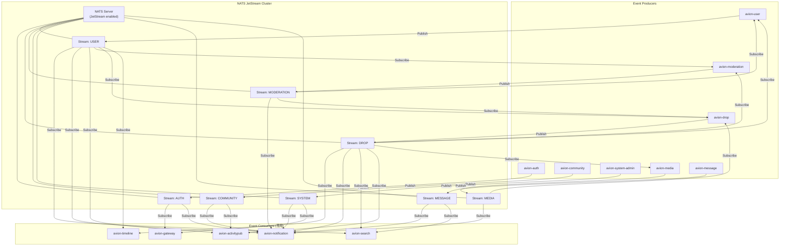
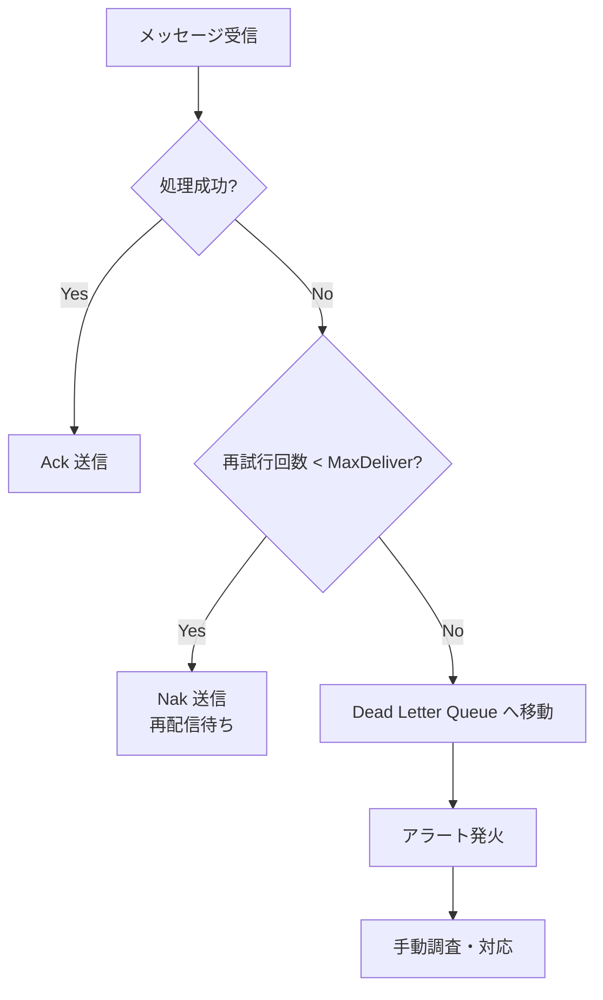
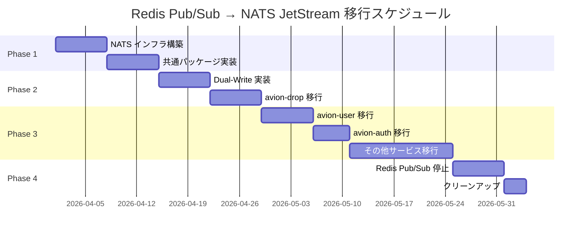

# NATS JetStream イベントバス設計

**Last Updated:** 2026/03/15
**Author:** Claude Code
**Status:** 採用済み
**Compliance:** Production Ready

## 概要

Avionプラットフォーム全体のイベントバスとして NATS JetStream を採用するための設計ドキュメントです。
現行の Redis Pub/Sub によるサービス間イベント通信を NATS JetStream へ段階的に移行し、メッセージの永続化・再配信・Consumer Group対応を実現します。

### Redis Pub/Sub からの移行理由

現行アーキテクチャでは、サービス間のイベント通信に Redis Pub/Sub を使用しています。Redis はキャッシュおよびセッション管理として引き続き利用しますが、イベントバスとしての Redis Pub/Sub には以下の課題があります。

| 課題 | Redis Pub/Sub の制約 | NATS JetStream による解決 |
|:--|:--|:--|
| **メッセージ永続化** | Fire-and-forget 方式のため、Subscriber 不在時のメッセージは消失する | Stream にメッセージを永続化し、過去のイベントを再取得可能 |
| **Consumer Group** | Redis Streams で対応可能だが、Pub/Sub モデルとは別の API 体系となる | Durable Consumer により同一グループ内での排他的メッセージ処理を標準サポート |
| **責務分離** | Redis がキャッシュ・セッション・キュー・Pub/Sub を兼務しており、障害影響範囲が広い | イベントバスを専用インフラに分離し、Redis の障害がイベント通信に波及しない構成 |
| **At-Least-Once 配信** | Pub/Sub は配信保証がなく、メッセージロスのリスクがある | JetStream が Ack ベースの At-Least-Once 配信を保証 |
| **リプレイ機能** | 過去のメッセージを再取得する手段がない | Stream の保持ポリシーに基づき、任意の時点からのリプレイが可能 |
| **バックプレッシャー** | Subscriber の処理速度に関わらずメッセージが送信される | Consumer の MaxAckPending により処理速度の制御が可能 |

### Redis の継続利用範囲

Redis は以下の用途で引き続き使用します。NATS JetStream への移行対象はイベントバス機能のみです。

- **キャッシュ**: プロフィール、タイムライン、設定等のホットデータキャッシュ
- **セッション管理**: JWT キャッシュ、セッションストア
- **一時的なカウンター**: リアクション集計、レート制限カウンター

## 目次

1. [アーキテクチャ](#1-アーキテクチャ)
2. [Subject 設計](#2-subject-設計)
3. [Stream 設計](#3-stream-設計)
4. [Consumer 設計](#4-consumer-設計)
5. [Docker Compose 設定](#5-docker-compose-設定)
6. [Kubernetes 設定](#6-kubernetes-設定)
7. [Go SDK 実装パターン](#7-go-sdk-実装パターン)
8. [移行計画](#8-移行計画)
9. [監視](#9-監視)

---

## 1. アーキテクチャ

### 1.1 全体構成



### 1.2 設計原則

1. **サービスごとの Stream 分離**: 各サービスが自身のドメインイベントを専用 Stream に Publish する
2. **Subject ベースルーティング**: 階層的な Subject 命名によりイベントの種類を識別し、Consumer がワイルドカードで柔軟に購読する
3. **At-Least-Once 配信**: すべての Consumer で Ack ベースの配信保証を適用する
4. **べき等処理**: Consumer 側で重複メッセージに対するべき等性を担保する
5. **サービス境界の尊重**: Producer は自身のドメインイベントのみを Publish し、他サービスの Stream には書き込まない

---

## 2. Subject 設計

### 2.1 命名規則

Subject は以下の形式に従います。

```
avion.{service}.{aggregate}.{event_type}
```

| セグメント | 説明 | 例 |
|:--|:--|:--|
| `avion` | プラットフォーム共通プレフィクス | `avion` |
| `{service}` | イベント発行元サービス名 | `auth`, `user`, `drop`, `timeline` |
| `{aggregate}` | ドメインの集約名 | `session`, `profile`, `follow`, `drop`, `reaction` |
| `{event_type}` | イベントの種別 | `created`, `updated`, `deleted` |

### 2.2 Subject 一覧

#### avion-auth

| Subject | 説明 |
|:--|:--|
| `avion.auth.session.created` | ユーザーログイン |
| `avion.auth.session.revoked` | セッション無効化 |
| `avion.auth.role.changed` | ロール付与・変更 |
| `avion.auth.policy.updated` | 認可ポリシー更新 |
| `avion.auth.passkey.registered` | Passkey 登録 |
| `avion.auth.account.password_changed` | パスワード変更 |
| `avion.auth.account.locked` | アカウントロック |
| `avion.auth.security.anomalous_login` | 異常ログイン検知 |

#### avion-user

| Subject | 説明 |
|:--|:--|
| `avion.user.profile.created` | ユーザー登録 |
| `avion.user.profile.updated` | プロフィール更新 |
| `avion.user.profile.deleted` | アカウント削除 |
| `avion.user.follow.created` | フォロー |
| `avion.user.follow.deleted` | フォロー解除 |
| `avion.user.block.created` | ブロック |
| `avion.user.block.deleted` | ブロック解除 |
| `avion.user.mute.created` | ミュート |
| `avion.user.mute.deleted` | ミュート解除 |

#### avion-drop

| Subject | 説明 |
|:--|:--|
| `avion.drop.drop.created` | Drop 作成 |
| `avion.drop.drop.updated` | Drop 更新 |
| `avion.drop.drop.deleted` | Drop 削除 |
| `avion.drop.reaction.created` | リアクション追加 |
| `avion.drop.reaction.deleted` | リアクション削除 |
| `avion.drop.bookmark.created` | ブックマーク追加 |
| `avion.drop.bookmark.deleted` | ブックマーク削除 |
| `avion.drop.poll.voted` | 投票参加 |
| `avion.drop.poll.closed` | 投票終了 |
| `avion.drop.renote.created` | リポスト |

#### avion-moderation

| Subject | 説明 |
|:--|:--|
| `avion.moderation.report.created` | 通報作成 |
| `avion.moderation.action.executed` | モデレーションアクション実行 |
| `avion.moderation.filter.updated` | フィルター更新 |
| `avion.moderation.instance_policy.changed` | インスタンスポリシー変更 |

#### avion-community

| Subject | 説明 |
|:--|:--|
| `avion.community.group.created` | グループ作成 |
| `avion.community.group.updated` | グループ更新 |
| `avion.community.event.created` | イベント作成 |
| `avion.community.member.joined` | メンバー参加 |
| `avion.community.member.left` | メンバー脱退 |

#### avion-system-admin

| Subject | 説明 |
|:--|:--|
| `avion.system.config.updated` | システム設定更新 |
| `avion.system.announcement.created` | アナウンス作成 |
| `avion.system.ratelimit.updated` | レート制限ルール更新 |
| `avion.system.backup.completed` | バックアップ完了 |
| `avion.system.maintenance.activated` | メンテナンスモード有効化 |
| `avion.system.security.alert` | セキュリティアラート |

#### avion-media

| Subject | 説明 |
|:--|:--|
| `avion.media.upload.completed` | メディアアップロード完了 |
| `avion.media.processing.completed` | メディア処理完了 |
| `avion.media.processing.failed` | メディア処理失敗 |
| `avion.media.upload.deleted` | メディア削除 |
| `avion.media.usage.updated` | メディア利用状況更新（NSFW フラグ等） |

#### avion-message

| Subject | 説明 |
|:--|:--|
| `avion.message.conversation.created` | 会話作成 |
| `avion.message.conversation.updated` | 会話更新 |
| `avion.message.conversation.deleted` | 会話削除 |
| `avion.message.message.sent` | メッセージ送信 |
| `avion.message.message.updated` | メッセージ編集 |
| `avion.message.message.deleted` | メッセージ削除 |
| `avion.message.participant.joined` | 参加者追加 |
| `avion.message.participant.left` | 参加者退出 |
| `avion.message.delivery.read` | 既読 |

### 2.3 ワイルドカード購読パターン

Consumer は目的に応じてワイルドカードを使用して購読できます。

```
avion.drop.>              # avion-drop の全イベント
avion.drop.drop.*         # Drop 集約の全イベント
avion.*.*.created         # 全サービスの created イベント（監査用）
avion.user.follow.*       # フォロー関連の全イベント
```

---

## 3. Stream 設計

### 3.1 Stream 構成

サービスごとに専用の Stream を作成します。共有 Stream は使用しません。これにより、サービスごとの独立したライフサイクル管理と保持ポリシーの個別設定が可能になります。

| Stream 名 | Subject フィルタ | 保持ポリシー | 最大メッセージ保持 | 最大サイズ | レプリカ数 |
|:--|:--|:--|:--|:--|:--|
| `AUTH` | `avion.auth.>` | Limits | 7日間 | 1GB | 3 |
| `USER` | `avion.user.>` | Limits | 7日間 | 5GB | 3 |
| `DROP` | `avion.drop.>` | Limits | 3日間 | 10GB | 3 |
| `MODERATION` | `avion.moderation.>` | Limits | 30日間 | 2GB | 3 |
| `COMMUNITY` | `avion.community.>` | Limits | 7日間 | 3GB | 3 |
| `SYSTEM` | `avion.system.>` | Limits | 30日間 | 1GB | 3 |
| `MEDIA` | `avion.media.>` | Limits | 3日間 | 2GB | 3 |
| `MESSAGE` | `avion.message.>` | Limits | 7日間 | 5GB | 3 |

### 3.2 Stream 設定例

```go
// DROP Stream の設定例
streamConfig := &nats.StreamConfig{
    Name:      "DROP",
    Subjects:  []string{"avion.drop.>"},
    Retention: nats.LimitsPolicy,
    MaxAge:    3 * 24 * time.Hour, // 3日間
    MaxBytes:  10 * 1024 * 1024 * 1024, // 10GB
    Storage:   nats.FileStorage,
    Replicas:  3,
    Discard:   nats.DiscardOld,
    MaxMsgs:   -1, // 無制限（MaxAge と MaxBytes で制御）
    Duplicates: 2 * time.Minute, // 重複排除ウィンドウ
}
```

### 3.3 保持ポリシーの設計方針

- **DROP Stream (3日間)**: 高頻度で大量のメッセージが発生するため、短い保持期間で容量を管理する
- **MODERATION / SYSTEM Stream (30日間)**: 監査目的で長期保持が必要。メッセージ量は比較的少ない
- **その他 (7日間)**: 一般的なイベント処理に十分な期間。Consumer の障害復旧に対応可能

---

## 4. Consumer 設計

### 4.1 Consumer Group パターン

同一サービスの複数インスタンスで負荷分散するために Durable Consumer を使用します。

| Consumer 名 | 購読対象 Stream | Subject フィルタ | 配信ポリシー | Ack ポリシー |
|:--|:--|:--|:--|:--|
| `timeline-drop-consumer` | DROP | `avion.drop.>` | DeliverAll | Explicit |
| `timeline-user-consumer` | USER | `avion.user.follow.*`, `avion.user.block.*`, `avion.user.mute.*` | DeliverAll | Explicit |
| `notification-drop-consumer` | DROP | `avion.drop.>` | DeliverAll | Explicit |
| `notification-user-consumer` | USER | `avion.user.>` | DeliverAll | Explicit |
| `notification-moderation-consumer` | MODERATION | `avion.moderation.>` | DeliverAll | Explicit |
| `notification-auth-consumer` | AUTH | `avion.auth.>` | DeliverAll | Explicit |
| `notification-message-consumer` | MESSAGE | `avion.message.>` | DeliverAll | Explicit |
| `notification-community-consumer` | COMMUNITY | `avion.community.member.*` | DeliverAll | Explicit |
| `notification-system-consumer` | SYSTEM | `avion.system.>` | DeliverAll | Explicit |
| `notification-media-consumer` | MEDIA | `avion.media.processing.*` | DeliverAll | Explicit |
| `search-drop-consumer` | DROP | `avion.drop.drop.*` | DeliverAll | Explicit |
| `search-user-consumer` | USER | `avion.user.profile.*` | DeliverAll | Explicit |
| `search-message-consumer` | MESSAGE | `avion.message.message.*` | DeliverAll | Explicit |
| `search-community-consumer` | COMMUNITY | `avion.community.group.*` | DeliverAll | Explicit |
| `activitypub-drop-consumer` | DROP | `avion.drop.>` | DeliverAll | Explicit |
| `activitypub-user-consumer` | USER | `avion.user.>` | DeliverAll | Explicit |
| `activitypub-moderation-consumer` | MODERATION | `avion.moderation.instance_policy.*` | DeliverAll | Explicit |
| `activitypub-community-consumer` | COMMUNITY | `avion.community.>` | DeliverAll | Explicit |
| `gateway-auth-consumer` | AUTH | `avion.auth.>` | DeliverNew | Explicit |
| `gateway-system-consumer` | SYSTEM | `avion.system.>` | DeliverNew | Explicit |
| `user-drop-consumer` | DROP | `avion.drop.>` | DeliverAll | Explicit |
| `user-moderation-consumer` | MODERATION | `avion.moderation.action.*` | DeliverAll | Explicit |
| `drop-media-consumer` | MEDIA | `avion.media.upload.*` | DeliverAll | Explicit |
| `drop-user-consumer` | USER | `avion.user.profile.deleted` | DeliverAll | Explicit |
| `drop-moderation-consumer` | MODERATION | `avion.moderation.action.*` | DeliverAll | Explicit |
| `media-drop-consumer` | DROP | `avion.drop.drop.deleted` | DeliverAll | Explicit |
| `moderation-drop-consumer` | DROP | `avion.drop.drop.created` | DeliverAll | Explicit |
| `moderation-user-consumer` | USER | `avion.user.profile.created` | DeliverAll | Explicit |

> **注**: ActivityPub サービスが受信するリモートサーバーからのイベント（`avion.activitypub.*`）は NATS Core（JetStream 非使用）で配信されます。リモートサーバーからの受信処理はリアルタイム性を優先し、永続化よりも低レイテンシを重視するためです。これらのイベントを購読する avion-user、avion-drop、avion-timeline 等のサービスは、NATS Core の Subscribe を使用します。将来的に配信信頼性の要件が高まった場合、ACTIVITYPUB Stream の導入を検討します。

### 4.2 Consumer 設定例

```go
// timeline-drop-consumer の設定例
consumerConfig := &nats.ConsumerConfig{
    Durable:        "timeline-drop-consumer",
    FilterSubject:  "avion.drop.>",
    DeliverPolicy:  nats.DeliverAllPolicy,
    AckPolicy:      nats.AckExplicitPolicy,
    AckWait:        30 * time.Second,
    MaxDeliver:     5, // 最大再配信回数
    MaxAckPending:  1000, // バックプレッシャー制御
    DeliverSubject: "", // Pull ベース Consumer
}
```

### 4.3 エラーハンドリング戦略

Consumer でメッセージ処理が失敗した場合の戦略を以下に定義します。



- **MaxDeliver**: 5回まで自動再配信
- **AckWait**: 30秒以内に Ack/Nak しない場合、自動再配信
- **Dead Letter Queue**: MaxDeliver 超過後、専用の Stream (`DLQ`) にメッセージを退避

---

## 5. Docker Compose 設定

### 5.1 基本設定

```yaml
# docker-compose.yml (該当部分)
services:
  nats:
    image: nats:2-alpine
    command:
      - "--jetstream"
      - "--store_dir=/data"
      - "--http_port=8222"
      - "--max_payload=1048576"
    ports:
      - "4222:4222"   # Client connections
      - "8222:8222"   # HTTP monitoring
    volumes:
      - nats_data:/data
    healthcheck:
      test: ["CMD", "wget", "--spider", "-q", "http://localhost:8222/healthz"]
      interval: 10s
      timeout: 5s
      retries: 5
    restart: unless-stopped
    deploy:
      resources:
        limits:
          memory: 512M
          cpus: "1.0"
        reservations:
          memory: 256M
          cpus: "0.5"

volumes:
  nats_data:
    driver: local
```

### 5.2 開発環境用設定

```yaml
# docker-compose.dev.yml (該当部分)
services:
  nats:
    image: nats:2-alpine
    command:
      - "--jetstream"
      - "--store_dir=/data"
      - "--http_port=8222"
      - "--max_payload=1048576"
      - "-DV"  # Debug + Verbose（開発環境のみ）
    ports:
      - "4222:4222"
      - "8222:8222"
      - "6222:6222"   # Cluster（開発時のデバッグ用）
    volumes:
      - nats_dev_data:/data

volumes:
  nats_dev_data:
    driver: local
```

### 5.3 サービスの依存関係設定

各サービスの `depends_on` に NATS を追加します。

```yaml
services:
  avion-drop:
    depends_on:
      nats:
        condition: service_healthy
      postgres:
        condition: service_healthy
      redis:
        condition: service_healthy
```

---

## 6. Kubernetes 設定

### 6.1 デプロイ方針

本番環境では [NATS Helm Chart](https://github.com/nats-io/k8s/tree/main/helm/charts/nats) を使用してクラスター構成でデプロイします。

### 6.2 Helm Chart 設定例

```yaml
# k8s/helm/nats-values.yaml
nats:
  image:
    tag: "2-alpine"

  jetstream:
    enabled: true
    memStorage:
      enabled: true
      size: "1Gi"
    fileStorage:
      enabled: true
      size: "20Gi"
      storageClassName: "gp3"

  cluster:
    enabled: true
    replicas: 3

  resources:
    requests:
      cpu: "500m"
      memory: "1Gi"
    limits:
      cpu: "2000m"
      memory: "4Gi"

  monitoring:
    enabled: true
    port: 8222

  podDisruptionBudget:
    enabled: true
    minAvailable: 2

  affinity:
    podAntiAffinity:
      requiredDuringSchedulingIgnoredDuringExecution:
        - labelSelector:
            matchLabels:
              app.kubernetes.io/name: nats
          topologyKey: kubernetes.io/hostname
```

### 6.3 環境変数設定

各サービスに NATS 接続用の環境変数を追加します。`docs/common/infrastructure/environment-variables.md` の設計に準拠します。

```go
// NATSConfig NATS JetStream 関連の設定
type NATSConfig struct {
    URL           string        `env:"NATS_URL" required:"true" default:"nats://nats:4222"`
    MaxReconnects int           `env:"NATS_MAX_RECONNECTS" required:"false" default:"60"`
    ReconnectWait time.Duration `env:"NATS_RECONNECT_WAIT" required:"false" default:"2s"`
    Name          string        `env:"NATS_CLIENT_NAME" required:"true"`
}
```

---

## 7. Go SDK 実装パターン

### 7.1 依存パッケージ

```
github.com/nats-io/nats.go v1.x
```

### 7.2 接続管理

```go
// internal/infrastructure/nats/connection.go
package natsinfra

import (
    "context"
    "fmt"
    "log/slog"
    "time"

    "github.com/nats-io/nats.go"
    "github.com/nats-io/nats.go/jetstream"
)

// Connection は NATS JetStream への接続を管理する
type Connection struct {
    nc *nats.Conn
    js jetstream.JetStream
}

// NewConnection は NATS JetStream への接続を確立する
func NewConnection(url, clientName string, maxReconnects int, reconnectWait time.Duration) (*Connection, error) {
    nc, err := nats.Connect(
        url,
        nats.Name(clientName),
        nats.MaxReconnects(maxReconnects),
        nats.ReconnectWait(reconnectWait),
        nats.DisconnectErrHandler(func(_ *nats.Conn, err error) {
            slog.Warn("NATS disconnected", "error", err)
        }),
        nats.ReconnectHandler(func(nc *nats.Conn) {
            slog.Info("NATS reconnected", "url", nc.ConnectedUrl())
        }),
        nats.ClosedHandler(func(_ *nats.Conn) {
            slog.Info("NATS connection closed")
        }),
    )
    if err != nil {
        return nil, fmt.Errorf("failed to connect to NATS: %w", err)
    }

    js, err := jetstream.New(nc)
    if err != nil {
        nc.Close()
        return nil, fmt.Errorf("failed to create JetStream context: %w", err)
    }

    return &Connection{nc: nc, js: js}, nil
}

// JetStream は JetStream コンテキストを返す
func (c *Connection) JetStream() jetstream.JetStream {
    return c.js
}

// Close は接続を閉じる
func (c *Connection) Close() {
    if c.nc != nil {
        c.nc.Drain()
    }
}
```

### 7.3 Publisher 実装

```go
// internal/infrastructure/nats/publisher.go
package natsinfra

import (
    "context"
    "encoding/json"
    "fmt"
    "time"

    "github.com/nats-io/nats.go/jetstream"
)

// Event はイベントの共通構造を定義する
type Event struct {
    ID        string    `json:"id"`
    Type      string    `json:"type"`
    Source    string    `json:"source"`
    Timestamp time.Time `json:"timestamp"`
    Data      any       `json:"data"`
}

// EventPublisher はイベントの Publish を担当する
//
//go:generate mockgen -source=$GOFILE -destination=../../../tests/mocks/infrastructure/nats/mock_event_publisher.go -package=mocks
type EventPublisher interface {
    Publish(ctx context.Context, subject string, event Event) error
}

type eventPublisher struct {
    js jetstream.JetStream
}

// NewEventPublisher は EventPublisher を生成する
func NewEventPublisher(js jetstream.JetStream) EventPublisher {
    return &eventPublisher{js: js}
}

func (p *eventPublisher) Publish(ctx context.Context, subject string, event Event) error {
    data, err := json.Marshal(event)
    if err != nil {
        return fmt.Errorf("failed to marshal event: %w", err)
    }

    _, err = p.js.Publish(ctx, subject, data,
        jetstream.WithMsgID(event.ID), // 重複排除用
    )
    if err != nil {
        return fmt.Errorf("failed to publish event to %s: %w", subject, err)
    }

    return nil
}
```

### 7.4 Subscriber 実装

```go
// internal/infrastructure/nats/subscriber.go
package natsinfra

import (
    "context"
    "encoding/json"
    "fmt"
    "log/slog"

    "github.com/nats-io/nats.go/jetstream"
)

// EventHandler はイベントを処理するハンドラー
type EventHandler func(ctx context.Context, event Event) error

// EventSubscriber はイベントの Subscribe を担当する
//
//go:generate mockgen -source=$GOFILE -destination=../../../tests/mocks/infrastructure/nats/mock_event_subscriber.go -package=mocks
type EventSubscriber interface {
    Subscribe(ctx context.Context, streamName string, consumerName string, handler EventHandler) error
}

type eventSubscriber struct {
    js jetstream.JetStream
}

// NewEventSubscriber は EventSubscriber を生成する
func NewEventSubscriber(js jetstream.JetStream) EventSubscriber {
    return &eventSubscriber{js: js}
}

func (s *eventSubscriber) Subscribe(ctx context.Context, streamName string, consumerName string, handler EventHandler) error {
    consumer, err := s.js.Consumer(ctx, streamName, consumerName)
    if err != nil {
        return fmt.Errorf("failed to get consumer %s from stream %s: %w", consumerName, streamName, err)
    }

    cc, err := consumer.Consume(func(msg jetstream.Msg) {
        var event Event
        if err := json.Unmarshal(msg.Data(), &event); err != nil {
            slog.Error("failed to unmarshal event",
                "error", err,
                "stream", streamName,
                "consumer", consumerName,
                "subject", msg.Subject(),
            )
            // デシリアライズ失敗は再試行しても無意味なため Ack で破棄
            _ = msg.Ack()
            return
        }

        if err := handler(ctx, event); err != nil {
            slog.Error("failed to handle event",
                "error", err,
                "event_id", event.ID,
                "event_type", event.Type,
                "stream", streamName,
                "consumer", consumerName,
            )
            // 処理失敗は Nak で再配信を要求
            _ = msg.Nak()
            return
        }

        _ = msg.Ack()
    })
    if err != nil {
        return fmt.Errorf("failed to start consuming: %w", err)
    }

    // コンテキストキャンセル時に停止
    go func() {
        <-ctx.Done()
        cc.Stop()
    }()

    return nil
}
```

### 7.5 Stream 初期化

```go
// internal/infrastructure/nats/stream.go
package natsinfra

import (
    "context"
    "fmt"
    "time"

    "github.com/nats-io/nats.go/jetstream"
)

// StreamDefinition は Stream の定義を保持する
type StreamDefinition struct {
    Name       string
    Subjects   []string
    MaxAge     time.Duration
    MaxBytes   int64
    Replicas   int
}

// EnsureStream は Stream が存在しない場合に作成し、存在する場合は更新する
func EnsureStream(ctx context.Context, js jetstream.JetStream, def StreamDefinition) error {
    cfg := jetstream.StreamConfig{
        Name:       def.Name,
        Subjects:   def.Subjects,
        Retention:  jetstream.LimitsPolicy,
        MaxAge:     def.MaxAge,
        MaxBytes:   def.MaxBytes,
        Storage:    jetstream.FileStorage,
        Replicas:   def.Replicas,
        Discard:    jetstream.DiscardOld,
        Duplicates: 2 * time.Minute,
    }

    _, err := js.CreateOrUpdateStream(ctx, cfg)
    if err != nil {
        return fmt.Errorf("failed to ensure stream %s: %w", def.Name, err)
    }

    return nil
}
```

### 7.6 DDD レイヤーでの配置

```
avion-[service]/
├── internal/
│   ├── domain/
│   │   └── event/
│   │       └── events.go          # ドメインイベント定義
│   ├── usecase/
│   │   └── command/
│   │       └── create_drop.go     # UseCase 内で EventPublisher を呼び出す
│   └── infrastructure/
│       └── nats/
│           ├── connection.go      # 接続管理
│           ├── publisher.go       # EventPublisher 実装
│           ├── subscriber.go      # EventSubscriber 実装
│           └── stream.go          # Stream 初期化
└── tests/
    └── mocks/
        └── infrastructure/
            └── nats/
                ├── mock_event_publisher.go
                └── mock_event_subscriber.go
```

---

## 8. 移行計画

### 8.1 段階的移行戦略

Redis Pub/Sub から NATS JetStream への移行は、以下の 4 フェーズで段階的に実施します。



### 8.2 Phase 1: インフラ構築と共通パッケージ

1. Docker Compose / Kubernetes に NATS JetStream を追加
2. 共通パッケージ（`internal/infrastructure/nats/`）を実装
3. Stream および Consumer の定義を作成
4. 結合テスト環境で動作確認

### 8.3 Phase 2: Dual-Write による並行運用

最もイベント量の多い avion-drop から移行を開始します。移行期間中は Redis Pub/Sub と NATS JetStream の両方にイベントを Publish します（Dual-Write パターン）。

```go
// Dual-Write Publisher の例
type dualWritePublisher struct {
    redisPublisher RedisEventPublisher
    natsPublisher  EventPublisher
}

func (p *dualWritePublisher) Publish(ctx context.Context, subject string, event Event) error {
    // NATS に Publish（プライマリ）
    if err := p.natsPublisher.Publish(ctx, subject, event); err != nil {
        slog.Error("failed to publish to NATS", "error", err, "subject", subject)
        // NATS 障害時は Redis にフォールバック
    }

    // Redis にも Publish（移行期間中のみ）
    if err := p.redisPublisher.Publish(ctx, subject, event); err != nil {
        slog.Warn("failed to publish to Redis", "error", err, "subject", subject)
        // Redis への Publish 失敗は警告のみ
    }

    return nil
}
```

Consumer 側の移行手順:

1. NATS Consumer を起動し、イベント処理を開始
2. NATS Consumer の処理が安定していることを確認（メトリクスで検証）
3. Redis Subscriber を停止

### 8.4 Phase 3: 残りのサービス移行

Phase 2 と同じパターンで、以下の順序でサービスを移行します。

1. **avion-user**: フォロー・プロフィールイベント
2. **avion-auth**: セッション・ポリシーイベント
3. **avion-moderation**: モデレーションイベント
4. **avion-community**: コミュニティイベント
5. **avion-system-admin**: システムイベント
6. **avion-media**: メディア処理イベント

### 8.5 Phase 4: Redis Pub/Sub の停止

1. すべてのサービスで NATS Consumer が正常に動作していることを確認
2. Dual-Write Publisher から Redis Pub/Sub への書き込みを停止
3. Redis Pub/Sub 関連のコードを削除
4. Redis の設定からイベントバス関連の設定を除去（キャッシュ・セッション用途は継続）

### 8.6 ロールバック戦略

各 Phase でロールバック可能な状態を維持します。

- **Phase 2-3**: Dual-Write 中は Redis Subscriber を再起動するだけでロールバック可能
- **Phase 4**: Redis Pub/Sub のコードは削除前にブランチで保持し、必要に応じて復旧可能

---

## 9. 監視

### 9.1 NATS 標準モニタリングエンドポイント

NATS は HTTP モニタリングポート（8222）で以下のエンドポイントを提供します。

| エンドポイント | 説明 |
|:--|:--|
| `/healthz` | ヘルスチェック |
| `/varz` | サーバー全体の統計 |
| `/connz` | 接続情報 |
| `/jsz` | JetStream の統計 |
| `/subsz` | Subscription 情報 |

### 9.2 Prometheus メトリクス

NATS Prometheus Exporter を使用して以下のメトリクスを収集します。

```yaml
# k8s/monitoring/nats-prometheus-rules.yaml
apiVersion: monitoring.coreos.com/v1
kind: PrometheusRule
metadata:
  name: nats-jetstream-alerts
  namespace: avion-monitoring
spec:
  groups:
  - name: nats-jetstream
    interval: 30s
    rules:
    # 接続数の異常
    - alert: NATSHighConnectionCount
      expr: |
        nats_server_total_connections > 500
      for: 5m
      labels:
        severity: warning
        team: platform
      annotations:
        summary: "NATS connection count is high"
        description: "NATS server has {{ $value }} connections"

    # メッセージレートの異常
    - alert: NATSLowMessageRate
      expr: |
        rate(nats_server_total_messages_received[5m]) < 1
      for: 10m
      labels:
        severity: warning
        team: platform
      annotations:
        summary: "NATS message rate is unusually low"
        description: "NATS message receive rate is {{ $value }}/s"

    # Stream サイズの警告
    - alert: NATSStreamSizeHigh
      expr: |
        nats_jetstream_stream_bytes > (nats_jetstream_stream_config_max_bytes * 0.8)
      for: 5m
      labels:
        severity: warning
        team: platform
      annotations:
        summary: "NATS JetStream stream size exceeds 80%"
        description: "Stream {{ $labels.stream }} is using {{ $value | humanize1024 }}B"

    # Consumer の Pending メッセージ蓄積
    - alert: NATSConsumerPendingHigh
      expr: |
        nats_jetstream_consumer_num_pending > 10000
      for: 5m
      labels:
        severity: warning
        team: platform
      annotations:
        summary: "NATS consumer has high pending messages"
        description: "Consumer {{ $labels.consumer }} in stream {{ $labels.stream }} has {{ $value }} pending messages"

    # Consumer の再配信率が高い
    - alert: NATSConsumerHighRedelivery
      expr: |
        rate(nats_jetstream_consumer_num_redelivered[5m]) > 10
      for: 5m
      labels:
        severity: warning
        team: platform
      annotations:
        summary: "NATS consumer redelivery rate is high"
        description: "Consumer {{ $labels.consumer }} redelivery rate is {{ $value }}/s"

    # NATS サーバーダウン
    - alert: NATSServerDown
      expr: |
        up{job="nats"} == 0
      for: 1m
      labels:
        severity: critical
        team: platform
      annotations:
        summary: "NATS server is down"
        description: "NATS server {{ $labels.instance }} is unreachable"
```

### 9.3 Grafana ダッシュボード

以下のパネルを含む NATS JetStream 専用ダッシュボードを作成します。

| パネル | メトリクス | 説明 |
|:--|:--|:--|
| 接続数 | `nats_server_total_connections` | アクティブな Client 接続数の推移 |
| メッセージレート | `rate(nats_server_total_messages_received[5m])` | 秒間メッセージ受信数 |
| Stream サイズ | `nats_jetstream_stream_bytes` | 各 Stream のディスク使用量 |
| Stream メッセージ数 | `nats_jetstream_stream_total_messages` | 各 Stream 内のメッセージ総数 |
| Consumer Pending | `nats_jetstream_consumer_num_pending` | 各 Consumer の未処理メッセージ数 |
| Consumer Ack Pending | `nats_jetstream_consumer_num_ack_pending` | Ack 待ちメッセージ数 |
| 再配信数 | `rate(nats_jetstream_consumer_num_redelivered[5m])` | 再配信レート |
| サーバーメモリ | `nats_server_mem_bytes` | NATS サーバーのメモリ使用量 |

### 9.4 構造化ログ

NATS 関連のログは Avion の既存の構造化ログ方針に従い、以下のフィールドを含めます。

```json
{
  "level": "INFO",
  "msg": "event published",
  "layer": "infrastructure",
  "component": "nats",
  "trace_id": "abc123",
  "subject": "avion.drop.drop.created",
  "event_id": "evt_xxxx",
  "stream": "DROP"
}
```

---

## まとめ

NATS JetStream の採用により、以下の改善を実現します。

1. **責務分離**: Redis からイベントバス機能を分離し、障害影響範囲を限定
2. **メッセージ永続化**: Stream による永続化で、Consumer 不在時のメッセージロスを防止
3. **At-Least-Once 配信**: Ack ベースの配信保証により、イベント処理の信頼性を向上
4. **Consumer Group**: Durable Consumer により同一サービスの複数インスタンスでの負荷分散を実現
5. **バックプレッシャー制御**: MaxAckPending による Consumer の処理速度制御
6. **段階的移行**: Dual-Write パターンによる安全な移行と、各 Phase でのロールバック対応
7. **包括的な監視**: Prometheus メトリクスと Grafana ダッシュボードによる運用可視化

Redis は引き続きキャッシュ・セッション管理に使用し、各インフラコンポーネントが専門の責務に集中する構成を目指します。
