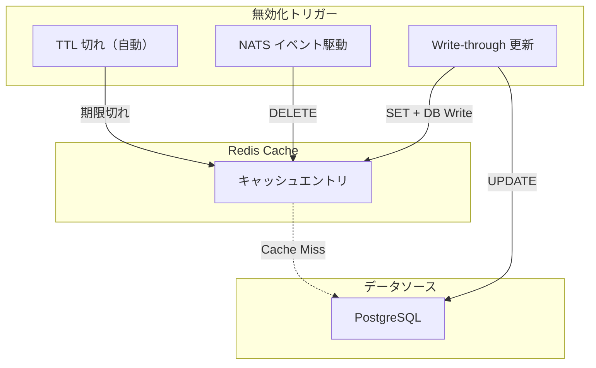
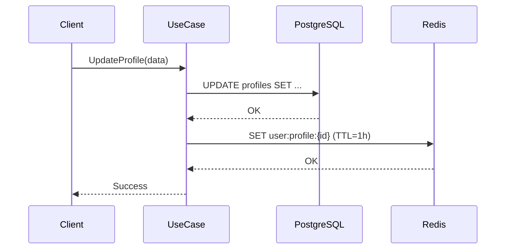
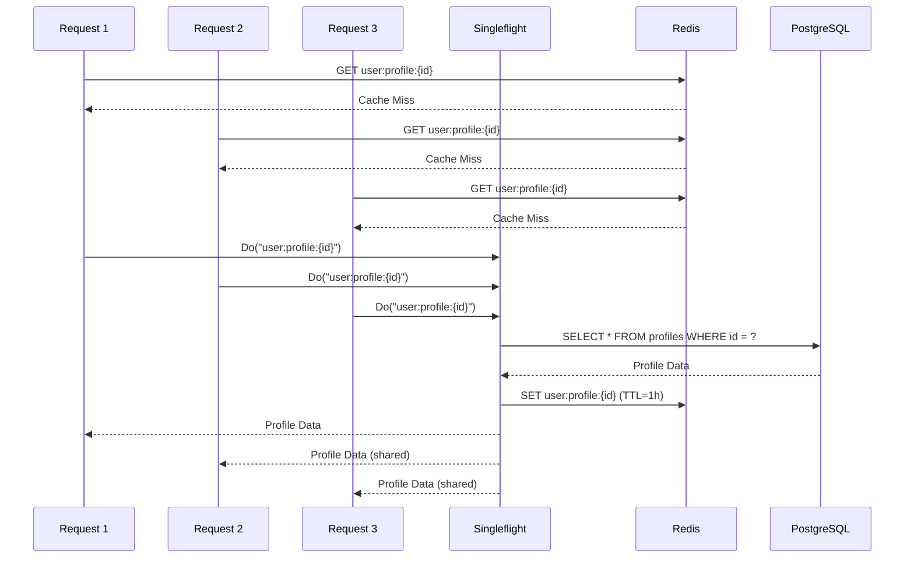
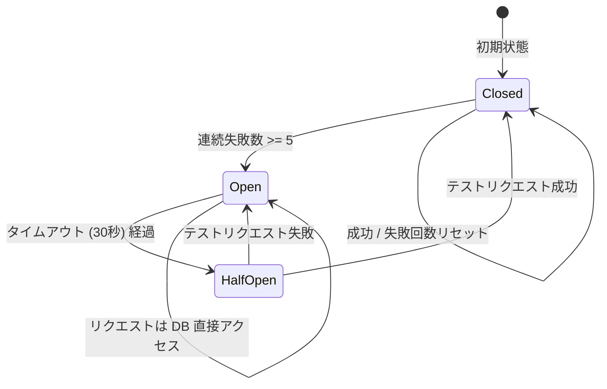

# Redis キャッシュ戦略ガイドライン

**Last Updated:** 2026/03/14
**Author:** Claude Code
**Status:** 提案中
**Compliance:** Production Ready

## 概要

Avion プラットフォームにおける Redis の役割は**キャッシュ専用**です。サービス間のイベント通信は NATS JetStream が担当し（詳細は [nats-jetstream-design.md](./nats-jetstream-design.md) を参照）、Redis はデータの高速読み出しに特化します。

### Redis の責務範囲

| 責務 | 説明 |
|:--|:--|
| **データキャッシュ** | プロフィール、Drop コンテンツ、タイムライン等のホットデータをキャッシュ |
| **セッション管理** | JWT キャッシュ、セッションストア |
| **一時的なカウンター** | リアクション集計、レート制限カウンター |

### Redis が担当しないもの

| 責務 | 担当 |
|:--|:--|
| **イベントバス** | NATS JetStream |
| **永続化データ** | PostgreSQL |
| **全文検索** | MeiliSearch |
| **メディアストレージ** | S3 |

## 目次

1. [キャッシュ TTL 標準値](#1-キャッシュ-ttl-標準値)
2. [キャッシュキー命名規則](#2-キャッシュキー命名規則)
3. [キャッシュ無効化戦略](#3-キャッシュ無効化戦略)
4. [キャッシュミス時の再構築](#4-キャッシュミス時の再構築)
5. [Redis 障害時のフォールバック](#5-redis-障害時のフォールバック)
6. [各サービスのキャッシュ設計一覧](#6-各サービスのキャッシュ設計一覧)
7. [Go 実装パターン](#7-go-実装パターン)
8. [監視メトリクス](#8-監視メトリクス)

---

## 1. キャッシュ TTL 標準値

キャッシュ対象データをアクセス頻度に基づき 3 段階に分類し、各段階に標準 TTL を定義します。

### 1.1 データ分類と TTL

| 分類 | TTL | 用途 | 特性 |
|:--|:--|:--|:--|
| **Hot（ホットデータ）** | 5分 | 頻繁にアクセスされるデータ | 高頻度読み取り、更新頻度も高い |
| **Warm（ウォームデータ）** | 1時間 | 中程度のアクセス頻度 | 定期的に読み取られる、更新頻度は低い |
| **Cold（コールドデータ）** | 24時間 | 低頻度のアクセス | 参照中心、ほとんど更新されない |

### 1.2 各サービスのデータ分類例

| サービス | Hot (5分) | Warm (1時間) | Cold (24時間) |
|:--|:--|:--|:--|
| **avion-user** | フォロワー数、フォロー数 | ユーザープロフィール | ユーザー設定、ブロックリスト |
| **avion-drop** | リアクション集計 | Drop コンテンツ | Drop メタデータ |
| **avion-auth** | アクティブセッション | JWT 公開鍵 | 認可ポリシー |
| **avion-timeline** | タイムラインフィード | - | - |
| **avion-gateway** | レート制限カウンター | ルーティングテーブル | サービスディスカバリ情報 |
| **avion-search** | - | 検索サジェスト | - |
| **avion-notification** | 未読通知数 | - | 通知設定 |
| **avion-community** | - | グループメンバー一覧 | グループ設定 |

### 1.3 TTL 設定の Go 定数定義

```go
// internal/infrastructure/cache/ttl.go
package cache

import "time"

const (
    // TTLHot はホットデータ（高頻度アクセス）の TTL
    TTLHot = 5 * time.Minute

    // TTLWarm はウォームデータ（中程度アクセス）の TTL
    TTLWarm = 1 * time.Hour

    // TTLCold はコールドデータ（低頻度アクセス）の TTL
    TTLCold = 24 * time.Hour
)
```

---

## 2. キャッシュキー命名規則

### 2.1 基本フォーマット

キャッシュキーは以下の形式に統一します。

```
{service}:{entity}:{id}
```

| セグメント | 説明 | 例 |
|:--|:--|:--|
| `{service}` | サービス名（プレフィクス省略） | `user`, `drop`, `auth`, `timeline` |
| `{entity}` | エンティティまたはデータ種別 | `profile`, `content`, `session`, `feed` |
| `{id}` | 識別子（UUIDv7） | `550e8400-e29b-41d4-a716-446655440000` |

### 2.2 キー例

| キーパターン | 説明 | 値の型 |
|:--|:--|:--|
| `user:profile:550e8400-e29b...` | ユーザープロフィール | JSON (Hash) |
| `user:followers-count:550e8400...` | フォロワー数 | Integer |
| `user:following-count:550e8400...` | フォロー数 | Integer |
| `drop:content:550e8400...` | Drop コンテンツ | JSON (Hash) |
| `drop:reactions:550e8400...` | Drop リアクション集計 | Hash |
| `auth:session:550e8400...` | セッション情報 | JSON (String) |
| `auth:jwt-pubkey:current` | JWT 公開鍵 | String |
| `auth:policy:550e8400...` | 認可ポリシー | JSON (String) |
| `timeline:feed:550e8400...` | タイムラインフィード | Sorted Set |
| `gateway:ratelimit:550e8400...` | レート制限カウンター | Integer |
| `notification:unread-count:550e8400...` | 未読通知数 | Integer |
| `community:members:550e8400...` | グループメンバー一覧 | Set |

### 2.3 複合キーのパターン

複数条件で一意性を確保する場合、`:` で区切りを追加します。

```
{service}:{entity}:{parent_id}:{child_id}
```

例:

```
drop:reactions:550e8400...:thumbsup     # 特定 Drop の特定リアクション数
community:member:550e8400...:660e8400...  # 特定グループの特定メンバー
```

### 2.4 命名規則の制約

- キー全体の最大長: **256 バイト**
- セグメント区切り: `:` （コロン）のみ使用
- 使用可能文字: 英小文字、数字、ハイフン（`-`）
- UUID はハイフン付き標準形式を使用
- ワイルドカード用途のキーパターンには `*` を含めない（`SCAN` コマンドで使用）

---

## 3. キャッシュ無効化戦略

キャッシュの一貫性を保つために、複数の無効化戦略を組み合わせます。

### 3.1 戦略の全体像



### 3.2 TTL 切れ（基本戦略）

すべてのキャッシュエントリに TTL を設定します。TTL 切れはキャッシュ無効化の最も基本的な仕組みであり、他の無効化戦略が失敗した場合の安全網として機能します。

- 全エントリに対して **必ず TTL を設定する**（TTL なしのキャッシュエントリは禁止）
- TTL は [1. キャッシュ TTL 標準値](#1-キャッシュ-ttl-標準値) に従う

### 3.3 イベント駆動無効化

NATS JetStream のイベントを購読し、関連するキャッシュエントリを即座に削除します。データ更新からキャッシュ無効化までの遅延を最小限に抑える戦略です。

| NATS Subject | 削除対象キャッシュキー | 説明 |
|:--|:--|:--|
| `avion.user.profile.updated` | `user:profile:{id}` | プロフィール更新時にキャッシュ削除 |
| `avion.user.profile.deleted` | `user:profile:{id}`, `user:followers-count:{id}`, `user:following-count:{id}` | アカウント削除時に関連キャッシュを一括削除 |
| `avion.user.follow.created` | `user:followers-count:{target_id}`, `user:following-count:{actor_id}` | フォロー時にカウンターを無効化 |
| `avion.user.follow.deleted` | `user:followers-count:{target_id}`, `user:following-count:{actor_id}` | フォロー解除時にカウンターを無効化 |
| `avion.drop.drop.updated` | `drop:content:{id}` | Drop 更新時にキャッシュ削除 |
| `avion.drop.drop.deleted` | `drop:content:{id}`, `drop:reactions:{id}` | Drop 削除時に関連キャッシュを一括削除 |
| `avion.drop.reaction.created` | `drop:reactions:{drop_id}` | リアクション追加時に集計キャッシュを無効化 |
| `avion.drop.reaction.deleted` | `drop:reactions:{drop_id}` | リアクション削除時に集計キャッシュを無効化 |
| `avion.auth.session.revoked` | `auth:session:{id}` | セッション無効化時にキャッシュ削除 |
| `avion.auth.policy.updated` | `auth:policy:{id}` | 認可ポリシー更新時にキャッシュ削除 |

### 3.4 Write-through 更新

書き込み操作時にデータベースとキャッシュの両方を同時に更新する戦略です。読み取り頻度が極めて高く、キャッシュミスのコストが大きいデータに対して適用します。



**Write-through を適用するデータ:**

| データ | 理由 |
|:--|:--|
| ユーザープロフィール | 読み取り頻度が高く、プロフィール表示のレイテンシに直結 |
| JWT 公開鍵 | 全リクエストで参照されるため、キャッシュミスの影響が大きい |

**注意事項:**
- DB 書き込み成功後にキャッシュを更新する（DB がプライマリ）
- キャッシュ更新に失敗した場合は、ログを出力して処理を続行する（キャッシュ更新失敗で DB トランザクションをロールバックしない）
- Write-through 対象でも TTL は必ず設定する（最終防衛線）

---

## 4. キャッシュミス時の再構築

### 4.1 Singleflight パターン

同一キーに対する同時リクエストが発生した場合、DB への問い合わせを 1 つに集約し、結果を全リクエストで共有します。これにより、Cache Stampede（キャッシュ切れ時に大量のリクエストが DB に殺到する問題）を防止します。



### 4.2 実装方針

Go 標準の `golang.org/x/sync/singleflight` パッケージを使用します。

```go
// internal/infrastructure/cache/singleflight.go
package cache

import (
    "context"
    "encoding/json"
    "fmt"
    "time"

    "github.com/redis/go-redis/v9"
    "golang.org/x/sync/singleflight"
)

// CacheLoader はキャッシュ読み込みと Singleflight を組み合わせた構造体
type CacheLoader[T any] struct {
    client *redis.Client
    group  singleflight.Group
}

// NewCacheLoader は CacheLoader を生成する
func NewCacheLoader[T any](client *redis.Client) *CacheLoader[T] {
    return &CacheLoader[T]{
        client: client,
    }
}

// GetOrLoad はキャッシュを参照し、ミス時は loader を実行してキャッシュに格納する
// 同一キーの同時リクエストは Singleflight で集約される
func (cl *CacheLoader[T]) GetOrLoad(
    ctx context.Context,
    key string,
    ttl time.Duration,
    loader func(ctx context.Context) (T, error),
) (T, error) {
    // 1. キャッシュ参照
    cached, err := cl.client.Get(ctx, key).Bytes()
    if err == nil {
        var result T
        if unmarshalErr := json.Unmarshal(cached, &result); unmarshalErr == nil {
            return result, nil
        }
    }

    // 2. Singleflight で DB アクセスを集約
    v, err, _ := cl.group.Do(key, func() (any, error) {
        result, loadErr := loader(ctx)
        if loadErr != nil {
            return result, loadErr
        }

        // 3. キャッシュに格納
        data, marshalErr := json.Marshal(result)
        if marshalErr == nil {
            cl.client.Set(ctx, key, data, ttl)
        }

        return result, nil
    })

    if err != nil {
        var zero T
        return zero, fmt.Errorf("failed to load cache for key %s: %w", key, err)
    }

    return v.(T), nil
}
```

---

## 5. Redis 障害時のフォールバック

### 5.1 Circuit Breaker パターン

Redis への接続障害が発生した場合、Circuit Breaker により自動的に PostgreSQL への直接アクセスにフォールバックします。これにより、Redis の障害がサービス全体の停止に波及することを防ぎます。



### 5.2 Circuit Breaker 設定値

| パラメータ | 値 | 説明 |
|:--|:--|:--|
| **MaxFailures** | 5 | Open 状態に遷移するまでの連続失敗数 |
| **Timeout** | 30秒 | Open → Half-Open に遷移するまでの待機時間 |
| **MaxHalfOpenRequests** | 3 | Half-Open 状態でのテストリクエスト上限 |

### 5.3 フォールバック時の動作

| 状態 | Redis 操作 | DB 操作 | キャッシュ書き込み |
|:--|:--|:--|:--|
| **Closed（正常）** | 実行 | Cache Miss 時のみ | 実行 |
| **Open（障害中）** | スキップ | 常に直接アクセス | スキップ |
| **Half-Open（回復確認中）** | テストリクエストのみ | 基本は直接アクセス | テスト成功時のみ |

### 5.4 フォールバック時の注意事項

- DB への負荷が一時的に増加するため、DB のコネクションプール上限に余裕を持たせる
- Circuit Breaker の状態遷移は Prometheus メトリクスとして公開する
- Open 状態への遷移時にアラートを発火する

---

## 6. 各サービスのキャッシュ設計一覧

### 6.1 キャッシュ設計テーブル

| サービス | キーパターン | TTL | データ分類 | 無効化トリガー | 値の型 |
|:--|:--|:--|:--|:--|:--|
| **avion-user** | `user:profile:{id}` | 1時間 | Warm | `avion.user.profile.updated`, Write-through | Hash |
| | `user:followers-count:{id}` | 5分 | Hot | `avion.user.follow.created/deleted` | Integer |
| | `user:following-count:{id}` | 5分 | Hot | `avion.user.follow.created/deleted` | Integer |
| | `user:settings:{id}` | 24時間 | Cold | `avion.user.profile.updated` | Hash |
| | `user:blocklist:{id}` | 24時間 | Cold | `avion.user.block.created/deleted` | Set |
| **avion-drop** | `drop:content:{id}` | 1時間 | Warm | `avion.drop.drop.updated/deleted` | Hash |
| | `drop:reactions:{id}` | 5分 | Hot | `avion.drop.reaction.created/deleted` | Hash |
| | `drop:metadata:{id}` | 24時間 | Cold | `avion.drop.drop.updated` | Hash |
| **avion-auth** | `auth:session:{id}` | 5分 | Hot | `avion.auth.session.revoked` | String (JSON) |
| | `auth:jwt-pubkey:current` | 1時間 | Warm | `avion.auth.policy.updated`, Write-through | String |
| | `auth:policy:{id}` | 24時間 | Cold | `avion.auth.policy.updated` | String (JSON) |
| **avion-timeline** | `timeline:feed:{id}` | 5分 | Hot | Drop 作成・削除イベント | Sorted Set |
| **avion-gateway** | `gateway:ratelimit:{id}` | 5分 | Hot | TTL 切れのみ | Integer |
| | `gateway:routing:current` | 1時間 | Warm | `avion.system.config.updated` | Hash |
| | `gateway:discovery:services` | 24時間 | Cold | `avion.system.config.updated` | Hash |
| **avion-notification** | `notification:unread-count:{id}` | 5分 | Hot | 通知作成・既読イベント | Integer |
| | `notification:settings:{id}` | 24時間 | Cold | 設定更新イベント | Hash |
| **avion-search** | `search:suggest:{query_hash}` | 1時間 | Warm | TTL 切れのみ | List |
| **avion-community** | `community:members:{id}` | 1時間 | Warm | `avion.community.member.joined/left` | Set |
| | `community:settings:{id}` | 24時間 | Cold | `avion.community.group.updated` | Hash |

### 6.2 メモリ使用量の見積もり

| サービス | エントリ数見込み | 平均エントリサイズ | 推定メモリ使用量 |
|:--|:--|:--|:--|
| avion-user | 100,000 | 2KB | 200MB |
| avion-drop | 500,000 | 1KB | 500MB |
| avion-auth | 50,000 | 512B | 25MB |
| avion-timeline | 50,000 | 4KB | 200MB |
| avion-gateway | 10,000 | 128B | 1.3MB |
| avion-notification | 50,000 | 256B | 13MB |
| avion-search | 10,000 | 1KB | 10MB |
| avion-community | 20,000 | 1KB | 20MB |
| **合計** | | | **約 970MB** |

---

## 7. Go 実装パターン

### 7.1 DDD レイヤーでの配置

```
avion-[service]/
├── internal/
│   ├── domain/
│   │   └── repository/
│   │       └── user_repository.go     # Repository インターフェース（キャッシュを意識しない）
│   ├── usecase/
│   │   └── query/
│   │       └── get_user_profile.go    # UseCase はキャッシュを意識しない
│   └── infrastructure/
│       ├── cache/
│       │   ├── ttl.go                 # TTL 定数定義
│       │   ├── keys.go                # キーパターン定義
│       │   ├── singleflight.go        # CacheLoader 実装
│       │   └── circuit_breaker.go     # Circuit Breaker 実装
│       ├── persistence/
│       │   └── user_repository.go     # DB 直接アクセスの Repository 実装
│       └── cached/
│           └── user_repository.go     # キャッシュ付き Repository 実装（Decorator パターン）
└── tests/
    └── mocks/
        └── infrastructure/
            └── cache/
                └── mock_cache_loader.go
```

### 7.2 キーパターン定義

```go
// internal/infrastructure/cache/keys.go
package cache

import "fmt"

// キーパターン定義
const (
    KeyUserProfile       = "user:profile:%s"
    KeyUserFollowersCount = "user:followers-count:%s"
    KeyUserFollowingCount = "user:following-count:%s"
    KeyUserSettings      = "user:settings:%s"
    KeyUserBlocklist     = "user:blocklist:%s"
)

// UserProfileKey はユーザープロフィールのキャッシュキーを生成する
func UserProfileKey(userID string) string {
    return fmt.Sprintf(KeyUserProfile, userID)
}

// UserFollowersCountKey はフォロワー数のキャッシュキーを生成する
func UserFollowersCountKey(userID string) string {
    return fmt.Sprintf(KeyUserFollowersCount, userID)
}
```

### 7.3 キャッシュ付き Repository（Decorator パターン）

```go
// internal/infrastructure/cached/user_repository.go
package cached

import (
    "context"

    "avion-user/internal/domain/model"
    "avion-user/internal/domain/repository"
    "avion-user/internal/infrastructure/cache"
)

// UserRepository はキャッシュ付きの UserRepository 実装
type UserRepository struct {
    inner  repository.UserRepository
    loader *cache.CacheLoader[model.User]
}

// NewUserRepository は Decorator パターンでキャッシュを付与した UserRepository を生成する
func NewUserRepository(inner repository.UserRepository, loader *cache.CacheLoader[model.User]) *UserRepository {
    return &UserRepository{
        inner:  inner,
        loader: loader,
    }
}

// FindByID はキャッシュを参照し、ミス時は DB から取得する
func (r *UserRepository) FindByID(ctx context.Context, id string) (model.User, error) {
    return r.loader.GetOrLoad(
        ctx,
        cache.UserProfileKey(id),
        cache.TTLWarm,
        func(ctx context.Context) (model.User, error) {
            return r.inner.FindByID(ctx, id)
        },
    )
}
```

### 7.4 イベント駆動キャッシュ無効化

```go
// internal/infrastructure/cache/invalidator.go
package cache

import (
    "context"
    "log/slog"

    "github.com/redis/go-redis/v9"
)

// CacheInvalidator はイベント駆動でキャッシュを無効化する
type CacheInvalidator struct {
    client *redis.Client
}

// NewCacheInvalidator は CacheInvalidator を生成する
func NewCacheInvalidator(client *redis.Client) *CacheInvalidator {
    return &CacheInvalidator{client: client}
}

// Invalidate は指定されたキーのキャッシュを削除する
func (ci *CacheInvalidator) Invalidate(ctx context.Context, keys ...string) {
    for _, key := range keys {
        if err := ci.client.Del(ctx, key).Err(); err != nil {
            slog.Warn("failed to invalidate cache",
                "key", key,
                "error", err,
                "layer", "infrastructure",
                "component", "cache",
            )
        }
    }
}
```

---

## 8. 監視メトリクス

### 8.1 主要メトリクス

| メトリクス | 型 | 説明 | アラート閾値 |
|:--|:--|:--|:--|
| `avion_cache_hit_total` | Counter | キャッシュヒット数 | - |
| `avion_cache_miss_total` | Counter | キャッシュミス数 | - |
| `avion_cache_hit_ratio` | Gauge | ヒット率 (`hit / (hit + miss)`) | < 80% で Warning |
| `avion_cache_latency_seconds` | Histogram | Redis 操作レイテンシ | p99 > 10ms で Warning |
| `avion_cache_error_total` | Counter | Redis 操作エラー数 | 5分間で 10 回以上で Warning |
| `avion_cache_memory_bytes` | Gauge | Redis メモリ使用量 | maxmemory の 80% で Warning |
| `avion_cache_eviction_total` | Counter | Eviction（メモリ上限による自動削除）数 | 5分間で 100 回以上で Warning |
| `avion_cache_circuit_breaker_state` | Gauge | Circuit Breaker 状態 (0=Closed, 1=Half-Open, 2=Open) | Open (2) で Critical |
| `avion_cache_singleflight_dedup_total` | Counter | Singleflight で重複排除されたリクエスト数 | - |

### 8.2 Prometheus アラートルール

```yaml
# k8s/monitoring/redis-cache-prometheus-rules.yaml
apiVersion: monitoring.coreos.com/v1
kind: PrometheusRule
metadata:
  name: redis-cache-alerts
  namespace: avion-monitoring
spec:
  groups:
  - name: redis-cache
    interval: 30s
    rules:
    # キャッシュヒット率低下
    - alert: CacheHitRatioLow
      expr: |
        (
          sum(rate(avion_cache_hit_total[5m])) by (service)
          /
          (sum(rate(avion_cache_hit_total[5m])) by (service) + sum(rate(avion_cache_miss_total[5m])) by (service))
        ) < 0.8
      for: 10m
      labels:
        severity: warning
        team: platform
      annotations:
        summary: "Cache hit ratio is low for {{ $labels.service }}"
        description: "Cache hit ratio for {{ $labels.service }} is {{ $value | humanizePercentage }}"

    # Redis レイテンシ異常
    - alert: CacheLatencyHigh
      expr: |
        histogram_quantile(0.99, rate(avion_cache_latency_seconds_bucket[5m])) > 0.01
      for: 5m
      labels:
        severity: warning
        team: platform
      annotations:
        summary: "Cache latency p99 exceeds 10ms"
        description: "Redis cache p99 latency is {{ $value }}s for {{ $labels.service }}"

    # Redis メモリ使用量警告
    - alert: CacheMemoryHigh
      expr: |
        redis_memory_used_bytes / redis_memory_max_bytes > 0.8
      for: 5m
      labels:
        severity: warning
        team: platform
      annotations:
        summary: "Redis memory usage exceeds 80%"
        description: "Redis memory usage is {{ $value | humanizePercentage }}"

    # Circuit Breaker Open
    - alert: CacheCircuitBreakerOpen
      expr: |
        avion_cache_circuit_breaker_state == 2
      for: 1m
      labels:
        severity: critical
        team: platform
      annotations:
        summary: "Cache circuit breaker is OPEN for {{ $labels.service }}"
        description: "Redis cache is unavailable. Service {{ $labels.service }} is falling back to direct DB access."

    # Eviction 発生
    - alert: CacheEvictionHigh
      expr: |
        rate(avion_cache_eviction_total[5m]) > 100
      for: 5m
      labels:
        severity: warning
        team: platform
      annotations:
        summary: "High cache eviction rate"
        description: "Redis eviction rate is {{ $value }}/s. Consider increasing maxmemory."
```

### 8.3 Grafana ダッシュボード

以下のパネルを含む Redis Cache 専用ダッシュボードを作成します。

| パネル | メトリクス | 説明 |
|:--|:--|:--|
| ヒット率 | `avion_cache_hit_ratio` | サービスごとのキャッシュヒット率推移 |
| ヒット / ミス数 | `rate(avion_cache_hit_total[5m])`, `rate(avion_cache_miss_total[5m])` | 秒間ヒット数・ミス数 |
| レイテンシ分布 | `avion_cache_latency_seconds` | p50, p90, p99 のレイテンシ推移 |
| メモリ使用量 | `redis_memory_used_bytes` | Redis のメモリ使用量推移 |
| Eviction 数 | `rate(avion_cache_eviction_total[5m])` | 秒間 Eviction 発生数 |
| Circuit Breaker 状態 | `avion_cache_circuit_breaker_state` | 各サービスの Circuit Breaker 状態 |
| Singleflight 重複排除数 | `rate(avion_cache_singleflight_dedup_total[5m])` | Singleflight で集約されたリクエスト数 |
| キー数 | `redis_db_keys` | Redis 内のキー総数推移 |

### 8.4 構造化ログ

キャッシュ関連のログは Avion の既存の構造化ログ方針に従い、以下のフィールドを含めます。

```json
{
  "level": "WARN",
  "msg": "cache miss",
  "layer": "infrastructure",
  "component": "cache",
  "trace_id": "abc123",
  "key": "user:profile:550e8400-e29b-41d4-a716-446655440000",
  "service": "avion-user",
  "operation": "GET",
  "latency_ms": 0.5
}
```

```json
{
  "level": "ERROR",
  "msg": "circuit breaker opened",
  "layer": "infrastructure",
  "component": "cache",
  "trace_id": "def456",
  "service": "avion-user",
  "consecutive_failures": 5,
  "fallback": "direct_db_access"
}
```

---

## まとめ

Redis キャッシュ戦略により、以下の効果を実現します。

1. **責務の明確化**: Redis はキャッシュ専用、イベントバスは NATS JetStream という責務分離を徹底
2. **TTL 標準化**: Hot / Warm / Cold の 3 段階分類により、データ特性に応じた適切な TTL を統一的に管理
3. **キー命名の一貫性**: `{service}:{entity}:{id}` 形式の統一により、運用時のキー特定と管理を容易化
4. **多層無効化**: TTL 切れ、イベント駆動、Write-through の組み合わせによりキャッシュ一貫性を確保
5. **Cache Stampede 防止**: Singleflight パターンにより同一キーの同時リクエストを集約し、DB 負荷を抑制
6. **障害耐性**: Circuit Breaker による自動フォールバックで Redis 障害時のサービス継続を保証
7. **包括的な監視**: ヒット率、レイテンシ、メモリ使用量、Circuit Breaker 状態の可視化による運用品質の担保
