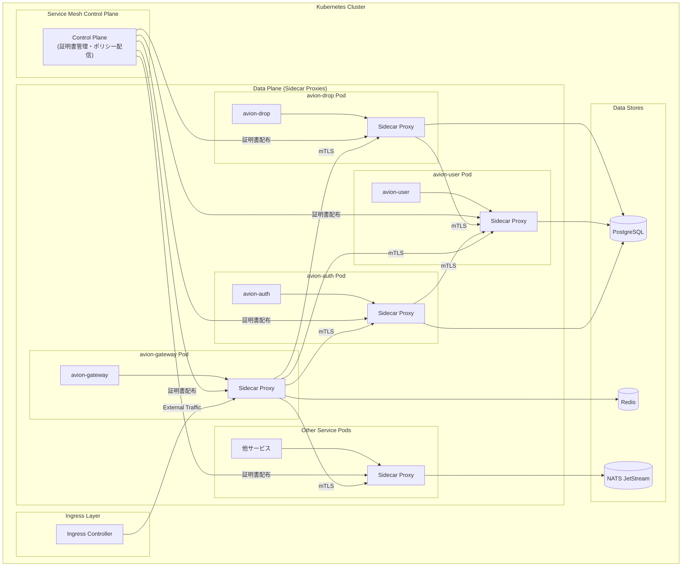
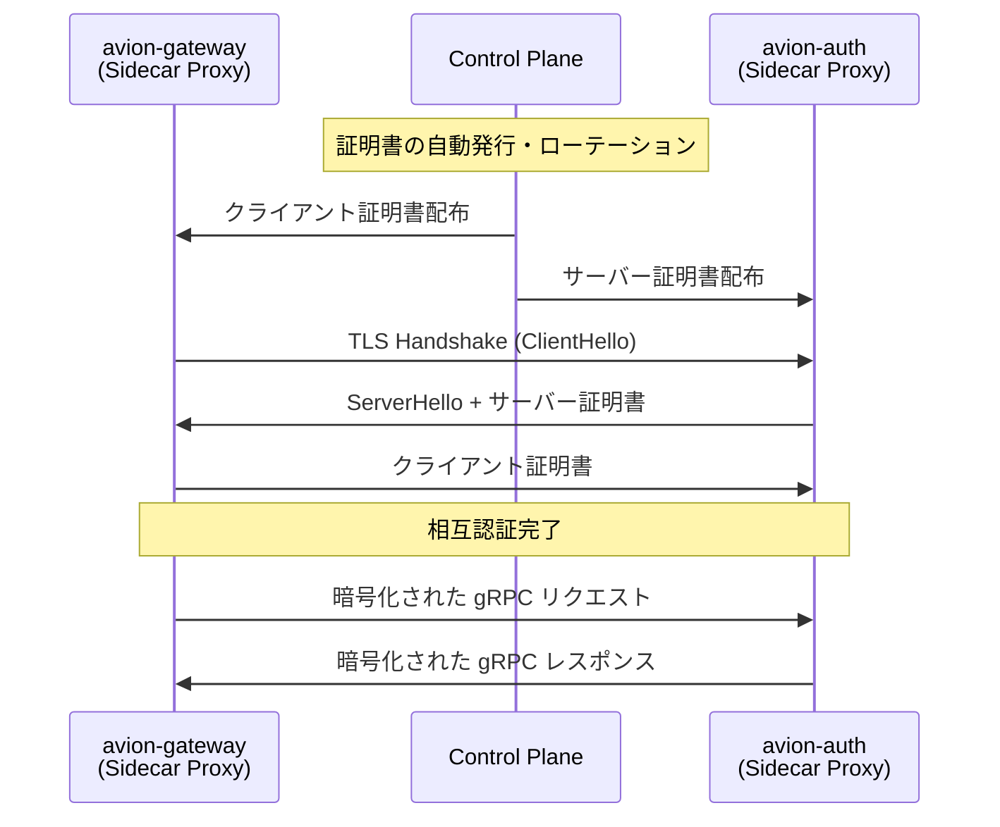
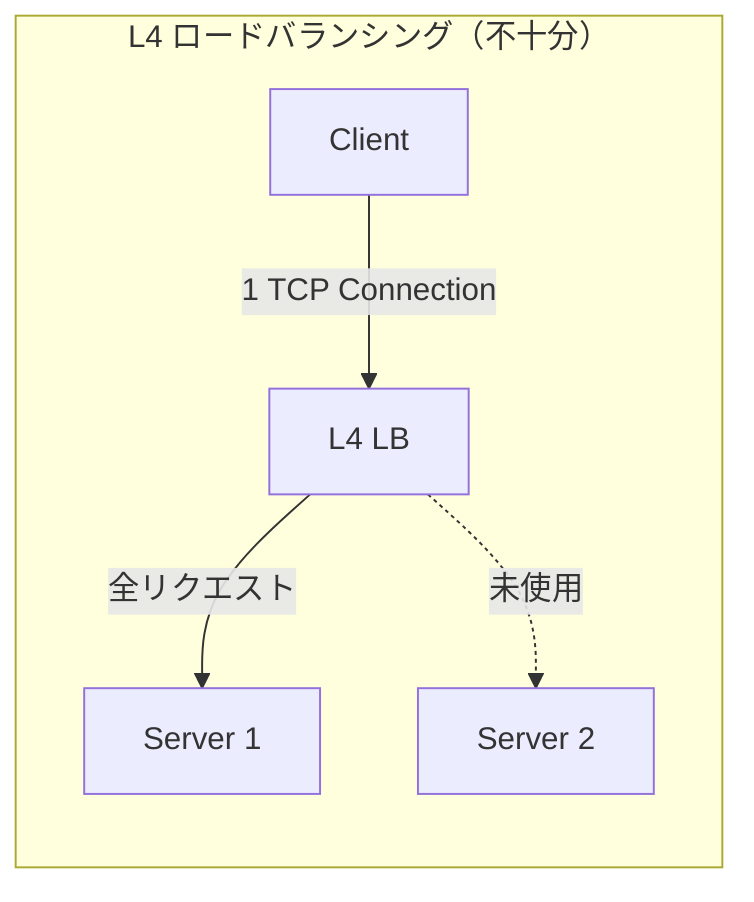
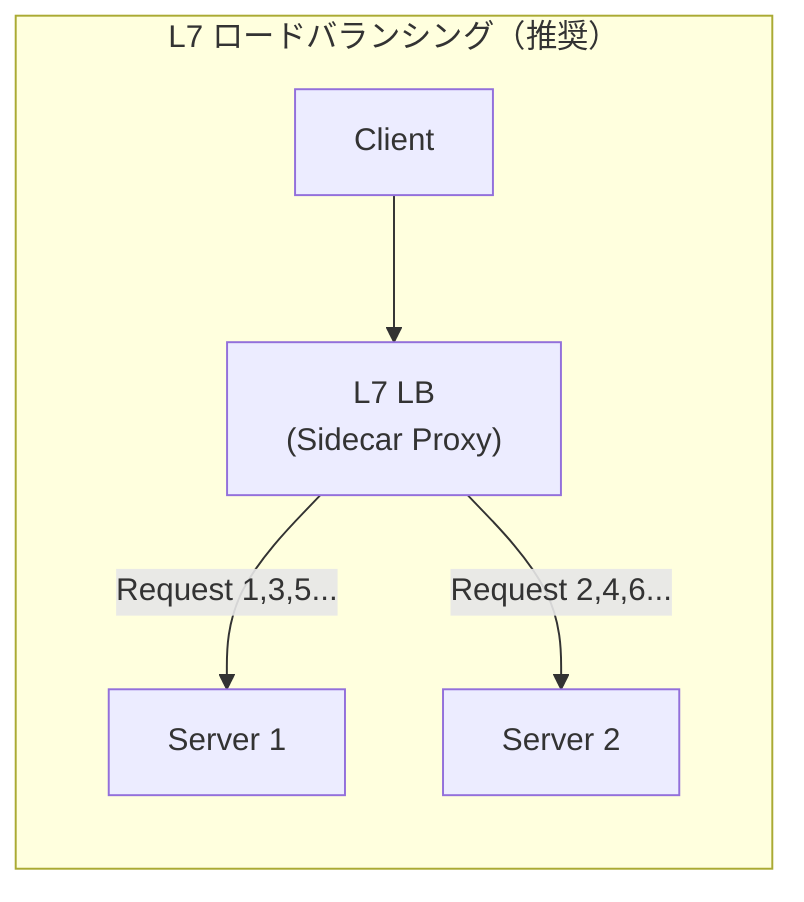
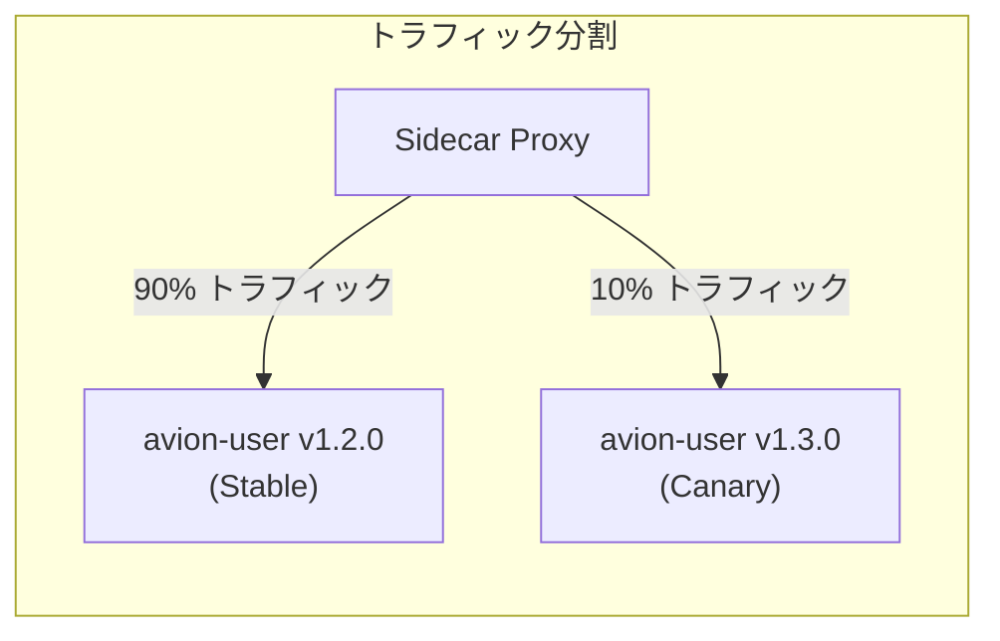
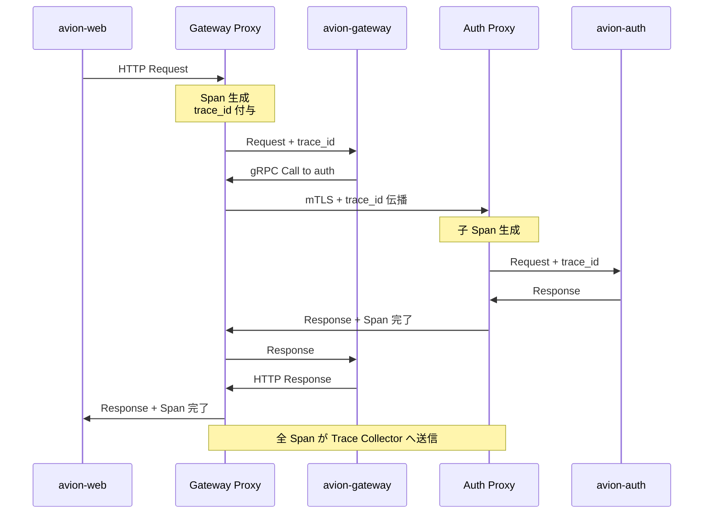
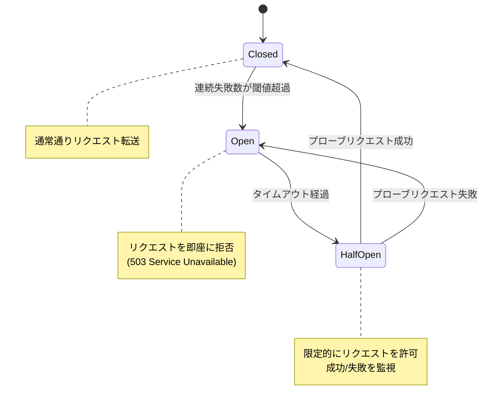

# サービスメッシュ設定ガイド

**Last Updated:** 2026/03/15
**Author:** Claude Code
**Status:** 採用済み
**Compliance:** Production Ready

## 概要

Avion プラットフォームはマイクロサービスアーキテクチャを採用し、Kubernetes 上にデプロイされます。サービス数の増加に伴い、サービス間通信のセキュリティ、信頼性、可観測性を統一的に管理する必要があります。本ドキュメントは、サービスメッシュの導入方針と設定ガイドラインを定義します。

### サービスメッシュの目的

サービスメッシュは、アプリケーションコードを変更することなく、サービス間通信に以下の機能を透過的に提供します。

| 機能 | 説明 | Avion での活用 |
|:--|:--|:--|
| **mTLS（相互 TLS）** | サービス間通信の暗号化と相互認証 | 全サービス間の通信をゼロトラストで保護 |
| **ロードバランシング** | インテリジェントなトラフィック分散 | ConnectRPC/gRPC 通信の効率的な負荷分散 |
| **トラフィック管理** | カナリアリリース、トラフィック分割 | 段階的なサービスデプロイメント |
| **可観測性** | 分散トレーシング、メトリクス収集 | OpenTelemetry との統合による統一的な監視 |
| **障害回復** | サーキットブレーカー、リトライ、タイムアウト | サービス間通信の信頼性向上 |

### Avion における方針

Avion では特定のサービスメッシュ製品（Istio、Linkerd、Cilium 等）に過度に依存せず、以下の方針で設計します。

1. **インターフェース指向**: サービスメッシュの機能を抽象化し、製品切り替えを可能にする
2. **段階的導入**: まず mTLS とロードバランシングから開始し、段階的に機能を拡充
3. **アプリケーション非侵入**: サイドカープロキシパターンにより、アプリケーションコードへの変更を最小化
4. **既存インフラとの共存**: NATS JetStream、Redis、PostgreSQL 等の既存インフラとの整合性を維持

### 関連ドキュメント

- **全体アーキテクチャ**: [architecture.md](../architecture/architecture.md) - システム全体構成
- **Observability**: [observability-package-design.md](../observability/observability-package-design.md) - 分散トレーシング・メトリクス設計
- **NATS JetStream**: [nats-jetstream-design.md](./nats-jetstream-design.md) - イベントバス設計
- **環境変数管理**: [environment-variables.md](./environment-variables.md) - 設定管理
- **TLS 設定**: [tls-configuration.md](../security/tls-configuration.md) - TLS 設定ガイドライン

---

## 目次

1. [アーキテクチャ概要](#1-アーキテクチャ概要)
2. [mTLS 設定](#2-mtls-設定)
3. [ロードバランシング](#3-ロードバランシング)
4. [トラフィック管理](#4-トラフィック管理)
5. [可観測性との連携](#5-可観測性との連携)
6. [障害回復](#6-障害回復)
7. [Kubernetes マニフェスト設定例](#7-kubernetes-マニフェスト設定例)
8. [運用ガイドライン](#8-運用ガイドライン)

---

## 1. アーキテクチャ概要

### 1.1 サービスメッシュの全体構成



### 1.2 サイドカープロキシパターン

Avion では**サイドカープロキシパターン**を採用します。各サービス Pod にサイドカープロキシを注入し、サービス間通信を透過的にインターセプトします。

| 要素 | 説明 |
|:--|:--|
| **Data Plane** | 各 Pod に注入されるサイドカープロキシ。実際のトラフィック制御を担当 |
| **Control Plane** | 証明書管理、ポリシー配信、サービスディスカバリを一元管理 |
| **透過性** | アプリケーションは `localhost` への通信のみ意識し、mTLS やリトライはプロキシが処理 |

### 1.3 サービスメッシュの対象範囲

| 対象 | サービスメッシュ管理 | 備考 |
|:--|:--|:--|
| **サービス間 gRPC 通信** | 対象 | ConnectRPC による全サービス間通信 |
| **Gateway → Backend 通信** | 対象 | avion-gateway から各バックエンドサービスへの通信 |
| **サービス → PostgreSQL** | 対象外 | データベース接続は TLS で個別管理（[tls-configuration.md](../security/tls-configuration.md) 参照） |
| **サービス → Redis** | 対象外 | Redis 接続は TLS で個別管理 |
| **サービス → NATS JetStream** | 対象外 | NATS 接続は TLS で個別管理（[nats-jetstream-design.md](./nats-jetstream-design.md) 参照） |
| **External → Ingress** | 対象外 | Ingress Controller が TLS 終端を担当 |

---

## 2. mTLS 設定

### 2.1 ゼロトラストネットワーキング

Avion では**ゼロトラストモデル**を採用し、クラスタ内部のサービス間通信であっても暗号化と相互認証を必須とします。



### 2.2 証明書管理方針

| 項目 | 方針 |
|:--|:--|
| **証明書の発行** | Control Plane が自動的に発行。手動管理は不要 |
| **証明書のローテーション** | 24 時間ごとに自動ローテーション |
| **ルート CA** | Control Plane が管理する内部 CA を使用 |
| **証明書の有効期限** | 短期証明書（24 〜 48 時間）を推奨。漏洩時のリスクを最小化 |
| **失効管理** | 短期証明書により CRL/OCSP は不要。ローテーションで対応 |

### 2.3 mTLS モード

段階的な導入を考慮し、以下の 2 つのモードを定義します。

| モード | 説明 | 用途 |
|:--|:--|:--|
| **PERMISSIVE** | mTLS と平文の両方を受け入れる | 移行期間中に使用。既存サービスとの互換性維持 |
| **STRICT** | mTLS のみ許可。平文通信を拒否 | 本番環境の最終目標。全サービスへの導入完了後に適用 |

#### 導入フェーズ

```
Phase 1: PERMISSIVE モードで全サービスにサイドカーを注入
  ↓ 全サービスの動作確認
Phase 2: 重要サービス（avion-auth, avion-gateway）を STRICT モードに変更
  ↓ 問題がないことを確認
Phase 3: 全サービスを STRICT モードに移行
```

### 2.4 サービスアイデンティティ

各サービスには Kubernetes ServiceAccount に基づく一意のアイデンティティを割り当てます。

| サービス | ServiceAccount | SPIFFE ID（例） |
|:--|:--|:--|
| avion-gateway | `avion-gateway` | `spiffe://avion.local/ns/avion/sa/avion-gateway` |
| avion-auth | `avion-auth` | `spiffe://avion.local/ns/avion/sa/avion-auth` |
| avion-user | `avion-user` | `spiffe://avion.local/ns/avion/sa/avion-user` |
| avion-drop | `avion-drop` | `spiffe://avion.local/ns/avion/sa/avion-drop` |
| avion-timeline | `avion-timeline` | `spiffe://avion.local/ns/avion/sa/avion-timeline` |
| avion-notification | `avion-notification` | `spiffe://avion.local/ns/avion/sa/avion-notification` |
| avion-search | `avion-search` | `spiffe://avion.local/ns/avion/sa/avion-search` |
| avion-media | `avion-media` | `spiffe://avion.local/ns/avion/sa/avion-media` |
| avion-message | `avion-message` | `spiffe://avion.local/ns/avion/sa/avion-message` |
| avion-community | `avion-community` | `spiffe://avion.local/ns/avion/sa/avion-community` |
| avion-moderation | `avion-moderation` | `spiffe://avion.local/ns/avion/sa/avion-moderation` |
| avion-activitypub | `avion-activitypub` | `spiffe://avion.local/ns/avion/sa/avion-activitypub` |
| avion-system-admin | `avion-system-admin` | `spiffe://avion.local/ns/avion/sa/avion-system-admin` |

### 2.5 認可ポリシー

mTLS による認証に加え、サービス間の通信を最小権限の原則に基づいて制限します。

#### 通信許可マトリクス

以下は、[architecture.md](../architecture/architecture.md) に定義されたサービス間依存関係に基づく許可マトリクスです。

| 送信元 → 送信先 | gateway | auth | user | drop | timeline | notification | search | media | message | community | moderation | activitypub | system-admin |
|:--|:--:|:--:|:--:|:--:|:--:|:--:|:--:|:--:|:--:|:--:|:--:|:--:|:--:|
| **gateway** | - | o | o | o | o | o | o | o | o | o | o | o | o |
| **auth** | x | - | x | x | x | x | x | x | x | x | x | x | x |
| **user** | x | x | - | x | x | x | x | x | x | x | x | x | x |
| **drop** | x | x | x | - | x | x | x | o | x | x | x | x | x |
| **timeline** | x | x | o | o | - | x | x | x | x | x | x | x | x |
| **notification** | x | x | o | x | x | - | x | x | x | x | x | x | x |
| **search** | x | x | o | o | x | x | - | x | x | x | x | x | x |
| **media** | x | x | x | x | x | x | x | - | x | x | x | x | x |
| **message** | x | x | x | x | x | x | x | o | - | x | x | x | x |
| **community** | x | x | x | x | x | x | x | x | x | - | x | x | x |
| **moderation** | x | x | x | x | x | x | x | x | x | x | - | x | x |
| **activitypub** | x | x | o | o | x | x | x | o | x | x | x | - | x |
| **system-admin** | x | x | x | x | x | x | x | x | x | x | x | x | - |

- `o`: 通信許可、`x`: 通信拒否、`-`: 自身

> **注記**: NATS JetStream 経由のイベント通信はサービスメッシュの管理対象外です。イベントの Publish/Subscribe 関係については [nats-jetstream-design.md](./nats-jetstream-design.md) を参照してください。

---

## 3. ロードバランシング

### 3.1 ロードバランシング戦略

Avion のサービス間通信は ConnectRPC（gRPC ベース）を使用しているため、HTTP/2 に対応したロードバランシングが必要です。

| 戦略 | 説明 | 推奨用途 |
|:--|:--|:--|
| **ROUND_ROBIN** | リクエストを均等に分散 | 一般的なサービス間通信のデフォルト |
| **LEAST_REQUEST** | 最も未処理リクエストが少ないインスタンスへ分散 | 処理時間にばらつきがあるサービス（avion-media 等） |
| **RING_HASH** | 一貫性ハッシュに基づく分散 | キャッシュ効率を重視するサービス |

### 3.2 gRPC ロードバランシングの考慮事項

HTTP/2 はコネクションの多重化を行うため、L4（TCP レベル）のロードバランシングでは十分な分散が実現できません。





サービスメッシュのサイドカープロキシは **L7（アプリケーション層）** でリクエスト単位のロードバランシングを行うため、gRPC 通信でも均等な分散が可能です。

### 3.3 サービス別ロードバランシング設定

| サービス | 戦略 | 理由 |
|:--|:--|:--|
| **avion-gateway** | ROUND_ROBIN | 標準的な API リクエスト分散 |
| **avion-auth** | ROUND_ROBIN | 認証リクエストは均一な処理時間 |
| **avion-user** | ROUND_ROBIN | 標準的な CRUD 操作 |
| **avion-drop** | ROUND_ROBIN | 投稿操作の均等分散 |
| **avion-timeline** | ROUND_ROBIN | タイムライン構築リクエストの分散 |
| **avion-media** | LEAST_REQUEST | メディア処理は処理時間のばらつきが大きい |
| **avion-search** | ROUND_ROBIN | 検索リクエストの均等分散 |
| **avion-message** | ROUND_ROBIN | メッセージ処理の均等分散 |
| **avion-notification** | ROUND_ROBIN | 通知処理の均等分散 |
| **avion-community** | ROUND_ROBIN | 標準的な CRUD 操作 |
| **avion-moderation** | ROUND_ROBIN | モデレーション処理の均等分散 |
| **avion-activitypub** | LEAST_REQUEST | リモートサーバーとの通信で処理時間がばらつく |
| **avion-system-admin** | ROUND_ROBIN | 管理操作の均等分散 |

### 3.4 ヘルスチェック

ロードバランシングの前提として、各サービスはヘルスチェックエンドポイントを公開します。

| チェック種別 | 説明 | 間隔 | タイムアウト |
|:--|:--|:--|:--|
| **Liveness Probe** | サービスプロセスが生存しているか | 10 秒 | 3 秒 |
| **Readiness Probe** | サービスがリクエストを受け付け可能か | 5 秒 | 3 秒 |
| **Startup Probe** | サービスの起動が完了したか | 5 秒 | 3 秒 |

---

## 4. トラフィック管理

### 4.1 カナリアリリース

新バージョンのサービスを段階的にデプロイするため、トラフィック分割によるカナリアリリースを実施します。



#### カナリアリリースの段階

| 段階 | トラフィック比率 | 期間 | 判断基準 |
|:--|:--|:--|:--|
| **Stage 1** | Canary: 5% / Stable: 95% | 30 分 | エラーレートが閾値以下 |
| **Stage 2** | Canary: 25% / Stable: 75% | 1 時間 | レイテンシが許容範囲内 |
| **Stage 3** | Canary: 50% / Stable: 50% | 2 時間 | 全メトリクスが正常 |
| **Stage 4** | Canary: 100% / Stable: 0% | - | 完全移行 |

#### 自動ロールバック条件

以下の条件を満たした場合、自動的に Stable バージョンにロールバックします。

| 条件 | 閾値 |
|:--|:--|
| **エラーレート** | 5xx レスポンスが 1% を超過 |
| **レイテンシ** | P99 レイテンシが Stable の 2 倍を超過 |
| **ヘルスチェック失敗** | Readiness Probe が連続 3 回失敗 |

### 4.2 ヘッダベースルーティング

テスト環境や特定のリクエストを特定バージョンにルーティングするため、ヘッダベースのルーティングをサポートします。

| ヘッダ | 値 | 動作 |
|:--|:--|:--|
| `x-avion-route-to` | `canary` | カナリアバージョンにルーティング |
| `x-avion-route-to` | `stable` | 安定バージョンにルーティング |
| `x-avion-debug` | `true` | デバッグ用エンドポイントへのルーティング |

> **注記**: ヘッダベースルーティングは開発・ステージング環境でのみ有効化し、本番環境では無効化します。

### 4.3 レート制限

サービスメッシュレベルでのレート制限は設定しません。レート制限は avion-gateway で一元管理します（Redis ベースのカウンターを使用）。詳細は [redis-cache-strategy.md](./redis-cache-strategy.md) を参照してください。

---

## 5. 可観測性との連携

### 5.1 分散トレーシング統合

サービスメッシュのサイドカープロキシは、OpenTelemetry との統合により分散トレーシング情報を自動的に収集・伝播します。



### 5.2 トレースコンテキスト伝播

サイドカープロキシは以下のヘッダを自動的に伝播します。

| ヘッダ | 説明 | 標準 |
|:--|:--|:--|
| `traceparent` | W3C Trace Context のトレース ID とスパン ID | W3C Trace Context |
| `tracestate` | ベンダー固有のトレース情報 | W3C Trace Context |
| `x-request-id` | リクエスト識別子 | 独自 |

Avion の Observability パッケージ（[observability-package-design.md](../observability/observability-package-design.md)）が生成するトレースコンテキストと、サービスメッシュが生成するトレース情報は自動的に統合されます。

### 5.3 メトリクス収集

サイドカープロキシは以下のメトリクスを自動的に収集し、Prometheus 形式で公開します。

#### リクエストメトリクス

| メトリクス名 | 種別 | 説明 |
|:--|:--|:--|
| `request_total` | Counter | リクエスト総数（送信元、送信先、レスポンスコード別） |
| `request_duration_seconds` | Histogram | リクエスト処理時間 |
| `request_size_bytes` | Histogram | リクエストサイズ |
| `response_size_bytes` | Histogram | レスポンスサイズ |

#### コネクションメトリクス

| メトリクス名 | 種別 | 説明 |
|:--|:--|:--|
| `tcp_connections_opened_total` | Counter | 開かれた TCP コネクション数 |
| `tcp_connections_closed_total` | Counter | 閉じられた TCP コネクション数 |
| `tcp_sent_bytes_total` | Counter | 送信バイト数 |
| `tcp_received_bytes_total` | Counter | 受信バイト数 |

#### 障害回復メトリクス

| メトリクス名 | 種別 | 説明 |
|:--|:--|:--|
| `circuit_breaker_state` | Gauge | サーキットブレーカーの状態（0: Closed, 1: Open, 2: Half-Open） |
| `retry_total` | Counter | リトライ回数 |
| `timeout_total` | Counter | タイムアウト回数 |

### 5.4 アラート設定

メトリクスに基づく推奨アラートルールを以下に定義します。

| アラート名 | 条件 | 重要度 | 対応 |
|:--|:--|:--|:--|
| **HighErrorRate** | 5xx レスポンスが全リクエストの 1% 超過（5 分間） | Critical | 即座にオンコール対応 |
| **HighLatency** | P99 レイテンシが 3 秒超過（5 分間） | Warning | パフォーマンス調査 |
| **CircuitBreakerOpen** | サーキットブレーカーが Open 状態 | Critical | 依存サービスの確認 |
| **mTLSHandshakeFailure** | mTLS ハンドシェイク失敗率が 0.1% 超過 | Critical | 証明書の確認 |
| **HighRetryRate** | リトライ率が 10% 超過（5 分間） | Warning | 送信先サービスの状態確認 |

---

## 6. 障害回復

### 6.1 サーキットブレーカー

サービス間の障害連鎖を防ぐため、サービスメッシュレベルでサーキットブレーカーを実装します。



#### サーキットブレーカーのパラメータ

| パラメータ | デフォルト値 | 説明 |
|:--|:--|:--|
| **連続失敗閾値** | 5 回 | Open 状態に遷移する連続失敗回数 |
| **タイムアウト** | 30 秒 | Open から Half-Open への遷移待ち時間 |
| **プローブ数** | 3 回 | Half-Open 時に送信するプローブリクエスト数 |
| **成功閾値** | 2 回 | Closed に戻るために必要なプローブ成功数 |
| **評価ウィンドウ** | 60 秒 | 連続失敗をカウントする時間窓 |

> **注記**: avion-gateway のアプリケーション層にもサーキットブレーカーが実装されています。サービスメッシュレベルのサーキットブレーカーはインフラ層の保護として機能し、アプリケーション層のサーキットブレーカーとは独立して動作します。両者の閾値は、サービスメッシュ側をより緩やか（閾値を高め）に設定し、アプリケーション層での制御を優先します。

### 6.2 リトライポリシー

一時的な障害に対するリトライポリシーを以下の通り定義します。

| パラメータ | デフォルト値 | 説明 |
|:--|:--|:--|
| **最大リトライ回数** | 3 回 | 初回リクエスト含めず |
| **リトライ対象ステータス** | 503, 504 | リトライを行う HTTP ステータスコード |
| **リトライ対象 gRPC コード** | UNAVAILABLE | リトライを行う gRPC ステータスコード |
| **バックオフ初期値** | 100ms | 指数バックオフの初期待機時間 |
| **バックオフ最大値** | 1 秒 | 指数バックオフの最大待機時間 |
| **ジッター** | 25% | バックオフにランダムなジッターを追加 |

#### リトライ時の冪等性

リトライは**冪等な操作**に対してのみ安全に適用可能です。

| メソッド | リトライ | 理由 |
|:--|:--|:--|
| **GET / Query 系** | 有効 | 読み取り操作は冪等 |
| **PUT** | 有効 | 全体置換は冪等 |
| **DELETE** | 有効 | 削除は冪等 |
| **POST / Command 系** | 無効 | 作成操作は非冪等の可能性。アプリケーション層で冪等キーを使用 |

### 6.3 タイムアウト

サービス間通信のタイムアウトをサービスメッシュレベルで管理します。

| サービス | リクエストタイムアウト | アイドルタイムアウト | 理由 |
|:--|:--|:--|:--|
| **avion-auth** | 5 秒 | 60 秒 | 認証処理は迅速であるべき |
| **avion-user** | 10 秒 | 60 秒 | プロフィール取得等の標準的な処理 |
| **avion-drop** | 10 秒 | 60 秒 | 投稿の CRUD 操作 |
| **avion-timeline** | 15 秒 | 60 秒 | タイムライン構築は複数サービス参照 |
| **avion-media** | 30 秒 | 120 秒 | メディアアップロード・処理は時間がかかる |
| **avion-search** | 10 秒 | 60 秒 | 検索クエリの処理 |
| **avion-message** | 10 秒 | 300 秒 | WebSocket 接続のアイドルタイムアウトは長め |
| **avion-notification** | 10 秒 | 60 秒 | 通知配信処理 |
| **avion-community** | 10 秒 | 60 秒 | コミュニティ操作 |
| **avion-moderation** | 10 秒 | 60 秒 | モデレーション処理 |
| **avion-activitypub** | 30 秒 | 120 秒 | リモートサーバーとの通信が含まれる |
| **avion-system-admin** | 15 秒 | 60 秒 | 管理操作（一括処理を含む） |

### 6.4 外れ値検出（Outlier Detection）

異常なインスタンスをロードバランシングプールから一時的に除外します。

| パラメータ | デフォルト値 | 説明 |
|:--|:--|:--|
| **連続 5xx 閾値** | 5 回 | エジェクトのトリガーとなる連続 5xx 回数 |
| **評価間隔** | 10 秒 | 外れ値チェックの実行間隔 |
| **エジェクト時間** | 30 秒 | プールから除外する基本時間 |
| **最大エジェクト率** | 30% | プール内で同時にエジェクトできる最大割合 |

---

## 7. Kubernetes マニフェスト設定例

以下は、サービスメッシュの設定を概念的に表現した Kubernetes マニフェスト例です。実際の設定は採用するサービスメッシュ製品に応じて調整してください。

### 7.1 Namespace レベルのサイドカー注入設定

```yaml
# namespace.yaml
apiVersion: v1
kind: Namespace
metadata:
  name: avion
  labels:
    # サイドカープロキシの自動注入を有効化
    # 注記: ラベル名は製品により異なる
    # Istio: istio-injection: enabled
    # Linkerd: linkerd.io/inject: enabled
    mesh-injection: enabled
```

### 7.2 サービスデプロイメント例

```yaml
# avion-auth-deployment.yaml
apiVersion: apps/v1
kind: Deployment
metadata:
  name: avion-auth
  namespace: avion
  labels:
    app: avion-auth
    version: v1.0.0
spec:
  replicas: 3
  selector:
    matchLabels:
      app: avion-auth
  template:
    metadata:
      labels:
        app: avion-auth
        version: v1.0.0
      annotations:
        # サイドカープロキシの設定アノテーション
        # CPU/メモリリソースの制限
        proxy.resources.requests.cpu: "100m"
        proxy.resources.requests.memory: "128Mi"
        proxy.resources.limits.cpu: "500m"
        proxy.resources.limits.memory: "256Mi"
    spec:
      serviceAccountName: avion-auth
      containers:
        - name: avion-auth
          image: avion-auth:v1.0.0
          ports:
            - containerPort: 8080
              name: http
              protocol: TCP
            - containerPort: 9090
              name: grpc
              protocol: TCP
          livenessProbe:
            httpGet:
              path: /healthz
              port: 8080
            initialDelaySeconds: 10
            periodSeconds: 10
            timeoutSeconds: 3
          readinessProbe:
            httpGet:
              path: /readyz
              port: 8080
            initialDelaySeconds: 5
            periodSeconds: 5
            timeoutSeconds: 3
          startupProbe:
            httpGet:
              path: /healthz
              port: 8080
            failureThreshold: 30
            periodSeconds: 5
            timeoutSeconds: 3
          resources:
            requests:
              cpu: "250m"
              memory: "256Mi"
            limits:
              cpu: "1000m"
              memory: "512Mi"
          env:
            - name: PORT
              value: "8080"
            - name: GRPC_PORT
              value: "9090"
            - name: ENVIRONMENT
              value: "production"
```

### 7.3 mTLS ポリシー設定例

```yaml
# mtls-policy.yaml
# 注記: 実際の CRD 名は製品により異なる
apiVersion: security.mesh/v1
kind: PeerAuthentication
metadata:
  name: avion-strict-mtls
  namespace: avion
spec:
  # Namespace 内の全サービスに STRICT mTLS を適用
  mtls:
    mode: STRICT
```

### 7.4 認可ポリシー設定例

```yaml
# authorization-policy.yaml
# avion-auth への通信を avion-gateway からのみ許可
apiVersion: security.mesh/v1
kind: AuthorizationPolicy
metadata:
  name: avion-auth-policy
  namespace: avion
spec:
  selector:
    matchLabels:
      app: avion-auth
  rules:
    - from:
        - source:
            principals:
              - "cluster.local/ns/avion/sa/avion-gateway"
      to:
        - operation:
            ports: ["9090"]
```

### 7.5 トラフィック分割設定例（カナリアリリース）

```yaml
# traffic-split.yaml
# avion-user のカナリアリリース（10% を新バージョンへ）
apiVersion: networking.mesh/v1
kind: TrafficSplit
metadata:
  name: avion-user-canary
  namespace: avion
spec:
  service: avion-user
  backends:
    - service: avion-user-stable
      weight: 90
    - service: avion-user-canary
      weight: 10
```

### 7.6 サーキットブレーカー設定例

```yaml
# circuit-breaker.yaml
apiVersion: networking.mesh/v1
kind: DestinationRule
metadata:
  name: avion-user-circuit-breaker
  namespace: avion
spec:
  host: avion-user
  trafficPolicy:
    connectionPool:
      tcp:
        maxConnections: 100
      http:
        h2UpgradePolicy: DEFAULT
        maxRequestsPerConnection: 1000
    outlierDetection:
      consecutiveErrors: 5
      interval: 10s
      baseEjectionTime: 30s
      maxEjectionPercent: 30
```

### 7.7 リトライポリシー設定例

```yaml
# retry-policy.yaml
apiVersion: networking.mesh/v1
kind: VirtualService
metadata:
  name: avion-user-retry
  namespace: avion
spec:
  host: avion-user
  route:
    - destination:
        host: avion-user
      retries:
        attempts: 3
        perTryTimeout: 5s
        retryOn: "unavailable,resource-exhausted"
        retryBackOff:
          baseInterval: 100ms
          maxInterval: 1s
```

---

## 8. 運用ガイドライン

### 8.1 サイドカープロキシのリソース管理

サイドカープロキシは各 Pod に追加されるため、リソース消費を考慮する必要があります。

| リソース | Request | Limit | 備考 |
|:--|:--|:--|:--|
| **CPU** | 100m | 500m | 通常の通信処理に十分な量 |
| **メモリ** | 128Mi | 256Mi | TLS 処理やバッファリングを考慮 |

#### リソース使用量の監視

サイドカープロキシのリソース使用量を監視し、以下の閾値を超えた場合はリソース設定を見直します。

| メトリクス | 警告閾値 | 対応 |
|:--|:--|:--|
| CPU 使用率 | 80% | Limit の引き上げを検討 |
| メモリ使用率 | 85% | Limit の引き上げを検討 |

### 8.2 サービスメッシュのアップグレード

サービスメッシュのアップグレードは以下の手順で実施します。

```
1. Control Plane のアップグレード
   ↓
2. ステージング環境の Data Plane（サイドカー）更新
   ↓
3. ステージング環境での動作検証（最低 24 時間）
   ↓
4. 本番環境の Data Plane を段階的に更新（ローリングアップデート）
   ↓
5. 全 Pod の更新完了確認
```

### 8.3 トラブルシューティング

#### よくある問題と対処法

| 問題 | 原因 | 対処法 |
|:--|:--|:--|
| **503 エラーが頻発** | サーキットブレーカーが Open 状態 | 送信先サービスの状態を確認。メトリクスで障害原因を特定 |
| **mTLS ハンドシェイク失敗** | 証明書の期限切れまたは不整合 | Control Plane の証明書管理を確認。Pod の再起動で証明書を再取得 |
| **レイテンシ増大** | サイドカープロキシのリソース不足 | プロキシのリソース使用量を確認し、必要に応じて Limit を引き上げ |
| **通信が拒否される** | 認可ポリシーの設定ミス | 認可ポリシーの設定を確認。通信許可マトリクス（セクション 2.5）と照合 |
| **トレース情報が欠落** | トレースコンテキストの伝播失敗 | アプリケーションが `traceparent` ヘッダを適切に伝播しているか確認 |

### 8.4 サービスメッシュ製品の選定基準

Avion では特定の製品に依存しない方針ですが、選定時には以下の基準を考慮します。

| 基準 | 重要度 | 説明 |
|:--|:--|:--|
| **gRPC/HTTP2 対応** | 必須 | ConnectRPC ベースの通信をサポート |
| **mTLS 自動管理** | 必須 | 証明書の自動発行・ローテーション |
| **L7 ロードバランシング** | 必須 | gRPC リクエスト単位の負荷分散 |
| **OpenTelemetry 統合** | 必須 | 既存の Observability パッケージとの統合 |
| **Prometheus メトリクス** | 必須 | 既存の監視インフラとの統合 |
| **リソース消費量** | 重要 | サイドカープロキシの CPU/メモリ消費が少ないこと |
| **CNCF プロジェクト** | 推奨 | 長期的なサポートとコミュニティの活発さ |
| **Kubernetes ネイティブ** | 推奨 | CRD ベースの設定管理 |
