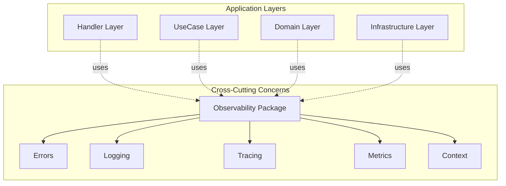

# Design Doc: Avion共通Observabilityパッケージ

**Last Updated:** 2025/08/13  
**Author:** Claude Code  
**Status:** レビュー待ち

## 1. Executive Summary

本ドキュメントは、Avionプラットフォーム全体で使用される共通のObservability（観測可能性）パッケージの設計仕様を定義します。エラーハンドリング、構造化ログ、分散トレーシング、メトリクス収集を統一的に実装し、すべてのマイクロサービスで一貫した監視・デバッグ能力を提供します。

### 1.1. `.cursor/rules`準拠チェックリスト

- ✅ **DDD アーキテクチャ準拠**: 横断的関心事（Cross-Cutting Concerns）として正しく位置づけ
- ✅ **カプセル化原則**: 各パッケージが単一の目的を持ち、責任が明確に分離
- ✅ **関心の分離**: エラー、ログ、トレース、メトリクスが独立したモジュールとして設計
- ✅ **TDD対応**: すべてのインターフェースに`//go:generate`ディレクティブを配置
- ✅ **モック戦略**: `go.uber.org/mock/gomock`を使用し、`tests/`ディレクトリにモック生成

## 2. Background

### 2.1. 設計の動機

Avionプラットフォームは複数のマイクロサービスで構成される分散システムです。このような環境では以下の要件が必要となります：

1. **統一された観測可能性**: すべてのサービスで一貫した監視・デバッグ能力
2. **サービス間の追跡**: 分散環境でのリクエストフローの可視化
3. **標準化された運用**: 統一されたエラーコード、ログフォーマット、メトリクス定義
4. **効率的な障害対応**: 迅速な問題特定と解決のための情報収集

これらの要件を満たすため、プラットフォーム全体で使用する共通のObservabilityパッケージを設計します。

### 2.2. DDD観点での位置づけ

`.cursor/rules/ddd/architecture/architecture.md`に基づき、Observabilityパッケージは以下の特性を持ちます：



**特性:**
- **レイヤー非依存**: すべてのレイヤーから利用可能
- **技術的関心事**: ビジネスロジックではなく技術基盤
- **共通性**: すべてのサービスで同一の実装を使用

## 3. Goals and Non-Goals

### 3.1. Goals（実現すること）

1. **統一されたエラーハンドリング**
   - 標準化されたエラーコード体系 `[SERVICE]_[LAYER]_[ERROR_TYPE]`
   - プロトコル間の自動変換（HTTP/gRPC/GraphQL）
   - 詳細なエラー情報の構造化

2. **構造化ログ**
   - 統一されたログフォーマット（JSON）
   - コンテキスト情報の自動付与
   - パフォーマンスへの最小限の影響

3. **分散トレーシング**
   - OpenTelemetryベースの実装
   - 自動的なスパン伝播
   - サービス間のリクエスト追跡

4. **メトリクス収集**
   - Prometheus形式での統一
   - 標準メトリクスの定義
   - カスタムメトリクスのサポート

5. **コンテキスト管理**
   - 相関IDの自動生成と伝播
   - メタデータの一元管理

### 3.2. Non-Goals（実現しないこと）

- ビジネスロジックの実装
- サービス固有のカスタマイズ（設定で対応）
- 外部監視システムの実装（統合のみ）
- ログストレージの実装（出力のみ）
- APMツールの独自実装

## 4. Architecture

### 4.1. パッケージ構造

```
pkg/
├── observability/           # 観測可能性統合パッケージ
│   ├── errors/             # エラーハンドリング
│   │   ├── error.go        # 基本エラー型定義
│   │   ├── codes.go        # 標準エラーコード
│   │   ├── factory.go      # エラーファクトリー
│   │   ├── handler.go      # エラーハンドラー
│   │   └── mapper/         # プロトコル変換
│   │       ├── http.go     # HTTP変換
│   │       ├── grpc.go     # gRPC変換
│   │       └── graphql.go  # GraphQL変換
│   │
│   ├── logging/            # 構造化ログ
│   │   ├── logger.go       # ロガーインターフェース
│   │   ├── zap/            # Zap実装
│   │   │   ├── logger.go   # Zapロガー
│   │   │   └── config.go   # 設定
│   │   ├── context.go      # コンテキスト統合
│   │   └── fields.go       # 標準フィールド定義
│   │
│   ├── tracing/            # 分散トレーシング
│   │   ├── tracer.go       # トレーサー初期化
│   │   ├── span.go         # スパン管理
│   │   ├── propagation.go  # コンテキスト伝播
│   │   └── middleware/     # ミドルウェア
│   │       ├── http.go     # HTTP用
│   │       └── grpc.go     # gRPC用
│   │
│   ├── metrics/            # メトリクス収集
│   │   ├── collector.go    # メトリクス収集
│   │   ├── prometheus/     # Prometheus実装
│   │   │   └── exporter.go # エクスポーター
│   │   └── standard.go     # 標準メトリクス定義
│   │
│   └── context/            # コンテキスト管理
│       ├── context.go      # 拡張コンテキスト
│       ├── correlation.go  # 相関ID管理
│       └── metadata.go     # メタデータ管理
```

### 4.2. モジュール設計原則（`.cursor/rules/core.mdc`準拠）

各モジュールは以下の原則に従います：

1. **カプセル化**: 各パッケージは単一の目的を持つ
   - `errors`: エラー情報の管理と変換
   - `logging`: ログの構造化と出力
   - `tracing`: 分散トレースの管理
   - `metrics`: メトリクスの収集と公開
   - `context`: 横断的な情報の管理

2. **関心の分離**: 各機能が独立して動作
   - 他のモジュールへの依存を最小限に
   - インターフェースを通じた疎結合

## 5. Detailed Design

### 5.1. エラーパッケージ (pkg/observability/errors)

#### 5.1.1. インターフェース定義

```go
// pkg/observability/errors/error.go
package errors

import (
    "context"
    "time"
)

// Error は Avion 共通エラーインターフェース
//
//go:generate mockgen -source=$GOFILE -destination=../../../tests/pkg/observability/errors/mock_error.go -package=errors
type Error interface {
    error
    Code() ErrorCode
    Message() string
    Details() map[string]interface{}
    Timestamp() time.Time
    Wrap(err error) Error
    WithContext(ctx context.Context) Error
    WithStack() Error
    WithDetails(key string, value interface{}) Error
}

// ErrorCode はエラーコードの型
type ErrorCode string

// Factory はエラーを生成するファクトリーインターフェース
//
//go:generate mockgen -source=$GOFILE -destination=../../../tests/pkg/observability/errors/mock_factory.go -package=errors
type Factory interface {
    New(code ErrorCode, message string) Error
    NewWithCause(code ErrorCode, message string, cause error) Error
    Wrap(err error, code ErrorCode, message string) Error
}
```

#### 5.1.2. エラーコード体系

```go
// pkg/observability/errors/codes.go
package errors

// 共通エラーコード（サービス非依存）
const (
    // 4xx系 - クライアントエラー
    ErrCodeInvalidInput      ErrorCode = "INVALID_INPUT"
    ErrCodeNotFound          ErrorCode = "NOT_FOUND"
    ErrCodeAlreadyExists     ErrorCode = "ALREADY_EXISTS"
    ErrCodeUnauthorized      ErrorCode = "UNAUTHORIZED"
    ErrCodeForbidden         ErrorCode = "FORBIDDEN"
    
    // 5xx系 - サーバーエラー
    ErrCodeInternal          ErrorCode = "INTERNAL"
    ErrCodeUnavailable       ErrorCode = "UNAVAILABLE"
)

// ServiceErrorCode はサービス固有のエラーコードを生成
// 命名規則: [SERVICE]_[LAYER]_[ERROR_TYPE]
func ServiceErrorCode(service, layer, errorType string) ErrorCode {
    return ErrorCode(fmt.Sprintf("%s_%s_%s", service, layer, errorType))
}
```

#### 5.1.3. プロトコル変換

```go
// pkg/observability/errors/mapper/http.go
package mapper

// HTTPStatusMapper はエラーコードをHTTPステータスに変換
//
//go:generate mockgen -source=$GOFILE -destination=../../../../tests/pkg/observability/errors/mapper/mock_http.go -package=mapper
type HTTPStatusMapper interface {
    MapToHTTPStatus(err errors.Error) int
    RegisterMapping(code errors.ErrorCode, httpStatus int)
}

// pkg/observability/errors/mapper/grpc.go
package mapper

// GRPCStatusMapper はエラーコードをgRPCステータスに変換
//
//go:generate mockgen -source=$GOFILE -destination=../../../../tests/pkg/observability/errors/mapper/mock_grpc.go -package=mapper
type GRPCStatusMapper interface {
    MapToGRPCStatus(err errors.Error) error
    RegisterMapping(code errors.ErrorCode, grpcCode codes.Code)
}
```

### 5.2. ログパッケージ (pkg/observability/logging)

#### 5.2.1. ロガーインターフェース

```go
// pkg/observability/logging/logger.go
package logging

import (
    "context"
)

// Logger は構造化ログのインターフェース
//
//go:generate mockgen -source=$GOFILE -destination=../../../tests/pkg/observability/logging/mock_logger.go -package=logging
type Logger interface {
    // 基本ログメソッド
    Debug(msg string, fields ...Field)
    Info(msg string, fields ...Field)
    Warn(msg string, fields ...Field)
    Error(msg string, fields ...Field)
    Fatal(msg string, fields ...Field)
    
    // コンテキスト付きログ
    WithContext(ctx context.Context) Logger
    WithFields(fields ...Field) Logger
    WithError(err error) Logger
    
    // トレース統合
    WithTraceID(traceID string) Logger
    WithSpanID(spanID string) Logger
}

// Field は構造化ログのフィールド
type Field struct {
    Key   string
    Value interface{}
}

// Factory はロガーを生成するファクトリーインターフェース
//
//go:generate mockgen -source=$GOFILE -destination=../../../tests/pkg/observability/logging/mock_factory.go -package=logging
type Factory interface {
    NewLogger(config Config) (Logger, error)
}
```

#### 5.2.2. コンテキスト統合

```go
// pkg/observability/logging/context.go
package logging

import "context"

type contextKey string

const loggerKey contextKey = "logger"

// FromContext はコンテキストからロガーを取得
func FromContext(ctx context.Context) Logger {
    if logger, ok := ctx.Value(loggerKey).(Logger); ok {
        return logger
    }
    return NewDefaultLogger()
}

// WithLogger はコンテキストにロガーを設定
func WithLogger(ctx context.Context, logger Logger) context.Context {
    return context.WithValue(ctx, loggerKey, logger)
}
```

### 5.3. トレーシングパッケージ (pkg/observability/tracing)

#### 5.3.1. トレーサーインターフェース

```go
// pkg/observability/tracing/tracer.go
package tracing

import (
    "context"
    "go.opentelemetry.io/otel/trace"
)

// Tracer はトレーシングのインターフェース
//
//go:generate mockgen -source=$GOFILE -destination=../../../tests/pkg/observability/tracing/mock_tracer.go -package=tracing
type Tracer interface {
    StartSpan(ctx context.Context, name string, opts ...trace.SpanStartOption) (context.Context, trace.Span)
    Extract(ctx context.Context, carrier interface{}) context.Context
    Inject(ctx context.Context, carrier interface{})
}

// Factory はトレーサーを生成するファクトリーインターフェース
//
//go:generate mockgen -source=$GOFILE -destination=../../../tests/pkg/observability/tracing/mock_factory.go -package=tracing
type Factory interface {
    NewTracer(config Config) (Tracer, func(), error)
}
```

### 5.4. メトリクスパッケージ (pkg/observability/metrics)

#### 5.4.1. コレクターインターフェース

```go
// pkg/observability/metrics/collector.go
package metrics

// Collector はメトリクス収集インターフェース
//
//go:generate mockgen -source=$GOFILE -destination=../../../tests/pkg/observability/metrics/mock_collector.go -package=metrics
type Collector interface {
    // カウンター
    IncrementCounter(name string, labels map[string]string)
    AddCounter(name string, value float64, labels map[string]string)
    
    // ゲージ
    SetGauge(name string, value float64, labels map[string]string)
    
    // ヒストグラム
    ObserveHistogram(name string, value float64, labels map[string]string)
}

// Factory はコレクターを生成するファクトリーインターフェース
//
//go:generate mockgen -source=$GOFILE -destination=../../../tests/pkg/observability/metrics/mock_factory.go -package=metrics
type Factory interface {
    NewCollector(config Config) (Collector, error)
}
```

#### 5.4.2. 標準メトリクス定義

```go
// pkg/observability/metrics/standard.go
package metrics

// 標準メトリクス名
const (
    // HTTPメトリクス
    MetricHTTPRequests      = "http_requests_total"
    MetricHTTPDuration      = "http_request_duration_seconds"
    
    // gRPCメトリクス
    MetricGRPCRequests      = "grpc_requests_total"
    MetricGRPCDuration      = "grpc_request_duration_seconds"
    
    // データベースメトリクス
    MetricDBQueries         = "db_queries_total"
    MetricDBDuration        = "db_query_duration_seconds"
)

// 標準ラベル
const (
    LabelService   = "service"
    LabelMethod    = "method"
    LabelStatus    = "status"
    LabelErrorCode = "error_code"
)
```

### 5.5. コンテキスト管理パッケージ (pkg/observability/context)

```go
// pkg/observability/context/correlation.go
package context

import (
    "context"
    "github.com/google/uuid"
)

type correlationKey struct{}

// WithCorrelationID はコンテキストに相関IDを設定
func WithCorrelationID(ctx context.Context, id string) context.Context {
    if id == "" {
        id = uuid.New().String()
    }
    return context.WithValue(ctx, correlationKey{}, id)
}

// CorrelationID はコンテキストから相関IDを取得
func CorrelationID(ctx context.Context) string {
    if id, ok := ctx.Value(correlationKey{}).(string); ok {
        return id
    }
    return ""
}
```

## 6. Testing Strategy

### 6.1. TDD準拠（`.cursor/guidelines.mdc`）

すべての実装は以下のTDDワークフローに従います：

1. **Step 1**: インターフェース定義（`//go:generate`ディレクティブ付き）
2. **Step 2**: テーブル駆動テストの実装
3. **Step 3**: プロダクトコード実装
4. **Step 4**: `go test ./...`と`golangci-lint run`でのバリデーション

### 6.2. テストカバレッジ目標

- ユニットテスト: 90%以上
- 統合テスト: 主要なユースケースをカバー
- パフォーマンステスト: オーバーヘッド1ms未満

### 6.3. モック戦略

```bash
# モック生成コマンド
go generate ./pkg/observability/...

# モック配置
tests/
└── pkg/
    └── observability/
        ├── errors/
        │   ├── mock_error.go
        │   └── mock_factory.go
        ├── logging/
        │   ├── mock_logger.go
        │   └── mock_factory.go
        └── ...
```

## 7. Migration Plan

### Phase 1: 基盤実装（Week 1）
- エラーパッケージの実装
- ロギングパッケージの実装
- 基本的なテストの作成

### Phase 2: 統合実装（Week 2）
- トレーシングパッケージの実装
- メトリクスパッケージの実装
- コンテキスト管理の実装

### Phase 3: サービス適用（Week 3-4）
- avion-system-adminでの試験導入
- フィードバック収集と改善
- 全サービスへの段階的適用

## 8. Performance Considerations

### 8.1. パフォーマンス目標

- ログ出力のオーバーヘッド: < 100μs
- エラー生成のオーバーヘッド: < 10μs
- メトリクス収集のオーバーヘッド: < 50μs
- メモリ使用量: 最小限に抑制

### 8.2. 最適化戦略

- ゼロアロケーションロギング（Zapの活用）
- オブジェクトプールの使用
- 非同期処理の活用
- バッファリングによる効率化

## 9. Security Considerations

### 9.1. センシティブ情報の扱い

- パスワード、APIキー、トークンはログに含めない
- 個人情報（PII）の自動マスキング
- エラー詳細の露出制御（本番環境では最小限）

### 9.2. 監査ログ

- 管理操作は必ず監査ログに記録
- 改竄防止のためのハッシュチェーン
- 長期保存とアーカイブポリシー

## 10. Monitoring and Alerting

### 10.1. 監視項目

```yaml
# Prometheusアラート設定例
alerts:
  - name: HighErrorRate
    expr: rate(errors_total[5m]) > 0.05
    severity: warning
    
  - name: LoggingOverload
    expr: rate(log_entries_total[1m]) > 10000
    severity: warning
    
  - name: TracingDataLoss
    expr: trace_export_failures_total > 0
    severity: critical
```

### 10.2. ダッシュボード

- エラー率の可視化
- レイテンシ分布（P50/P95/P99）
- サービス間の依存関係マップ
- リソース使用状況

## 11. Dependencies

### 11.1. 外部依存

```go
// go.mod
require (
    go.uber.org/zap v1.26.0           // 構造化ログ
    go.opentelemetry.io/otel v1.19.0  // トレーシング
    github.com/prometheus/client_golang v1.17.0  // メトリクス
    google.golang.org/grpc v1.59.0    // gRPC統合
    github.com/google/uuid v1.4.0     // UUID生成
    go.uber.org/mock v0.3.0           // モック生成
)
```

### 11.2. 内部依存

- なし（共通パッケージのため他のAvionパッケージに依存しない）

## 12. Future Considerations

### 12.1. 将来的な拡張

- OpenTelemetry Metricsへの移行
- ログサンプリング機能
- 動的ログレベル変更
- カスタムプロトコルサポート

### 12.2. 非機能要件の強化

- マルチテナント対応
- コンプライアンス対応（GDPR等）
- 高可用性の向上

## 13. Appendix

### 13.1. 使用例

```go
// サービスでの初期化例
package main

import (
    "context"
    "github.com/na2na-p/avion/pkg/observability/errors"
    "github.com/na2na-p/avion/pkg/observability/logging"
    "github.com/na2na-p/avion/pkg/observability/tracing"
    "github.com/na2na-p/avion/pkg/observability/metrics"
)

func main() {
    ctx := context.Background()
    
    // 各コンポーネントの初期化
    errorFactory := errors.NewFactory()
    loggerFactory := logging.NewFactory()
    tracerFactory := tracing.NewFactory()
    metricsFactory := metrics.NewFactory()
    
    logger, _ := loggerFactory.NewLogger(logging.Config{
        Level: "info",
        Format: "json",
    })
    
    tracer, cleanup, _ := tracerFactory.NewTracer(tracing.Config{
        ServiceName: "avion-iam",
        Endpoint: "localhost:4317",
    })
    defer cleanup()
    
    collector, _ := metricsFactory.NewCollector(metrics.Config{
        Namespace: "avion",
    })
    
    // サービス起動
    startService(ctx, logger, tracer, collector, errorFactory)
}
```

### 13.2. 関連ドキュメント

- [Avion共通開発ガイドライン](./development-guidelines.md)
- [エラーコード標準化ガイドライン](./errors/error-standards.md)
- [.cursor/guidelines.mdc](../../.cursor/guidelines.mdc)
- [.cursor/rules/ddd/architecture/architecture.md](../../.cursor/rules/ddd/architecture/architecture.md)

## 14. Review Checklist

- [ ] `.cursor/rules`への完全準拠を確認
- [ ] DDDアーキテクチャの横断的関心事として適切に設計されている
- [ ] すべてのインターフェースに`//go:generate`ディレクティブが配置されている
- [ ] テストファーストアプローチが可能な設計になっている
- [ ] エラーコード体系が`[SERVICE]_[LAYER]_[ERROR_TYPE]`パターンに準拠
- [ ] カプセル化と関心の分離が適切に実現されている
- [ ] パフォーマンス目標が明確に定義されている
- [ ] セキュリティ考慮事項が網羅されている