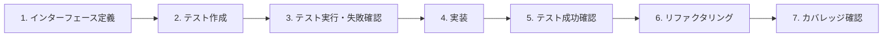

# Avion 共通テスト戦略

**最終更新**: 2025-01-14  
**適用範囲**: 全Goマイクロサービス

## 1. 概要

このドキュメントは、Avionプロジェクトの全Goマイクロサービスに適用される共通のテスト戦略とガイドラインを定義します。Test-Driven Development (TDD) の厳格な実施により、高品質で保守性の高いコードベースを維持します。

## 2. TDD ワークフロー

### 必須のTDD実施手順



### 実装例

```go
// Step 1: インターフェース定義
//go:generate mockgen -source=$GOFILE -destination=../../tests/mocks/mock_$GOFILE -package=mocks
type UserService interface {
    GetUser(ctx context.Context, userID string) (*User, error)
    CreateUser(ctx context.Context, req *CreateUserRequest) (*User, error)
}

// Step 2: テスト作成（実装前に作成）
func TestUserService_GetUser(t *testing.T) {
    // テーブル駆動テストの実装
    tests := []struct {
        name    string
        userID  string
        mock    func(m *mocks.MockUserRepository)
        want    *User
        wantErr bool
    }{
        {
            name:   "正常系: ユーザー取得成功",
            userID: "user123",
            mock: func(m *mocks.MockUserRepository) {
                m.EXPECT().FindByID(gomock.Any(), "user123").
                    Return(&User{ID: "user123", Name: "Alice"}, nil)
            },
            want:    &User{ID: "user123", Name: "Alice"},
            wantErr: false,
        },
        {
            name:   "異常系: ユーザーが存在しない",
            userID: "nonexistent",
            mock: func(m *mocks.MockUserRepository) {
                m.EXPECT().FindByID(gomock.Any(), "nonexistent").
                    Return(nil, ErrUserNotFound)
            },
            want:    nil,
            wantErr: true,
        },
    }
    
    for _, tt := range tests {
        t.Run(tt.name, func(t *testing.T) {
            // Arrange
            ctrl := gomock.NewController(t)
            defer ctrl.Finish()
            
            mockRepo := mocks.NewMockUserRepository(ctrl)
            tt.mock(mockRepo)
            
            svc := NewUserService(mockRepo)
            
            // Act
            got, err := svc.GetUser(context.Background(), tt.userID)
            
            // Assert
            if (err != nil) != tt.wantErr {
                t.Errorf("GetUser() error = %v, wantErr %v", err, tt.wantErr)
                return
            }
            if !reflect.DeepEqual(got, tt.want) {
                t.Errorf("GetUser() = %v, want %v", got, tt.want)
            }
        })
    }
}

// Step 3: テスト実行（失敗確認）
// $ go test ./... -v
// --- FAIL: TestUserService_GetUser (0.00s)
//     user_service_test.go:45: undefined: NewUserService

// Step 4-6: 実装とリファクタリング
type userService struct {
    repo UserRepository
}

func NewUserService(repo UserRepository) UserService {
    return &userService{repo: repo}
}

func (s *userService) GetUser(ctx context.Context, userID string) (*User, error) {
    if userID == "" {
        return nil, ErrInvalidUserID
    }
    
    user, err := s.repo.FindByID(ctx, userID)
    if err != nil {
        if errors.Is(err, sql.ErrNoRows) {
            return nil, ErrUserNotFound
        }
        return nil, fmt.Errorf("failed to get user: %w", err)
    }
    
    return user, nil
}
```

## 3. テストカバレッジ要件

### 必須カバレッジ目標

| テストタイプ | 最小カバレッジ | 推奨カバレッジ | 測定方法 |
|------------|--------------|--------------|---------|
| **ユニットテスト** | 90% | 95%以上 | `go test -cover` |
| **クリティカルパス** | 95% | 100% | クリティカルパス専用測定 |
| **ドメインロジック** | 95% | 100% | ドメイン層のみ測定 |
| **統合テスト** | 80% | 90%以上 | 主要シナリオカバレッジ |

### カバレッジ測定コマンド

```bash
# 全体カバレッジ測定
go test -v -race -coverprofile=coverage.out ./...
go tool cover -html=coverage.out -o coverage.html

# 特定パッケージの詳細カバレッジ
go test -v -covermode=atomic -coverprofile=coverage.out ./domain/...
go tool cover -func=coverage.out | grep "total:"

# クリティカルパスのみ測定
go test -v -tags=critical -coverprofile=critical.out ./...
```

## 4. テーブル駆動テスト（必須）

### 標準テンプレート

```go
func TestFunctionName(t *testing.T) {
    // テストケース定義
    tests := []struct {
        name    string        // テストケース名（必須）
        args    interface{}   // 入力パラメータ
        mock    func(*mocks.MockDependency) // モック設定
        want    interface{}   // 期待値
        wantErr bool         // エラー期待フラグ
        errType error        // 期待するエラー型（オプション）
    }{
        {
            name: "正常系: 基本的な成功ケース",
            args: args{
                param1: "value1",
                param2: 123,
            },
            mock: func(m *mocks.MockDependency) {
                m.EXPECT().Method(gomock.Any(), "value1").Return(expectedResult, nil)
            },
            want:    expectedResult,
            wantErr: false,
        },
        {
            name: "境界値: 空文字列",
            args: args{
                param1: "",
                param2: 0,
            },
            want:    nil,
            wantErr: true,
            errType: ErrInvalidInput,
        },
        {
            name: "異常系: 依存サービスエラー",
            args: args{
                param1: "value1",
                param2: 123,
            },
            mock: func(m *mocks.MockDependency) {
                m.EXPECT().Method(gomock.Any(), "value1").Return(nil, errors.New("service error"))
            },
            want:    nil,
            wantErr: true,
        },
    }
    
    for _, tt := range tests {
        t.Run(tt.name, func(t *testing.T) {
            // Parallel実行（副作用がない場合）
            t.Parallel()
            
            // Arrange
            ctrl := gomock.NewController(t)
            defer ctrl.Finish()
            
            if tt.mock != nil {
                mockDep := mocks.NewMockDependency(ctrl)
                tt.mock(mockDep)
                // mockDepを使用した初期化
            }
            
            // Act
            got, err := FunctionUnderTest(tt.args)
            
            // Assert
            if (err != nil) != tt.wantErr {
                t.Errorf("FunctionName() error = %v, wantErr %v", err, tt.wantErr)
                return
            }
            
            if tt.errType != nil && !errors.Is(err, tt.errType) {
                t.Errorf("FunctionName() error = %v, wantErr %v", err, tt.errType)
                return
            }
            
            if !reflect.DeepEqual(got, tt.want) {
                t.Errorf("FunctionName() = %v, want %v", got, tt.want)
            }
        })
    }
}
```

### テストケース設計ガイドライン

#### 必須テストケース

1. **正常系**
   - 基本的な成功ケース
   - 複数の有効な入力パターン
   - 最大/最小の正常値

2. **境界値**
   - 空文字列、空配列、nil
   - 最大長、最小長
   - ゼロ値、最大値、最小値

3. **異常系**
   - 無効な入力
   - 依存サービスのエラー
   - タイムアウト
   - 同時実行の競合状態

4. **エッジケース**
   - 特殊文字、Unicode
   - 巨大なデータセット
   - 部分的な失敗

## 5. モック生成戦略

### gomock設定

```go
// インターフェースファイルのヘッダーに追加
//go:generate mockgen -source=$GOFILE -destination=../../tests/mocks/$(basename $GOFILE) -package=mocks

// ディレクトリ構造
project/
├── domain/
│   ├── user.go
│   └── interfaces.go
├── tests/
│   └── mocks/
│       ├── mock_user.go
│       └── mock_interfaces.go
└── Makefile
```

### Makefile設定

```makefile
# モック生成
.PHONY: mock
mock:
	@echo "Generating mocks..."
	@go generate ./...
	@echo "Mocks generated successfully"

# モック再生成（クリーン後）
.PHONY: mock-clean
mock-clean:
	@echo "Cleaning mocks..."
	@rm -rf tests/mocks/*
	@echo "Regenerating mocks..."
	@go generate ./...
	@echo "Mocks regenerated successfully"

# テスト実行
.PHONY: test
test: mock
	@echo "Running tests..."
	@go test -v -race -cover ./...

# カバレッジレポート生成
.PHONY: coverage
coverage: mock
	@echo "Generating coverage report..."
	@go test -v -race -coverprofile=coverage.out ./...
	@go tool cover -html=coverage.out -o coverage.html
	@echo "Coverage report generated: coverage.html"
```

## 6. 時刻処理のテスト

### github.com/newmo-oss/ctxtime使用

```go
import (
    "github.com/newmo-oss/ctxtime"
)

// テスト可能な時刻処理
func (s *Service) CreateRecord(ctx context.Context, data *Data) (*Record, error) {
    now := ctxtime.Now(ctx) // コンテキストから時刻取得
    
    record := &Record{
        ID:        generateID(),
        Data:      data,
        CreatedAt: now,
        ExpiresAt: now.Add(24 * time.Hour),
    }
    
    return s.repo.Save(ctx, record)
}

// テスト
func TestService_CreateRecord(t *testing.T) {
    fixedTime := time.Date(2024, 1, 1, 0, 0, 0, 0, time.UTC)
    ctx := ctxtime.WithTime(context.Background(), fixedTime)
    
    tests := []struct {
        name string
        data *Data
        want *Record
    }{
        {
            name: "固定時刻でのレコード作成",
            data: &Data{Name: "test"},
            want: &Record{
                Data:      &Data{Name: "test"},
                CreatedAt: fixedTime,
                ExpiresAt: fixedTime.Add(24 * time.Hour),
            },
        },
    }
    
    // ... テスト実行
}
```

## 7. 統合テスト

### データベーステスト

```go
// testcontainers使用例
func TestRepository_Integration(t *testing.T) {
    if testing.Short() {
        t.Skip("Skipping integration test in short mode")
    }
    
    ctx := context.Background()
    
    // PostgreSQLコンテナ起動
    postgres, err := testcontainers.GenericContainer(ctx, testcontainers.GenericContainerRequest{
        ContainerRequest: testcontainers.ContainerRequest{
            Image:        "postgres:15-alpine",
            ExposedPorts: []string{"5432/tcp"},
            Env: map[string]string{
                "POSTGRES_PASSWORD": "test",
                "POSTGRES_DB":       "testdb",
            },
            WaitingFor: wait.ForListeningPort("5432/tcp"),
        },
        Started: true,
    })
    require.NoError(t, err)
    defer postgres.Terminate(ctx)
    
    // DB接続とマイグレーション
    dsn := getDSN(postgres)
    db, err := sql.Open("postgres", dsn)
    require.NoError(t, err)
    defer db.Close()
    
    // マイグレーション実行
    err = migrateDB(db)
    require.NoError(t, err)
    
    // リポジトリテスト
    repo := NewPostgreSQLRepository(db)
    
    t.Run("Create and Retrieve", func(t *testing.T) {
        // テスト実装
    })
}
```

### gRPCサービステスト

```go
func TestGRPCService_Integration(t *testing.T) {
    // インメモリgRPCサーバー
    lis := bufconn.Listen(1024 * 1024)
    
    server := grpc.NewServer()
    pb.RegisterUserServiceServer(server, NewUserService())
    
    go func() {
        if err := server.Serve(lis); err != nil {
            log.Fatalf("Server exited with error: %v", err)
        }
    }()
    defer server.Stop()
    
    // クライアント作成
    ctx := context.Background()
    conn, err := grpc.DialContext(ctx, "bufnet",
        grpc.WithContextDialer(func(context.Context, string) (net.Conn, error) {
            return lis.Dial()
        }),
        grpc.WithTransportCredentials(insecure.NewCredentials()),
    )
    require.NoError(t, err)
    defer conn.Close()
    
    client := pb.NewUserServiceClient(conn)
    
    // テスト実行
    t.Run("GetUser", func(t *testing.T) {
        resp, err := client.GetUser(ctx, &pb.GetUserRequest{
            UserId: "test123",
        })
        require.NoError(t, err)
        assert.Equal(t, "test123", resp.User.Id)
    })
}
```

## 8. パフォーマンステスト

### ベンチマークテスト

```go
func BenchmarkService_ProcessData(b *testing.B) {
    // セットアップ
    svc := NewService()
    data := generateTestData(1000)
    
    b.ResetTimer()
    
    for i := 0; i < b.N; i++ {
        _ = svc.ProcessData(data)
    }
}

func BenchmarkService_ProcessData_Parallel(b *testing.B) {
    svc := NewService()
    data := generateTestData(1000)
    
    b.RunParallel(func(pb *testing.PB) {
        for pb.Next() {
            _ = svc.ProcessData(data)
        }
    })
}

// サブベンチマーク
func BenchmarkService_Sizes(b *testing.B) {
    sizes := []int{10, 100, 1000, 10000}
    
    for _, size := range sizes {
        b.Run(fmt.Sprintf("size-%d", size), func(b *testing.B) {
            svc := NewService()
            data := generateTestData(size)
            
            b.ResetTimer()
            
            for i := 0; i < b.N; i++ {
                _ = svc.ProcessData(data)
            }
        })
    }
}
```

### 負荷テスト

```go
func TestService_LoadTest(t *testing.T) {
    if testing.Short() {
        t.Skip("Skipping load test in short mode")
    }
    
    svc := NewService()
    
    // 並行リクエスト数
    concurrency := 100
    // 各ゴルーチンのリクエスト数
    requestsPerRoutine := 1000
    
    var wg sync.WaitGroup
    errors := make(chan error, concurrency*requestsPerRoutine)
    
    start := time.Now()
    
    for i := 0; i < concurrency; i++ {
        wg.Add(1)
        go func() {
            defer wg.Done()
            
            for j := 0; j < requestsPerRoutine; j++ {
                if err := svc.Process(context.Background()); err != nil {
                    errors <- err
                }
            }
        }()
    }
    
    wg.Wait()
    close(errors)
    
    duration := time.Since(start)
    
    // エラー集計
    errorCount := len(errors)
    successRate := float64(concurrency*requestsPerRoutine-errorCount) / float64(concurrency*requestsPerRoutine) * 100
    
    t.Logf("Load test completed:")
    t.Logf("  Duration: %v", duration)
    t.Logf("  Total requests: %d", concurrency*requestsPerRoutine)
    t.Logf("  Success rate: %.2f%%", successRate)
    t.Logf("  RPS: %.2f", float64(concurrency*requestsPerRoutine)/duration.Seconds())
    
    // アサーション
    assert.Greater(t, successRate, 99.0, "Success rate should be > 99%")
    assert.Less(t, duration.Seconds(), 10.0, "Should complete within 10 seconds")
}
```

## 9. テストヘルパー

### 共通テストユーティリティ

```go
package testutil

import (
    "testing"
    "github.com/stretchr/testify/require"
)

// テストフィクスチャ生成
func NewTestUser(t *testing.T, opts ...UserOption) *User {
    t.Helper()
    
    user := &User{
        ID:    "test-" + uuid.New().String(),
        Name:  "Test User",
        Email: "test@example.com",
    }
    
    for _, opt := range opts {
        opt(user)
    }
    
    return user
}

// オプション関数
type UserOption func(*User)

func WithUserName(name string) UserOption {
    return func(u *User) {
        u.Name = name
    }
}

func WithUserEmail(email string) UserOption {
    return func(u *User) {
        u.Email = email
    }
}

// アサーションヘルパー
func AssertUsersEqual(t *testing.T, expected, actual *User) {
    t.Helper()
    
    require.Equal(t, expected.ID, actual.ID, "User ID mismatch")
    require.Equal(t, expected.Name, actual.Name, "User Name mismatch")
    require.Equal(t, expected.Email, actual.Email, "User Email mismatch")
}

// クリーンアップヘルパー
func CleanupDatabase(t *testing.T, db *sql.DB) {
    t.Helper()
    
    t.Cleanup(func() {
        _, err := db.Exec("TRUNCATE TABLE users CASCADE")
        require.NoError(t, err)
    })
}
```

## 10. CI/CD統合

### GitHub Actions設定例

```yaml
name: Test

on:
  push:
    branches: [ main ]
  pull_request:
    branches: [ main ]

jobs:
  test:
    runs-on: ubuntu-latest
    
    services:
      postgres:
        image: postgres:15
        env:
          POSTGRES_PASSWORD: test
        options: >-
          --health-cmd pg_isready
          --health-interval 10s
          --health-timeout 5s
          --health-retries 5
    
    steps:
    - uses: actions/checkout@v3
    
    - name: Set up Go
      uses: actions/setup-go@v4
      with:
        go-version: '1.25'
    
    - name: Install dependencies
      run: |
        go mod download
        go install github.com/golang/mock/mockgen@latest
    
    - name: Generate mocks
      run: make mock
    
    - name: Run tests
      run: |
        go test -v -race -coverprofile=coverage.out ./...
        go tool cover -func=coverage.out
    
    - name: Check coverage
      run: |
        COVERAGE=$(go tool cover -func=coverage.out | grep total | awk '{print $3}' | sed 's/%//')
        echo "Coverage: $COVERAGE%"
        if (( $(echo "$COVERAGE < 80" | bc -l) )); then
          echo "Coverage is below 80%"
          exit 1
        fi
    
    - name: Upload coverage
      uses: codecov/codecov-action@v3
      with:
        file: ./coverage.out
```

## 11. テスト実行ガイド

### 基本コマンド

```bash
# 全テスト実行
go test ./...

# 詳細出力付き
go test -v ./...

# レースコンディション検出付き
go test -race ./...

# 特定パッケージのみ
go test ./domain/...

# 特定のテストケースのみ
go test -run TestUserService_GetUser ./...

# 短縮モード（統合テストスキップ）
go test -short ./...

# ベンチマーク実行
go test -bench=. ./...

# ベンチマーク（メモリ割り当て表示）
go test -bench=. -benchmem ./...

# テストキャッシュクリア
go clean -testcache
```

### 並列テスト設定

```bash
# 並列度指定
go test -parallel=4 ./...

# CPU数に応じた自動設定
go test -parallel=$(nproc) ./...
```

## 12. トラブルシューティング

### よくある問題と解決策

#### モック生成エラー

```bash
# mockgenが見つからない
go install github.com/golang/mock/mockgen@latest

# パスの問題
export PATH=$PATH:$(go env GOPATH)/bin
```

#### テストのタイムアウト

```go
// タイムアウト設定
func TestSlowOperation(t *testing.T) {
    ctx, cancel := context.WithTimeout(context.Background(), 5*time.Second)
    defer cancel()
    
    result := make(chan error, 1)
    
    go func() {
        result <- slowOperation(ctx)
    }()
    
    select {
    case err := <-result:
        require.NoError(t, err)
    case <-ctx.Done():
        t.Fatal("Test timed out")
    }
}
```

#### データ競合の検出

```go
// -race フラグで検出可能な競合状態の例
type Counter struct {
    mu    sync.Mutex
    value int
}

func (c *Counter) Increment() {
    c.mu.Lock()
    defer c.mu.Unlock()
    c.value++
}

func (c *Counter) Value() int {
    c.mu.Lock()
    defer c.mu.Unlock()
    return c.value
}
```

## 13. ベストプラクティス

### Do's ✅

1. **テストファースト開発**: 実装前にテストを書く
2. **意味のあるテスト名**: 何をテストしているか明確に
3. **独立したテスト**: 他のテストに依存しない
4. **クリーンアップ**: t.Cleanup()を活用
5. **並列実行**: 可能な限りt.Parallel()を使用
6. **ヘルパー使用**: t.Helper()でスタックトレースを改善
7. **早期失敗**: require使用で早期終了
8. **モック最小化**: 必要最小限のモック使用

### Don'ts ❌

1. **グローバル状態の変更**: テスト間で共有される状態を変更しない
2. **実環境への依存**: 外部APIやDBへの直接アクセス
3. **不確定な結果**: ランダム値や現在時刻の直接使用
4. **過度なモック**: ビジネスロジックのモック化
5. **テストのテスト**: テストコード自体のテスト
6. **コメントアウト**: 不要なテストは削除
7. **スリープ使用**: time.Sleep()の代わりに適切な同期機構を使用

## 14. 参考リンク

- [Go Testing Documentation](https://golang.org/pkg/testing/)
- [gomock Documentation](https://github.com/golang/mock)
- [testify Assertions](https://github.com/stretchr/testify)
- [testcontainers-go](https://github.com/testcontainers/testcontainers-go)
- [ctxtime Documentation](https://github.com/newmo-oss/ctxtime)

---

**注意**: このドキュメントは定期的に更新されます。最新のベストプラクティスとツールの進化に合わせて、継続的な改善を行います。