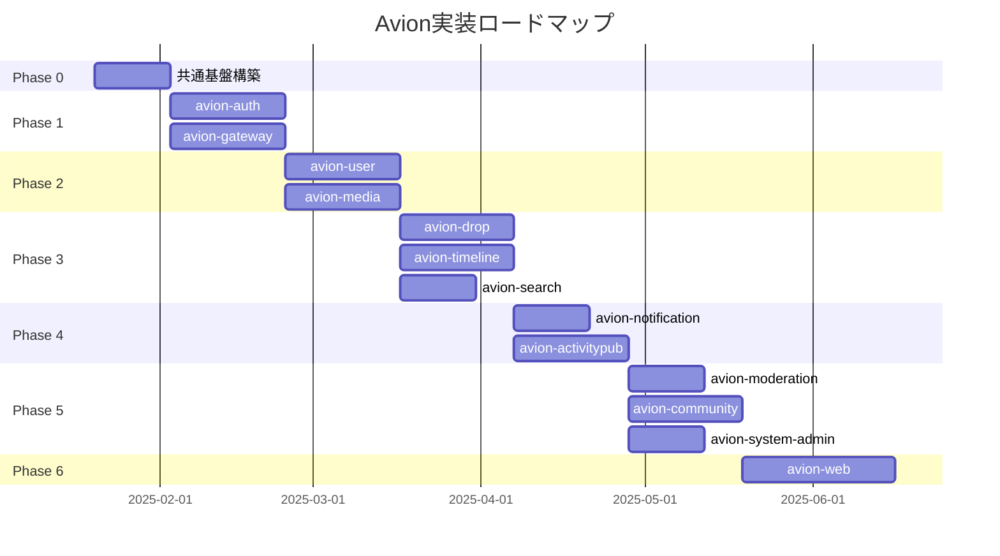

# Avionプラットフォーム実装ロードマップ

作成日: 2025-01-19  
バージョン: 1.0.0

## 概要

本ドキュメントは、Avionプラットフォームの実装を効率的に進めるための詳細な実装計画を定義します。サービス間の依存関係、技術的制約、チームリソースを考慮し、並行開発可能な作業を最大化しながら、リスクを最小化する実装順序を提案します。

## 実装フェーズ概要



---

## Phase 0: 共通基盤構築（2週間）

### 目的
全サービスで使用する共通コンポーネントとインフラストラクチャを構築

### 並行作業可能なタスク

#### インフラチーム（3-4名）
```yaml
tasks:
  - Kubernetes クラスター構築
  - PostgreSQL クラスター構築
  - Redis クラスター構築
  - MeiliSearch セットアップ
  - S3互換オブジェクトストレージ構築
  - CI/CD パイプライン構築
  - 監視・ログ基盤（Prometheus, Grafana, Loki）
```

#### 共通ライブラリチーム（2-3名）
```yaml
tasks:
  - 共通エラーハンドリングパッケージ
  - 構造化ログパッケージ
  - OpenTelemetry統合パッケージ
  - 環境変数管理パッケージ
  - DDD基底クラス（Aggregate, Entity, ValueObject）
  - CQRS基底インターフェース
  - gRPCヘルパーユーティリティ
```

#### DevOpsチーム（2名）
```yaml
tasks:
  - Dockerfile テンプレート作成
  - Helm チャート テンプレート作成
  - Makefile 標準化
  - データベースマイグレーションツール設定
  - 開発環境構築スクリプト
```

### 成果物
- 動作するKubernetesクラスター
- 共通ライブラリ v1.0.0
- CI/CDパイプライン
- 開発環境構築ドキュメント

---

## Phase 1: 認証・ゲートウェイ基盤（3週間）

### 実装サービス

#### avion-auth（チームA: 3名）
**依存関係**: なし（最も基礎的なサービス）

```yaml
week1:
  - ドメインモデル実装
  - PostgreSQL スキーマ設計・マイグレーション
  - Repository層実装
  
week2:
  - UseCase層実装（CQRS）
  - JWT生成・検証ロジック
  - パスワード認証実装
  
week3:
  - gRPCハンドラー実装
  - 統合テスト
  - デプロイメント
```

#### avion-gateway（チームB: 3名）
**依存関係**: avion-auth（JWT検証のみ）

```yaml
week1:
  - ルーティングエンジン実装
  - レート制限実装
  - サーキットブレーカー実装
  
week2:
  - GraphQL スキーマ定義（基本）
  - 認証ミドルウェア統合
  - ロードバランシング実装
  
week3:
  - gRPCプロキシ実装
  - 統合テスト
  - デプロイメント
```

### マイルストーン
- ユーザー認証機能の完成
- APIゲートウェイの基本機能完成

---

## Phase 2: ユーザー・メディア基盤（3週間）

### 実装サービス

#### avion-user（チームA: 3名）
**依存関係**: avion-auth（認証済みリクエスト）

```yaml
week1:
  - User Aggregate実装
  - Follow/Block/Mute ドメインモデル
  - PostgreSQL スキーマ設計
  
week2:
  - プロフィール管理UseCase
  - ソーシャルグラフUseCase
  - Repository実装
  
week3:
  - gRPCサービス実装
  - イベント発行実装
  - 統合テスト・デプロイ
```

#### avion-media（チームC: 2名）
**依存関係**: avion-auth（認証）

```yaml
week1:
  - Media Aggregate実装
  - S3統合実装
  - アップロードハンドラー
  
week2:
  - 画像処理パイプライン
  - CDN統合
  - メタデータ管理
  
week3:
  - gRPCサービス実装
  - 統合テスト・デプロイ
```

### マイルストーン
- ユーザー管理機能の完成
- メディアアップロード機能の完成

---

## Phase 3: コンテンツ・配信基盤（3-4週間）

### 実装サービス（並行開発可能）

#### avion-drop（チームA: 3名）
**依存関係**: avion-user, avion-media

```yaml
week1:
  - Drop Aggregate実装
  - Reaction/Poll実装
  - PostgreSQL スキーマ設計
  
week2:
  - 投稿作成・編集UseCase
  - リアクションUseCase
  - メディア添付統合
  
week3:
  - gRPCサービス実装
  - イベント発行実装
  - 統合テスト・デプロイ
```

#### avion-timeline（チームB: 3名）
**依存関係**: avion-user, avion-drop

```yaml
week1:
  - Timeline Aggregate実装
  - ハイブリッドFan-out戦略実装
  - Redis統合
  
week2:
  - ホーム/ローカル/グローバルタイムライン
  - SSE実装
  - キャッシュ戦略
  
week3:
  - gRPCサービス実装
  - パフォーマンステスト
  - デプロイ
```

#### avion-search（チームC: 2名）
**依存関係**: avion-user, avion-drop

```yaml
week1:
  - MeiliSearch統合
  - インデックス設計
  - 検索クエリ実装
  
week2:
  - イベント購読・インデックス更新
  - PostgreSQLフォールバック
  - 統合テスト・デプロイ
```

### マイルストーン
- 投稿機能の完成
- タイムライン機能の完成
- 検索機能の完成

---

## Phase 4: 通知・フェデレーション（3週間）

### 実装サービス

#### avion-notification（チームC: 2名）
**依存関係**: avion-user, avion-drop

```yaml
week1:
  - Notification Aggregate実装
  - WebPush/SSE実装
  
week2:
  - 通知配信ロジック
  - プリファレンス管理
  - 統合テスト・デプロイ
```

#### avion-activitypub（チームD: 3名）
**依存関係**: avion-user, avion-drop

```yaml
week1:
  - ActivityPub プロトコル実装
  - アンチコラプションレイヤー
  
week2:
  - WebFinger実装
  - HTTP Signatures実装
  
week3:
  - フェデレーション配信
  - 互換性テスト（Mastodon, Misskey）
  - デプロイ
```

### マイルストーン
- プッシュ通知機能の完成
- フェデレーション機能の基本実装

---

## Phase 5: 運用・コミュニティ機能（3週間）

### 実装サービス（並行開発可能）

#### avion-moderation（チームA: 2名）
```yaml
week1:
  - Report/ModerationCase実装
  - フィルター実装
  
week2:
  - AI統合（オプショナル）
  - コミュニティモデレーション
  - デプロイ
```

#### avion-community（チームB: 3名）
```yaml
week1:
  - Community Aggregate実装
  - メンバーシップ管理
  
week2:
  - イベント管理
  - 招待システム
  
week3:
  - 統合テスト・デプロイ
```

#### avion-system-admin（チームC: 2名）
```yaml
week1:
  - 管理操作実装
  - 監査ログ実装
  
week2:
  - メトリクス収集
  - バックアップ管理
  - デプロイ
```

### マイルストーン
- モデレーション機能の完成
- コミュニティ機能の完成
- 管理機能の完成

---

## Phase 6: フロントエンド（4週間）

### avion-web（チームE: 4-5名）

```yaml
week1:
  - プロジェクト構築
  - 認証フロー実装
  - 基本レイアウト
  
week2:
  - タイムライン実装
  - 投稿機能実装
  - プロフィール実装
  
week3:
  - 検索・通知実装
  - コミュニティ機能
  - PWA対応
  
week4:
  - パフォーマンス最適化
  - E2Eテスト
  - デプロイ
```

### マイルストーン
- Webクライアントの完成
- MVP機能の完全動作

---

## チーム編成提案

### 推奨チーム構成（15-20名）

```yaml
teams:
  infrastructure:
    size: 3-4名
    skills: [Kubernetes, PostgreSQL, Redis, DevOps]
    
  team_a:
    size: 3名
    focus: [avion-auth, avion-user, avion-drop, avion-moderation]
    skills: [Go, DDD, PostgreSQL]
    
  team_b:
    size: 3名
    focus: [avion-gateway, avion-timeline, avion-community]
    skills: [Go, GraphQL, Redis, SSE]
    
  team_c:
    size: 2-3名
    focus: [avion-media, avion-search, avion-notification, avion-system-admin]
    skills: [Go, S3, MeiliSearch, WebPush]
    
  team_d:
    size: 3名
    focus: [avion-activitypub]
    skills: [Go, ActivityPub, HTTP Signatures]
    
  team_e:
    size: 4-5名
    focus: [avion-web]
    skills: [React, TypeScript, GraphQL, PWA]
```

---

## リスク管理

### 技術的リスク

| リスク | 影響度 | 対策 |
|--------|--------|------|
| avion-timeline パフォーマンス | 高 | Phase 3で早期に性能テスト実施 |
| ActivityPub互換性 | 中 | Mastodon/Misskeyとの早期統合テスト |
| スケーラビリティ | 高 | 各フェーズで負荷テスト実施 |

### スケジュールリスク

| リスク | 影響度 | 対策 |
|--------|--------|------|
| 依存サービス遅延 | 高 | モックサービスによる並行開発 |
| 要員不足 | 中 | クリティカルパスのサービスに優先配置 |
| 仕様変更 | 中 | Phase間でのバッファ期間確保 |

---

## 成功指標

### Phase別KPI

```yaml
phase_0:
  - インフラ構築完了率: 100%
  - 共通ライブラリテストカバレッジ: 90%以上
  
phase_1:
  - 認証成功率: 99.9%以上
  - ゲートウェイレイテンシ: p99 < 20ms
  
phase_2:
  - ユーザー作成成功率: 99%以上
  - メディアアップロード成功率: 98%以上
  
phase_3:
  - 投稿作成レイテンシ: p50 < 200ms
  - タイムライン取得: p50 < 150ms
  
phase_4:
  - 通知配信成功率: 95%以上
  - フェデレーション成功率: 90%以上
  
phase_5:
  - 管理操作監査率: 100%
  - モデレーション処理時間: p50 < 1秒
  
phase_6:
  - Core Web Vitals達成
  - E2Eテストカバレッジ: 80%以上
```

---

## 次のアクション

1. **チーム編成の確定**（1週間以内）
2. **Phase 0の詳細タスク分解**（3日以内）
3. **開発環境の準備**（1週間以内）
4. **技術選定の最終確認**（3日以内）
5. **プロジェクトキックオフ**（2025-01-20）

---

## 更新履歴

- 2025-01-19: 初版作成