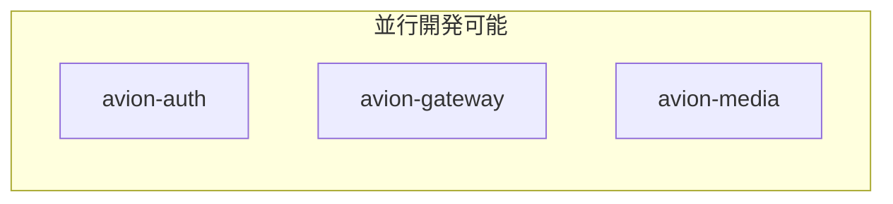
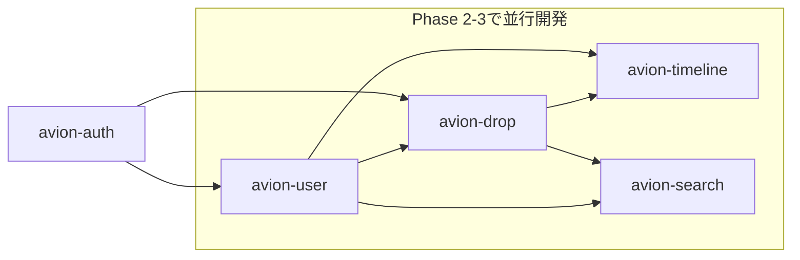
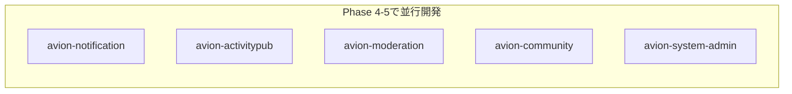
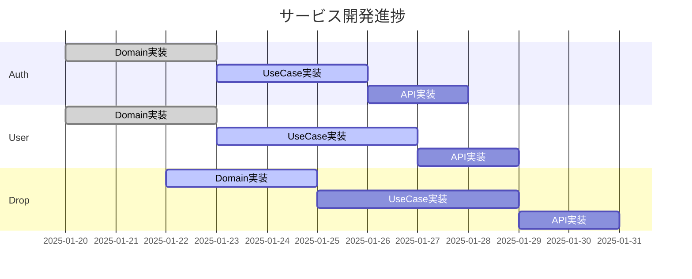

# 並行開発戦略ガイド

## 概要

Avionプラットフォームの開発を効率化するため、サービス間の依存関係を最小化し、並行開発を最大化する戦略を定義します。

---

## 並行開発可能なサービスグループ

### Group A: 基盤サービス（依存なし）


**特徴**
- 他サービスへの依存がない/最小限
- 独立してテスト可能
- 最初に開発開始すべきサービス

### Group B: コアビジネスサービス


**並行開発のポイント**
- モックサービスを使った開発
- インターフェース先行定義
- 統合テストは後続フェーズ

### Group C: 拡張サービス


**特徴**
- コア機能完成後に開発
- 相互依存が少ない
- 独立したチームで並行開発可能

---

## モックサービス戦略

### 1. インターフェース先行定義

```protobuf
// proto/avion-user/v1/user.proto
syntax = "proto3";

package avion.user.v1;

service UserService {
  rpc GetUser(GetUserRequest) returns (GetUserResponse);
  rpc CreateUser(CreateUserRequest) returns (CreateUserResponse);
  rpc UpdateProfile(UpdateProfileRequest) returns (UpdateProfileResponse);
}

message User {
  string id = 1;
  string username = 2;
  string display_name = 3;
  string avatar_url = 4;
  google.protobuf.Timestamp created_at = 5;
}
```

### 2. モックサービス実装

```go
// mocks/avion-user/server.go
package main

import (
    "context"
    pb "github.com/na2na-p/avion/proto/avion-user/v1"
)

type mockUserService struct {
    pb.UnimplementedUserServiceServer
}

func (s *mockUserService) GetUser(ctx context.Context, req *pb.GetUserRequest) (*pb.GetUserResponse, error) {
    // 固定のモックデータを返す
    return &pb.GetUserResponse{
        User: &pb.User{
            Id:          "mock-user-123",
            Username:    "mockuser",
            DisplayName: "Mock User",
            AvatarUrl:   "https://example.com/avatar.png",
        },
    }, nil
}
```

### 3. Docker Composeでのモック環境

```yaml
# docker-compose.mock.yml
version: '3.8'

services:
  mock-avion-user:
    build: ./mocks/avion-user
    ports:
      - "9092:9092"  # 本番と同じポート
    environment:
      - MODE=mock
      - PORT=9092

  mock-avion-auth:
    build: ./mocks/avion-auth
    ports:
      - "9091:9091"
    environment:
      - MODE=mock
      - PORT=9091
      - MOCK_JWT_SECRET=mock-secret

  # 開発中のサービス
  avion-drop:
    build: ./services/avion-drop
    ports:
      - "9093:9093"
    environment:
      - USER_SERVICE_URL=mock-avion-user:9092
      - AUTH_SERVICE_URL=mock-avion-auth:9091
    depends_on:
      - mock-avion-user
      - mock-avion-auth
```

---

## 契約テスト（Contract Testing）

### Pactを使った契約テスト

```go
// services/avion-drop/tests/contract_test.go
package tests

import (
    "testing"
    "github.com/pact-foundation/pact-go/v2/consumer"
)

func TestUserServiceContract(t *testing.T) {
    pact := consumer.NewV2Pact(consumer.MockHTTPProviderConfig{
        Consumer: "avion-drop",
        Provider: "avion-user",
    })

    t.Run("get user by ID", func(t *testing.T) {
        pact.
            AddInteraction().
            Given("User with ID user-123 exists").
            UponReceiving("A request to get user").
            WithRequest("GET", "/users/user-123").
            WillRespondWith(200).
            WithJSONBody(map[string]interface{}{
                "id":       "user-123",
                "username": "testuser",
            })

        // テスト実行
        err := pact.ExecuteTest(t, func(config consumer.MockServerConfig) error {
            // クライアントコードのテスト
            client := NewUserServiceClient(config.Host)
            user, err := client.GetUser("user-123")
            assert.NoError(t, err)
            assert.Equal(t, "testuser", user.Username)
            return nil
        })
        assert.NoError(t, err)
    })
}
```

---

## Feature Flag戦略

### 機能フラグによる段階的統合

```go
// pkg/feature/flags.go
package feature

type Flags struct {
    UseRealUserService         bool `env:"FEATURE_REAL_USER_SERVICE" envDefault:"false"`
    UseRealAuthService         bool `env:"FEATURE_REAL_AUTH_SERVICE" envDefault:"false"`
    EnableActivityPub          bool `env:"FEATURE_ACTIVITYPUB" envDefault:"false"`
    EnableCommunityFeatures    bool `env:"FEATURE_COMMUNITY" envDefault:"false"`
    EnableAIModeration         bool `env:"FEATURE_AI_MODERATION" envDefault:"false"`
}

// 使用例
func (uc *CreateDropUseCase) Execute(ctx context.Context, cmd CreateDropCommand) error {
    var userService UserService
    
    if feature.Flags.UseRealUserService {
        userService = grpc.NewUserServiceClient(config.UserServiceURL)
    } else {
        userService = mock.NewMockUserService()
    }
    
    user, err := userService.GetUser(ctx, cmd.UserID)
    // ...
}
```

---

## 並行開発のベストプラクティス

### 1. API First Development

```yaml
# api-specs/avion-user.yaml
openapi: 3.0.0
info:
  title: Avion User Service API
  version: 1.0.0
paths:
  /users/{userId}:
    get:
      summary: Get user by ID
      parameters:
        - name: userId
          in: path
          required: true
          schema:
            type: string
      responses:
        '200':
          description: User found
          content:
            application/json:
              schema:
                $ref: '#/components/schemas/User'
```

### 2. 共有型定義

```go
// shared/domain/user.go
package domain

type UserID string

type User struct {
    ID          UserID    `json:"id"`
    Username    string    `json:"username"`
    DisplayName string    `json:"display_name"`
    AvatarURL   string    `json:"avatar_url"`
    CreatedAt   time.Time `json:"created_at"`
}

// shared/events/user_events.go
package events

type UserCreatedEvent struct {
    UserID      string    `json:"user_id"`
    Username    string    `json:"username"`
    OccurredAt  time.Time `json:"occurred_at"`
}
```

### 3. 統合テストの自動化

```yaml
# .github/workflows/integration-test.yml
name: Integration Tests

on:
  pull_request:
    paths:
      - 'services/**'
      - 'proto/**'

jobs:
  integration-test:
    runs-on: ubuntu-latest
    steps:
      - uses: actions/checkout@v3
      
      - name: Start services
        run: |
          docker-compose -f docker-compose.test.yml up -d
          ./scripts/wait-for-services.sh
      
      - name: Run integration tests
        run: |
          go test -tags=integration ./tests/integration/...
      
      - name: Contract tests
        run: |
          go test -tags=contract ./tests/contract/...
```

---

## チーム間コミュニケーション

### 1. API変更通知プロセス

```markdown
## API Breaking Change Template

**Service**: avion-user
**Version**: v1 → v2
**Breaking Change**: Field `username` renamed to `user_name`
**Migration Guide**:
1. Update proto files
2. Regenerate client code
3. Update field mappings
**Timeline**: 
- Announcement: 2025-02-01
- Deprecation: 2025-02-15
- Removal: 2025-03-01
**Affected Services**: avion-drop, avion-timeline, avion-search
```

### 2. 依存関係マトリックス

| サービス | 依存先 | 依存元 | 並行開発可能グループ |
|---------|--------|--------|---------------------|
| avion-auth | なし | 全サービス | A |
| avion-gateway | avion-auth | なし | A |
| avion-media | avion-auth | avion-drop, avion-user | A |
| avion-user | avion-auth | avion-drop, avion-timeline等 | B |
| avion-drop | avion-auth, avion-user, avion-media | avion-timeline, avion-search | B |
| avion-timeline | avion-user, avion-drop | avion-web | B |
| avion-search | avion-user, avion-drop | avion-web | B |
| avion-notification | avion-user, avion-drop | なし | C |
| avion-activitypub | avion-user, avion-drop | なし | C |
| avion-moderation | avion-user, avion-drop | なし | C |
| avion-community | avion-user | avion-web | C |
| avion-system-admin | 全サービス（読み取り） | なし | C |

### 3. デイリースタンドアップテンプレート

```markdown
## Team A (Auth/Gateway/Media)
**Yesterday**: 
- Auth JWT実装完了
- Gateway ルーティング実装中
**Today**:
- Auth リフレッシュトークン実装
- Gateway レート制限実装
**Blockers**: なし
**API Changes**: なし

## Team B (User/Drop/Timeline)
**Yesterday**:
- User Aggregate設計完了
- Drop モックAPI作成
**Today**:
- User Repository実装
- Drop Domain実装
**Blockers**: 
- User API仕様の確認待ち
**API Changes**: 
- User.profile フィールド追加予定
```

---

## 並行開発のメトリクス

### 測定すべき指標

```yaml
metrics:
  development_velocity:
    - ストーリーポイント/スプリント/チーム
    - API定義から実装完了までの時間
    - モック→実サービス切り替え時間
    
  integration_quality:
    - 契約テスト成功率
    - 統合時の不具合数
    - API変更による手戻り回数
    
  team_efficiency:
    - ブロッカー解消時間
    - チーム間依存による待機時間
    - 並行作業率（同時進行タスク数/全タスク数）
```

### ダッシュボード例



---

## リスク管理

### 並行開発のリスクと対策

| リスク | 発生確率 | 影響度 | 対策 |
|--------|---------|--------|------|
| API仕様の不整合 | 中 | 高 | OpenAPI仕様の自動検証、契約テスト |
| モックと実装の乖離 | 高 | 中 | Pactによる契約テスト、早期統合テスト |
| チーム間の認識齟齬 | 中 | 中 | デイリースタンドアップ、API変更通知プロセス |
| 依存サービスの遅延 | 低 | 高 | モックサービス活用、Feature Flag |
| 統合時の性能問題 | 低 | 高 | 早期性能テスト、段階的統合 |

---

## まとめ

### 並行開発成功の鍵

1. **明確なインターフェース定義**: Proto/OpenAPI仕様の事前定義
2. **モックサービスの活用**: 依存関係の疎結合化
3. **契約テストの実施**: インターフェースの一貫性保証
4. **Feature Flagの活用**: 段階的な統合とロールバック
5. **継続的なコミュニケーション**: チーム間の情報共有

これらの戦略により、15-20名のチームで効率的な並行開発を実現し、6ヶ月でMVPリリースを達成します。