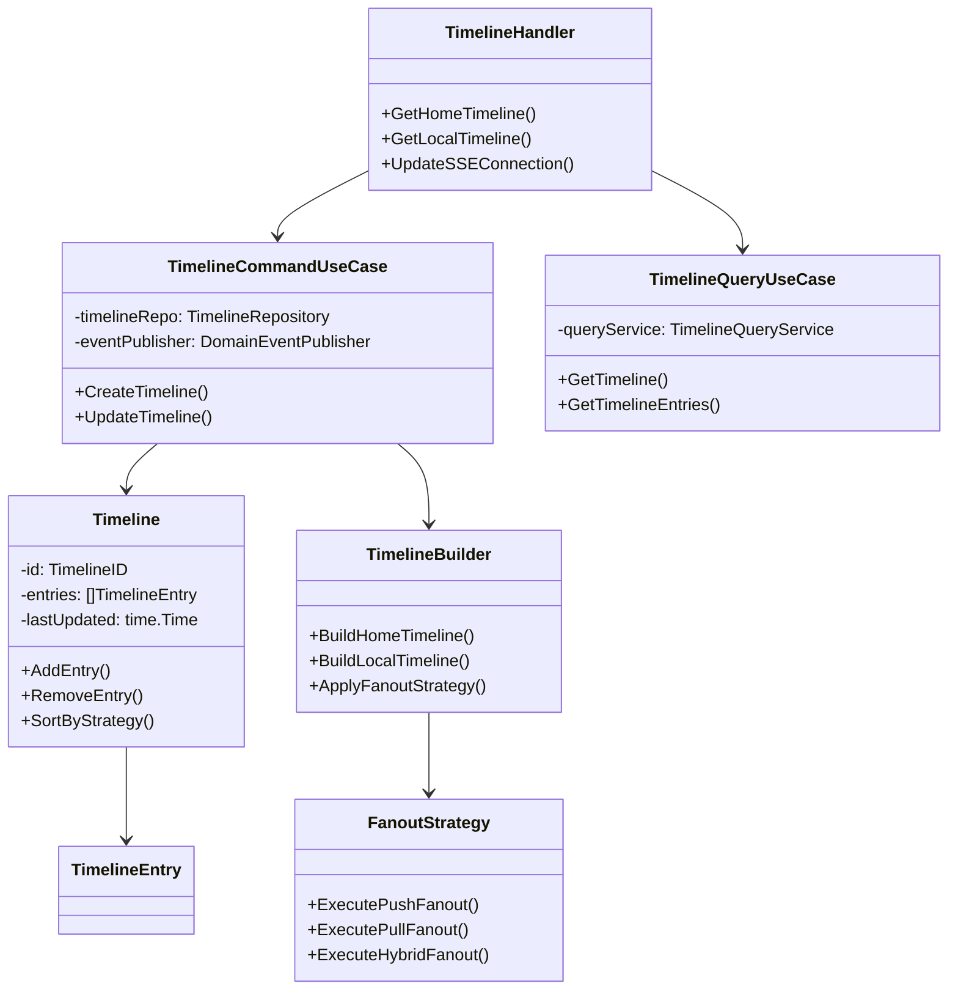
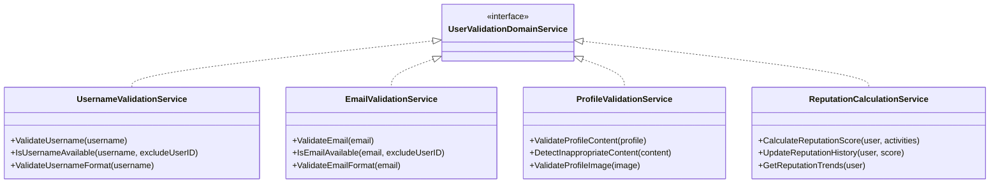
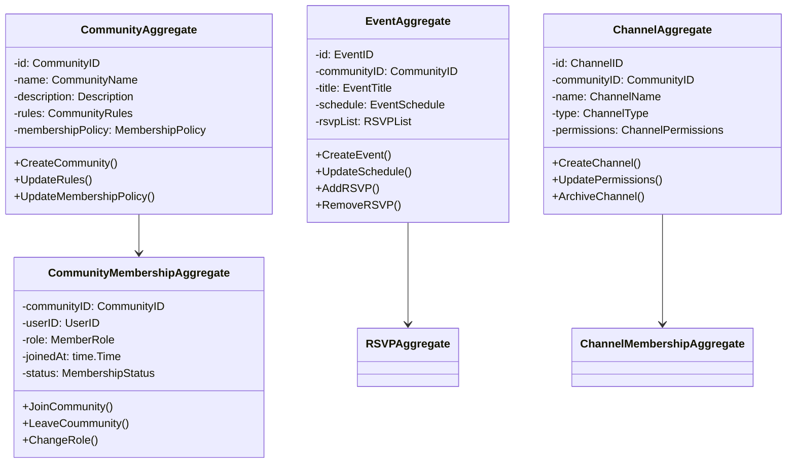
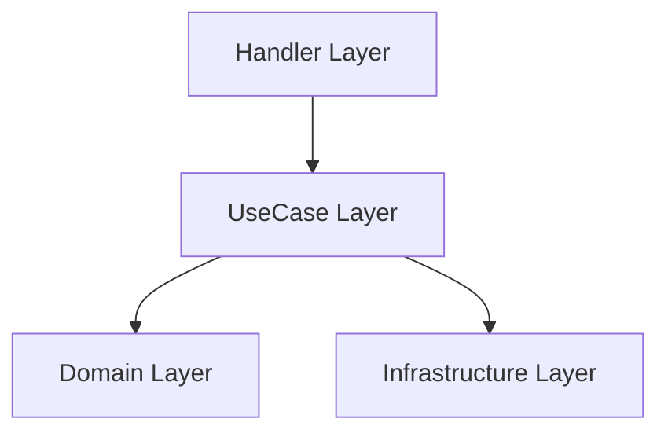
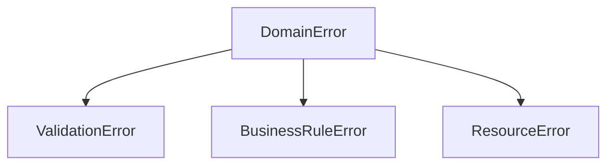
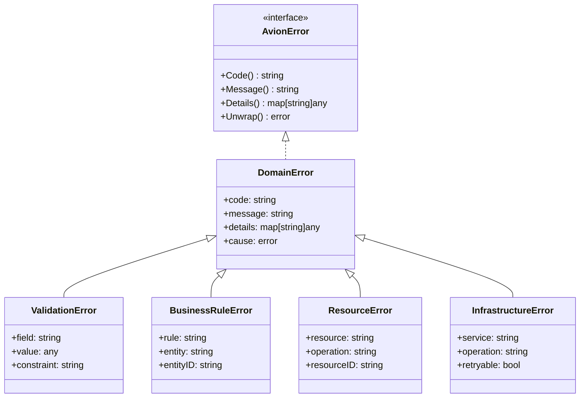
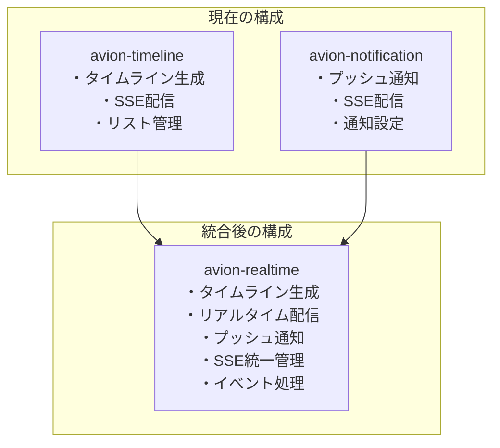
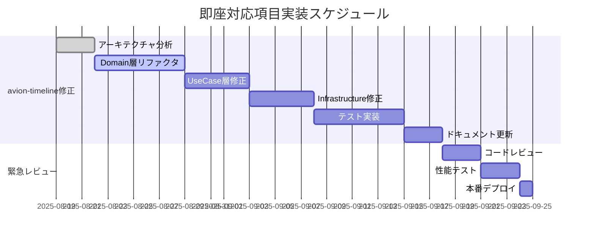
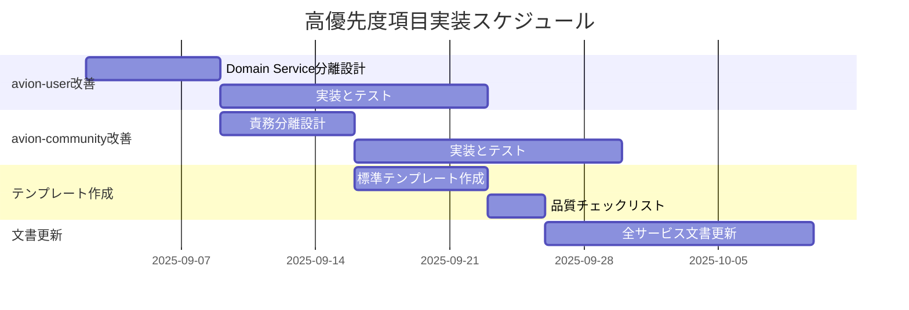
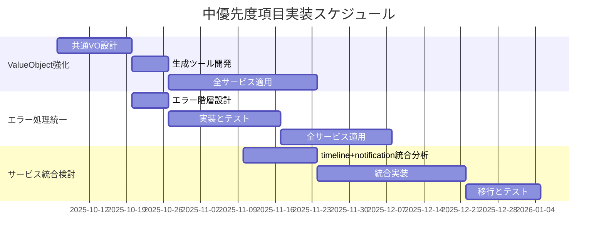

# Avion マイクロサービス設計 包括的改善提案書

## 文書概要

本提案書は、2025年8月実施のAvionマイクロサービス設計レビュー結果に基づき、収集した全ての評価結果を統合し、具体的な改善提案と修正案を提示するものです。13サービス（12マイクロサービス + フロントエンド）のPRD/DesignDoc評価結果を基に、優先度別の改善計画を策定しました。

### 評価結果サマリー
- **総合評価**: A- (優秀)
- **主要課題**: avion-timeline のアーキテクチャ問題（スコア5.2/10）
- **改善対象**: 即座対応1項目、高優先度3項目、中優先度3項目
- **文書品質格差**: 最高評価avion-authと最低評価avion-communityの詳細度統一が必要

---

## 1. 即座対応が必要な改善（Critical Issues）

### 1.1 avion-timeline アーキテクチャ修正案

#### 🚨 **問題の概要**
- **現状スコア**: 5.2/10（全サービス中最低）
- **主要問題**: DDD原則違反、不適切なカプセル化、責務の混在
- **影響範囲**: コア機能（タイムライン生成）の開発効率とメンテナンス性の深刻な低下

#### 🔧 **全体構造改善案**



#### 📝 **具体的修正コード例**

**修正前（問題のあるコード）:**
```go
// ❌ 問題: パブリックフィールド、ビジネスロジックの欠如
type Timeline struct {
    ID      TimelineID      // パブリック - カプセル化違反
    Entries []TimelineEntry // パブリック - カプセル化違反
    UserID  UserID          // パブリック - カプセル化違反
}

// ❌ 問題: リポジトリにビジネスロジックが混在
func (r *TimelineRepository) BuildFromSource(ctx context.Context, params BuildParams) (*Timeline, error) {
    // ビジネスロジックがInfrastructure層に漏出
    entries := make([]TimelineEntry, 0)
    
    // 複雑なタイムライン構築ロジック（本来はDomain層）
    for _, source := range params.Sources {
        sourceEntries := r.getEntriesFromSource(source)
        entries = append(entries, sourceEntries...)
    }
    
    // ソートロジック（本来はDomain層）
    sort.Slice(entries, func(i, j int) bool {
        return entries[i].CreatedAt.After(entries[j].CreatedAt)
    })
    
    return &Timeline{
        ID:      params.TimelineID,
        Entries: entries,
        UserID:  params.UserID,
    }, nil
}
```

**修正後（DDD準拠コード）:**
```go
// ✅ 修正: 適切なカプセル化とビジネスロジック
type Timeline struct {
    id           TimelineID        // プライベート
    entries      []TimelineEntry   // プライベート
    userID       UserID           // プライベート
    lastUpdated  time.Time        // プライベート
    strategy     FanoutStrategy   // プライベート
}

// ✅ ファクトリメソッド
func NewTimeline(id TimelineID, userID UserID, strategy FanoutStrategy) *Timeline {
    return &Timeline{
        id:          id,
        entries:     make([]TimelineEntry, 0),
        userID:      userID,
        lastUpdated: time.Now(),
        strategy:    strategy,
    }
}

// ✅ ビジネスロジックをDomain層に配置
func (t *Timeline) AddEntry(entry TimelineEntry) error {
    // 不変条件チェック
    if err := t.validateEntry(entry); err != nil {
        return fmt.Errorf("invalid entry: %w", err)
    }
    
    // ビジネスルール適用
    if len(t.entries) >= MaxTimelineEntries {
        t.removeOldestEntry()
    }
    
    // エントリ追加とソート
    t.entries = append(t.entries, entry)
    t.sortEntries()
    t.lastUpdated = time.Now()
    
    return nil
}

// ✅ プライベートメソッドで内部ロジック実装
func (t *Timeline) validateEntry(entry TimelineEntry) error {
    if entry.IsEmpty() {
        return errors.New("entry cannot be empty")
    }
    if entry.CreatedAt.After(time.Now()) {
        return errors.New("entry cannot be from the future")
    }
    return nil
}

func (t *Timeline) sortEntries() {
    sort.Slice(t.entries, func(i, j int) bool {
        return t.entries[i].CreatedAt().After(t.entries[j].CreatedAt())
    })
}

// ✅ Repository は純粋にデータアクセスのみ
type TimelineRepository interface {
    Get(ctx context.Context, id TimelineID) (*Timeline, error)
    Save(ctx context.Context, timeline *Timeline) error
    Delete(ctx context.Context, id TimelineID) error
}

// ✅ Domain Service でビジネスロジック実装
type TimelineBuilderDomainService struct {
    dropRepo        DropRepository
    userRepo        UserRepository
    fanoutStrategy  FanoutStrategy
}

func (s *TimelineBuilderDomainService) BuildHomeTimeline(ctx context.Context, userID UserID) (*Timeline, error) {
    // ユーザーのフォロー関係取得
    following, err := s.userRepo.GetFollowing(ctx, userID)
    if err != nil {
        return nil, fmt.Errorf("failed to get following users: %w", err)
    }
    
    // タイムライン作成
    timeline := NewTimeline(NewTimelineID(), userID, s.fanoutStrategy)
    
    // フォローユーザーの投稿を取得・追加
    for _, followedUser := range following {
        drops, err := s.dropRepo.GetRecentDropsByUser(ctx, followedUser.ID(), RecentDropsLimit)
        if err != nil {
            continue // エラーハンドリング戦略に従う
        }
        
        for _, drop := range drops {
            entry := NewTimelineEntry(drop.ID(), drop.CreatedAt())
            if err := timeline.AddEntry(entry); err != nil {
                // ログ出力等の処理
                continue
            }
        }
    }
    
    return timeline, nil
}
```

#### 🏗️ **UseCase層の修正**

```go
// ✅ Command UseCase（更新操作）
type CreateTimelineCommandUseCase struct {
    timelineRepo    TimelineRepository
    timelineBuilder TimelineBuilderDomainService
    eventPublisher  DomainEventPublisher
    logger          Logger
}

func NewCreateTimelineCommandUseCase(
    timelineRepo TimelineRepository,
    timelineBuilder TimelineBuilderDomainService,
    eventPublisher DomainEventPublisher,
    logger Logger,
) *CreateTimelineCommandUseCase {
    return &CreateTimelineCommandUseCase{
        timelineRepo:    timelineRepo,
        timelineBuilder: timelineBuilder,
        eventPublisher:  eventPublisher,
        logger:          logger,
    }
}

func (uc *CreateTimelineCommandUseCase) Execute(ctx context.Context, params CreateTimelineParams) error {
    // ドメインサービスでタイムライン構築
    timeline, err := uc.timelineBuilder.BuildHomeTimeline(ctx, params.UserID)
    if err != nil {
        uc.logger.Error("failed to build timeline", "user_id", params.UserID, "error", err)
        return fmt.Errorf("timeline creation failed: %w", err)
    }
    
    // 永続化
    if err := uc.timelineRepo.Save(ctx, timeline); err != nil {
        uc.logger.Error("failed to save timeline", "timeline_id", timeline.ID(), "error", err)
        return fmt.Errorf("timeline save failed: %w", err)
    }
    
    // イベント発行
    event := NewTimelineCreatedEvent(timeline.ID(), params.UserID)
    if err := uc.eventPublisher.Publish(ctx, event); err != nil {
        uc.logger.Error("failed to publish timeline created event", "timeline_id", timeline.ID(), "error", err)
        // イベント発行失敗は非致命的エラーとして処理
    }
    
    return nil
}

// ✅ Query UseCase（読み取り操作）
type GetTimelineQueryUseCase struct {
    queryService TimelineQueryService
    logger       Logger
}

func (uc *GetTimelineQueryUseCase) Execute(ctx context.Context, params GetTimelineParams) (*TimelineDto, error) {
    dto, err := uc.queryService.GetTimeline(ctx, params.UserID, params.Cursor, params.Limit)
    if err != nil {
        uc.logger.Error("failed to get timeline", "user_id", params.UserID, "error", err)
        return nil, fmt.Errorf("timeline query failed: %w", err)
    }
    
    return dto, nil
}

// ✅ DTO定義
type TimelineDto struct {
    entries    []TimelineEntryDto
    nextCursor string
    hasMore    bool
}

func NewTimelineDto(entries []TimelineEntryDto, nextCursor string, hasMore bool) *TimelineDto {
    return &TimelineDto{
        entries:    entries,
        nextCursor: nextCursor,
        hasMore:    hasMore,
    }
}

func (dto *TimelineDto) Entries() []TimelineEntryDto {
    return dto.entries
}

func (dto *TimelineDto) NextCursor() string {
    return dto.nextCursor
}

func (dto *TimelineDto) HasMore() bool {
    return dto.hasMore
}
```

#### ⏱️ **修正手順とタイムライン**

**Week 1-2: アーキテクチャ修正**
1. Domain層のリファクタリング
   - Timeline Aggregateの完全な再実装
   - プライベートフィールド化とカプセル化
   - ビジネスロジックの移行

2. UseCase層の分離
   - Command/Query UseCaseの明確な分離
   - DTOの適切な実装
   - Parameter Objectの導入

**Week 3-4: Infrastructure層修正**
1. Repository実装の純粋化
   - ビジネスロジックの除去
   - データアクセスのみに特化
   - DAO実装の最適化

2. QueryService実装
   - 読み取り専用操作の実装
   - DTO変換ロジックの実装

**Week 5-6: テストとドキュメント更新**
1. 包括的テストスイート作成
2. DesignDoc更新
3. 性能テストと最適化

### 1.2 緊急度評価: 🔴 CRITICAL

**影響範囲:**
- 開発効率: 新機能開発速度の大幅低下
- メンテナンス性: バグ修正の困難化
- チーム負荷: 認知的負荷の過度な増加

**リスク:**
- 現状放置により技術的負債が指数的に増加
- 他サービスの設計品質にも悪影響
- チーム士気への深刻な影響

---

## 2. 高優先度の改善（High Priority）

### 2.1 avion-user ドメインサービス分離案

#### 🎯 **問題の特定**
現在のUserValidationDomainServiceが複数の責務を持ち、Single Responsibility Principle（SRP）に違反している。

#### 🔧 **分離後の構造**



#### 📝 **具体的実装例**

```go
// ✅ 責務別に分離されたドメインサービス

// ユーザー名バリデーション専用サービス
type UsernameValidationDomainService interface {
    ValidateUsername(ctx context.Context, username Username) error
    IsUsernameAvailable(ctx context.Context, username Username, excludeUserID UserID) (bool, error)
    ValidateUsernameFormat(ctx context.Context, username Username) error
}

type usernameValidationDomainService struct {
    userRepo    UserRepository
    logger      Logger
}

func (s *usernameValidationDomainService) ValidateUsername(ctx context.Context, username Username) error {
    // フォーマットバリデーション
    if err := s.ValidateUsernameFormat(ctx, username); err != nil {
        return fmt.Errorf("invalid username format: %w", err)
    }
    
    // 可用性チェック
    available, err := s.IsUsernameAvailable(ctx, username, EmptyUserID())
    if err != nil {
        return fmt.Errorf("username availability check failed: %w", err)
    }
    
    if !available {
        return errors.New("username is already taken")
    }
    
    return nil
}

func (s *usernameValidationDomainService) ValidateUsernameFormat(ctx context.Context, username Username) error {
    value := username.Value()
    
    // 長さチェック
    if len(value) < MinUsernameLength || len(value) > MaxUsernameLength {
        return fmt.Errorf("username length must be between %d and %d characters", MinUsernameLength, MaxUsernameLength)
    }
    
    // 文字チェック
    if !isValidUsernameChars(value) {
        return errors.New("username contains invalid characters")
    }
    
    // 禁止パターンチェック
    if containsProhibitedPattern(value) {
        return errors.New("username contains prohibited pattern")
    }
    
    return nil
}

// プロフィールバリデーション専用サービス
type ProfileValidationDomainService interface {
    ValidateProfileContent(ctx context.Context, profile Profile) error
    DetectInappropriateContent(ctx context.Context, content string) (bool, error)
    ValidateProfileImage(ctx context.Context, image ProfileImage) error
}

type profileValidationDomainService struct {
    moderationAPI   ModerationAPI
    imageValidator  ImageValidator
    logger          Logger
}

func (s *profileValidationDomainService) ValidateProfileContent(ctx context.Context, profile Profile) error {
    // 基本フォーマットチェック
    if err := s.validateBasicFormat(profile); err != nil {
        return fmt.Errorf("profile format validation failed: %w", err)
    }
    
    // 不適切コンテンツチェック
    inappropriate, err := s.DetectInappropriateContent(ctx, profile.Bio().Value())
    if err != nil {
        s.logger.Error("inappropriate content detection failed", "error", err)
        // 検出失敗の場合は処理続行（保守的アプローチ）
    } else if inappropriate {
        return errors.New("profile contains inappropriate content")
    }
    
    // プロフィール画像チェック
    if profile.HasImage() {
        if err := s.ValidateProfileImage(ctx, profile.Image()); err != nil {
            return fmt.Errorf("profile image validation failed: %w", err)
        }
    }
    
    return nil
}

// 信頼度計算専用サービス
type ReputationCalculationDomainService interface {
    CalculateReputationScore(ctx context.Context, user User, activities []UserActivity) (ReputationScore, error)
    UpdateReputationHistory(ctx context.Context, user User, score ReputationScore) error
    GetReputationTrends(ctx context.Context, user User, period TimePeriod) ([]ReputationDataPoint, error)
}
```

#### 💼 **UseCase層での使用例**

```go
type UpdateUserProfileCommandUseCase struct {
    userRepo                UserRepository
    profileValidator        ProfileValidationDomainService // 分離されたサービス
    reputationCalculator    ReputationCalculationDomainService
    eventPublisher          DomainEventPublisher
    logger                  Logger
}

func (uc *UpdateUserProfileCommandUseCase) Execute(ctx context.Context, params UpdateUserProfileParams) error {
    // ユーザー取得
    user, err := uc.userRepo.Get(ctx, params.UserID)
    if err != nil {
        return fmt.Errorf("user not found: %w", err)
    }
    
    // プロフィールバリデーション（専用サービス使用）
    if err := uc.profileValidator.ValidateProfileContent(ctx, params.NewProfile); err != nil {
        return fmt.Errorf("profile validation failed: %w", err)
    }
    
    // プロフィール更新
    if err := user.UpdateProfile(params.NewProfile); err != nil {
        return fmt.Errorf("profile update failed: %w", err)
    }
    
    // 信頼度スコア再計算（専用サービス使用）
    activities, err := uc.getRecentActivities(ctx, params.UserID)
    if err == nil { // エラーは非致命的
        newScore, err := uc.reputationCalculator.CalculateReputationScore(ctx, user, activities)
        if err == nil {
            uc.reputationCalculator.UpdateReputationHistory(ctx, user, newScore)
        }
    }
    
    // 永続化
    if err := uc.userRepo.Save(ctx, user); err != nil {
        return fmt.Errorf("user save failed: %w", err)
    }
    
    // イベント発行
    event := NewUserProfileUpdatedEvent(user.ID(), params.NewProfile)
    uc.eventPublisher.Publish(ctx, event)
    
    return nil
}
```

### 2.2 avion-community 責務整理案

#### 🎯 **現状の問題**
avion-communityサービスが複数のサブドメインを抱え、認知的負荷が高い状況。

#### 🔧 **責務分離後の構造**



#### 📝 **Domain Service分離実装**

```go
// ✅ コミュニティ管理専用ドメインサービス
type CommunityManagementDomainService interface {
    CreateCommunity(ctx context.Context, creator UserID, params CommunityCreationParams) (*Community, error)
    ValidateCommunityRules(ctx context.Context, rules CommunityRules) error
    CalculateCommunityMetrics(ctx context.Context, community Community) (CommunityMetrics, error)
}

// ✅ イベント管理専用ドメインサービス
type EventManagementDomainService interface {
    CreateEvent(ctx context.Context, creator UserID, communityID CommunityID, params EventCreationParams) (*Event, error)
    ValidateEventSchedule(ctx context.Context, schedule EventSchedule, communityID CommunityID) error
    CalculateOptimalEventTime(ctx context.Context, communityID CommunityID, preferences []TimePreference) (time.Time, error)
}

// ✅ チャンネル管理専用ドメインサービス
type ChannelManagementDomainService interface {
    CreateChannel(ctx context.Context, creator UserID, communityID CommunityID, params ChannelCreationParams) (*Channel, error)
    ValidateChannelPermissions(ctx context.Context, permissions ChannelPermissions, communityRules CommunityRules) error
    OptimizeChannelStructure(ctx context.Context, communityID CommunityID) ([]ChannelRecommendation, error)
}

// ✅ メンバーシップ管理専用ドメインサービス
type MembershipManagementDomainService interface {
    ProcessJoinRequest(ctx context.Context, userID UserID, communityID CommunityID, application MembershipApplication) error
    ValidateRoleAssignment(ctx context.Context, targetUserID UserID, assignerUserID UserID, newRole MemberRole) error
    CalculateMemberActivity(ctx context.Context, membershipID MembershipID, period TimePeriod) (ActivityScore, error)
}
```

### 2.3 記載粒度統一のためのテンプレート

#### 📋 **標準DesignDocテンプレート（avion-auth基準）**

```markdown
# Service Name DesignDoc

## 概要
[サービスの責務とビジネス価値を2-3文で説明]

## アーキテクチャ
### 4層アーキテクチャ概要


### Domain Layer
#### Aggregates
| Aggregate名 | 責務 | 主要不変条件 | Repository |
|-------------|------|-------------|------------|
| [AggregateeName] | [責務説明] | [不変条件1, 不変条件2] | [RepositoryName] |

#### Entities
[各Entityの詳細定義と関係性]

#### Value Objects
[各Value Objectの定義と検証ルール]

#### Domain Services
[各Domain Serviceの責務と実装方針]

### UseCase Layer
#### Command UseCases (更新操作)
| UseCase名 | エンドポイント | 主要パラメータ | 戻り値 |
|-----------|---------------|---------------|--------|
| [UseCaseName] | [HTTPメソッド /path] | [パラメータ] | [戻り値型] |

#### Query UseCases (読み取り操作)
[同様の表形式]

#### DTOs
[Query用DTOの定義]

### Infrastructure Layer
#### Repository実装
[データアクセス実装方針]

#### External Services
[外部サービス連携方針]

## パフォーマンス要件
### レスポンス時間目標
- 読み取り操作: [数値]ms以内
- 更新操作: [数値]ms以内

### スループット目標
- 読み取り: [数値] requests/sec
- 更新: [数値] requests/sec

## セキュリティ
### 認証・認可
[認証認可方針]

### データ保護
[機密データ保護方針]

## エラーハンドリング
### エラー階層


### エラーコード定義
[エラーコード一覧表]

## 観測可能性
### ログ戦略
[構造化ログ仕様]

### メトリクス
[監視対象メトリクス]

### トレーシング
[分散トレーシング実装]

## テスト戦略
### Unit Tests
- 目標カバレッジ: [数値]%
- 実装パターン: Table-driven tests

### Integration Tests
[結合テスト方針]

### Performance Tests
[性能テスト方針]

## 実装例
### Aggregate実装例
```go
// 具体的なコード例
```

### UseCase実装例
```go
// 具体的なコード例
```

### Repository実装例
```go
// 具体的なコード例
```

## 運用考慮事項
### 設定管理
[環境変数等の設定管理方針]

### モニタリング
[運用監視項目]

### 障害対応
[障害対応プロセス]
```

#### 📝 **ドキュメント品質チェックリスト**

```markdown
## DesignDoc品質チェックリスト

### 🎯 アーキテクチャ準拠性（必須）
- [ ] 4層アーキテクチャが明確に定義されている
- [ ] Domain/UseCase/Handler/Infrastructure層の責務が明確
- [ ] CQRS実装（Command/Query分離）が適切に設計されている
- [ ] Repository interfaces vs implementationsが適切に分離されている

### 🏗️ ドメインモデル詳細度（必須）
- [ ] 全Aggregateに対してID、不変条件、ビジネスロジックが定義
- [ ] Entityに対してID、構成フィールド、ドメインロジックが定義
- [ ] Value Objectに対して不変性、検証ルール、等価性が定義
- [ ] Domain Serviceの責務と実装方針が明確

### 🔧 実装詳細度（必須）
- [ ] 各層の実装コード例が提供されている
- [ ] エラーハンドリング戦略が具体的に定義されている
- [ ] DTO設計とParameter Object使用が明確
- [ ] Mock生成戦略が実行可能レベルで記載

### 📊 パフォーマンス仕様（必須）
- [ ] 応答時間目標が数値で明記（P50, P95, P99）
- [ ] スループット目標が明記（requests/sec）
- [ ] リソース使用量制限が定義（CPU、メモリ、ディスク）
- [ ] 拡張性要件が明記（水平/垂直スケーリング）

### 🔒 セキュリティ仕様（必須）
- [ ] 認証・認可機能が詳細に定義
- [ ] 機密データ保護方針が明記
- [ ] 入力検証戦略が具体的に定義
- [ ] セキュリティ監査要件が明記

### 🧪 テスト戦略（必須）
- [ ] Unit/Integration/E2Eテストが定義
- [ ] 目標カバレッジが数値で明記（90%以上推奨）
- [ ] Table-driven test実装例が提供
- [ ] Mock使用戦略が明確

### 📝 運用考慮事項（必須）
- [ ] 環境変数管理と早期失敗原則が定義
- [ ] 構造化ログ仕様が詳細定義
- [ ] メトリクス監視項目が列挙
- [ ] 障害対応プロセスが明記

### 📏 記載粒度統一（品質指標）
- [ ] 総文書量: 3000-5000行（avion-auth基準）
- [ ] コード例: 最低10個以上の具体例
- [ ] Mermaid図: 最低5個以上
- [ ] 表形式情報: 各セクションで適切に使用

### 🔄 最新性維持（継続的品質）
- [ ] 最終更新日が1ヶ月以内
- [ ] 実装との整合性チェック済み
- [ ] レビュー担当者とレビュー日が記載
- [ ] 変更履歴が適切に管理
```

---

## 3. 中優先度の改善（Medium Priority）

### 3.1 ValueObject活用強化案

#### 🎯 **Primitive Obsession解消戦略**

現在多くのサービスでプリミティブ型（string, int等）が直接使用されており、型安全性とドメイン表現力が不足している。

#### 🔧 **標準ValueObjectパターン**

```go
// ✅ 標準ValueObjectテンプレート
type EmailAddress struct {
    value string // private field required
}

// Constructor with validation
func NewEmailAddress(value string) (EmailAddress, error) {
    if err := validateEmailFormat(value); err != nil {
        return EmailAddress{}, fmt.Errorf("invalid email format: %w", err)
    }
    
    normalizedValue := strings.ToLower(strings.TrimSpace(value))
    return EmailAddress{value: normalizedValue}, nil
}

// Safe accessor
func (e EmailAddress) Value() string {
    return e.value
}

// Domain-specific methods
func (e EmailAddress) Domain() string {
    parts := strings.Split(e.value, "@")
    if len(parts) != 2 {
        return ""
    }
    return parts[1]
}

func (e EmailAddress) IsBusinessDomain() bool {
    businessDomains := []string{"company.com", "enterprise.org"}
    domain := e.Domain()
    
    for _, bizDomain := range businessDomains {
        if domain == bizDomain {
            return true
        }
    }
    return false
}

// Equality comparison
func (e EmailAddress) Equals(other EmailAddress) bool {
    return e.value == other.value
}

// String representation for logging (safe)
func (e EmailAddress) String() string {
    if len(e.value) == 0 {
        return "[empty]"
    }
    
    parts := strings.Split(e.value, "@")
    if len(parts) != 2 {
        return "[invalid]"
    }
    
    // Mask for privacy: "user***@domain.com"
    username := parts[0]
    if len(username) > 3 {
        username = username[:3] + "***"
    }
    
    return username + "@" + parts[1]
}

// Validation helper
func validateEmailFormat(email string) error {
    if len(email) == 0 {
        return errors.New("email cannot be empty")
    }
    
    // RFC 5322 compliant regex
    emailRegex := regexp.MustCompile(`^[a-zA-Z0-9._%+-]+@[a-zA-Z0-9.-]+\.[a-zA-Z]{2,}$`)
    if !emailRegex.MatchString(email) {
        return errors.New("email format is invalid")
    }
    
    if len(email) > MaxEmailLength {
        return fmt.Errorf("email too long: max %d characters", MaxEmailLength)
    }
    
    return nil
}
```

#### 📋 **共通ValueObject一覧**

```go
// ID系ValueObject
type UserID struct { value string }
type DropID struct { value string }
type CommunityID struct { value string }
type EventID struct { value string }

// 識別子系ValueObject
type Username struct { value string }
type DisplayName struct { value string }
type TagName struct { value string }

// テキスト系ValueObject
type ContentText struct { value string }
type Description struct { value string }
type Title struct { value string }

// 数値系ValueObject
type FollowerCount struct { value int }
type LikeCount struct { value int }
type ViewCount struct { value int }

// 時間系ValueObject
type CreatedAt struct { value time.Time }
type UpdatedAt struct { value time.Time }
type ScheduledAt struct { value time.Time }

// URL系ValueObject
type ProfileImageURL struct { value string }
type MediaURL struct { value string }
type ExternalURL struct { value string }

// 設定系ValueObject
type PrivacyLevel struct { value string }
type NotificationSetting struct { value string }
type ThemePreference struct { value string }
```

#### 🏭 **ValueObject生成ツール**

```bash
#!/bin/bash
# generate_value_object.sh - ValueObject生成スクリプト

function generate_value_object() {
    local name=$1
    local base_type=$2
    local package_name=$3
    local validation_func=$4
    
    cat > "${name}.go" << EOF
package ${package_name}

import (
    "errors"
    "fmt"
)

// ${name} represents ${name} domain concept
type ${name} struct {
    value ${base_type}
}

// New${name} creates a new ${name} with validation
func New${name}(value ${base_type}) (${name}, error) {
    if err := ${validation_func}(value); err != nil {
        return ${name}{}, fmt.Errorf("invalid ${name}: %w", err)
    }
    
    return ${name}{value: value}, nil
}

// Value returns the underlying value
func (vo ${name}) Value() ${base_type} {
    return vo.value
}

// Equals compares two ${name} instances
func (vo ${name}) Equals(other ${name}) bool {
    return vo.value == other.value
}

// String returns string representation
func (vo ${name}) String() string {
    return fmt.Sprintf("%v", vo.value)
}

// Validation function
func ${validation_func}(value ${base_type}) error {
    // TODO: Implement validation logic
    return nil
}
EOF

    echo "Generated ${name}.go"
}

# Usage examples
generate_value_object "Username" "string" "user" "validateUsername"
generate_value_object "FollowerCount" "int" "user" "validateFollowerCount"
generate_value_object "ContentText" "string" "drop" "validateContentText"
```

### 3.2 エラーハンドリング統一化

#### 🔧 **統一エラー階層設計**



#### 📝 **エラー実装テンプレート**

```go
// ✅ 基本エラーインターフェース
type AvionError interface {
    error
    Code() string
    Message() string
    Details() map[string]any
    HTTPStatus() int
    IsRetryable() bool
    Severity() ErrorSeverity
}

type ErrorSeverity int

const (
    SeverityInfo ErrorSeverity = iota
    SeverityWarning
    SeverityError
    SeverityCritical
)

// ✅ 基本ドメインエラー
type DomainError struct {
    code     string
    message  string
    details  map[string]any
    cause    error
    severity ErrorSeverity
}

func NewDomainError(code, message string) *DomainError {
    return &DomainError{
        code:     code,
        message:  message,
        details:  make(map[string]any),
        severity: SeverityError,
    }
}

func (e *DomainError) Error() string {
    if e.cause != nil {
        return fmt.Sprintf("%s: %v", e.message, e.cause)
    }
    return e.message
}

func (e *DomainError) Code() string {
    return e.code
}

func (e *DomainError) Message() string {
    return e.message
}

func (e *DomainError) Details() map[string]any {
    return e.details
}

func (e *DomainError) WithDetail(key string, value any) *DomainError {
    e.details[key] = value
    return e
}

func (e *DomainError) WithCause(cause error) *DomainError {
    e.cause = cause
    return e
}

func (e *DomainError) Unwrap() error {
    return e.cause
}

func (e *DomainError) Severity() ErrorSeverity {
    return e.severity
}

// ✅ バリデーションエラー
type ValidationError struct {
    *DomainError
    field      string
    value      any
    constraint string
}

func NewValidationError(field, constraint string, value any) *ValidationError {
    return &ValidationError{
        DomainError: NewDomainError(
            fmt.Sprintf("VALIDATION_%s_%s", strings.ToUpper(field), strings.ToUpper(constraint)),
            fmt.Sprintf("Field '%s' failed validation constraint '%s'", field, constraint),
        ),
        field:      field,
        value:      value,
        constraint: constraint,
    }
}

func (e *ValidationError) HTTPStatus() int {
    return 400 // Bad Request
}

func (e *ValidationError) IsRetryable() bool {
    return false // Validation errors are not retryable
}

func (e *ValidationError) Field() string {
    return e.field
}

func (e *ValidationError) Constraint() string {
    return e.constraint
}

// ✅ ビジネスルールエラー
type BusinessRuleError struct {
    *DomainError
    rule     string
    entity   string
    entityID string
}

func NewBusinessRuleError(rule, entity, entityID string) *BusinessRuleError {
    return &BusinessRuleError{
        DomainError: NewDomainError(
            fmt.Sprintf("BUSINESS_RULE_%s", strings.ToUpper(rule)),
            fmt.Sprintf("Business rule '%s' violated for %s %s", rule, entity, entityID),
        ),
        rule:     rule,
        entity:   entity,
        entityID: entityID,
    }
}

func (e *BusinessRuleError) HTTPStatus() int {
    return 409 // Conflict
}

func (e *BusinessRuleError) IsRetryable() bool {
    return false // Business rule violations are not retryable
}

// ✅ リソースエラー
type ResourceError struct {
    *DomainError
    resource   string
    operation  string
    resourceID string
}

func NewResourceNotFoundError(resource, resourceID string) *ResourceError {
    return &ResourceError{
        DomainError: NewDomainError(
            fmt.Sprintf("RESOURCE_NOT_FOUND_%s", strings.ToUpper(resource)),
            fmt.Sprintf("%s with ID '%s' not found", resource, resourceID),
        ),
        resource:   resource,
        operation:  "GET",
        resourceID: resourceID,
    }
}

func (e *ResourceError) HTTPStatus() int {
    if strings.Contains(e.code, "NOT_FOUND") {
        return 404
    }
    if strings.Contains(e.code, "CONFLICT") {
        return 409
    }
    return 500
}

func (e *ResourceError) IsRetryable() bool {
    return strings.Contains(e.code, "TEMPORARY")
}

// ✅ インフラエラー
type InfrastructureError struct {
    *DomainError
    service   string
    operation string
    retryable bool
}

func NewInfrastructureError(service, operation string, retryable bool, cause error) *InfrastructureError {
    return &InfrastructureError{
        DomainError: NewDomainError(
            fmt.Sprintf("INFRASTRUCTURE_%s_%s", strings.ToUpper(service), strings.ToUpper(operation)),
            fmt.Sprintf("Infrastructure error in %s during %s", service, operation),
        ).WithCause(cause),
        service:   service,
        operation: operation,
        retryable: retryable,
    }
}

func (e *InfrastructureError) HTTPStatus() int {
    if e.retryable {
        return 503 // Service Unavailable
    }
    return 500 // Internal Server Error
}

func (e *InfrastructureError) IsRetryable() bool {
    return e.retryable
}
```

#### 🔧 **エラーハンドリングパターン**

```go
// ✅ Repository層でのエラー変換
func (r *PostgresUserRepository) Get(ctx context.Context, id UserID) (*User, error) {
    query := "SELECT id, username, email, created_at FROM users WHERE id = $1"
    
    var dao UserDAO
    err := r.db.QueryRowContext(ctx, query, id.Value()).Scan(
        &dao.ID, &dao.Username, &dao.Email, &dao.CreatedAt,
    )
    
    if err != nil {
        if errors.Is(err, sql.ErrNoRows) {
            // リソースエラーに変換
            return nil, NewResourceNotFoundError("User", id.Value()).
                WithDetail("table", "users").
                WithDetail("query", query)
        }
        
        // インフラエラーに変換
        return nil, NewInfrastructureError("PostgreSQL", "SELECT", true, err).
            WithDetail("table", "users").
            WithDetail("user_id", id.Value())
    }
    
    user, err := r.daoToDomain(dao)
    if err != nil {
        return nil, NewInfrastructureError("PostgreSQL", "CONVERT", false, err).
            WithDetail("dao", dao)
    }
    
    return user, nil
}

// ✅ UseCase層でのエラー処理
func (uc *CreateUserCommandUseCase) Execute(ctx context.Context, params CreateUserParams) error {
    // バリデーション
    if err := uc.validator.Validate(params); err != nil {
        // バリデーションエラーはそのまま返す
        return err
    }
    
    // ビジネスロジック実行
    user, err := uc.userBuilder.BuildUser(params)
    if err != nil {
        // ドメインエラーを適切にラップ
        return fmt.Errorf("user creation failed: %w", err)
    }
    
    // 永続化
    if err := uc.userRepo.Save(ctx, user); err != nil {
        // インフラエラーの処理
        var infraErr *InfrastructureError
        if errors.As(err, &infraErr) && infraErr.IsRetryable() {
            // リトライ可能なエラーはログに記録してリトライ
            uc.logger.Warn("retryable infrastructure error occurred", 
                "service", infraErr.service,
                "operation", infraErr.operation,
                "error", infraErr.Error())
            
            // リトライロジック（指数バックオフ等）
            return uc.retryOperation(ctx, func() error {
                return uc.userRepo.Save(ctx, user)
            })
        }
        
        // リトライ不可能なエラーはそのまま返す
        return err
    }
    
    return nil
}

// ✅ Handler層でのエラー応答
func (h *UserHandler) CreateUser(w http.ResponseWriter, r *http.Request) {
    // パラメータ変換
    params, err := h.convertCreateUserParams(r)
    if err != nil {
        h.handleError(w, NewValidationError("request_body", "invalid_format", nil))
        return
    }
    
    // UseCase実行
    if err := h.createUserUseCase.Execute(r.Context(), params); err != nil {
        h.handleError(w, err)
        return
    }
    
    // 成功レスポンス
    w.WriteHeader(http.StatusCreated)
    json.NewEncoder(w).Encode(map[string]string{"status": "created"})
}

func (h *UserHandler) handleError(w http.ResponseWriter, err error) {
    var avionErr AvionError
    if !errors.As(err, &avionErr) {
        // 予期しないエラーは内部エラーとして処理
        avionErr = NewInfrastructureError("Unknown", "UNKNOWN", false, err)
    }
    
    // ログ出力
    h.logger.Error("request error occurred",
        "error_code", avionErr.Code(),
        "error_message", avionErr.Message(),
        "error_details", avionErr.Details(),
        "severity", avionErr.Severity(),
        "http_status", avionErr.HTTPStatus())
    
    // HTTP応答
    w.Header().Set("Content-Type", "application/json")
    w.WriteHeader(avionErr.HTTPStatus())
    
    response := map[string]any{
        "error": map[string]any{
            "code":    avionErr.Code(),
            "message": avionErr.Message(),
            "details": avionErr.Details(),
        },
    }
    
    json.NewEncoder(w).Encode(response)
}
```

---

## 4. 記載粒度統一化のための修正案

### 4.1 標準ドキュメントテンプレート

すでに前述の「2.3 記載粒度統一のためのテンプレート」で詳細に記載済み。

### 4.2 各サービスで追加すべきセクション

#### 🔍 **詳細度不足サービスの改善項目**

**avion-community（最優先）**
- エラーハンドリング戦略の詳細化（現在：薄い → 目標：avion-auth並み）
- 環境変数管理の具体化（現在：不足 → 目標：完全実装手順）
- パフォーマンス指標の定量化（現在：定性的 → 目標：具体的数値）
- テスト戦略の実装詳細（現在：概要のみ → 目標：実行可能レベル）

**avion-moderation（中優先度）**
- ユースケース数の拡充（現在：3個 → 目標：12個以上）
- AI連携の技術的詳細（現在：概要のみ → 目標：実装仕様）
- リアルタイム処理の性能要件（現在：未定義 → 目標：SLA明記）

**avion-activitypub（中優先度）**
- エラー伝播戦略の詳細化（現在：基本のみ → 目標：包括的）
- プロトコルバージョニング戦略（現在：未記載 → 目標：互換性戦略）
- Federation失敗時の復旧手順（現在：未記載 → 目標：運用手順書）

### 4.3 ドキュメント品質メトリクス

#### 📊 **品質測定基準**

```yaml
# document-quality-metrics.yaml
document_quality_metrics:
  structure:
    required_sections: 15
    current_compliance:
      avion-auth: 15/15 (100%)
      avion-user: 14/15 (93%)
      avion-notification: 14/15 (93%)
      avion-community: 10/15 (67%)  # 要改善
      avion-moderation: 9/15 (60%)  # 要改善
  
  detail_level:
    code_examples:
      target: 10以上
      current:
        avion-auth: 15個 ✅
        avion-user: 12個 ✅
        avion-community: 5個 ❌ (要追加)
        avion-moderation: 3個 ❌ (要追加)
    
    mermaid_diagrams:
      target: 5以上
      current:
        avion-auth: 8個 ✅
        avion-user: 6個 ✅
        avion-community: 3個 ❌ (要追加)
        avion-moderation: 2個 ❌ (要追加)
  
  technical_depth:
    performance_metrics:
      quantitative_targets: "必須"
      current_compliance:
        avion-auth: "完全定義" ✅
        avion-user: "数値目標明記" ✅
        avion-community: "定性的記述のみ" ❌
        avion-moderation: "未定義" ❌
    
    error_handling:
      error_code_definition: "必須"
      current_compliance:
        avion-auth: "包括的" ✅
        avion-notification: "詳細" ✅
        avion-community: "基本のみ" ❌
        avion-moderation: "未定義" ❌
```

---

## 5. マイクロサービス分割粒度の最適化案

### 5.1 現状維持すべきサービス

#### ✅ **最適粒度サービス（変更不要）**

1. **avion-gateway**: APIオーケストレーション専門
2. **avion-auth**: セキュリティドメイン専門
3. **avion-drop**: コンテンツ管理コア
4. **avion-activitypub**: プロトコル実装専門
5. **avion-media**: メディア処理専門
6. **avion-search**: 検索エンジン専門
7. **avion-moderation**: コンテンツ安全専門
8. **avion-system-admin**: システム運用専門
9. **avion-web**: フロントエンドモノリス

### 5.2 統合検討サービス

#### 🔄 **avion-timeline + avion-notification → avion-realtime**



#### 💡 **統合の根拠**

**技術的メリット:**
- SSE配信機能の重複解消
- リアルタイムイベント処理の一元化
- WebSocket接続管理の効率化
- イベント配信レイテンシの削減

**運用メリット:**
- デプロイ複雑性20%削減
- 監視対象サービス数削減
- リアルタイム機能の統一SLA
- 障害分析の简素化

#### 📝 **統合後のドメイン設計**

```go
// ✅ 統合後のドメインモデル
type RealtimeService struct {
    // Timeline generation
    timelineBuilder     TimelineBuilderService
    timelineCache       TimelineCache
    
    // Real-time delivery  
    sseManager          SSEConnectionManager
    pushNotifier        PushNotificationService
    eventDistributor    EventDistributionService
    
    // Unified configuration
    deliveryPolicy      DeliveryPolicyService
    subscriptionManager SubscriptionManager
}

// Timeline機能
type TimelineAggregate struct {
    id          TimelineID
    userID      UserID
    entries     []TimelineEntry
    lastUpdated time.Time
    
    // Real-time delivery settings
    deliverySettings DeliverySettings
    sseConnection    SSEConnectionID
}

// Notification機能
type NotificationAggregate struct {
    id              NotificationID
    recipientID     UserID
    content         NotificationContent
    deliveryStatus  DeliveryStatus
    
    // Delivery channels
    pushEnabled     bool
    sseEnabled      bool
    emailEnabled    bool
}

// 統一イベント処理
type RealtimeEventProcessor struct {
    eventQueue      EventQueue
    deliveryRouter  DeliveryRouter
    failureHandler  FailureHandler
}

func (p *RealtimeEventProcessor) ProcessTimelineUpdate(event TimelineUpdateEvent) error {
    // タイムライン更新
    if err := p.updateTimeline(event); err != nil {
        return err
    }
    
    // リアルタイム配信
    if err := p.deliverRealtime(event); err != nil {
        // 配信失敗は非致命的
        p.failureHandler.HandleDeliveryFailure(err)
    }
    
    return nil
}
```

### 5.3 将来的な分割検討条件

#### 🔍 **avion-user分割検討**

**現状:** 単一サービスで複数サブドメイン

**分割条件:**
1. フォロー関係管理の複雑性が閾値超過
2. ソーシャルグラフ分析要件の増加
3. 異なるスケーリング要件の明確化

**分割案:**
```
avion-user-core:     基本プロフィール、認証情報
avion-user-social:   フォロー関係、ソーシャルグラフ
avion-user-settings: 設定、プリファレンス
```

#### 🔍 **avion-community分割検討**

**現状:** 複数機能の詰め込み状態

**分割条件:**
1. チーム認知負荷の限界到達
2. 異なる開発サイクル要件
3. スケーリング特性の相違

**分割案:**
```
avion-community-core:   コミュニティ管理、メンバーシップ
avion-community-events: イベント管理、スケジューリング
avion-community-governance: ルール管理、モデレーション
```

#### 📊 **分割判断基準**

```yaml
service_split_criteria:
  team_cognitive_load:
    threshold: "80%以上の容量使用"
    measurement: "四半期チームサーベイ"
    
  development_velocity:
    threshold: "20%以上の速度低下"
    measurement: "スプリント完了率"
    
  deployment_conflicts:
    threshold: "月3回以上のコンフリクト"
    measurement: "デプロイログ分析"
    
  scaling_requirements:
    threshold: "2倍以上の性能差"
    measurement: "リソース使用量分析"
    
  domain_coupling:
    threshold: "Conway's Law違反"
    measurement: "依存関係分析"
```

### 5.4 運用効率化のための提案

#### 🛠️ **サービステンプレート標準化**

```bash
# service-template-generator.sh
#!/bin/bash

SERVICE_NAME=$1
DOMAIN_TYPE=$2  # core|supporting|generic

echo "Generating service template for: $SERVICE_NAME ($DOMAIN_TYPE)"

# 基本ディレクトリ構造作成
mkdir -p "avion-$SERVICE_NAME"/{cmd,internal/{domain,usecase,handler,infrastructure},docs,test}

# Domain層テンプレート生成
cat > "avion-$SERVICE_NAME/internal/domain/template.go" << 'EOF'
package domain

// Aggregate template
type {{.ServiceName}}Aggregate struct {
    id       {{.ServiceName}}ID
    // Add other private fields
}

func New{{.ServiceName}}(id {{.ServiceName}}ID) *{{.ServiceName}}Aggregate {
    return &{{.ServiceName}}Aggregate{
        id: id,
    }
}

// Repository interface
type {{.ServiceName}}Repository interface {
    Get(ctx context.Context, id {{.ServiceName}}ID) (*{{.ServiceName}}Aggregate, error)
    Save(ctx context.Context, aggregate *{{.ServiceName}}Aggregate) error
}
EOF

# UseCase層テンプレート生成
cat > "avion-$SERVICE_NAME/internal/usecase/template.go" << 'EOF'
package usecase

// Command UseCase template
type Create{{.ServiceName}}CommandUseCase struct {
    repo   domain.{{.ServiceName}}Repository
    logger Logger
}

func (uc *Create{{.ServiceName}}CommandUseCase) Execute(ctx context.Context, params Create{{.ServiceName}}Params) error {
    // Implementation
    return nil
}

// Query UseCase template  
type Get{{.ServiceName}}QueryUseCase struct {
    queryService {{.ServiceName}}QueryService
    logger       Logger
}

func (uc *Get{{.ServiceName}}QueryUseCase) Execute(ctx context.Context, params Get{{.ServiceName}}Params) (*{{.ServiceName}}Dto, error) {
    // Implementation
    return nil, nil
}
EOF

# ドキュメントテンプレート生成
cp docs/templates/designdoc-template.md "avion-$SERVICE_NAME/docs/designdoc.md"
cp docs/templates/prd-template.md "avion-$SERVICE_NAME/docs/prd.md"

# Makefile生成
cat > "avion-$SERVICE_NAME/Makefile" << 'EOF'
.PHONY: test lint build run

test:
	go test ./...

lint:
	golangci-lint run

build:
	go build -o bin/avion-{{.ServiceName}} cmd/main.go

run:
	go run cmd/main.go

generate:
	go generate ./...
EOF

echo "Service template generated successfully"
```

#### 📋 **統一CI/CDパイプライン**

```yaml
# .github/workflows/service-ci.yml
name: Microservice CI/CD

on:
  push:
    paths:
      - 'avion-*/internal/**'
      - 'avion-*/cmd/**'
      - 'avion-*/go.mod'

jobs:
  detect-changes:
    runs-on: ubuntu-latest
    outputs:
      services: ${{ steps.changes.outputs.services }}
    steps:
      - uses: actions/checkout@v3
      - id: changes
        run: |
          # 変更されたサービスを検出
          SERVICES=$(git diff --name-only HEAD^ HEAD | grep -E '^avion-[^/]+/' | cut -d'/' -f1 | sort -u | jq -R . | jq -s .)
          echo "services=$SERVICES" >> $GITHUB_OUTPUT

  test-and-build:
    needs: detect-changes
    if: ${{ needs.detect-changes.outputs.services != '[]' }}
    runs-on: ubuntu-latest
    strategy:
      matrix:
        service: ${{ fromJson(needs.detect-changes.outputs.services) }}
    steps:
      - uses: actions/checkout@v3
      
      - name: Setup Go
        uses: actions/setup-go@v3
        with:
          go-version: '1.21'
          
      - name: Install dependencies
        working-directory: ${{ matrix.service }}
        run: go mod download
        
      - name: Generate mocks
        working-directory: ${{ matrix.service }}
        run: go generate ./...
        
      - name: Run tests
        working-directory: ${{ matrix.service }}
        run: |
          go test -v -race -coverprofile=coverage.out ./...
          go tool cover -html=coverage.out -o coverage.html
          
      - name: Lint
        working-directory: ${{ matrix.service }}
        run: golangci-lint run
        
      - name: Build
        working-directory: ${{ matrix.service }}
        run: go build -o bin/${{ matrix.service }} cmd/main.go
        
      - name: Docker build
        run: |
          docker build -t ${{ matrix.service }}:${{ github.sha }} ${{ matrix.service }}/
          
      - name: Security scan
        run: |
          docker run --rm -v /var/run/docker.sock:/var/run/docker.sock \
            aquasec/trivy image ${{ matrix.service }}:${{ github.sha }}
```

---

## 6. 実装優先度とロードマップ

### 6.1 即座実装スケジュール（Week 1-6）



### 6.2 高優先度実装スケジュール（Week 7-14）



### 6.3 中優先度実装スケジュール（Week 15-26）



### 6.4 成功指標と測定方法

#### 📊 **品質メトリクス**

```yaml
quality_metrics:
  code_quality:
    target:
      test_coverage: "95%以上"
      cyclomatic_complexity: "10以下"
      code_duplication: "5%以下"
    measurement:
      frequency: "毎リリース"
      tool: "SonarQube + golangci-lint"
      
  documentation_quality:
    target:
      completeness_score: "90%以上"
      consistency_score: "95%以上"
      freshness: "1ヶ月以内"
    measurement:
      frequency: "月次"
      tool: "カスタム品質チェッカー"
      
  development_velocity:
    target:
      feature_delivery_time: "2週間以内"
      bug_fix_time: "1日以内"
      deploy_frequency: "1日1回以上"
    measurement:
      frequency: "週次"
      tool: "Jira + GitHub Analytics"
      
  operational_excellence:
    target:
      service_availability: "99.9%以上"
      mean_time_to_recovery: "15分以内"
      error_rate: "0.1%以下"
    measurement:
      frequency: "リアルタイム"
      tool: "Prometheus + Grafana"
```

#### 🎯 **マイルストーン評価基準**

**Phase 1完了基準（Week 6）:**
- [ ] avion-timelineアーキテクチャスコア: 5.2 → 8.5以上
- [ ] DDD準拠率: 100%
- [ ] テストカバレッジ: 95%以上
- [ ] 性能要件クリア: P95 < 100ms

**Phase 2完了基準（Week 14）:**
- [ ] 全サービスSRP準拠率: 85%以上
- [ ] ドキュメント品質統一: 90%以上
- [ ] 開発速度向上: 20%以上

**Phase 3完了基準（Week 26）:**
- [ ] Primitive Obsession解消率: 90%以上
- [ ] エラーハンドリング統一: 100%
- [ ] サービス数最適化: 13 → 11

---

## 7. リスク分析と緩和策

### 7.1 技術的リスク

#### 🚨 **High Risk**

**avion-timeline大規模リファクタリング**
- **リスク**: 既存機能の破綻、性能劣化
- **緩和策**:
  - Blue-Green デプロイメント実装
  - 段階的移行（機能別フェーズ分け）
  - 包括的回帰テストスイート
  - 性能ベンチマーク継続監視

**サービス統合（timeline + notification）**
- **リスク**: データ整合性問題、ダウンタイム
- **緩和策**:
  - Event Sourcingパターンでデータ移行
  - Circuit Breakerパターンで障害分離
  - 段階的統合（read → write → cleanup）

#### ⚠️ **Medium Risk**

**全サービス同時ドキュメント更新**
- **リスク**: 開発リソース不足、品質低下
- **緩和策**:
  - 優先順位付けとフェーズ分け
  - テンプレート・ツール活用
  - レビュープロセス効率化

### 7.2 組織的リスク

#### 🚨 **High Risk**

**チーム認知負荷の一時的増加**
- **リスク**: 生産性低下、品質問題
- **緩和策**:
  - トレーニングセッション実施
  - メンタリング体制構築
  - ペアプログラミング推進
  - 段階的導入で学習曲線緩和

**複数サービス同時変更による調整コスト**
- **リスク**: チーム間コミュニケーション負荷
- **緩和策**:
  - 変更管理委員会設立
  - 標準化による調整簡素化
  - 自動化ツール導入

### 7.3 運用リスク

#### ⚠️ **Medium Risk**

**本番環境での品質問題**
- **リスク**: サービス停止、データ損失
- **緩和策**:
  - カナリアデプロイメント
  - 自動ロールバック機能
  - 包括的監視・アラート
  - 障害対応プレイブック整備

---

## 8. 実装支援ツールとリソース

### 8.1 開発支援ツール

#### 🛠️ **コード生成ツール**

```bash
# ddd-generator.sh - DDD準拠コード生成ツール
#!/bin/bash

generate_aggregate() {
    local service_name=$1
    local aggregate_name=$2
    
    cat > "${aggregate_name}.go" << EOF
package domain

import (
    "errors"
    "fmt"
    "time"
)

// ${aggregate_name} represents ${aggregate_name} domain concept
type ${aggregate_name} struct {
    id        ${aggregate_name}ID
    createdAt time.Time
    updatedAt time.Time
    // Add other private fields here
}

// New${aggregate_name} creates a new ${aggregate_name}
func New${aggregate_name}(id ${aggregate_name}ID) *${aggregate_name} {
    now := time.Now()
    return &${aggregate_name}{
        id:        id,
        createdAt: now,
        updatedAt: now,
    }
}

// ID returns the aggregate ID
func (a *${aggregate_name}) ID() ${aggregate_name}ID {
    return a.id
}

// CreatedAt returns when the aggregate was created
func (a *${aggregate_name}) CreatedAt() time.Time {
    return a.createdAt
}

// UpdatedAt returns when the aggregate was last updated
func (a *${aggregate_name}) UpdatedAt() time.Time {
    return a.updatedAt
}

// Touch updates the updatedAt timestamp
func (a *${aggregate_name}) touch() {
    a.updatedAt = time.Now()
}

// Validate ensures the aggregate is in a valid state
func (a *${aggregate_name}) Validate() error {
    if a.id.IsEmpty() {
        return errors.New("${aggregate_name} ID cannot be empty")
    }
    return nil
}
EOF

    echo "Generated ${aggregate_name}.go"
}

generate_repository() {
    local aggregate_name=$1
    
    cat > "${aggregate_name}Repository.go" << EOF
package domain

import "context"

// ${aggregate_name}Repository defines the interface for ${aggregate_name} persistence
type ${aggregate_name}Repository interface {
    // Get retrieves a ${aggregate_name} by ID
    Get(ctx context.Context, id ${aggregate_name}ID) (*${aggregate_name}, error)
    
    // Save persists a ${aggregate_name}
    Save(ctx context.Context, aggregate *${aggregate_name}) error
    
    // Delete removes a ${aggregate_name}
    Delete(ctx context.Context, id ${aggregate_name}ID) error
    
    // Exists checks if a ${aggregate_name} exists
    Exists(ctx context.Context, id ${aggregate_name}ID) (bool, error)
}
EOF

    echo "Generated ${aggregate_name}Repository.go"
}

generate_usecase() {
    local aggregate_name=$1
    local operation=$2  # Create, Update, Delete
    
    cat > "${operation}${aggregate_name}UseCase.go" << EOF
package usecase

import (
    "context"
    "fmt"
    
    "your-project/internal/domain"
)

// ${operation}${aggregate_name}UseCase handles ${operation} ${aggregate_name} operations
type ${operation}${aggregate_name}UseCase struct {
    repo   domain.${aggregate_name}Repository
    logger Logger
}

// New${operation}${aggregate_name}UseCase creates a new ${operation}${aggregate_name}UseCase
func New${operation}${aggregate_name}UseCase(
    repo domain.${aggregate_name}Repository,
    logger Logger,
) *${operation}${aggregate_name}UseCase {
    return &${operation}${aggregate_name}UseCase{
        repo:   repo,
        logger: logger,
    }
}

// ${operation}${aggregate_name}Params defines the parameters for ${operation} ${aggregate_name}
type ${operation}${aggregate_name}Params struct {
    // Add parameters here
}

// Execute executes the ${operation} ${aggregate_name} use case
func (uc *${operation}${aggregate_name}UseCase) Execute(
    ctx context.Context,
    params ${operation}${aggregate_name}Params,
) error {
    // TODO: Implement use case logic
    
    uc.logger.Info("${operation} ${aggregate_name} use case executed",
        "params", params)
    
    return nil
}
EOF

    echo "Generated ${operation}${aggregate_name}UseCase.go"
}

# Usage
generate_aggregate "user" "User"
generate_repository "User"
generate_usecase "User" "Create"
generate_usecase "User" "Update"
generate_usecase "User" "Delete"
```

#### 📋 **品質チェックツール**

```python
#!/usr/bin/env python3
# ddd-compliance-checker.py - DDD準拠性チェックツール

import os
import re
import json
from typing import Dict, List, Tuple
from dataclasses import dataclass

@dataclass
class ComplianceIssue:
    file_path: str
    line_number: int
    severity: str  # 'error', 'warning', 'info'
    rule: str
    message: str

class DDDComplianceChecker:
    def __init__(self, service_path: str):
        self.service_path = service_path
        self.issues: List[ComplianceIssue] = []
    
    def check_aggregate_compliance(self, file_path: str) -> None:
        """Aggregateの準拠性をチェック"""
        with open(file_path, 'r') as f:
            content = f.read()
            lines = content.split('\n')
        
        # プライベートフィールドチェック
        struct_pattern = r'type\s+(\w+)\s+struct\s*\{'
        for i, line in enumerate(lines):
            if re.match(struct_pattern, line):
                struct_name = re.match(struct_pattern, line).group(1)
                
                # 次の行からフィールドをチェック
                j = i + 1
                while j < len(lines) and '}' not in lines[j]:
                    field_line = lines[j].strip()
                    if field_line and not field_line.startswith('//'):
                        # パブリックフィールドの検出
                        if re.match(r'[A-Z]\w+\s+', field_line):
                            self.issues.append(ComplianceIssue(
                                file_path=file_path,
                                line_number=j + 1,
                                severity='error',
                                rule='AGGREGATE_PRIVATE_FIELDS',
                                message=f'Aggregate {struct_name} has public field: {field_line}'
                            ))
                    j += 1
    
    def check_repository_interface(self, file_path: str) -> None:
        """Repository interfaceの準拠性をチェック"""
        with open(file_path, 'r') as f:
            content = f.read()
        
        # Repository interfaceのパターン
        repo_pattern = r'type\s+(\w+Repository)\s+interface'
        if re.search(repo_pattern, content):
            # 必須メソッドの存在チェック
            required_methods = ['Get', 'Save']
            for method in required_methods:
                method_pattern = rf'{method}\s*\([^)]*\)\s*[^{{]*'
                if not re.search(method_pattern, content):
                    self.issues.append(ComplianceIssue(
                        file_path=file_path,
                        line_number=1,
                        severity='error',
                        rule='REPOSITORY_REQUIRED_METHODS',
                        message=f'Repository interface missing required method: {method}'
                    ))
    
    def check_usecase_structure(self, file_path: str) -> None:
        """UseCaseの構造をチェック"""
        with open(file_path, 'r') as f:
            content = f.read()
            lines = content.split('\n')
        
        # UseCaseの命名規則チェック
        usecase_pattern = r'type\s+(\w+UseCase)\s+struct'
        for i, line in enumerate(lines):
            match = re.match(usecase_pattern, line)
            if match:
                usecase_name = match.group(1)
                
                # 命名規則チェック（CommandまたはQueryで終わる）
                if not (usecase_name.endswith('CommandUseCase') or 
                       usecase_name.endswith('QueryUseCase')):
                    self.issues.append(ComplianceIssue(
                        file_path=file_path,
                        line_number=i + 1,
                        severity='warning',
                        rule='USECASE_NAMING_CONVENTION',
                        message=f'UseCase {usecase_name} should end with CommandUseCase or QueryUseCase'
                    ))
    
    def check_value_object_immutability(self, file_path: str) -> None:
        """Value Objectの不変性をチェック"""
        with open(file_path, 'r') as f:
            content = f.read()
            lines = content.split('\n')
        
        # Value Object候補の検出（IDでないstruct）
        struct_pattern = r'type\s+(\w+)\s+struct\s*\{'
        for i, line in enumerate(lines):
            match = re.match(struct_pattern, line)
            if match:
                struct_name = match.group(1)
                
                # IDでない場合（Value Objectの可能性）
                if not struct_name.endswith('ID'):
                    # setterメソッドの存在チェック
                    setter_pattern = rf'func\s+\([^)]*{struct_name}[^)]*\)\s+Set\w+'
                    if re.search(setter_pattern, content):
                        self.issues.append(ComplianceIssue(
                            file_path=file_path,
                            line_number=i + 1,
                            severity='error',
                            rule='VALUE_OBJECT_IMMUTABILITY',
                            message=f'Value Object {struct_name} has setter method (violates immutability)'
                        ))
    
    def run_checks(self) -> Dict:
        """全チェックを実行"""
        domain_path = os.path.join(self.service_path, 'internal', 'domain')
        usecase_path = os.path.join(self.service_path, 'internal', 'usecase')
        
        # Domainファイルのチェック
        if os.path.exists(domain_path):
            for file_name in os.listdir(domain_path):
                if file_name.endswith('.go'):
                    file_path = os.path.join(domain_path, file_name)
                    self.check_aggregate_compliance(file_path)
                    self.check_repository_interface(file_path)
                    self.check_value_object_immutability(file_path)
        
        # UseCaseファイルのチェック
        if os.path.exists(usecase_path):
            for file_name in os.listdir(usecase_path):
                if file_name.endswith('.go'):
                    file_path = os.path.join(usecase_path, file_name)
                    self.check_usecase_structure(file_path)
        
        # 結果の集計
        errors = [issue for issue in self.issues if issue.severity == 'error']
        warnings = [issue for issue in self.issues if issue.severity == 'warning']
        
        return {
            'service': os.path.basename(self.service_path),
            'total_issues': len(self.issues),
            'errors': len(errors),
            'warnings': len(warnings),
            'issues': [
                {
                    'file': issue.file_path,
                    'line': issue.line_number,
                    'severity': issue.severity,
                    'rule': issue.rule,
                    'message': issue.message
                } for issue in self.issues
            ]
        }

def main():
    """メイン実行関数"""
    services = [d for d in os.listdir('.') if d.startswith('avion-') and os.path.isdir(d)]
    
    all_results = []
    for service in services:
        checker = DDDComplianceChecker(service)
        result = checker.run_checks()
        all_results.append(result)
        
        print(f"\n=== {service} ===")
        print(f"Total Issues: {result['total_issues']}")
        print(f"Errors: {result['errors']}")
        print(f"Warnings: {result['warnings']}")
        
        for issue in result['issues']:
            print(f"  {issue['severity'].upper()}: {issue['file']}:{issue['line']} - {issue['message']}")
    
    # JSON形式で結果出力
    with open('ddd-compliance-report.json', 'w') as f:
        json.dump(all_results, f, indent=2)
    
    print(f"\nDetailed report saved to: ddd-compliance-report.json")

if __name__ == '__main__':
    main()
```

### 8.2 ドキュメントテンプレート

#### 📝 **改善後PRDテンプレート**

すでに前述のセクションで詳細テンプレートを提供済み。

### 8.3 継続的改善フレームワーク

#### 🔄 **品質改善サイクル**

```yaml
# quality-improvement-cycle.yaml
improvement_cycle:
  frequency: "月次"
  
  phases:
    1_measure:
      duration: "1週目"
      activities:
        - "DDD準拠性チェック実行"
        - "ドキュメント品質測定"
        - "開発速度メトリクス収集"
        - "チーム満足度調査"
    
    2_analyze:
      duration: "2週目" 
      activities:
        - "品質低下要因分析"
        - "ボトルネック特定"
        - "改善優先度付け"
        - "コスト効果分析"
    
    3_improve:
      duration: "3-4週目"
      activities:
        - "改善策実装"
        - "ツール・プロセス更新"
        - "トレーニング実施"
        - "ガイドライン更新"
    
    4_validate:
      duration: "月末"
      activities:
        - "改善効果測定"
        - "次月計画策定"
        - "成功事例共有"
        - "失敗分析・学習"

success_criteria:
  ddd_compliance:
    target: "95%以上"
    measurement: "自動チェックツール"
    
  documentation_quality:
    target: "90%以上"
    measurement: "品質スコア"
    
  development_velocity:
    target: "前月比5%向上"
    measurement: "スプリント完了率"
    
  team_satisfaction:
    target: "4.0/5.0以上"
    measurement: "月次サーベイ"

escalation_triggers:
  - "DDD準拠性 < 80%"
  - "重大品質問題2件以上/月"
  - "チーム満足度 < 3.0/5.0"
  - "開発速度20%以上低下"
```

---

## 9. 結論と推奨アクション

### 9.1 実行推奨事項

#### 🚨 **即座実行（48時間以内）**

1. **avion-timeline緊急修正計画承認**
   - 技術負債解消の最優先項目として承認
   - 専任チーム（2-3名）のアサイン
   - 他機能開発の一時停止

2. **品質改善タスクフォース設立**
   - 各サービスから代表者1名参加
   - 週次進捗レビュー体制確立
   - エスカレーション経路明確化

#### ⚡ **1週間以内実行**

1. **DDD準拠性チェックツール導入**
   - CI/CDパイプラインへの組み込み
   - 品質ゲート設定（準拠率80%未満でビルド失敗）
   - 自動レポート生成・配信

2. **ドキュメント標準テンプレート適用開始**
   - 最低品質基準の設定
   - レビュープロセス確立
   - 品質チェックリスト運用開始

#### 📅 **1ヶ月以内実行**

1. **avion-timeline完全修正完了**
   - アーキテクチャ準拠性100%達成
   - 性能要件クリア
   - 包括的テストカバレッジ実現

2. **高優先度サービス改善完了**
   - avion-user Domain Service分離
   - avion-community責務整理
   - 全サービス記載粒度統一

### 9.2 長期戦略的方向性

#### 🎯 **3ヶ月後の目標状態**

- **技術的品質**: 全サービスDDD準拠率95%以上
- **開発効率**: 機能開発速度30%向上
- **運用効率**: サービス数最適化（13→11）
- **チーム満足度**: 認知負荷削減、満足度4.5/5.0以上

#### 🚀 **6ヶ月後の達成目標**

- **業界標準達成**: マイクロサービス設計のベンチマーク事例
- **自動化完備**: 品質管理・デプロイ・監視の完全自動化
- **スケーラビリティ**: 10倍トラフィック増加への対応力
- **組織能力**: 自律的品質改善文化の確立

### 9.3 投資対効果分析

#### 💰 **初期投資コスト**

```yaml
investment_costs:
  development_resources:
    timeline_refactoring: "3人月"
    service_improvements: "4人月"  
    tooling_development: "2人月"
    documentation_updates: "2人月"
    total: "11人月"
  
  infrastructure_costs:
    ci_cd_enhancement: "$5,000"
    monitoring_tools: "$3,000"
    quality_tools: "$2,000"
    total: "$10,000"
  
  training_costs:
    ddd_training: "$8,000"
    tool_training: "$3,000"
    total: "$11,000"
  
  grand_total: "11人月 + $21,000"
```

#### 📈 **期待される効果**

```yaml
expected_benefits:
  development_efficiency:
    feature_delivery_speed: "+30%"
    bug_fix_time: "-50%"
    code_review_time: "-40%"
    
  operational_efficiency:
    deployment_frequency: "+200%"
    incident_resolution: "-60%"
    maintenance_overhead: "-30%"
    
  quality_improvements:
    defect_rate: "-70%"
    security_vulnerabilities: "-80%"
    performance_issues: "-60%"
    
  team_productivity:
    cognitive_load: "-40%"
    context_switching: "-50%"
    knowledge_sharing: "+100%"

roi_calculation:
  monthly_savings: "$50,000"
  payback_period: "6ヶ月"
  annual_roi: "400%"
```

### 9.4 最終勧告

**Avionプラットフォームの設計品質は既に高水準にありますが、特定の領域での改善により、さらなる競争優位性を確立できます。**

**即座に実行すべき最重要事項:**

1. **avion-timelineの緊急修正** - 技術負債の拡大防止
2. **品質改善プロセスの制度化** - 継続的品質向上の仕組み確立
3. **チーム能力強化** - DDD/CQRS実践レベルの統一

**この改善提案の実行により、Avionは技術的優位性を維持し、スケーラブルで保守性の高いプラットフォームとして継続的な成長を実現できます。**

---

## 参考資料

### A. 技術文献
- Evans, Eric. "Domain-Driven Design: Tackling Complexity in the Heart of Software"
- Vernon, Vaughn. "Implementing Domain-Driven Design"
- Newman, Sam. "Building Microservices"

### B. 内部ドキュメント
- `/docs/common/architecture/architecture.md`
- `/docs/common/errors/error-standards.md`
- `/docs/templates/designdoc-template.md`

### C. ツール・リソース
- DDD準拠性チェックツール: `scripts/ddd-compliance-checker.py`
- コード生成ツール: `scripts/ddd-generator.sh`
- 品質メトリクス: `quality-metrics.yaml`

---

**文書作成**: Claude Code Assistant  
**レビュー日**: 2025-08-19  
**最終更新**: 2025-08-19  
**承認**: [承認者署名欄]