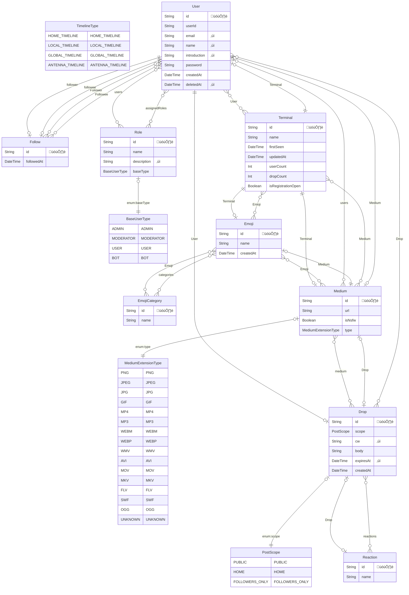

```mermaid
erDiagram

        PostScope {
            PUBLIC PUBLIC
HOME HOME
FOLLOWERS_ONLY FOLLOWERS_ONLY
        }
    


        BaseUserType {
            ADMIN ADMIN
MODERATOR MODERATOR
USER USER
BOT BOT
        }
    


        TimelineType {
            HOME_TIMELINE HOME_TIMELINE
LOCAL_TIMELINE LOCAL_TIMELINE
GLOBAL_TIMELINE GLOBAL_TIMELINE
ANTENNA_TIMELINE ANTENNA_TIMELINE
        }
    


        MediumExtensionType {
            PNG PNG
JPEG JPEG
JPG JPG
GIF GIF
MP4 MP4
MP3 MP3
WEBM WEBM
WEBP WEBP
WMV WMV
AVI AVI
MOV MOV
MKV MKV
FLV FLV
SWF SWF
OGG OGG
UNKNOWN UNKNOWN
        }
    
  "User" {
    String id "🗝️"
    String userId 
    String email "‚ùì"
    String name "‚ùì"
    String introduction "‚ùì"
    String password 
    DateTime createdAt 
    DateTime deletedAt "‚ùì"
    }
  

  "Follow" {
    String id "🗝️"
    DateTime followedAt 
    }
  

  "Drop" {
    String id "🗝️"
    PostScope scope 
    String cw "‚ùì"
    String body 
    DateTime expiresAt "‚ùì"
    DateTime createdAt 
    }
  

  "Role" {
    String id "🗝️"
    String name 
    String description "‚ùì"
    BaseUserType baseType 
    }
  

  "Terminal" {
    String id "🗝️"
    String name 
    DateTime firstSeen 
    DateTime updatedAt 
    Int userCount 
    Int dropCount 
    Boolean isRegistrationOpen 
    }
  

  "Reaction" {
    String id "🗝️"
    String name 
    }
  

  "Emoji" {
    String id "🗝️"
    String name 
    DateTime createdAt 
    }
  

  "EmojiCategory" {
    String id "🗝️"
    String name 
    }
  

  "Medium" {
    String id "🗝️"
    String url 
    Boolean isNsfw 
    MediumExtensionType type 
    }
  
    "User" o|--|| "Terminal" : "Terminal"
    "User" o|--|o "Medium" : "Medium"
    "User" o{--}o "Role" : "assignedRoles"
    "User" o{--}o "Drop" : "Drop"
    "User" o{--}o "Follow" : "Followee"
    "User" o{--}o "Follow" : "Follower"
    "Follow" o|--|| "User" : "followee"
    "Follow" o|--|| "User" : "follower"
    "Drop" o|--|| "PostScope" : "enum:scope"
    "Drop" o{--}o "Medium" : "medium"
    "Drop" o{--}o "Reaction" : "reactions"
    "Drop" o|--|| "User" : "User"
    "Role" o|--|| "BaseUserType" : "enum:baseType"
    "Role" o{--}o "User" : "users"
    "Terminal" o{--}o "User" : "User"
    "Terminal" o{--}o "Emoji" : "Emoji"
    "Terminal" o{--}o "Medium" : "Medium"
    "Reaction" o|--|o "Drop" : "Drop"
    "Emoji" o{--}o "EmojiCategory" : "categories"
    "Emoji" o|--|| "Medium" : "Medium"
    "Emoji" o|--|| "Terminal" : "Terminal"
    "EmojiCategory" o{--}o "Emoji" : "Emoji"
    "Medium" o{--}o "User" : "users"
    "Medium" o|--|| "MediumExtensionType" : "enum:type"
    "Medium" o{--}o "Emoji" : "Emoji"
    "Medium" o|--|| "Terminal" : "Terminal"
    "Medium" o|--|o "Drop" : "Drop"
```
