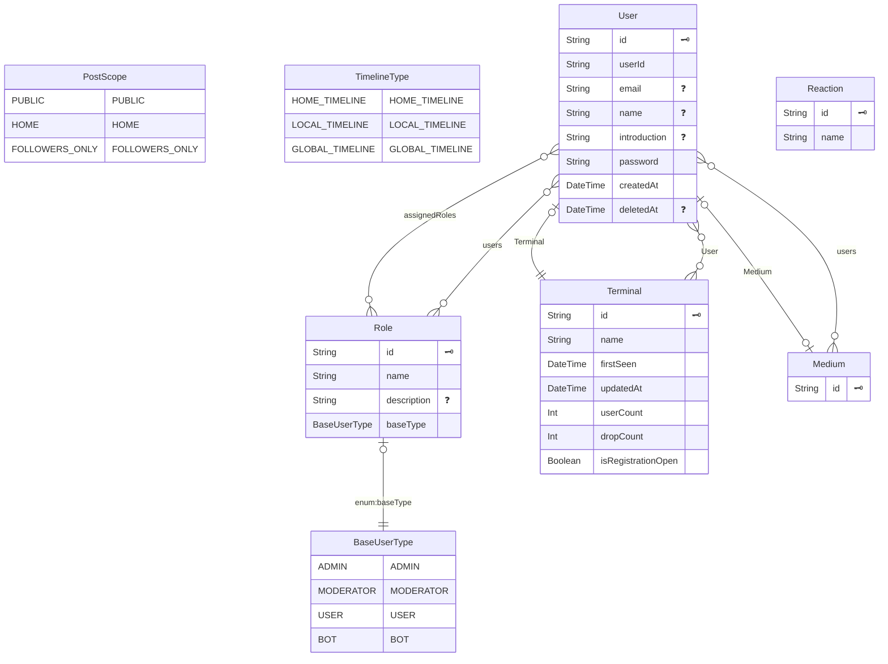

```mermaid
erDiagram

        PostScope {
            PUBLIC PUBLIC
HOME HOME
FOLLOWERS_ONLY FOLLOWERS_ONLY
        }
    


        BaseUserType {
            ADMIN ADMIN
MODERATOR MODERATOR
USER USER
BOT BOT
        }
    


        TimelineType {
            HOME_TIMELINE HOME_TIMELINE
LOCAL_TIMELINE LOCAL_TIMELINE
GLOBAL_TIMELINE GLOBAL_TIMELINE
        }
    
  "User" {
    String id "🗝️"
    String userId 
    String email "❓"
    String name "❓"
    String introduction "❓"
    String password 
    DateTime createdAt 
    DateTime deletedAt "❓"
    }
  

  "Role" {
    String id "🗝️"
    String name 
    String description "❓"
    BaseUserType baseType 
    }
  

  "Terminal" {
    String id "🗝️"
    String name 
    DateTime firstSeen 
    DateTime updatedAt 
    Int userCount 
    Int dropCount 
    Boolean isRegistrationOpen 
    }
  

  "Reaction" {
    String id "🗝️"
    String name 
    }
  

  "Medium" {
    String id "🗝️"
    }
  
    "User" o|--|| "Terminal" : "Terminal"
    "User" o|--|o "Medium" : "Medium"
    "User" o{--}o "Role" : "assignedRoles"
    "Role" o|--|| "BaseUserType" : "enum:baseType"
    "Role" o{--}o "User" : "users"
    "Terminal" o{--}o "User" : "User"
    "Medium" o{--}o "User" : "users"
```
