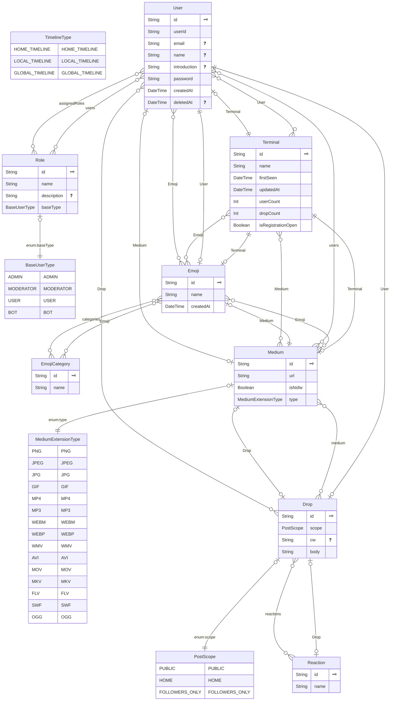

```mermaid
erDiagram

        PostScope {
            PUBLIC PUBLIC
HOME HOME
FOLLOWERS_ONLY FOLLOWERS_ONLY
        }
    


        BaseUserType {
            ADMIN ADMIN
MODERATOR MODERATOR
USER USER
BOT BOT
        }
    


        TimelineType {
            HOME_TIMELINE HOME_TIMELINE
LOCAL_TIMELINE LOCAL_TIMELINE
GLOBAL_TIMELINE GLOBAL_TIMELINE
        }
    


        MediumExtensionType {
            PNG PNG
JPEG JPEG
JPG JPG
GIF GIF
MP4 MP4
MP3 MP3
WEBM WEBM
WEBP WEBP
WMV WMV
AVI AVI
MOV MOV
MKV MKV
FLV FLV
SWF SWF
OGG OGG
        }
    
  "User" {
    String id "🗝️"
    String userId 
    String email "❓"
    String name "❓"
    String introduction "❓"
    String password 
    DateTime createdAt 
    DateTime deletedAt "❓"
    }
  

  "Drop" {
    String id "🗝️"
    PostScope scope 
    String cw "❓"
    String body 
    }
  

  "Role" {
    String id "🗝️"
    String name 
    String description "❓"
    BaseUserType baseType 
    }
  

  "Terminal" {
    String id "🗝️"
    String name 
    DateTime firstSeen 
    DateTime updatedAt 
    Int userCount 
    Int dropCount 
    Boolean isRegistrationOpen 
    }
  

  "Reaction" {
    String id "🗝️"
    String name 
    }
  

  "Emoji" {
    String id "🗝️"
    String name 
    DateTime createdAt 
    }
  

  "EmojiCategory" {
    String id "🗝️"
    String name 
    }
  

  "Medium" {
    String id "🗝️"
    String url 
    Boolean isNsfw 
    MediumExtensionType type 
    }
  
    "User" o|--|| "Terminal" : "Terminal"
    "User" o|--|o "Medium" : "Medium"
    "User" o{--}o "Role" : "assignedRoles"
    "User" o{--}o "Drop" : "Drop"
    "User" o{--}o "Emoji" : "Emoji"
    "Drop" o|--|| "PostScope" : "enum:scope"
    "Drop" o{--}o "Medium" : "medium"
    "Drop" o{--}o "Reaction" : "reactions"
    "Drop" o|--|| "User" : "User"
    "Role" o|--|| "BaseUserType" : "enum:baseType"
    "Role" o{--}o "User" : "users"
    "Terminal" o{--}o "User" : "User"
    "Terminal" o{--}o "Emoji" : "Emoji"
    "Terminal" o{--}o "Medium" : "Medium"
    "Reaction" o|--|o "Drop" : "Drop"
    "Emoji" o{--}o "EmojiCategory" : "categories"
    "Emoji" o|--|| "User" : "User"
    "Emoji" o|--|| "Medium" : "Medium"
    "Emoji" o|--|| "Terminal" : "Terminal"
    "EmojiCategory" o{--}o "Emoji" : "Emoji"
    "Medium" o{--}o "User" : "users"
    "Medium" o|--|| "MediumExtensionType" : "enum:type"
    "Medium" o{--}o "Emoji" : "Emoji"
    "Medium" o|--|| "Terminal" : "Terminal"
    "Medium" o|--|o "Drop" : "Drop"
```
