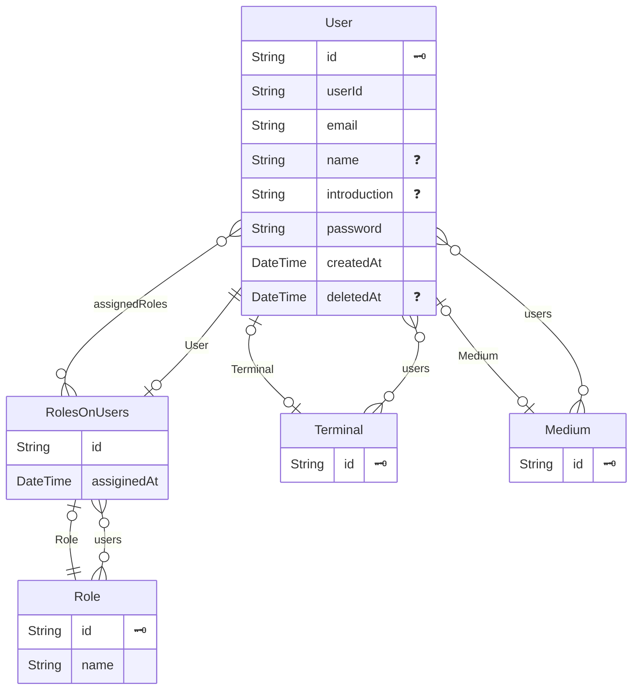

```mermaid
erDiagram

  "User" {
    String id "🗝️"
    String userId 
    String email 
    String name "❓"
    String introduction "❓"
    String password 
    DateTime createdAt 
    DateTime deletedAt "❓"
    }
  

  "RolesOnUsers" {
    String id 
    DateTime assiginedAt 
    }
  

  "Role" {
    String id "🗝️"
    String name 
    }
  

  "Terminal" {
    String id "🗝️"
    }
  

  "Medium" {
    String id "🗝️"
    }
  
    "User" o|--|o "Terminal" : "Terminal"
    "User" o|--|o "Medium" : "Medium"
    "User" o{--}o "RolesOnUsers" : "assignedRoles"
    "RolesOnUsers" o|--|| "User" : "User"
    "RolesOnUsers" o|--|| "Role" : "Role"
    "Role" o{--}o "RolesOnUsers" : "users"
    "Terminal" o{--}o "User" : "users"
    "Medium" o{--}o "User" : "users"
```
